# 如何为 WordPress 邮件使用免费的 SMTP 服务器(包括 Gmail SMTP 服务器)

> 原文：<https://kinsta.com/blog/free-smtp-server/>

如果你在 WordPress 网站上收发邮件有问题，使用免费的 SMTP 服务器可以免费提供更好的可靠性和投递能力。

默认情况下，WordPress 试图通过 PHP mail 发送[事务性邮件](https://kinsta.com/help/transactional-email/)，这导致了各种各样的问题。*交易电子邮件是您网站的自动电子邮件，如密码重置、订单确认等*。

SMTP 是简单邮件传输协议的缩写，让你通过一个专用的邮件服务器发送你站点的邮件。这意味着你的网站可以更可靠地发送电子邮件，这些电子邮件不太可能出现在用户的[垃圾邮件文件夹](https://kinsta.com/blog/why-are-my-emails-going-to-spam/)。

在这篇文章中，我们将看看你可以在 WordPress 网站上使用的七个免费 SMTP 服务器选项，包括免费的 [Gmail SMTP 服务器](https://kinsta.com/blog/gmail-smtp-server/)。

对于每一个选项，我们将简要地向您介绍它，分享免费计划的任何限制，并向您展示如何在 WordPress 上设置它。

### 看看这个[视频指南](https://www.youtube.com/watch?v=ykL0GyCO8MU)如何使用免费的 SMTP 服务器处理 WordPress 邮件

## 你需要什么来使用免费的 SMTP 服务器

要将这些工具集成到你的 WordPress 站点中，你需要一个插件。

> 需要在这里大声喊出来。Kinsta 太神奇了，我用它做我的个人网站。支持是迅速和杰出的，他们的服务器是 WordPress 最快的。
> 
> <footer class="wp-block-kinsta-client-quote__footer">
> 
> 
> 
> <cite class="wp-block-kinsta-client-quote__cite">Phillip Stemann</cite></footer>

[View plans](https://kinsta.com/plans/)

其中一些工具提供了自己专用的集成插件。如果没有，你可以在 WordPress.org 找到几个高质量的[免费 SMTP 插件，比如](https://wordpress.org/plugins/tags/smtp/) [Post SMTP Mailer/Email Log](https://wordpress.org/plugins/post-smtp/) ，这是一个 100%免费重新推出的流行的邮递员 SMTP 插件。

对于下面的教程，我们将使用:

*   一个服务的专用 WordPress 插件。
*   当专用插件不可用时，发布 SMTP 邮件程序/电子邮件日志。你应该能够使用其他插件遵循相同的基本指令，尽管。

准备好了吗？开始吧！

## 7 个免费的 SMTP 服务器解决方案将在 2022 年与 WordPress 一起使用

以下是我们将介绍的免费 SMTP 提供商——请继续阅读，了解每个工具的更多详细信息:

### Gmail SMTP 服务器

你可能已经知道 Gmail 的免费电子邮件服务。然而，谷歌也允许你使用 Gmail 作为 SMTP 服务器从你的网站发送电子邮件。

有了免费的 Gmail 帐户，你可以在连续 24 小时内发送多达 500 封电子邮件。或者，如果你是谷歌工作空间的付费用户，你可以在 24 小时内发送 2000 封邮件。

设置免费的 Gmail SMTP 服务器比其他一些工具需要更多的劳动。然而，额外的努力是值得的，因为 Gmail 还提供了列表中最高的免费发送限额。

您可以在许多不同的地方使用 Gmail 的 SMTP 服务器信息。你可以在你的本地电子邮件客户端使用它，比如微软的 Outlook 或者 T2 的 WordPress 网站，这就是我们将要关注的。

要在 WordPress 网站上设置 Gmail，您需要:

*   创建一个谷歌应用
*   配置你的 WordPress 站点，使用插件通过应用程序发送

如果你想从自定义域(例如[【电子邮件保护】](/cdn-cgi/l/email-protection))而不是 Gmail ( [【电子邮件保护】](/cdn-cgi/l/email-protection))发送电子邮件，你首先需要设置并支付 Google Workspace。我们有一整篇关于[为什么我们喜欢 Google Workspace](https://kinsta.com/blog/google-workspace/) ，以及[如何设置 Google Workspace MX 记录](https://kinsta.com/help/google-mx-records/)以将 Google Workspace [连接到您的自定义域名](https://kinsta.com/blog/professional-email-address/)的帖子。

如果你可以从 Gmail 地址发送电子邮件，那么在开始教程之前，你不需要做任何事情。

以下是如何使用 Gmail SMTP 服务器发送 WordPress 电子邮件…

#### 1.配置后 SMTP 邮件程序/电子邮件日志

要让你的 WordPress 站点通过你的 Google app 发送邮件，你可以安装 WordPress 的免费 Post SMTP Mailer/Email Log 插件。

一旦你激活了它，在你的 WordPress 仪表盘中进入新的 **Post SMTP** 标签，点击**显示所有设置**查看所有选项。

首先，转到**消息**选项卡，设置您的“发件人”电子邮件地址和姓名。

完成后，返回到**账户**选项卡，使用**类型**下拉菜单选择 **Gmail API** 。这将暴露一些额外的选项。保持此页面打开，因为在下一步中您将需要以下信息:

*   授权的 JavaScript 起源
*   授权重定向 URI

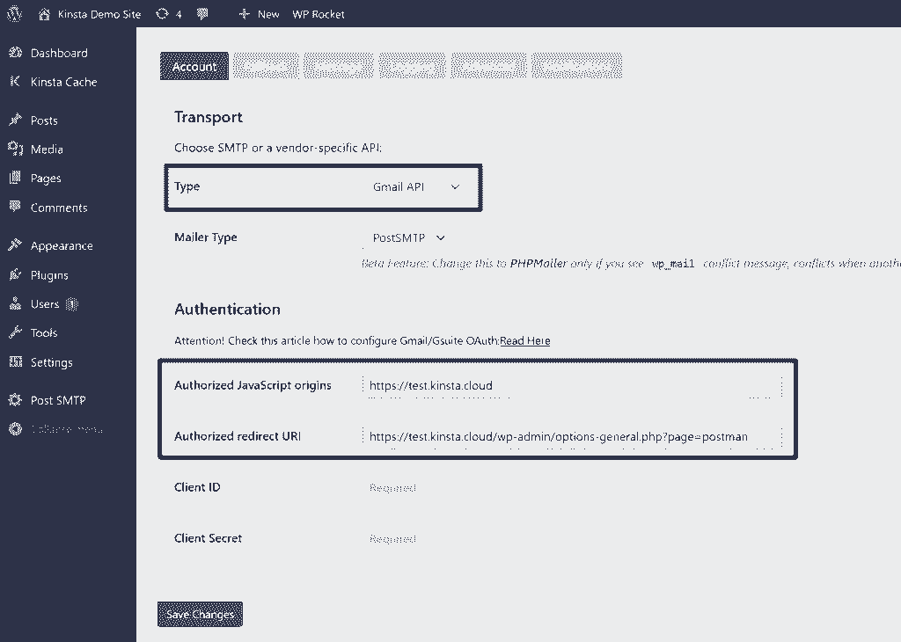

Choose the Gmail API option

#### 2.创建一个谷歌应用

接下来，您需要创建一个 Google 应用程序。这使得你的 WordPress 站点(或任何其他应用程序)能够安全地连接到 Gmail SMTP 服务器来发送电子邮件。

为此，打开一个新的浏览器选项卡，[转到 Google 开发者控制台](https://console.developers.google.com/apis/dashboard)，并创建一个新项目。如果这是你第一次登录，Google 应该会提示你创建一个新项目。否则，您可以通过单击 Google APIs 徽标旁边的下拉菜单(在下面的屏幕截图中用[1]表示)来完成。

一旦你有了你的应用，点击按钮**启用 API 和服务:**

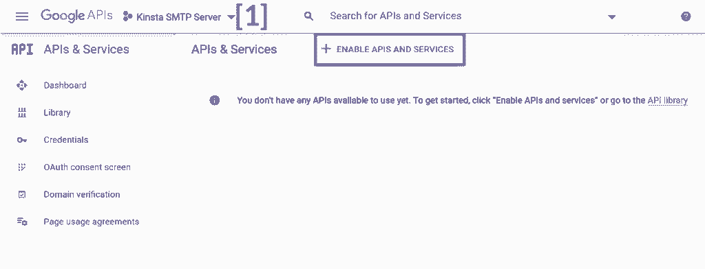

Create a new Google Developers project

然后，搜索“Gmail”并为 **Gmail API** 选择结果:

Search for the Gmail API

在 Gmail API 结果页面上，点击**启用**按钮:

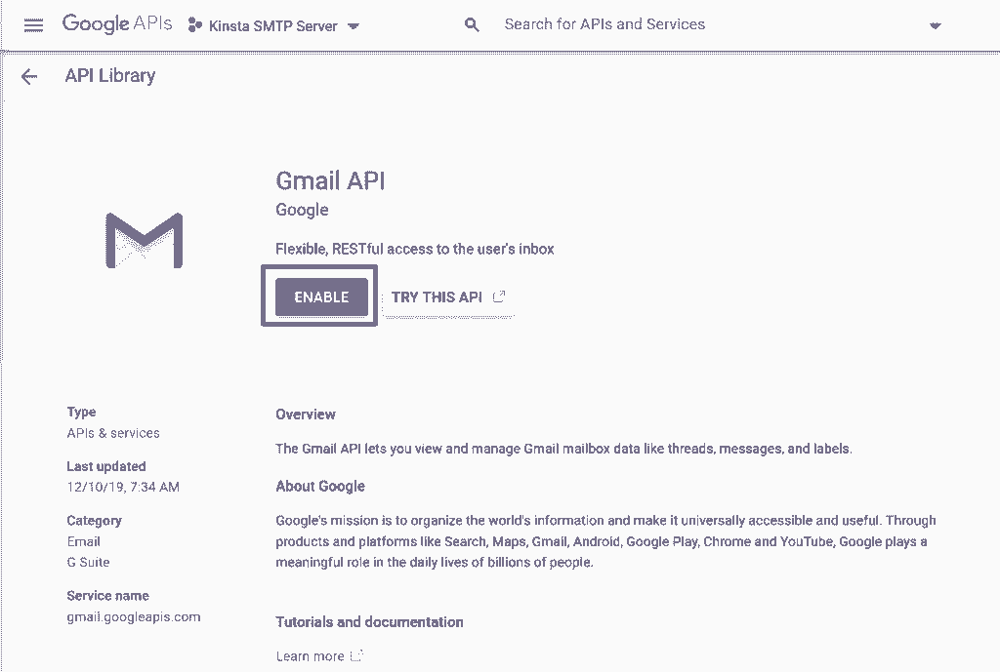

Enable the Gmail API

这应该会让你进入 Gmail API 的专用界面。要继续，请点击按钮**创建凭证**:

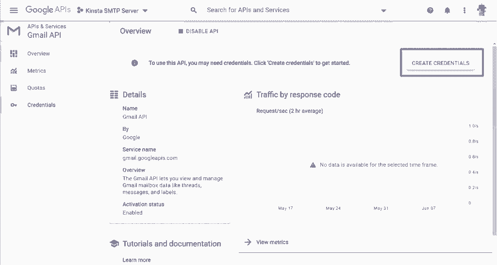

Create credentials for the Gmail API

首先，使用以下设置填写**了解您需要哪种凭证**部分:

*   您使用的是哪种 API？ Gmail API
*   您将从哪里调用 API？网络浏览器(JavaScript)
*   您将访问哪些数据？用户数据

然后，点击**我需要什么凭证？**按钮:

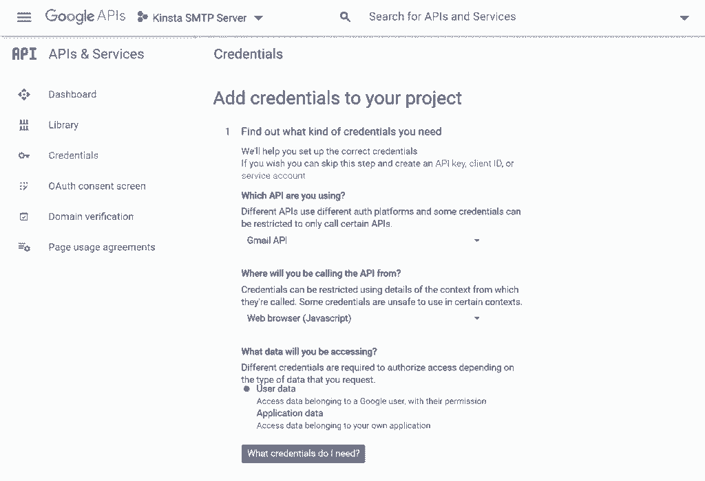

Fill out credentials form

然后，Google 会提示您设置 OAuth 同意屏幕。点击提示中的按钮**设置同意画面**:

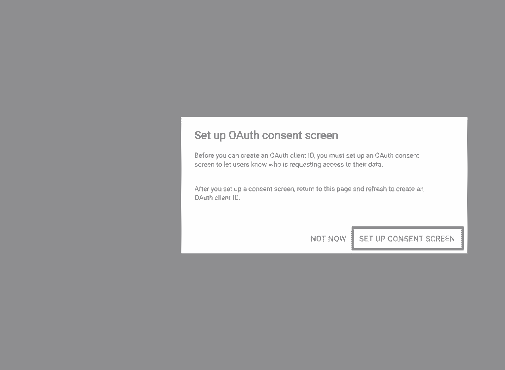

The prompt to create an OAuth consent screen

这将为 **OAuth 同意屏幕**打开一个新标签。对于**用户类型**，选择**外部**。然后，点击**创建**:

Create an external consent screen

在下一个屏幕上，输入网站的基本信息，比如名称和 URL。

不要太紧张，因为您实际上并不需要使用这些信息:

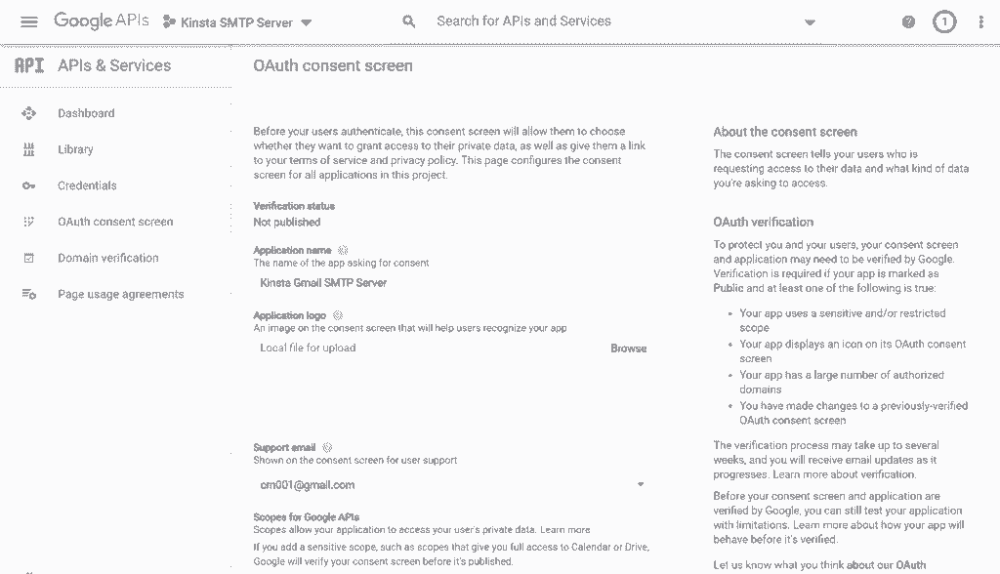

Configure the consent screen

添加完所有内容后，点击底部的**保存**按钮。

然后，返回到**Add credentials to your project**选项卡，输入以下信息:

*   **名称**-容易记住的东西，例如你网站的名称。
*   **授权的 JavaScript 源**–从 Post SMTP 邮件程序/电子邮件日志插件中复制并粘贴它(步骤#1)。
*   **授权重定向 URIs**–从 Post SMTP 邮件程序/电子邮件日志插件中复制并粘贴(步骤 1)。

然后，点击**刷新**:

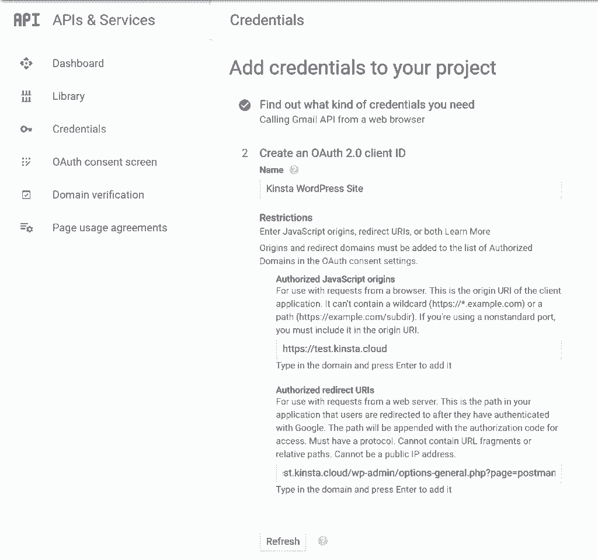

Create your credentials

**刷新**按钮应该变为**创建 OAuth 客户端 ID** 。单击该按钮完成该过程。然后，点击**完成**。

点击**完成**后，您应该会在**凭证**选项卡的 **OAuth 2.0 客户端 id**部分看到一个条目(点击**完成**后您应该会自动转到此页面)。

单击您的客户端 ID 条目以打开其设置:

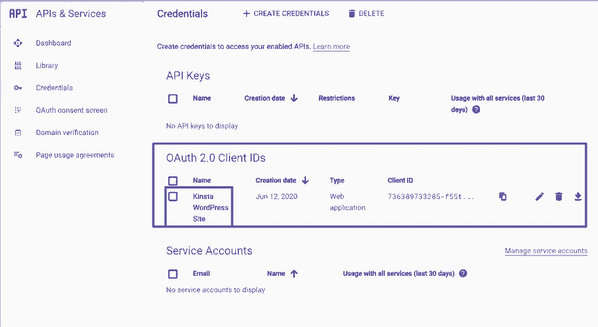

Access OAuth 2.0 client IDs

然后，寻找两条信息:

*   客户端 ID
*   客户机密

将这两条信息放在手边，因为在下一步中会用到它们:

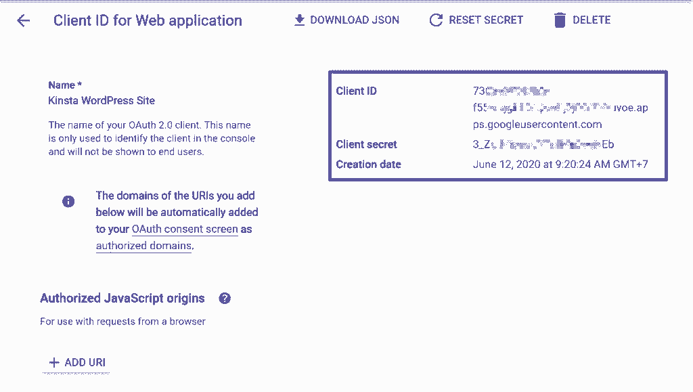

Your Gmail API client IDs

#### 3.添加客户端 id 以发布 SMTP 邮件程序/电子邮件日志

现在，回到你的 WordPress 仪表盘和 Post SMTP Mailer/Email 日志设置，粘贴你的**客户端 ID** 和**客户端密码**。然后，点击**保存修改**:

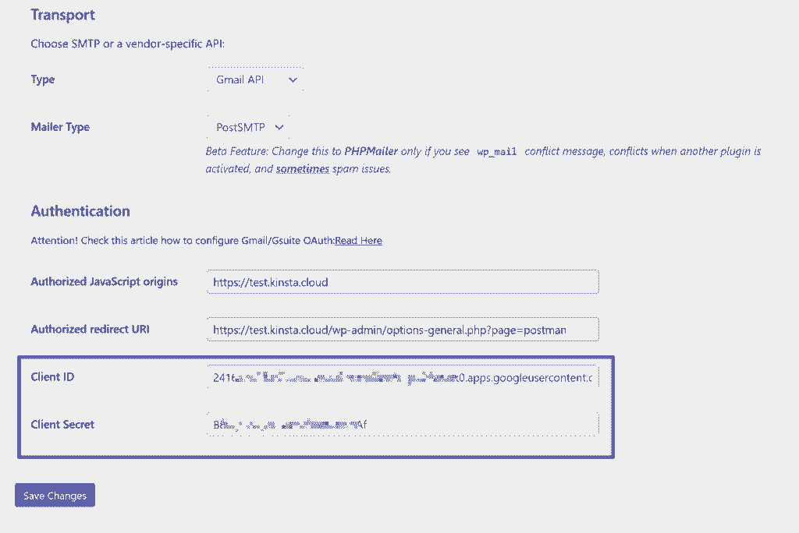

Add Gmail API client IDs to WordPress

一旦你这么做了，Post SMTP Mailer/Email Log 会提示你**授予 Google** 的权限:

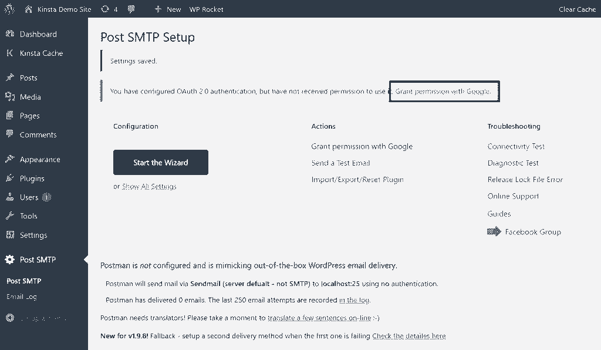

Grant permission to Google

当你点击那个链接，它将打开正常的谷歌授权过程。你需要点击进入，并给予你的网站访问你的 Gmail 账户的权限。

因为你没有将你的应用程序提交给谷歌进行审查，谷歌会给你一个警告，说明你的应用程序未经验证。因为您自己创建了应用程序，所以您可以安全地忽略此警告。点击链接显示高级设置，然后选择**转到“your website”**继续授权过程:

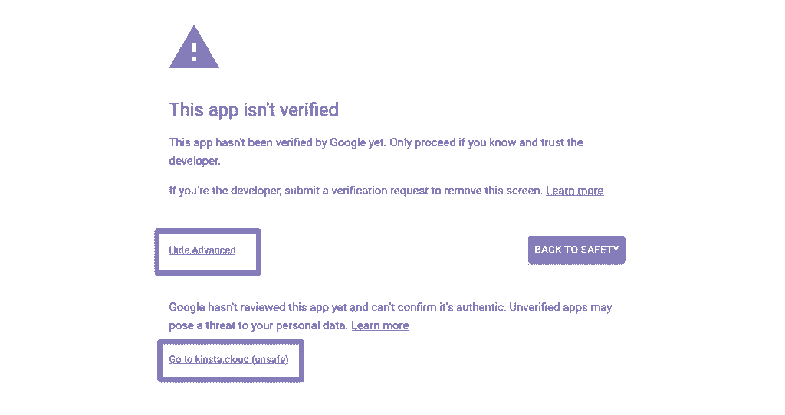

Ignore the warning to continue

一旦您完成授权过程，您就完成了！

为了验证一切正常，Post SMTP Mailer/Email Log 插件包含了一个让您发送测试电子邮件的功能。

### SendGrid

SendGrid 是一个受欢迎的[交易电子邮件服务](https://kinsta.com/blog/email-marketing-software/)，由于它的 API 集成方法，用 WordPress 很容易设置。它还为您提供详细的分析和日志记录。

SendGrid 提供一个月的免费试用，可以让你发送多达 40，000 封电子邮件。第一个月结束后，你可以继续每天发送 100 封电子邮件。

对于较小的 WordPress 网站，这个限制应该没问题。如果你确实需要超过免费限额，付费计划每月 14.95 美元起，最多可发送 4 万封电子邮件。

SendGrid 还提供了一项单独的服务，如果你感兴趣，可以让你发送营销电子邮件。要用 WordPress 设置 SendGrid，你需要:

*   生成 SendGrid API 密钥
*   使用专用的 WordPress 插件或单独的 SMTP 插件将 API 添加到 WordPress

对于完整的教程，我们有一整篇关于如何用 WordPress 使用 SendGrid 的文章。

## 注册订阅时事通讯

### 想知道我们是怎么让流量增长超过 1000%的吗？

加入 20，000 多名获得我们每周时事通讯和内部消息的人的行列吧！

[Subscribe Now](#newsletter)

### Pepipost

Pepipost 严格来说是一种电子邮件发送服务。你可以将它连接到任何应用或服务，包括你的 WordPress 网站。您还可以获得实时报告来分析您发送的电子邮件。

Pepipost 可以让你每天免费发送多达 100 封电子邮件。在最初的 30 天里，你还可以发送多达 30，000 封电子邮件。

如果您需要超过这一限制，没有照单定价。下一个最便宜的计划是每月 25 美元，最多 15 万封电子邮件。

为了帮助你在 WordPress 上使用 Pepipost，Pepipost 提供了一个[官方 WordPress 插件](https://wordpress.org/plugins/pepipost/)，帮助你连接到 Pepipost API ( *而不是使用 SMTP 凭证*)。

以下是如何使用 Pepipost 发送 WordPress 邮件。

#### 1.验证域名和访问 API 密钥

首先，注册一个免费的 Pepipost 帐户来生成您的 API 密钥。

一旦你创建了你的账户，你会被提示添加你的 [WordPress 站点的 URL](https://kinsta.com/knowledgebase/wordpress-change-url/) 作为**发送域**:

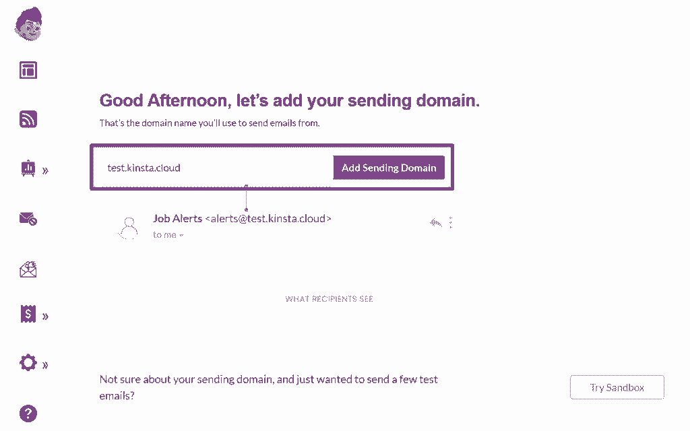

Add domain to Pepipost

然后你需要添加两个 TXT 记录到你的 [DNS 记录](https://kinsta.com/knowledgebase/what-is-dns/)来验证你的[域名](https://kinsta.com/blog/how-much-does-a-domain-name-cost/)。

如果你在 Kinsta 托管，你可以从你的 [MyKinsta 仪表板](https://kinsta.com/mykinsta/)中的 **Kinsta DNS** 选项卡将这些 TXT 记录添加到你的域中。如果你不确定如何做到这一点，你可以[遵循我们的电子邮件认证指南](https://kinsta.com/blog/email-authentication/)来学习如何添加这些 DNS 记录以及为什么它们很重要。

一旦您验证了您的域名，进入 Pepipost 仪表板中的**设置→集成**找到您的 API 密钥。请将该值放在手边，因为您将在下一步中用到它:

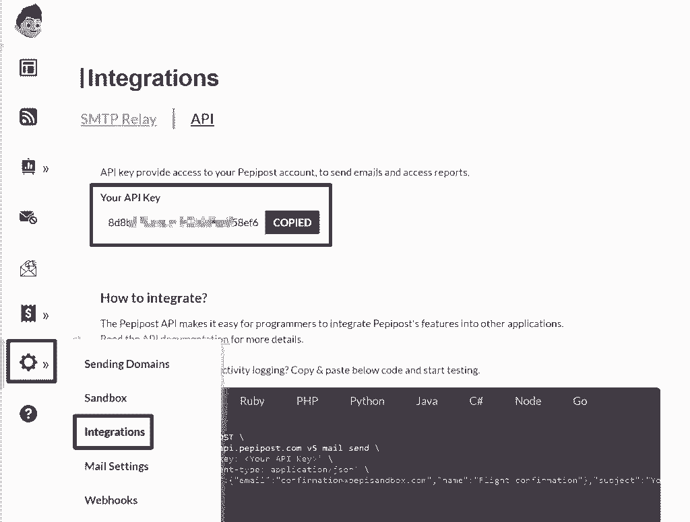

Access Pepipost API key

#### 2.安装和配置官方 Pepipost 插件

一旦你有了 Pepipost API 密匙，你就可以安装 WordPress.org 官方的 Pepipost 插件了。

然后，转到你的 WordPress 仪表盘中新的 **Pepipost 设置**标签，将你的 API 密匙添加到 **Api 密匙**框中。

在此之下，您还需要配置基本的发件人信息，如您的发件人姓名和发件人电子邮件地址。

一旦你保存了你的修改，你就可以开始了。您可以使用**发送测试电子邮件**部分来确保一切正常运行:

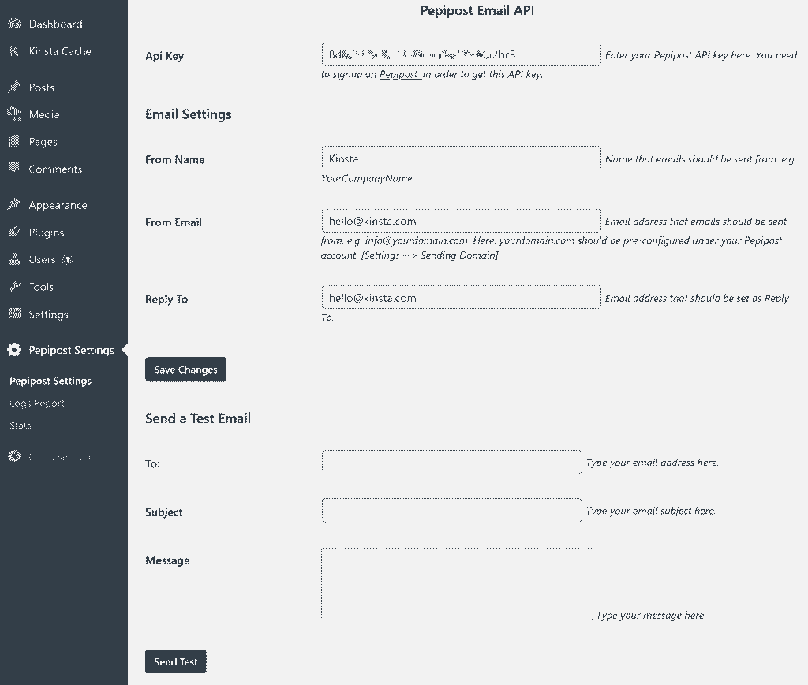

Add API to Pepipost plugin settings

### 你是谁

Sendinblue 可以帮助你发送营销邮件和交易邮件(这也是一个不错的 [Mailchimp 替代品](https://kinsta.com/blog/mailchimp-alternatives/))。它更侧重于营销方面，具有营销自动化功能等等。

Sendinblue 也有一个更高的免费发送限制，让你每天发送多达 300 封电子邮件。但是，如果您需要超出这些限制，最便宜的选择是每月 25 美元，每月最多 40，000 封电子邮件。所以，如果你认为你有可能每天超过 300 封邮件，这可能不是一个好的选择。

为了帮助你在 WordPress 中使用 Sendinblue，Sendinblue 团队提供了一个专门的 WordPress 插件。

以下是如何使用 Sendinblue 免费发送 WordPress 事务性邮件。

#### 1.注册并生成 API 密钥

首先，[注册一个免费的 Sendinblue 帐户](https://app.sendinblue.com/account/register)。

一旦你登录了你的账户，点击右上角的用户名并选择 **SMTP & API** 选项。或者，您可以在登录时[访问此页面](https://account.sendinblue.com/advanced/api)。

然后，点击**创建新的 API** 键按钮。在弹出窗口中:

*   选择**版本 2.0**
*   给它起一个名字来帮助你记住它(*例如你的 WordPress 站点的名字*
*   点击**生成**

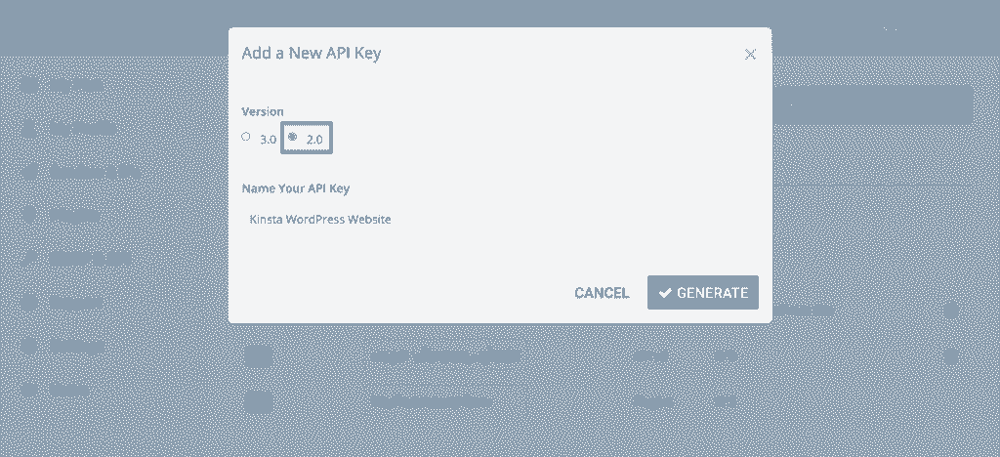

Create a Sendinblue API 2.0 key

然后，您应该会看到 API 键的值——请将它放在手边，因为您将在下一步中用到它。

使用我们灵活的 Google Cloud powered 基础设施提升你的 WordPress 网站的功能。查看我们的计划。

#### 2.安装 Sendinblue 插件

接下来，安装并激活来自 WordPress.org 的[官方 Sendinblue 插件。](https://wordpress.org/plugins/mailin/)

然后，点击你的 WordPress 仪表盘中新的 **Sendinblue** 标签，将你的 API 密匙添加到框中。然后，点击**登录**。

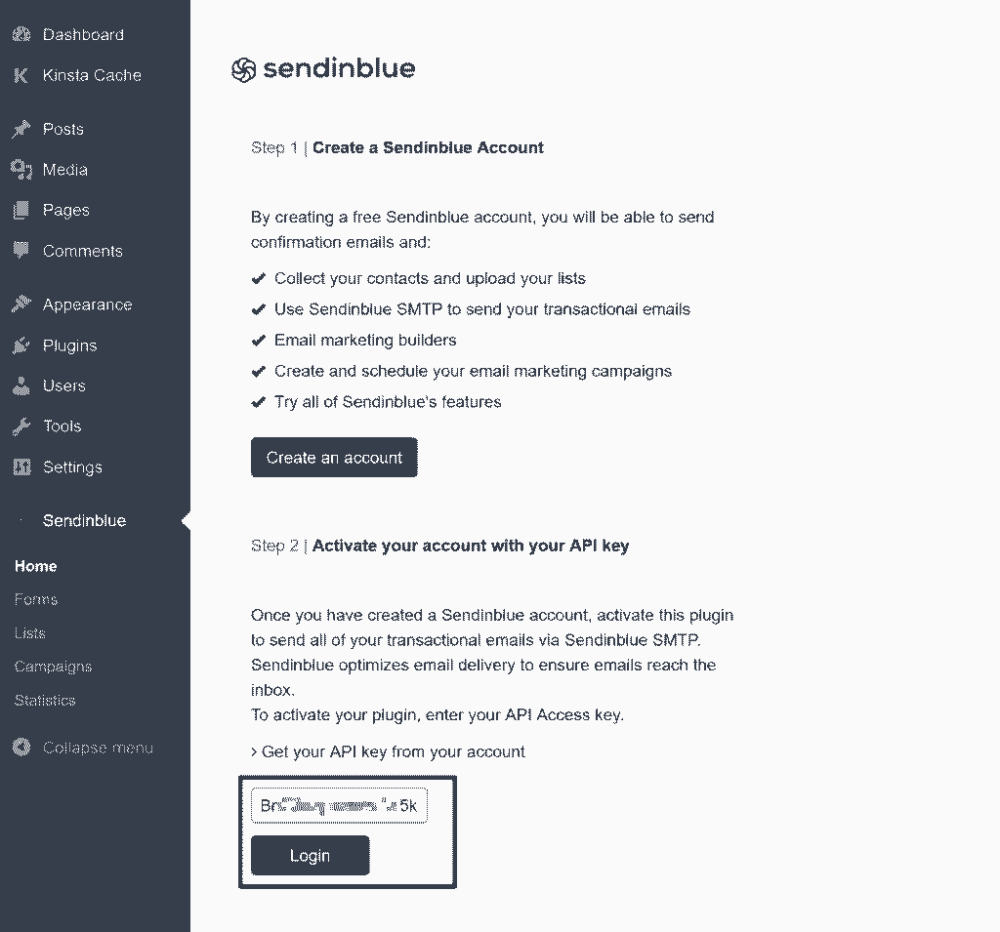

Add API key to Sendinblue plugin settings

然后你应该会看到插件的完整设置区域。

要开始通过 Sendinblue 的免费 SMTP 服务器发送您站点的交易电子邮件，请在**交易电子邮件**部分选择**是**单选按钮。

然后，您可以选择您的发件人信息(您可以从 Sendinblue 仪表板中控制此信息)并发送一封测试电子邮件:

Enable sending transactional emails with Sendinblue

### 邮件快递

[Mailjet](https://www.mailjet.com/) 是一款经济实惠的电子邮件解决方案，可以帮助处理营销电子邮件和交易电子邮件。对于 SMTP 发送服务，你可以每天免费发送多达 200 封电子邮件，尽管你的电子邮件会在页脚包含 Mailjet 标志。

要删除徽标和/或增加您的发送限额，付费计划每月只需 9.65 美元，每月最多可发送 30，000 封邮件。

以下是如何使用 Mailjet 发送 WordPress 邮件。

#### 1.注册和访问 API 密钥

首先，[注册一个免费的 Mailjet 帐户](https://app.mailjet.com/signup)以访问您的 Mailjet API 密钥。

激活您的 Mailjet 帐户后，进入 Mailjet 仪表板中的**交易→概述**找到您的 API 密钥:

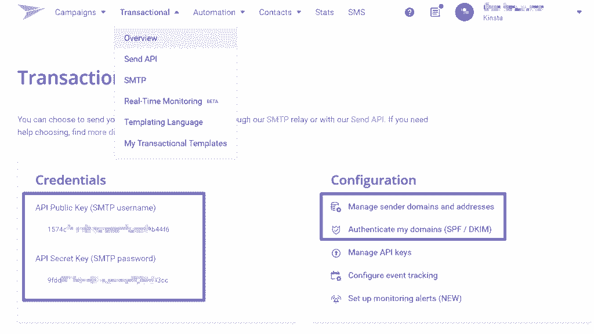

Access Mailjet API key

您还可以使用右侧的**配置**选项来添加和验证您的发件人域和地址。这将有助于提高你的电子邮件的可送达性。

#### 2.安装官方插件

为了配置你的 WordPress 站点通过 Mailjet 发送交易邮件，Mailjet 在 WordPress.org 提供了一个[专用集成插件。](https://wordpress.org/plugins/mailjet-for-wordpress/)

一旦你安装并激活了插件，进入你的 WordPress 仪表盘中新的 **Mailjet** 标签，从你的 Mailjet 账户添加 API 密钥:

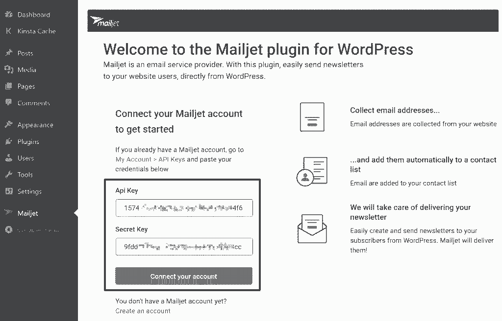

Add Mailjet API keys to plugin settings

连接你的 Mailjet 账户后，你会看到一个选项来同步你注册的 WordPress 用户和 Mailjet。如果您只想使用 Mailjet 处理事务性电子邮件，只需点击按钮**跳过此步骤**。

然后，在你的 WordPress 仪表盘中打开 Mailjet 插件设置( **Mailjet →设置**，选择**发送设置**。

选中复选框**启用通过 Mailjet** 发送电子邮件。然后，填写您的发件人信息，并发送一封测试电子邮件以确保一切正常:

Enable Mailjet for email sending

### 弹性电子邮件

[Elastic Email](https://elasticemail.com/api-pricing) 提供了一种负担得起的 SMTP 发送服务，具有永久免费计划和便宜的现收现付价格。使用永久免费计划，您每天可以发送多达 100 封电子邮件。超过这个限制，你只需为你的使用付费——每 1000 封邮件 0.09 美元。

你也可以每天花 1 美元购买一个私有 IP 地址，以及其他几个附件(比如电子邮件附件)。

#### 1.注册和访问 API 密钥

首先，[注册一个免费的弹性电子邮件帐户](https://elasticemail.com/)以访问您的弹性电子邮件 API 密钥。

激活您的帐户后，点击右上角的用户名并选择**设置**。

然后，转到 **API** 标签，同意你不会向用户发送垃圾邮件。一旦你同意，弹性邮件会显示一个按钮给你**创建 API 密匙**:

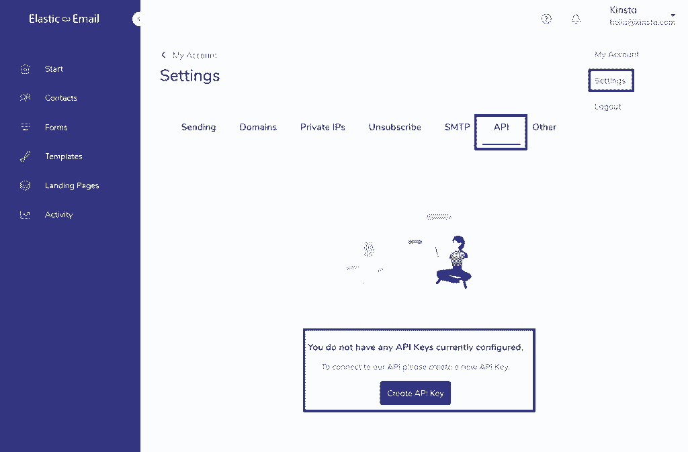

Create an Elastic Email API key

给 API 密匙起个名字以帮助你记住它，并为**权限**级别选择**插件**:

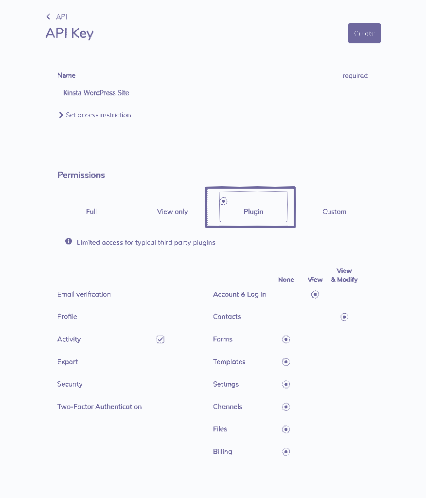

Configuring your API key settings

然后，您应该会看到 API 键的值。请确保此窗口保持打开，因为您将在下一步中需要它，而弹性电子邮件只会显示一次。

#### 2.安装官方插件

为了帮助你在 WordPress 使用弹性邮件，弹性邮件在 WordPress.org 提供了一个官方插件叫做[弹性邮件发送器](https://wordpress.org/plugins/elastic-email-sender/)。

一旦你在你的 WordPress 站点上安装并激活了插件，你就可以在你的 WordPress 仪表盘中进入新的**弹性邮件发送器**标签。然后配置以下详细信息:

*   **选择邮件程序**–通过弹性邮件 API 发送所有 WordPress 邮件。
*   **弹性邮件 API 密钥**–添加上一步中的 API 密钥。
*   **电子邮件类型**–交易型
*   **发件人姓名和电子邮件**

然后，点击**保存更改**:

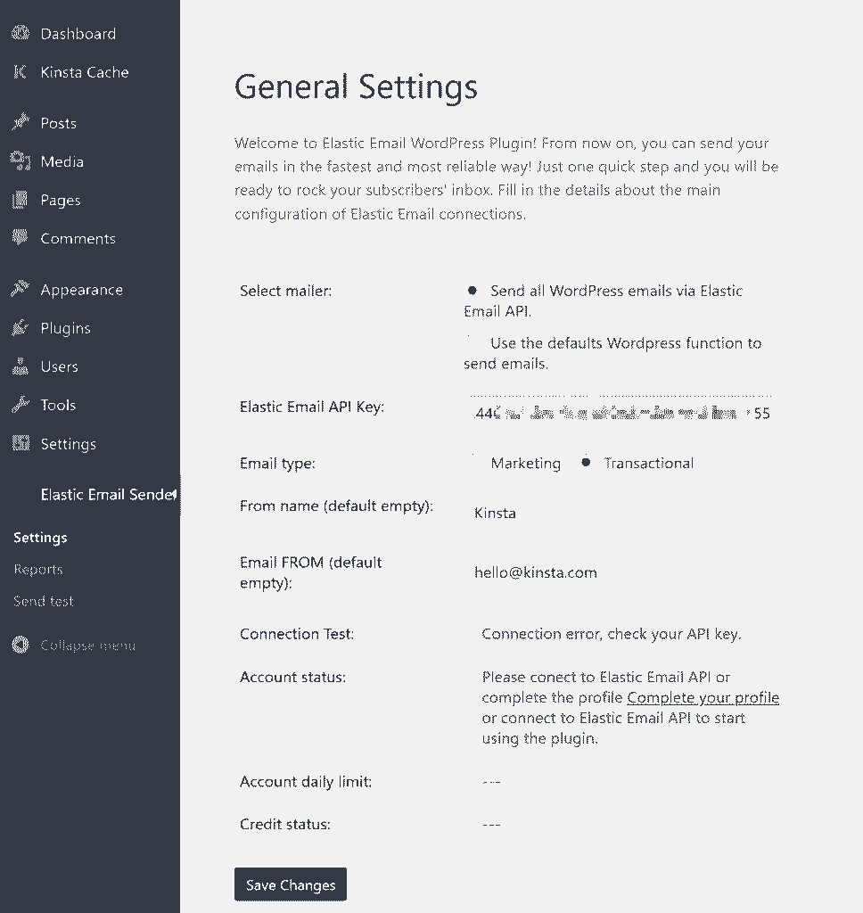

Add Elastic Email API key to WordPress plugin

然后，您应该会看到一条成功消息。

为了确保一切正常，请转到**弹性电子邮件发送器→发送测试**发送一封测试电子邮件。

### Mailgun

Mailgun **不再像其他工具一样提供永远免费的计划**。然而，我们仍然将它包括在内，因为它提供了三个月的漫长试用期，以及之后可负担的现收现付价格。尽管如此，如果你想要永远 100%免费的东西，Mailgun 不再是一个选项。

Mailgun 提供了一个简单的基于 API 的发送服务，你可以在几分钟内集成到 WordPress。

在最初的三个月里，你每月可以免费发送多达 5000 封电子邮件。之后，您可以使用每 1000 封电子邮件 0.80 美元起的现收现付定价。

我们有一个关于如何使用 Mailgun 和 WordPress 的完整指南。

[Send your site's emails through a dedicated server 📥 with these 7 SMTP providers (free options available 💸).Click to Tweet](https://twitter.com/intent/tweet?url=https%3A%2F%2Fkinsta.com%2Fblog%2Ffree-smtp-server%2F&via=kinsta&text=Send+your+site%27s+emails+through+a+dedicated+server+%F0%9F%93%A5++with+these+7+SMTP+providers+%28free+options+available+%F0%9F%92%B8%29.&hashtags=emailmarketing%2CSMTP)

## 摘要

默认情况下，WordPress 发送邮件的方式会导致各种可靠性和可送达性的问题。为了解决你的 WordPress 站点的交易邮件问题，你应该使用一个专用的 SMTP 服务器，而不是依赖 WordPress 的默认选项。

幸运的是，有了免费的 SMTP 服务器，你不用花一分钱就可以访问可靠的 WordPress 交易邮件。

以下是您应该了解的可以利用的不同解决方案的关键方面:

*   Gmail SMTP 服务器——使用免费的 Gmail 帐户，您可以在 24 小时内发送多达 500 封电子邮件，如果您为 Google Workspace 付费，则可以发送 2000 封电子邮件。
*   send grid——让你永远每天发送 100 封邮件(第一个月免费发送 40，000 封邮件)。
*   pepipost——让您永远每天发送 100 封电子邮件(前 30 天免费发送 3 万封电子邮件)。
*   send in blue–让你永远每天发送 300 封电子邮件。
*   mailjet——让你永远每天发送多达 200 封电子邮件。
*   弹性电子邮件——让您永远每天发送多达 100 封电子邮件，之后以便宜的现收现付价格发送。
*   mailgun–让你每月免费发送 5000 封电子邮件*，但仅限前 3 个月*。之后，它有便宜的现收现付价格。

对于最高免费发送限额，您可以设置 Gmail SMTP 服务器。然而，Gmail 的设置过程也是最耗费人力的。

对于更简单的设置，您可以考虑其他免费选项，如 Sendinblue(每天 300 封电子邮件)或 SendGrid(每天 100 封电子邮件)。

* * *

让你所有的[应用程序](https://kinsta.com/application-hosting/)、[数据库](https://kinsta.com/database-hosting/)和 [WordPress 网站](https://kinsta.com/wordpress-hosting/)在线并在一个屋檐下。我们功能丰富的高性能云平台包括:

*   在 MyKinsta 仪表盘中轻松设置和管理
*   24/7 专家支持
*   最好的谷歌云平台硬件和网络，由 Kubernetes 提供最大的可扩展性
*   面向速度和安全性的企业级 Cloudflare 集成
*   全球受众覆盖全球多达 35 个数据中心和 275 多个 pop

在第一个月使用托管的[应用程序或托管](https://kinsta.com/application-hosting/)的[数据库，您可以享受 20 美元的优惠，亲自测试一下。探索我们的](https://kinsta.com/database-hosting/)[计划](https://kinsta.com/plans/)或[与销售人员交谈](https://kinsta.com/contact-us/)以找到最适合您的方式。