# 如何独立完成 WordPress 迁移(不停机)

> 原文：<https://kinsta.com/blog/migrate-wordpress-site/>

迁移一个 WordPress 站点是你在某个时候必须要做的事情。也许你正在考虑将一个 WordPress 网站转移到一个新的主机上。也许你已经创建了一个本地站点，或者也许你正在从一个[多站点安装](https://kinsta.com/wordpress-multisite-hosting/)进行迁移。

在本指南中，你将学习如何自己迁移一个 WordPress 站点。如果您要切换到 Kinsta，[我们会为您处理迁移事宜](https://kinsta.com/knowledgebase/wordpress-migrations/)。

如果你使用不同的主机，喜欢手动操作，或者你正在本地和远程站点之间迁移，这个指南将帮助你理解如何将你的 WordPress 站点迁移到一个新的主机上。

## 当你需要迁移一个 WordPress 站点时

在一些情况下，你可能需要迁移一个 [WordPress 站点](https://kinsta.com/blog/wordpress-site-examples/)。让我们来看看其中的一些。

*   将[本地开发站点](https://kinsta.com/blog/install-wordpress-locally/)上传到远程托管站点。如果你在本地进行开发工作(这是个好主意)，你需要[将站点迁移到你的远程站点](https://kinsta.com/knowledgebase/export-wordpress-site/)。稍后，当您开发站点时，您可能只需要迁移文件而不是数据库，或者您可能需要双向迁移数据库，以便您可以用当前数据测试任何更改。
*   在主机提供商之间切换。这是迁移 WordPress 最常见的场景之一。将一个 WordPress 站点转移到一个新的主机上通常是相当简单的。一个好的 [WordPress 主机提供商](https://kinsta.com/wordpress-hosting/)(包括 Kinsta)[将免费为你执行迁移](https://kinsta.com/wordpress-migration/):你只需要提供旧网站的登录信息。如果你的网站有一个更复杂的设置或者你更喜欢自己做，你可以遵循这篇文章中的方法。
*   从 WordPress 多站点网络中迁移站点。如果你已经在一个多站点网络上托管了一个站点，并且决定你需要把它分离出来，那么你就需要把那个站点从网络上迁移出来，然后把它迁移到一个全新的 WordPress 系统上。这比从一个独立站点迁移到另一个站点要复杂得多，但这是可以做到的。
*   将网站迁移到 WordPress 多站点网络。有时，您可能需要将现有的单个站点迁移到网络中。同样，这比从一个站点迁移到另一个站点要复杂一些，但是您可以做到。这是我有时为客户做的事情，他们有一个现有的网站，他们想迁移到我的主机上；我更喜欢为我所有的客户网站使用 Multisite。

Kinsta free migrations

迁移你的 WordPress 站点最简单的方法是使用插件。

> 需要在这里大声喊出来。Kinsta 太神奇了，我用它做我的个人网站。支持是迅速和杰出的，他们的服务器是 WordPress 最快的。
> 
> <footer class="wp-block-kinsta-client-quote__footer">
> 
> 
> 
> <cite class="wp-block-kinsta-client-quote__cite">Phillip Stemann</cite></footer>

[View plans](https://kinsta.com/plans/)

## 如何用 WordPress 复制插件将 WordPress 站点移动到新的主机上

免费的 [WordPress 复制插件](https://kinsta.com/blog/wordpress-migration-plugins/#Duplicator)是我们推荐的将网站迁移到 Kinsta 的插件。你可以[通过插件界面把它安装在你的网站](https://kinsta.com/knowledgebase/how-to-install-wordpress-plugins/)上，而且是免费的。

让我们来看看如何使用 Duplicator 插件将 WordPress 站点迁移到新的主机上。

这些说明将适用于任何类型的标准 WordPress 安装，允许你将你的 WordPress 站点从一个主机移动到另一个主机:远程或本地。如果您想迁移一个完整的多站点网络，这也是可行的。稍后我将介绍将站点迁移到多站点和从多站点迁移出来。

复制插件通过创建两个文件来工作:

1.  一个 zip 文件，包含旧站点(您正在迁移的站点)中的文件和数据库。
2.  一份**installer.php**的文件。

然后，你将这些文件上传到新网站，并运行**installer.php**文件。该插件将解压 zip 文件并导入您的数据和文件。

下面我们来看看怎么做。

### 在您开始使用 Duplicator 迁移之前

在运行迁移之前，您需要采取几个步骤。

#### 清理你的旧网站

花点时间清理一下你的旧网站，也就是说[删除任何你不用的主题](https://kinsta.com/blog/wordpress-delete-theme/)或[插件](https://kinsta.com/blog/uninstall-wordpress-plugin/)。更新到 WordPress 的最新版本，你的主题和插件。迁移运行不需要的代码的站点是没有意义的。

#### 禁用缓存插件

[缓存插件](https://kinsta.com/blog/wordpress-caching-plugins/)会干扰迁移，所以如果你在旧网站上运行这些插件，禁用它们。如果你要迁移到 Kinsta，我们有一个[禁止插件](https://kinsta.com/knowledgebase/banned-plugins/)(包括缓存插件)的列表，所以确保你没有运行这些插件。

#### 备份您的旧网站

在你将一个 WordPress 站点从一个主机转移到另一个主机之前，[做一个备份](https://kinsta.com/help/wordpress-backups/)。这适用于任何托管环境。使用你的备份插件或你的主机提供商的仪表板来创建你的旧网站的备份，并将其存储在安全的地方——而不是在你的主机服务器上。

#### 创建新网站

你需要在你的站点的新位置创建一个新的空站点(没有安装 WordPress)。

如果你要迁移到 Kinsta，你可以在几分钟内从 MyKinsta 创建一个新站点。在你的 [MyKinsta 仪表盘](https://kinsta.com/blog/manage-multiple-wordpress-sites/)中进入**站点**，点击右上角的**添加站点**按钮。

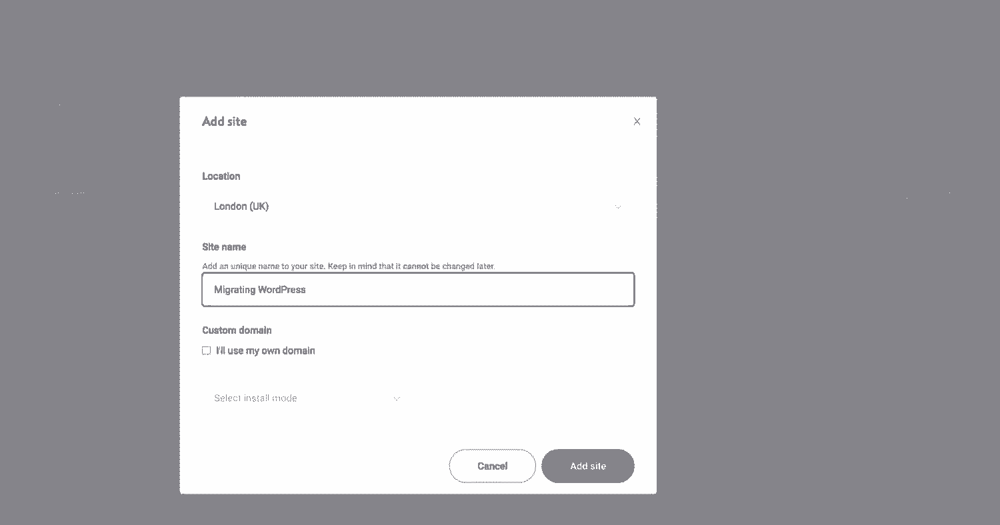

Adding a site in MyKinsta

然后，您可以将文件导入该站点。记住，**不要安装 WordPress** 。

如果你要迁移到本地网站，你需要安装一个工具，比如桌面服务器，这样你就可以运行 WordPress。如果您要导入到另一个主机提供商，您将需要 SFTP 访问您的 **/public/** 目录。你不需要安装 WordPress。

#### 迁移多站点网络

如果你正在将一个多站点网络迁移到 Kinsta，并且该网络包括[子目录](https://kinsta.com/blog/wordpress-multisite/#wordpress-multisite-subdomains-vs-subdirectories)，你将需要[联系 Kinsta 支持](https://kinsta.com/help/wordpress-support-ticket/)，并要求他们启用必要的 Nginx 配置来完成这项工作。

如果你要迁移到另一个主机提供商或从另一个主机提供商迁移过来，在你迁移之前，问问他们你是否需要他们做什么。

您还应该查看复印机插件的[指南，了解多站点迁移需要采取的额外步骤。这些只适用于如果你是移动到一个不同的主机提供商或](https://snapcreek.com/duplicator/docs/moving-a-multisite-install-with-duplicator-pro/)[域名](https://kinsta.com/knowledgebase/wordpress-multisite-domain-mapping/)。

### 从旧的 WordPress 站点创建文件和数据的存档

迁移过程的第一步是从旧站点创建文件，以便将它们导入到新站点。

安装并激活 WordPress 复制插件。转到**插件>添加新的**，然后搜索“WordPress Duplicator”。点击插件的**安装**按钮，然后点击**激活**按钮。

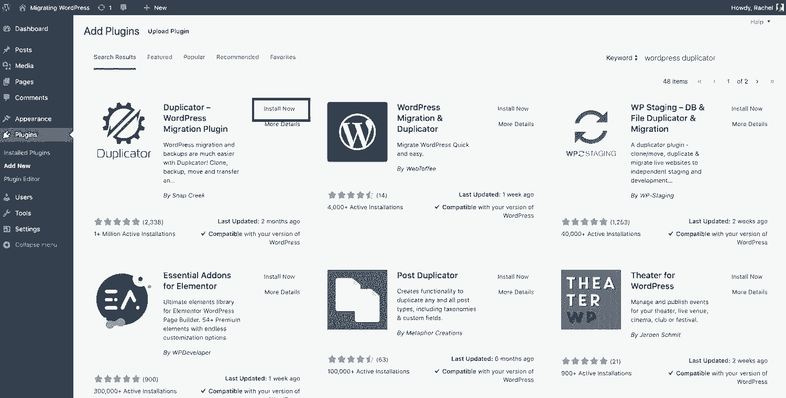

Installing the Duplicator plugin

现在是时候创建将用于迁移您的站点的归档文件了。点击管理菜单中的**复制器**进入插件设置。

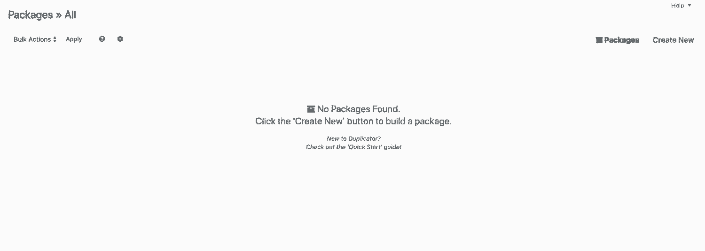

Duplicator settings

这个屏幕显示了您创建的所有包——它们是您站点的存档。现在，它将是空的。

要创建您站点的档案，请单击**新建**按钮。

然后，您将进入一个设置屏幕，在该屏幕中，您可以输入软件包的详细信息，如下所示:

*   **Name** :给包起一个对你有意义的名字。
*   **存储**:指定包文件的存储位置。在插件的免费版本中，你可以把它存储在你的网络服务器上，在这种情况下，你需要以后下载它，或者从插件发送给你的电子邮件中获取它。使用 pro 版插件，可以使用第三方存储服务，如 [Dropbox](https://kinsta.com/blog/saas-products/#14-dropbox) 和 [Google Drive](https://kinsta.com/blog/saas-products/#12-g-suite-email--collaboration-tools) 。选择您要使用的，系统会提示您登录。
*   **存档**:指定是只存档数据库还是同时存档数据库和文件。当你迁移你的站点时，你需要所有的东西。不要选中复选框。
*   **Installer** :在这个部分，通过添加一个密码来为你的包启用密码保护。你正在创建一个文件，里面有你网站上的所有东西，所以[安全性很重要](https://kinsta.com/blog/wordpress-security/)。

Password protection

现在点击**下一个**按钮继续。

该插件将扫描您的系统，并让您知道是否一切正常。

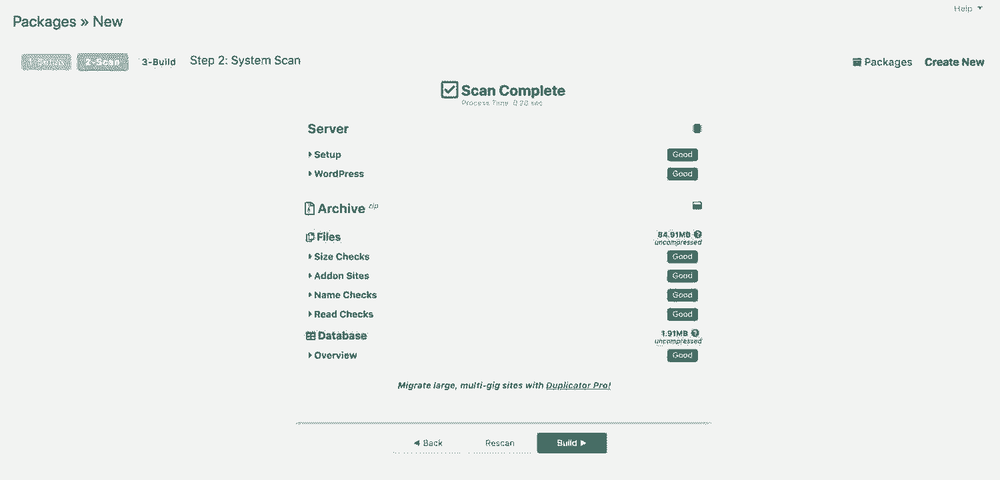

Package scan

如果有任何问题，请遵循插件给出的建议。因为你在开始之前清理了你的站点，你应该不会有任何问题。

现在单击 **Build** 按钮来构建归档文件。等待该过程完成，不要离开屏幕点击。

完成后，您可以选择下载您的软件包文件。

Download your package

点击**一键式下载**按钮，将两个文件下载到您的电脑。将它们存储在安全的地方，以便在迁移到新站点时能够检索到它们。

你现在有你的档案。

### 将归档文件导入到新站点

下一步是将文件导入到新站点并运行导入程序文件。

[使用 SFTP](https://kinsta.com/knowledgebase/how-to-use-sftp/) 将这两个文件上传到新站点的 **/public/** 目录中。使用你的 [FTP 客户端](https://kinsta.com/blog/best-ftp-clients/)，上传两个文件到那个文件夹(了解 [FTP 和](https://kinsta.com/knowledgebase/ftp-vs-sftp/)SFTP 的区别)。

Duplicator files in the new site

完成后，通过在浏览器中访问其 URL 来运行安装程序。您可以使用新站点的临时 URL 来完成此操作，因为您还没有跨域迁移。

因此，如果你的临时网址是**http://temp.kinsta.com**，你会在浏览器中访问**http://temp.kinsta.com/installer.php**。

这将打开复印机屏幕。

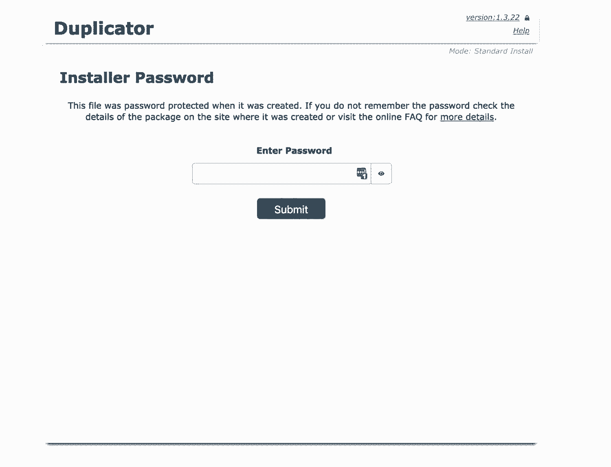

Duplicator password prompt

如果您在设置复印机文件时提供了密码，请输入密码并点击**提交**按钮。

然后将引导您完成运行导入的过程。在下一个屏幕上，选中底部的复选框并点击**下一个**按钮。

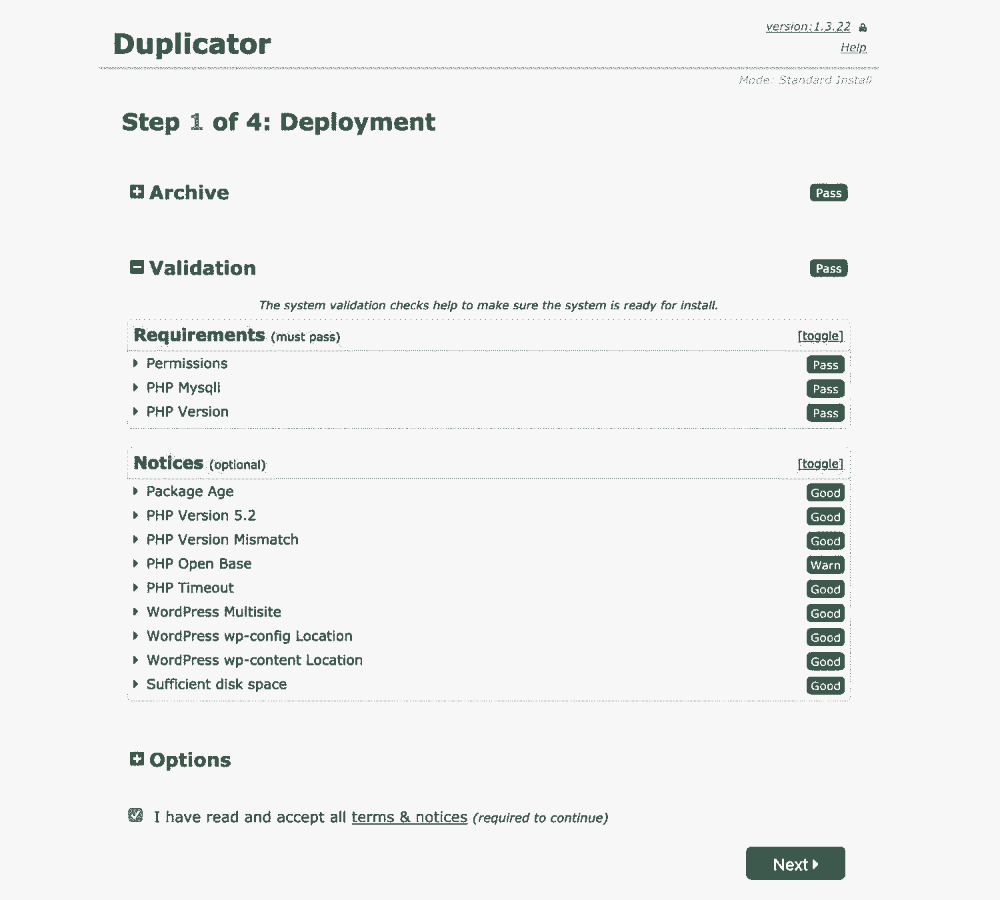

The Duplicator import process

该插件将提取档案文件，这可能需要一段时间，取决于您的网站的大小。下一步是安装新的[数据库](https://kinsta.com/knowledgebase/wordpress-database/)，这将需要:

*   主机名。
*   密码。
*   用户名。

插件将使用这些数据来更新站点设置。

你可以在 MyKinsta 网站的**信息**界面中找到所有这些信息。

如果你要迁移到另一个主机提供商，向他们询问详细信息，或者在你注册时他们发给你的电子邮件中找到。

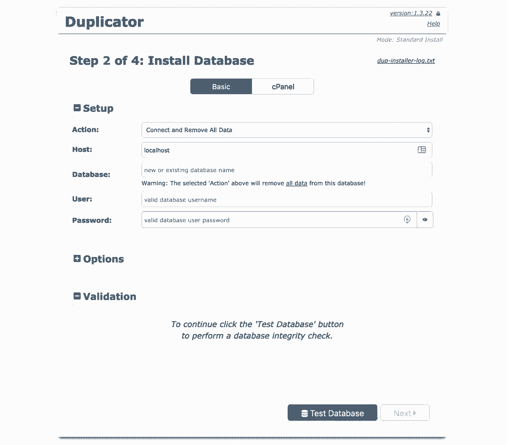

Creating the database in duplicator

单击该按钮检查数据库是否正常工作，并根据需要进行任何更正。一旦系统正常，点击**下一个**按钮。

然后，Duplicator 插件将运行第 3 步，使用新站点的临时 URL 使数据库正常工作。点击下一个按钮的**进入第 4 步，从这里您可以登录网站。**

当你访问你的网站时，你现在应该有一个旧网站的完美复制品。唯一的区别是域名。

### 重定向域名

一旦你测试了你的新网站，你很高兴它能正常工作，你就可以把域名重定向到你的新网站。

如果你要更换主机服务提供商，那么你需要[更新域名的 DNS](https://kinsta.com/help/dns/) ，让它指向你的新网站。

与您的域名注册商，[更改域名服务器](https://kinsta.com/knowledgebase/what-is-a-nameserver/)，一个或 CNAME 记录，以反映您的新位置。您使用哪一个取决于您的设置。

如果你也需要使用你的域名来处理电子邮件，那么你不会想要改变域名服务器，因为这会将你所有版本的域名指向你的新主机提供商。

一旦你这样做了，你需要在你的主机管理员中更新域名。在 MyKinsta 中，进入你网站的**域名**页面，在这里你可以[更新域名](https://kinsta.com/help/add-domain/)。

如果您使用的是另一个托管服务提供商，您需要在您的帐户中添加一个附加域，以便将它定向到您的新网站。您的提供商应该能够为您提供这方面的指导。

你还没有完成。

最后一步是在 WordPress 管理界面中更新域名。在你的站点中，进入**设置>常规**并找到 URL 字段。只有当 DNS 已经传播并且域名指向你的新站点时，你才应该这样做[。](https://kinsta.com/blog/dns-propagation/)

这可能需要 48 小时，但通常要快得多。

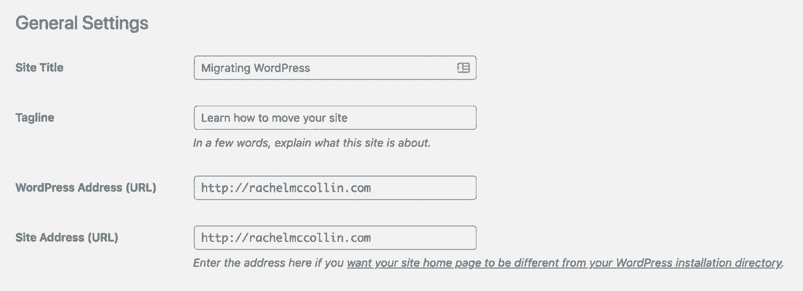

WordPress URL settings

有两个字段需要更新:

*   [**【网址】**](https://kinsta.com/knowledgebase/wordpress-change-url/) :这是站点本身的地址，所以是你在站点上使用的主域名。
*   **站点地址(URL)** :如果您希望用户看到的地址与实际的站点地址不同，只需更新该字段。如果两者相同(这是正常的)，更新两个字段。

点击**保存更改**按钮保存 URL。

现在，您的新站点已经在新位置运行。如果你不再需要旧网站，是时候删除它了，如果你换了提供商，就关闭你的旧主机账户。

## 使用插件将网站移入或移出 WordPress Multisite

如果你要将一个网站移入或移出 WordPress Multisite，你可以用一个插件来完成，但是**你不能使用 WordPress Duplicator 插件**。这是因为您不希望迁移整个数据库和文件:只迁移来自相关站点的那些文件。

要使用插件移入和移出多站点，您需要使用三个插件:

1.  一个用于迁移内容。
2.  一个用于迁移小部件设置。
3.  一个迁移用户。

根据您的设置，您可能不需要使用所有这些。让我们一步一步来看事情。

### 将文件移入或移出 WordPress Multisite

在您迁移任何内容或设置之前，您需要迁移主题和插件文件。您可以通过以下两种方式之一实现这一点:

*   [通过**主题**或**插件**屏幕在新网站中安装相同的主题](https://kinsta.com/blog/how-to-install-a-wordpress-theme/)和插件，或者如果您从第三方来源购买，则将其上传到新网站。
*   使用 SFTP 从旧站点下载主题和插件文件，并上传到新站点。

这两种方法都可以，但是如果你的主题或者插件是专门为你的站点开发的，你需要从旧站点下载并上传到新站点。或者，如果你在本地保存了文件的备份，或者使用了[版本控制](https://kinsta.com/blog/wordpress-version-control/)系统，比如 [Github](https://kinsta.com/knowledgebase/what-is-github/) (这是个好主意)，你可以从那里上传它们。

(建议阅读: [Git vs Github:两者有什么区别以及如何入门](https://kinsta.com/knowledgebase/git-vs-github/))

如果你需要上传和安装主题和插件到 WordPress 多站点网络中的站点，你需要为网络安装它们，然后为单独的站点激活它们。你可以在 WordPress Multisite 的[指南中找到更多相关信息。](https://kinsta.com/blog/wordpress-multisite/)

### 信息

不能决定一个 WordPress 主题？看看我们精心挑选的[最佳 WordPress 主题列表](https://kinsta.com/best-wordpress-themes/)。

激活你的新网站的主题，并激活任何插件。需要注意的几件事:

*   如果您的新站点在多站点网络中，您需要启用该站点的主题，方法是转到**网络>站点**，点击您正在处理的站点下方的**编辑**按钮，然后选择主题选项卡。从那里你可以启用主题。然后转到新站点的**外观>主题**并激活那里的主题。
*   你不需要为单独的站点启用插件。相反，你可以安装它们，然后转到该站点的**插件**屏幕并在那里激活它们。
*   如果你从网络中的一个站点迁移到一个独立的站点，你可以像对任何站点一样安装并激活主题和插件。

现在，您已经将所有文件放在了新站点上。花一些时间来配置主题和插件:如果你使用插件来完成迁移，你必须手动完成。

您不必做的一个配置是针对[小部件](https://kinsta.com/blog/wordpress-widgets/)的:您可以使用一个插件来完成它，我们很快就会看到。

### 将用户导入和导出多站点

如果您希望迁移的站点有除您之外的用户，您需要将用户从旧站点导出到新站点。如果您是唯一的用户，您可以跳过这一步，因为您将在创建新网站时将自己创建为用户。

由于 WordPress 并不在 Multisite 中存储每个站点的用户，因此将用户导入和导出 Multisite 变得很复杂。相反，它将它们存储在整个网络的一个数据库表中，称为 **wp_users** 。

如果您从网络中的站点导入，您应该只导出那些在您的站点上注册的用户，而不是那些在网络上的其他站点上注册的用户。如果您要导入到网络中的某个站点，您只想激活该站点上的那些用户，而不是网络上的其他站点。

如果您的网站包括多个作者，请在导入内容之前执行此操作，以便在将内容导入新网站时，可以为内容分配正确的用户。所以让我们开始吧！

你可以使用[Import Export WordPress Users](https://kinsta.com/knowledgebase/wordpress-export-users/)插件在站点间迁移用户。

首先在你的新旧站点上安装并激活插件。然后在你的旧站点，去**用户>用户导入导出**。

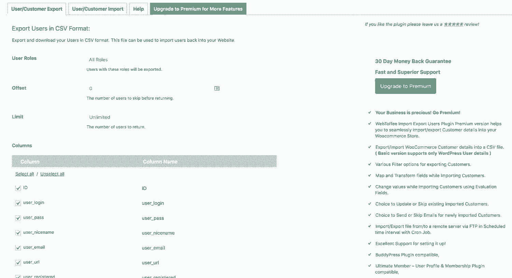

User Import Export settings

选择顶部的**用户/客户导出**选项卡。选择您想要导出的用户角色(如果您保留默认设置，将导出所有角色)，然后向下滚动并点击**导出用户**按钮。

该插件将下载一个 CSV 文件到您的计算机上。将它保存在某个地方，以便在导入时可以再次找到它。

现在，在您的新站点中，转到**用户>用户导入导出**并选择**用户/客户导入**选项卡。

User/Customer import

上传您刚刚创建的 CSV 文件，点击**上传文件和导入**按钮。该插件将上传文件并将用户导入到您的新站点。

在多站点网络中的站点上工作时，您在站点中而不是在网络管理中进行导入和导出。任何导入的用户都将被添加到整个网络的数据库中，但他们只能在一个站点上被激活。

### 将内容移入或移出 WordPress Multisite

从[导出您的内容](https://kinsta.com/knowledgebase/export-wordpress-site/)开始。转到**工具>出口**。选择**所有内容**，点击**下载导出**按钮。

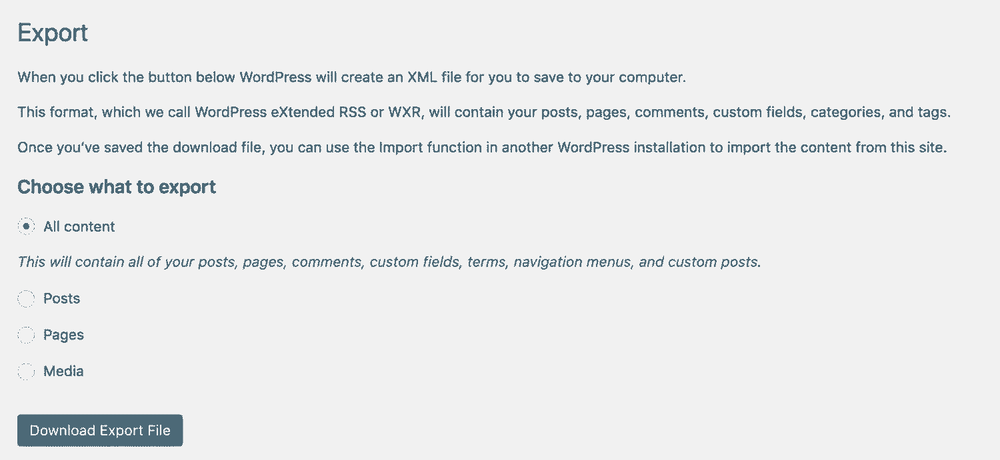

Exporting from Multisite

将下载文件保存在可以再次找到的地方。它将采用 XML 格式。

在您将任何内容导入新站点之前，如果旧站点中有自定义的文章类型或分类，那么确保您设置了这些类型或分类是很重要的。如果你还没有这样做，回到上一步，确保你在新网站上安装并激活了与旧网站相同的主题和插件。

现在打开新网站，进入**工具>导入**。向下滚动到**部分。如果你已经安装了导入器插件，点击**运行导入器**。如果您还没有安装它，请按照这里的说明安装并激活它，然后运行它。**

## 注册订阅时事通讯

### 想知道我们是怎么让流量增长超过 1000%的吗？

加入 20，000 多名获得我们每周时事通讯和内部消息的人的行列吧！

[Subscribe Now](#newsletter)

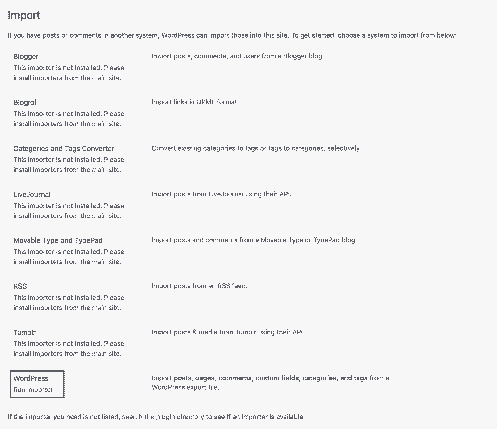

The WordPress importer

导入程序将提示您上传要导入的文件。点击**选择文件**，找到您从旧站点导出的文件，点击**上传文件导入**按钮。

导入程序会提示您将内容分配给新站点中的正确用户，这就是为什么在导入内容之前导入用户非常重要。如果您还没有这样做，请暂停内容导入并返回到上一步。

Importing in WordPress

选择相关用户，并勾选**下载和导入文件附件**复选框。WordPress 会在你的旧网站中找到任何附件，如果可以的话，抓取这些附件并导入到新网站中。有时由于安全或访问的原因，这不起作用，但是如果你从一个远程托管的站点迁移到另一个，它通常会起作用。

点击**提交**按钮。WordPress 将上传文件并创建内容。完成后，您会收到通知。前往你的帖子(点击管理菜单中的**帖子**，你会在你的新网站中看到你导入的帖子。

您已经在迁移您的站点的路上了——现在剩下的就是迁移小部件设置了。

### 将小部件移入和移出多站点

最后一步是迁移小部件。你不必手动配置这些:你可以使用[小部件导入器&导出器插件](https://wordpress.org/plugins/widget-importer-exporter/)来代替。

首先在你的旧站点和新站点上安装并激活插件。

在你的旧站点，进入**工具>小部件进出口商**。这将带您进入**小部件导入/导出**屏幕。

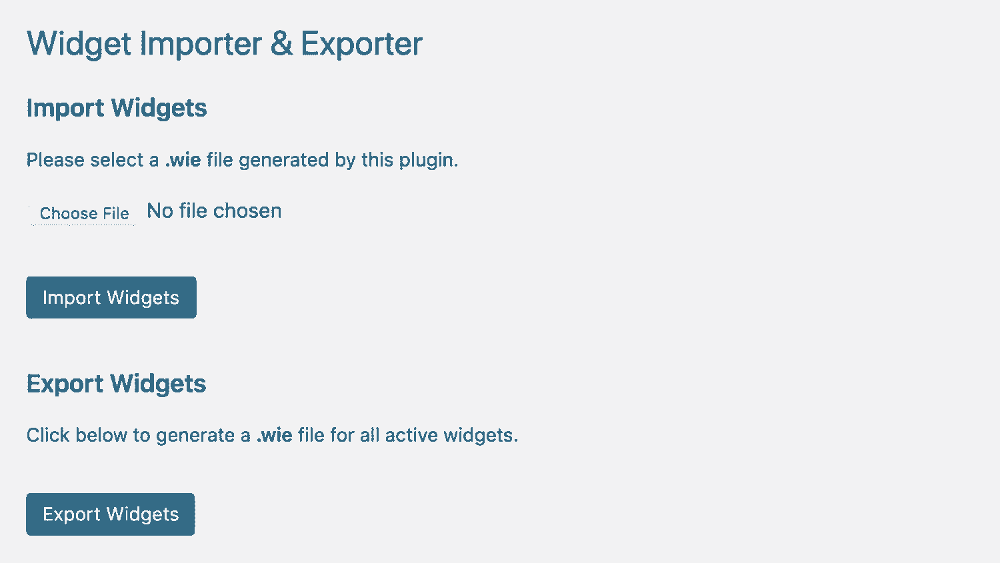

The widget import export screen

点击**导出小部件**按钮。这将下载一个文件到您的计算机与小工具的设置。

现在打开你的新网站。确保你已经安装并激活了你在旧网站上安装的所有相同的主题和插件，因为其中一些可能会提供你需要安装的插件。

小部件导入过程不会导入小部件本身。相反，它导入小部件的设置。同样重要的是，你要激活相同的主题，以使窗口小部件区域相同。

转到**工具>小部件进出口商**。这一次，点击**选择文件**按钮，上传您刚刚从旧网站下载的文件。它将具有。WIE 分机。

点击**导入小部件**按钮。该插件将导入小部件，并给你一个状态屏幕，告诉你它们已经被导入。

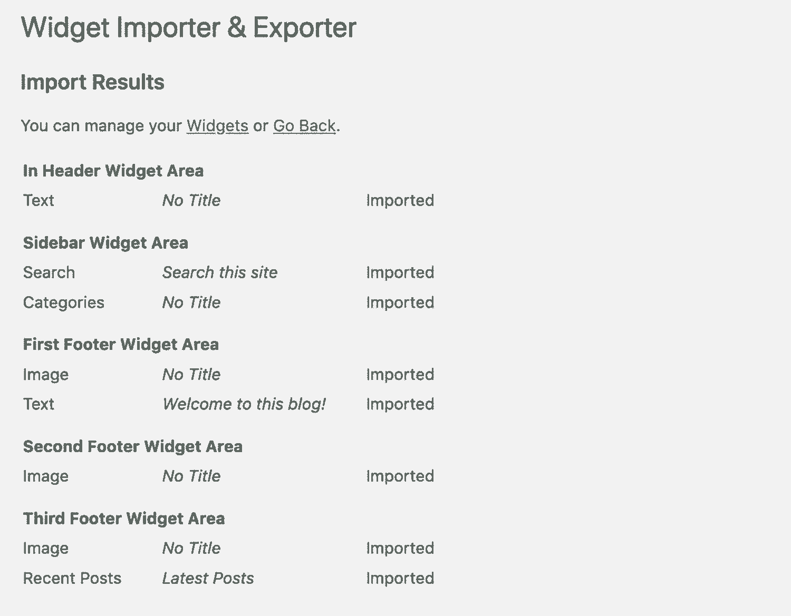

Widget import results

如果有任何缺少的小部件区域，将从您的旧站点导入小部件，但是它们将被添加到小部件管理屏幕中的**非活动小部件**区域。

如果你试图导入一个你的新网站上没有的小部件，可能是因为你没有激活插件，你会得到一个错误信息。安装并激活插件，再次运行导入，插件不会复制你已经导入的插件。

现在，您应该在新站点上拥有与旧站点完全相同的副本。花一些时间检查新站点的所有设置和配置，确保它们与旧站点相同(或者如果您想进行更改，可以对它们进行调整)。

然后，如果您的旧站点在多站点网络上，请要求网络管理员将其存档或删除。如果你的旧站点是一个独立的站点，[删除它](https://kinsta.com/blog/reset-wordpress/)。

## 手动迁移 WordPress 站点

如果你习惯使用 SFTP 和 MySQL，手动迁移你的站点会比使用插件更快更可靠。

在这里，我将着重于将一个独立的 WordPress 安装迁移到另一个。在下一节中，我将看看这对于 WordPress 多站点网络有何不同。

### 创建新的 WordPress 安装

首先创建一个新的站点，作为一个空的 WordPress 安装。

在 [MyKinsta](https://my.kinsta.com/) 中，点击管理菜单中的**站点**，然后点击屏幕右上角的**添加站点**按钮。您将看到一个对话框，询问您想要创建哪种类型的站点。

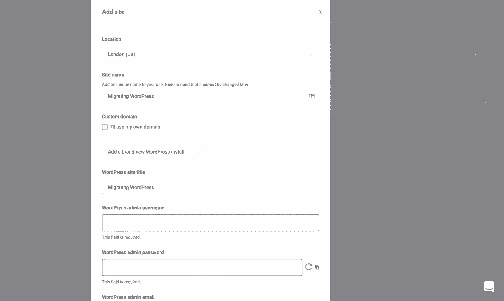

New WordPress site in MyKinsta

[选择你想在哪个数据中心](https://kinsta.com/knowledgebase/best-data-center/)托管你的网站，然后填写网站名称的详细信息，并选择**不要安装 WordPress** 。

这是因为**你将从你的旧站点**迁移 WordPress 文件。暂时将自定义域名保留为空，因为在新网站启动并运行时，您希望暂时将您的[域名](https://kinsta.com/blog/choose-domain-name/)保留在旧网站上。

点击**添加站点**按钮，将为您创建一个新站点。

如果你没有使用 Kinsta，你可以使用你的主机服务提供商的管理界面创建一个新的网站:你需要做的就是创建一个文件夹，或者如果你的主机帐户上没有任何其他网站，你可以跳过这一步，在下一步中只需将文件上传到 **/public/** 文件夹。

### 使用 SFTP 导出文件

下一步是将文件从旧站点迁移到新站点。这将包括主题文件，插件，上传和任何其他文件，插件可能已经添加到您的 **wp-content** 目录。

通过 SFTP 登录你的旧网站，下载所有的 WordPress 文件。如果你的站点在你的主机的根域中，那么这将意味着下载所有的文件。如果你把 WordPress 安装在一个子目录中，下载那个目录的内容。

要访问您的网站，您需要您的 SFTP 详细信息。在 MyKinsta 中，你可以通过点击**网站**然后点击网站名称并选择**信息**标签来找到这些。

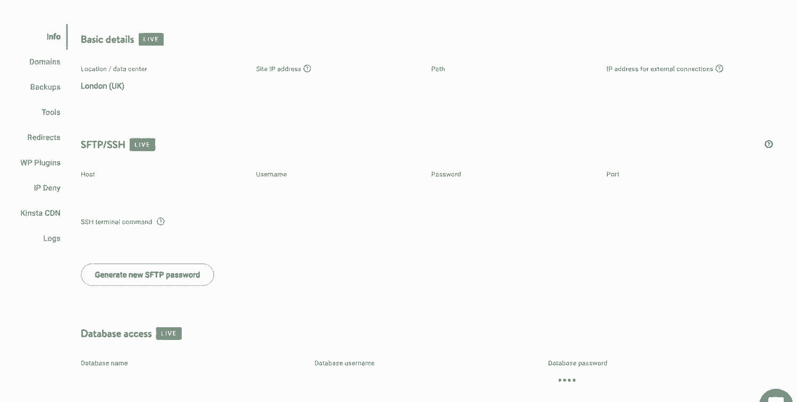

The info tab in MyKinsta

下面你可以看到在免费的 [FileZilla FTP 客户端](https://kinsta.com/blog/best-ftp-clients/#Filezilla)中查看的我的站点中的文件。

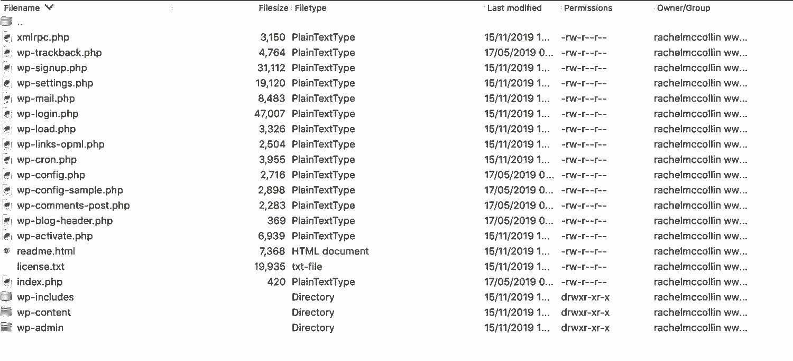

WordPress files in FTP client

### 从旧站点导出数据库

和文件一样，你的新 WordPress 站点也需要旧数据库的副本。为此，您需要使用一个 MySQL 工具，通常是 [phpMyAdmin](https://kinsta.com/help/wordpress-phpmyadmin/) 。

在你的旧站点的托管界面中，进入 phpMyAdmin。

厌倦了你的 WordPress 站点缓慢的主机？我们提供超快的服务器和来自 WordPress 专家的 24/7 世界级支持。[查看我们的计划](https://kinsta.com/plans/?in-article-cta)

在 MyKinsta 中，你可以点击**网站**，选择你的网站，然后进入**信息**屏幕。在**数据库访问**部分，点击**打开 phpMyAdmin** 按钮。

系统将提示您输入数据库用户名和密码。这些与您的托管帐户的密码不同。

在 MyKinsta 中，您可以在**信息**屏幕的**数据库访问**部分找到数据库用户名和密码。如果你正在迁移到另一个主机提供商，你可能会在注册你的帐户或在你的管理界面中得到这些信息。

在 phpMyAdmin 中，点击**数据库**选项卡。这将给你一个你在你的托管账户上创建的所有数据库的列表。

Databases in phpMyAdmin

单击与您要复制的站点相对应的数据库名称。然后，您将看到数据库中所有表的列表。

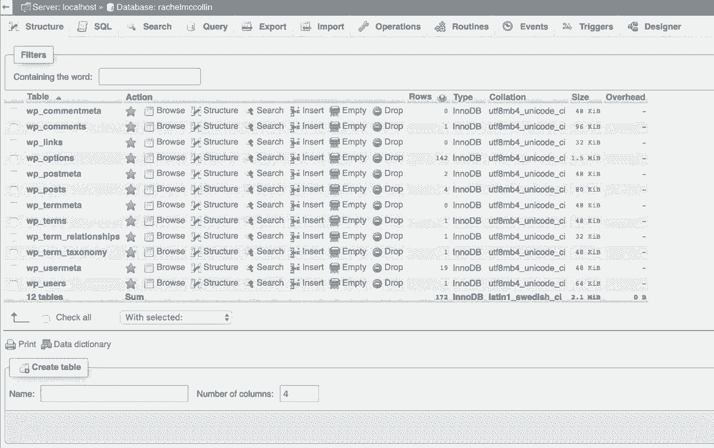

The database tables

点击表格列表下方的 **Check all** 复选框，在旁边的【T2 与选择:】下拉框中选择 Export。

PhpMyAdmin 将带你到一个新的屏幕。点击屏幕底部的 **Go** 按钮。

Export tables from database

PhpMyAdmin 将导出一个 SQL 文件并将其下载到您的计算机上。把它保存在你能再次找到的地方。

### 将文件导入新的 WordPress 站点

下一步是将所有这些文件上传到您的新网站。

如果你的新站点[由 Kinsta](https://kinsta.com/plans/) 托管，你可以去 MyKinsta 获取通过 SFTP 连接到它的[凭证。点击管理菜单中的**网站**，然后点击你的网站名称。在**信息**屏幕中，您将找到您的 SFTP 详细信息。](https://kinsta.com/knowledgebase/how-to-use-sftp/)

在您的 FTP 客户端中，通过提供以下详细信息进行连接:

*   **连接类型** : SFTP。
*   **主机名、地址、服务器或 URL** :您的 IPv4 地址。
*   **用户名**:你的 SFTP 用户名。
*   **密码**:您的 SFTP 密码。
*   **港口**:你的 SFTP 港口。

将文件上传到它们原来所在的目录，通常是 **/public/** 目录。

他们可能需要一段时间来上传，所以你可能想在等待的时候喝杯咖啡。

### 将数据库表导入到新站点

最后一步是[导入数据库表](https://kinsta.com/knowledgebase/how-to-restore-mysql-database-using-phpmyadmin/)。

在新站点的托管界面中，转到 phpMyAdmin。在 MyKinsta 中，您可以通过网站的**信息**屏幕来访问它。

如果你不小心创建了一个 WordPress 安装，或者你需要覆盖一个现有的 WordPress 站点，你需要删除现有的数据库表。按照从旧站点导出表格时的相同方式选择所有表格，并单击 **With selected:** 下拉列表。选择**下降**。

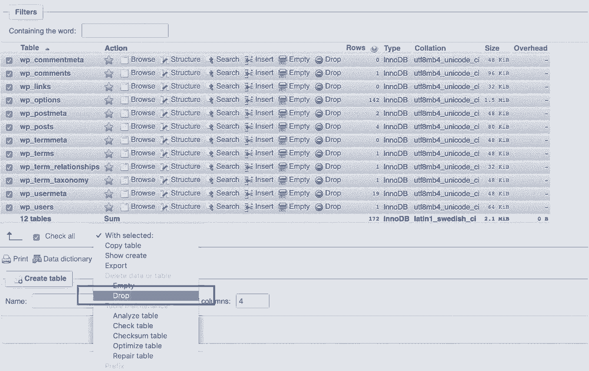

Drop database tables

系统将提示您确认是否要删除这些表，然后数据库中的所有内容都将被删除。如果您不确定是否要这样做，[首先通过导出表来备份数据库](https://kinsta.com/knowledgebase/mysql-backup-database/)。

一旦删除了数据库表，或者如果一开始就没有数据库，就需要将表从旧站点导入到新站点。

在 phpMyAdmin 中，单击**导入**选项卡。在**文件导入**部分，点击**选择文件**按钮，选择您电脑上已经下载的 SQL 文件。

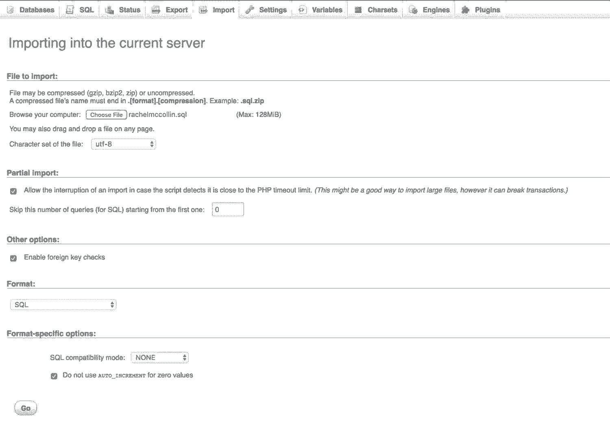

Uploading database tables

转到页面底部，点击**转到**按钮。PhpMyAdmin 将上传 [SQL 文件](https://kinsta.com/blog/sql-injection/)，并使用它为您的新站点创建数据库表，这些表将与旧站点中的表相同。

如果您要将站点迁移到本地安装或除 Kinsta 之外的主机提供商，您可能需要在导入表之前创建一个空数据库。在 phpMyAdmin 中，你可以通过进入**数据库**屏幕并点击**创建数据库**按钮来完成。给数据库起一个有意义的名字，然后将表导入其中。

### 编辑你的 wp-config.php 文件

既然您已经上传了数据库，那么您需要在新站点中编辑[wp-config.php 文件](https://kinsta.com/blog/wp-config-php/),以确保它反映了您刚刚创建的数据库。

回到你的 FTP 客户端，在你的新站点中找到 wp-config.php 文件。做一份备份，以防万一。然后右击文件，点击**编辑**选项打开。找到包含数据库详细信息的部分:

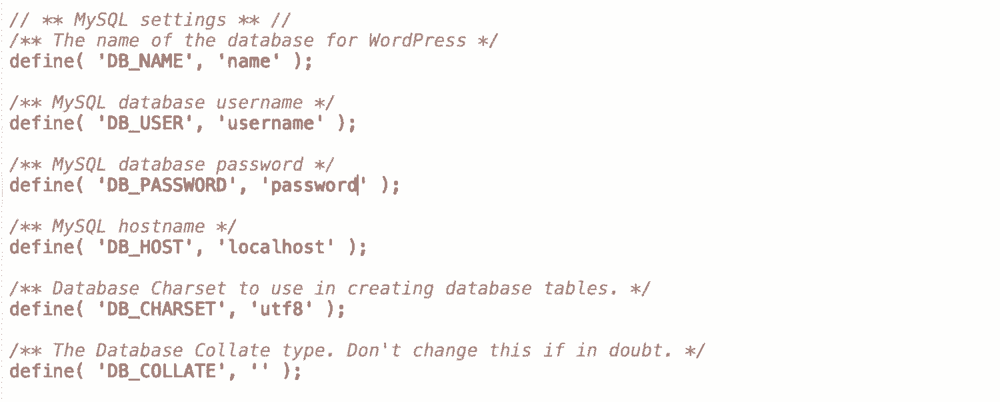

wp-config.php database details

用您在 MyKinsta 的 **Info** 屏幕中找到的数据库凭证更新这几行。如果站点位于本地计算机上，请使用这些凭据:

*   **Name** :创建数据库时给它起的名字。
*   **用户名** : root。
*   **密码** : root。

如果你将你的网站迁移到不同的主机提供商，你需要在你的主机仪表板中找到这些凭证。

### 信息

如果您跳过这一步，当您第一次尝试访问该站点时，系统会提示您提供这些详细信息。

### 测试您的站点并更新域

现在你已经建立了新的 WordPress 站点，花一些时间来测试它是否正常工作。当你测试它时，只测试指向新站点的链接，而不是旧站点，因为你会发现数据库中的一些链接有旧的域名。

这是可以的，因为一旦你测试了网站，你将更新域名。

比较新旧站点，检查它们是否相同。

### 将域名重定向到您的新站点

现在你的新网站已经准备好了，是时候关闭旧网站并[将你的域名](https://kinsta.com/blog/wordpress-redirect/)重定向到新网站。

这个过程和你使用复制插件是一样的，所以按照这篇文章中的说明去做。

现在，您已经在新位置创建了新站点。如果你不再需要旧网站，是时候删除它并关闭你的旧主机账户了。你完了！

## 手动迁移 WordPress 多站点网络

如果您需要手动迁移多站点网络，或者将一个站点迁移到多站点网络或从多站点网络中迁移出来，并且您不想使用上述插件方法，您可以这样做。

事实上，您只需要迁移一些数据库表和一些文件，这就很复杂了。

我将概述不同之处，而不是完整地描述这个过程，这样您就可以在完成上面的手动迁移时应用这些不同之处。

请注意，如果您要迁移整个网络，过程与单个站点相同，因为您要迁移的是整个安装。在这里，我将重点关注**将单个站点移入和移出多站点**。

### 重要的

如果你正在将一个多站点网络迁移到 Kinsta，并且该网络包括[子目录](https://kinsta.com/blog/wordpress-multisite/#wordpress-multisite-subdomains-vs-subdirectories)，你将需要[联系 Kinsta 支持](https://kinsta.com/help/wordpress-support-ticket/)，并要求他们启用必要的 Nginx 配置来完成这项工作。

### 创建新网站

因为你不会迁移整个网络安装，你需要在开始之前设置一个 [WordPress 安装](https://kinsta.com/knowledgebase/manually-install-wordpress/)。如果您正在迁移到一个现有的网络，您不需要这样做，因为网络已经存在。

当您迁移文件时，您不会导入 WordPress 文件，而只是导入 **wp-content** 目录的内容。

### 导出文件

如果您从单个站点导出到网络中，导出文件的过程将与上面相同。

如果您正在导出一个当前位于多站点网络中的站点，您将需要从该站点中查找文件。

从[插件](https://kinsta.com/best-wordpress-plugins)和[主题](https://kinsta.com/best-wordpress-themes/)开始。你只需要下载那些在这个特定网站上使用的插件和主题文件，而不是所有安装在网络上的插件和主题。在网站的管理界面中找到这些，并从**WP-内容/主题**和**WP-内容/插件**目录中下载。

在[多站点网络](https://kinsta.com/knowledgebase/multisite/)中，每个站点的上传都是分开存储的，因此您只需下载您要导出的站点的上传即可。

Files in a Multisite network

首先找到站点的 ID，这将是一个数字。您可以在网络中的**网络管理>站点**屏幕中找到这一点。然后在你的 **wp-content** 目录下，打开 **uploads/sites** 文件夹，找到一个以站点 ID(编号)为名称的文件夹。下载该文件夹的内容。

### 导出数据库表

如果从网络中的站点导出，只需导出与该站点相关的表。在 phpMyAdmin 中，找到名为 **wp-id-name** 的表，其中 **id** 是站点的 id， **name** 是每个唯一表的名称。选择所有选项，然后点击**导出**选项。

下面的例子来自网络中的一个站点，插件为每个站点创建额外的数据库表。你也需要出口那些。

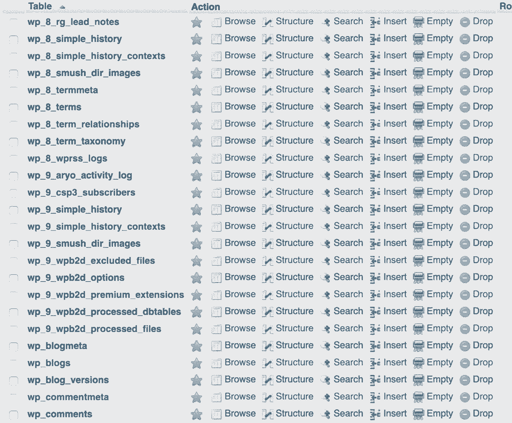

Extra database tables in Multisite

完成后，您需要编辑这些表名，然后才能将它们导入独立的站点。备份 SQL 文件并打开原始文件。搜索(例如) **wp-3-** 的所有实例，其中 **3** 是站点的 ID。换成 **wp-** 。保存文件，然后在导入到新站点时使用最近编辑的文件。

### 导入文件

如果你要导入到一个多站点网络中的站点，你需要上传上传到 **wp-content/uploads/sites** 中正确编号的文件夹。

这意味着你需要首先在你的网络中创建一个新的站点，这样 WordPress 就会创建这个文件夹。按照 WordPress Multisite 的[指南中的说明来做。](https://kinsta.com/blog/wordpress-multisite/)

当你导入主题和插件文件时，把它们上传到 **wp-content/themes** 和 **wp-content/plugins** 文件夹，就像你对普通 WordPress 站点所做的那样。

### 导入数据库表

如果您要导入到多站点网络中的站点，您需要确保 SQL 文件中的表在导入前具有正确的前缀。

在网络中创建新的要迁移到的空站点后，记下该站点的 ID。备份从旧网站下载的 SQL 文件，并打开原始文件。在该文件中，将 wp-的所有实例替换为(例如) **wp-3-** ，其中 **3** 是新站点的 ID。保存文件。

接下来，在 phpMyAdmin 中，选择已经为您的网络中的新站点创建的文件(所有前缀中带有站点 ID 的文件)。放下这些。完成后，导入新文件来创建这些表的新版本。

如果您不小心删除了错误的文件或错误地编辑了 SQL 文件，它可能会破坏您的多站点网络。因此，只有当您习惯于使用 phpMyAdmin 时才这样做。并且**先备份你的网络**！

### 导入用户

因为用户是为整个网络存储的，而不是为网络中的单个站点存储的，所以没有手动方式将用户导出到 WordPress 多站点网络中的某个站点或从该站点导出用户。

唯一的方法就是使用本文前面提到的插件方法。在导入了所有其他文件和表格之后，再这样做。

请注意，当您以这种方式导入用户时，在将帖子归属于作者时，他们不会被识别为同一用户。你需要浏览所有的帖子/页面，并手动将它们归属于正确的作者。

### 预览您的站点

完成多站点子站点或多站点网络的迁移后，可以通过编辑计算机的主机文件轻松预览迁移后的站点。这允许您将本地 DNS 指向托管迁移站点的服务器。有关如何编辑 hosts 文件的更多信息，请点击此处查看或深入了解指南。

[Migrating your site to a new host can be a challenging task because of the many elements involved. Check out this (massive) guide on how to perform a WordPress migration without downtimes 🚨💫Click to Tweet](https://twitter.com/intent/tweet?url=https%3A%2F%2Fkinsta.com%2Fblog%2Fmigrate-wordpress-site%2F&via=kinsta&text=Migrating+your+site+to+a+new+host+can+be+a+challenging+task+because+of+the+many+elements+involved.+Check+out+this+%28massive%29+guide+on+how+to+perform+a+WordPress+migration+without+downtimes+%F0%9F%9A%A8%F0%9F%92%AB&hashtags=migration%2Cwordpress)

## 摘要

在主机之间或者从本地到远程安装迁移 WordPress 站点是许多 WordPress 用户在某个时候不得不做的事情。有很多方法可以做到这一点，主要的区别是你是否手动或使用插件。

如果您搬到 Kinsta，我们将很乐意[为您负责迁移您的站点](https://kinsta.com/knowledgebase/wordpress-migrations/)。

另一方面，如果你决定自己迁移一个 WordPress 站点，上面概述的步骤将帮助你可靠地完成，并确保你的新 WordPress 站点和你的旧站点是一样的。

* * *

让你所有的[应用程序](https://kinsta.com/application-hosting/)、[数据库](https://kinsta.com/database-hosting/)和 [WordPress 网站](https://kinsta.com/wordpress-hosting/)在线并在一个屋檐下。我们功能丰富的高性能云平台包括:

*   在 MyKinsta 仪表盘中轻松设置和管理
*   24/7 专家支持
*   最好的谷歌云平台硬件和网络，由 Kubernetes 提供最大的可扩展性
*   面向速度和安全性的企业级 Cloudflare 集成
*   全球受众覆盖全球多达 35 个数据中心和 275 多个 pop

在第一个月使用托管的[应用程序或托管](https://kinsta.com/application-hosting/)的[数据库，您可以享受 20 美元的优惠，亲自测试一下。探索我们的](https://kinsta.com/database-hosting/)[计划](https://kinsta.com/plans/)或[与销售人员交谈](https://kinsta.com/contact-us/)以找到最适合您的方式。