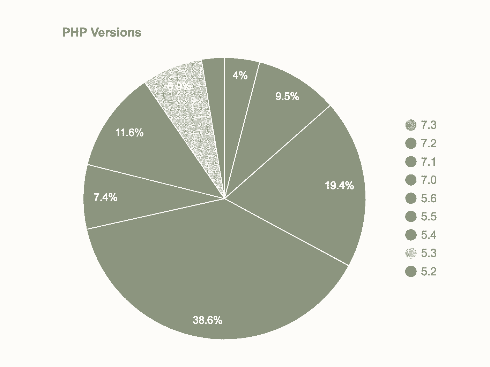
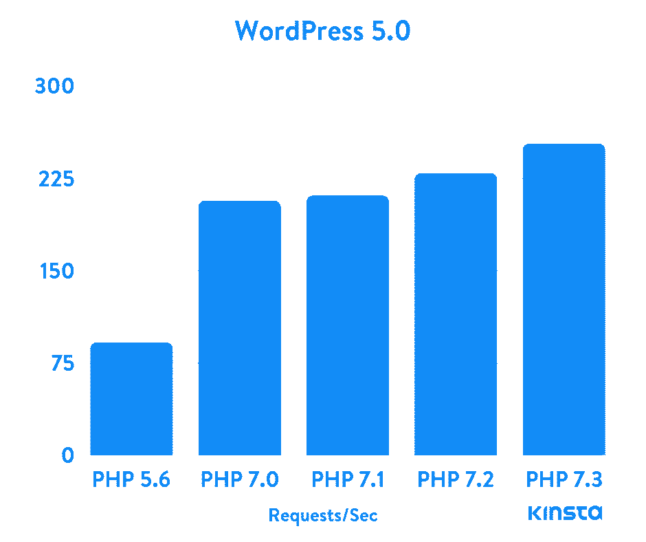
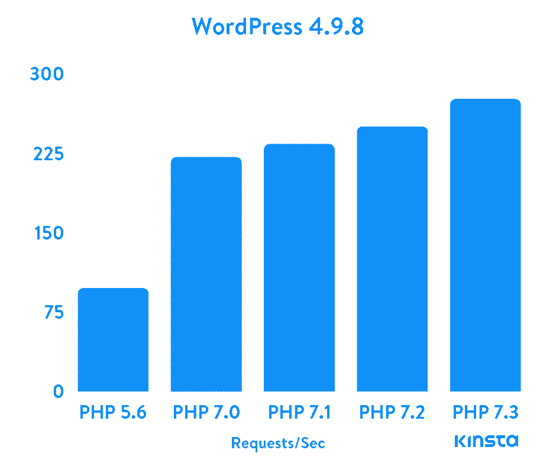
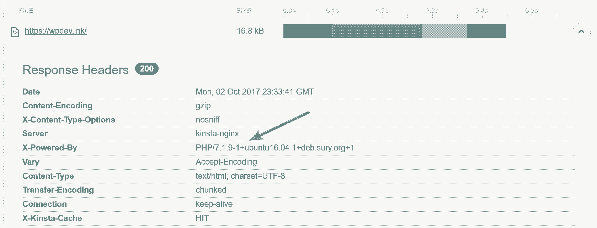
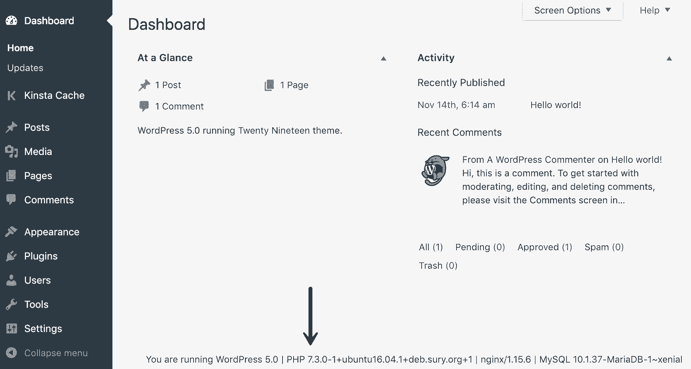
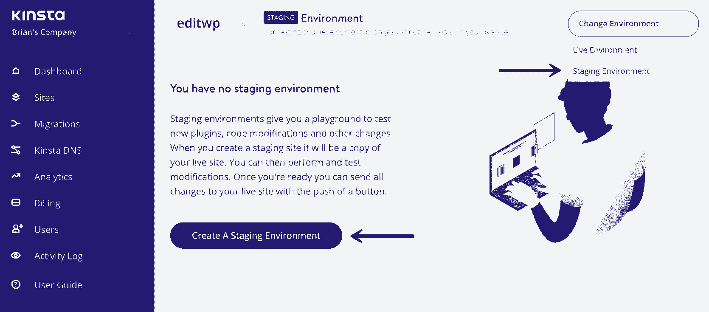

# PHP 7.3 的新特性(现在可以在 Kinsta 获得)

> 原文：<https://kinsta.com/blog/php-7-3/>

截止 2018 年 12 月 6 日，最新最棒的版本，PHP 7.3 来了！随之而来的是新的有用的特性、功能、弃用、大量的错误修复和性能提升。 **PHP 7.3 现在在 [MyKinsta 仪表板](https://my.kinsta.com/sites/tools/)中对所有 Kinsta 客户端**可用。🤘

**更新:** [PHP 8.1(正式发布)](https://kinsta.com/feature-updates/php-8-1/)现已对所有 Kinsta 客户端开放。Kinsta 不再支持 PHP 7.3。请注意，我们支持 PHP 8.0 和 8.1 版本。

在本帖中，我们将概述我们个人认为最相关的特性和变化。但是你可以在 [PHP 7.3 升级说明](https://github.com/php/php-src/blob/php-7.3.0beta1/UPGRADING)和 [PHP 7.3 征求意见](https://wiki.php.net/rfc#php_73)中查看完整的特性、变化和错误修复列表。

[The latest version, PHP 7.3 is now available to all Kinsta clients! 🤘Click to Tweet](https://twitter.com/intent/tweet?url=https%3A%2F%2Fkinsta.com%2Fblog%2Fphp-7-3%2F&via=kinsta&text=The+latest+version%2C+PHP+7.3+is+now+available+to+all+Kinsta+clients%21+%F0%9F%A4%98&hashtags=PHP%2Cwebdev)

## PHP 7.3 有什么新特性？

在本帖中，我们将介绍 PHP 7.3 的以下变化:

*   [实现灵活的 Heredoc 和 Nowdoc 语法](#flexible-heredoc-nowdoc)
*   [在函数调用中允许尾随逗号](#trailing-comma-in-function-calls)
*   [JSON_THROW_ON_ERROR](#JSON_THROW_ON_ERROR)
*   [列表()参考赋值](#list)
*   [是 _ 可数函数](#is-countable)
*   [array_key_first()，array_key_last()](#array-key-first-last)
*   [Argon2 密码哈希增强功能](#argon2)
*   [折旧](#deprecations)

## 灵活的 Heredoc 和 Nowdoc 语法

这可能是 PHP 7.3 带来的最相关的改进之一，我们认为它值得更多的关注。因此，在深入 PHP 7.3 heredoc/nowdoc 的变化之前，我们将提供一个这个有用的核心特性的快速概述。如果您已经对 nowdoc 和 heredoc 很有信心，请放心地跳到 PHP 7.3 的变化。

*   [heredoc 和 nowdoc 语法概述](#heredoc-nowdoc-overview)
*   PHP 7.3:允许缩进结束标记并去除前导空格
*   [PHP 7.3:从结束标记](#heredoc-nowdoc-closing-marker)中删除尾随的新行要求

### heredoc 和 nowdoc 语法概述

**heredoc 语法提供了一种添加大量文本的方法，而不需要转义诸如双引号**之类的东西。一个 heredoc 以`<<<`开头，后面跟着一个标记，以同样的标记结尾，后面跟着一个分号。这里有一个例子:

```
print <<<EOT
Heredoc text behaves just like a double-quoted string, without the double quotes.
EOT;
```

nowdoc 的行为很像 heredoc，但有一些例外:

*   标识符用单引号(`<<<'EOT'`)括起来
*   在 nowdoc 中不进行任何解析

以下是 nowdoc 的一个示例:

```
print <<<'EOT'
Nowdocs are to single-quoted strings what heredocs are to double-quoted strings.
EOT;
```

Heredocs 和 nowdocs 使用相同的规则来管理结束标记的使用:

1.  结束标记必须从该行的第一列开始
2.  标记必须遵循与 PHP 中任何其他标签相同的命名规则:它必须只包含字母数字字符和下划线，并且必须以非数字字符或下划线开头。

PHP 手册警告:

> 非常重要的是要注意，带有结束标识符的行不能包含其他字符，除了分号(；).这尤其意味着标识符*不能缩进*，分号前后不能有任何空格或制表符。认识到结束标识符前的第一个字符必须是本地操作系统定义的换行符也很重要。这是 UNIX 系统上的`\n`，包括 macOS。结束分隔符后面还必须跟一个换行符。

**PHP 7.2 无效语法:**

```
class foo {
    public $bar = <<<EOT
    bar
    EOT;
}
// Identifier must not be indented
```

**PHP 7.2 有效语法:**

```
class foo {
    public $bar = <<<EOT
bar
EOT;
}
```

简而言之，在 PHP 7.2 中:

*   结束标记不能缩进
*   带有结束标记的行不能包含空格或制表符之类的字符
*   结束标记前的第一个字符必须是换行符
*   结束标记后面必须跟一个换行符

很明显，heredoc 和 nowdoc 的语法非常严格，但 PHP 7.3 可能会通过以下改进稍微改变这一点。

### 1.允许缩进结束标记并去除前导空格

在 PHP 7.3 中，我们可以缩进结束标记，我们可以安全地编写下面的代码:

```
class foo {
    public $bar = <<<EOT
        bar
    EOT;
}
```

结束标记的缩进设置了将从正文的每一行中去除的空白(或制表符)的数量。但是要小心:**结束标记不应该缩进超过正文**的任何其他行。

参见下面的代码:

```
class foo {
    public $bar = <<<EOT
    bar
        EOT;
}
```

上面的代码会发出以下解析错误:

```
Parse error: Invalid body indentation level (expecting an indentation at least ...) in %s on line %d
```

去除制表符和空格允许我们将 heredoc/nowdoc 的主体缩进到与周围代码相同的级别，并且在主体的每一行之前没有不必要的空格。

我们可以使用制表符和空格来缩进，但是不允许混合使用。这意味着**我们必须对结束标记和正文**的任何行使用相同的缩进字符。对于不同的缩进字符，我们会遇到不同类型的解析错误(无效缩进)。

### 2.从结束标记中删除尾随的新行要求

目前，为了终止 heredoc/nowdoc，标记后面必须有一个新行。PHP 7.3 将改变这一点，允许我们在同一行终止 heredoc/nowdoc。这里有一个来自 RFC 的例子:

**PHP 7.2 有效语法:**

```
$values = [<<<END
a
b
c
END
, 'd e f'];
```

**PHP 7.3 有效语法:**

```
$values = [<<<END
a
b
c
END, 'd e f'];
```

无论如何，在选择标记的名字时要小心，因为“偶尔”如果它与你在 heredoc/nowdoc 正文中使用的一个单词匹配，你可能会期望一个错误(在 [RFC](https://wiki.php.net/rfc/flexible_heredoc_nowdoc_syntaxes) 和 [GitHub](https://github.com/php/php-src/blob/php-7.3.0beta1/UPGRADING#L33) 上阅读更多关于这个的内容)。

两项提案都以超过三分之二的票数通过。

#### PHP 7.3 RFC

*   [灵活的 Heredoc 和 Nowdoc 语法](https://wiki.php.net/rfc/flexible_heredoc_nowdoc_syntaxes)

#### 额外资源

*   [Heredoc 字符串语法](http://php.net/manual/en/language.types.string.php#language.types.string.syntax.heredoc)
*   [Nowdoc 字符串语法](http://php.net/manual/en/language.types.string.php#language.types.string.syntax.nowdoc)

## 在函数调用中允许尾随逗号

尾随逗号(或“结尾逗号”)是附加到元素、参数或属性列表的逗号，在频繁附加新值的情况下，它们很方便，因为它们可以防止由于缺少逗号而导致的错误。在 PHP 中，数组中允许尾随逗号，从 [PHP 7.2](https://kinsta.com/blog/php-7-2/) 开始，在分组名称空间中允许尾随逗号。

从 PHP 7.3 开始，函数声明中允许使用尾随逗号。[可变函数](https://en.wikipedia.org/wiki/Variadic_function)提供了一个尾随逗号非常有用的上下文示例:

```
foo(
    $bar,
    $baz,
);
```

当我们用`compact()`创建一个数组时，为了用`sprintf()`返回一个格式化的字符串，或者当合并一个数组时，我们可以使用一个尾随逗号:

```
$newArray = array_merge(
    $arrayOne,
    $arrayTwo,
    ['foo', 'bar'],
);
```

此外，尾随逗号对于调试也很有用:

```
var_dump(
    $foo,
    $bar,
    $baz,
);
```

而他们强大的有`unset()`和`isset()`:

```
unset(
    $foo,
    $bar,
    $baz,
);

isset(
    $foo,
    $bar,
    $baz,
);
```

方法调用和封装中也允许使用尾随逗号。

注意:**这个改变只会影响函数调用。函数声明语法不会改变**。此外，不允许使用独立逗号、多个尾随逗号和前导逗号。

更多示例可在 [RFC 页面](https://wiki.php.net/rfc/trailing-comma-function-calls)上找到。该 RFC 以 30 比 10 的票数通过。

#### PHP 7.3 RFC

*   [灵活的 Heredoc 和 Nowdoc 语法](https://wiki.php.net/rfc/flexible_heredoc_nowdoc_syntaxes)

## JSON _ THROW _ ON _ 错误

PHP 7.3 最受欢迎的功能之一是提供了一种处理 JSON 错误的新方法。这不是一个核心特性，而是对 JSON 扩展的补充，它将改变 [json_decode()](http://www.php.net/json_decode) 和 [json_encode()](http://www.php.net/json_encode) 的错误行为。

目前，`json_decode()`返回出错的`null`，但是`null`也可以是有效的结果。这可能会令人困惑，因为

> 只有通过调用`json_last_error()`或`json_last_error_msg()`才能知道是否发生了错误，它们分别以机器可读和人类可读的形式返回全局错误状态。–[PHP RFC](https://wiki.php.net/rfc/json_throw_on_error)

出错时`json_encode()`返回`FALSE`。这一点更清楚，因为有一个特定的误差值。总之，**两个函数都不会在出错时暂停程序执行，也不会抛出任何警告**。

话虽如此，以下是 PHP 7.3 的建议:

> 相反，RFC 建议为`json_decode()`和`json_encode()`、`JSON_THROW_ON_ERROR`增加一个新的选项标志值。当传递该标志时，这些函数的错误行为被改变。全局错误状态保持不变，如果发生错误，这些函数会抛出一个`JsonException`，消息和代码分别设置为`json_last_error()`和`json_last_error_msg()`的值。

下面的例子展示了一种抛出 JSON 错误的简单方法:

```
try {
    json_decode("{", false, 512, JSON_THROW_ON_ERROR);
}
catch (\JsonException $exception) {
    echo $exception->getMessage(); // echoes "Syntax error"
}
```

出错时抛出异常有几个好处，你会在 [RFC](https://wiki.php.net/rfc/json_throw_on_error) 中发现。

注意:传递给`json_decode()`的无效深度参数输出警告并返回`NULL`。这种行为不会受到`JSON_THROW_ON_ERROR`的影响。同样，参数解析错误不受`JSON_THROW_ON_ERROR`影响，继续产生警告。

这项提案以 23 票对 0 票获得通过。

#### PHP 7.3 RFC

*   [JSON_THROW_ON_ERROR](https://wiki.php.net/rfc/json_throw_on_error)

#### 额外资源

*   [JavaScript 对象符号](http://php.net/manual/en/book.json.php)
*   [json_decode()](http://php.net/manual/en/function.json-decode.php)
*   [json_encode()](http://php.net/manual/en/function.json_encode)
*   [json_last_error()](http://php.net/manual/en/function.json-last-error.php)
*   [json_last_error_msg()](http://php.net/manual/en/function.json-last-error-msg.php)
*   [PHP 语言异常](http://php.net/manual/en/language.exceptions.php)

## list()引用赋值

### 引用赋值是什么意思？

考虑下面一行:

```
$b = &$a;
```

这里`$b`获取`$a`的值，但是该值没有从`$a`复制到`$b`。在 PHP 中我们可以通过引用来赋值，这意味着两个变量可能指向相同的数据，对任何变量的每次更改都会影响原始数据。这里是 PHP 手册中的一个例子[:](http://php.net/manual/en/language.operators.assignment.php#language.operators.assignment.reference)

```
<?php
$a = 3;
$b = &$a; // $b is a reference to $a

print "$a\n"; // prints 3
print "$b\n"; // prints 3
```

现在，让我们更改`$a`的值:

```
$a = 4; // change $a

print "$a\n"; // prints 4
print "$b\n"; // prints 4 as well, since $b is a reference to $a, which has been changed
```

### 什么是 list()结构，它在 PHP 7.3 中有什么变化

[list()](http://www.php.net/list) 语言结构可以用来“给变量赋值，就像它们在一个数组中一样”，但是对于`list()`，我们目前不允许通过引用来给变量值赋值。

PHP 7.3 应该会改变这一点，允许我们也使用`list()`构造通过引用来分配变量，如下例所示:

```
$array = [1, 2];
list($a, &$b) = $array;
```

这与以下内容相同:

```
$array = [1, 2];
$a = $array[0];
$b =& $array[1];
```

这个提议的优点是，我们现在可以通过引用来分配多个变量，这在当前是不允许的。更多示例请参见 [RFC](https://wiki.php.net/rfc/list_reference_assignment) 。这项提案以 17 票对 7 票获得通过。

## 注册订阅时事通讯


### 想知道我们是怎么让流量增长超过 1000%的吗？

加入 20，000 多名获得我们每周时事通讯和内部消息的人的行列吧！

[Subscribe Now](#newsletter)

#### PHP 7.3 RFC

*   [列表()参考赋值](https://wiki.php.net/rfc/list_reference_assignment)

#### 额外资源

*   PHP 手册-[list()](http://php.net/manual/en/function.list.php)
*   PHP 手册-[参考资料解释](http://php.net/manual/en/language.references.php)
*   赋值运算符-[引用赋值](http://php.net/manual/en/language.operators.assignment.php#language.operators.assignment.reference)

## is _ 可数函数

PHP 7.3 的另一个有用的特性是`is_countable()`函数。一直到 [PHP 7.2](https://kinsta.com/blog/php-7-2/) ，我们在试图 [count()](http://php.net/manual/en/function.count.php) 不可数的东西时都会出错。为此，为了避免出现警告，我们被迫添加以下代码:

```
if (is_array($foo) || $foo instanceof Countable) {
    // $foo is countable
}
```

这个 RFC 提出了函数 [is_countable()](https://wiki.php.net/rfc/is-countable) ，如果给定变量是数组或者是可数变量，则返回`true`，否则返回`false`。因此，上面的代码可以修改如下:

```
if (is_countable($foo)) {
    // $foo is countable
}
```

这项提案以 25 票对 0 票获得通过。

#### PHP 7.3 RFC

*   [是可数的](https://wiki.php.net/rfc/is-countable)

#### 额外资源

*   [可计数界面](http://php.net/manual/en/class.countable.php)
*   [计数](http://php.net/manual/en/function.count.php)

## array_key_first()，array_key_last()

目前，我们可以使用 [reset()](http://php.net/manual/en/function.reset.php) 、 [end()](http://php.net/manual/en/function.end.php) 和 [key()](http://php.net/manual/en/function.key.php) 函数来获取数组的第一个和最后一个键。不幸的是，使用这些函数，没有办法在不改变数组内部状态的情况下收集数组的第一个或最后一个索引。其他选项通常会降低代码的可读性和性能。该提案将通过向 PHP 核心添加两个新功能来改变这种情况:

*   `array_key_first()`
*   `array_key_last()`

从 PHP 7.3 开始，`array_key_first()`和`array_key_last()`允许检索给定数组**的第一个和最后一个键，而不影响内部数组指针**。这些新函数将允许我们编写不太复杂的代码，并且在某些情况下避免错误。更多信息和几个例子见 [RFC](https://wiki.php.net/rfc/array_key_first_last) 。

`array_key_first()`和`array_key_last()`以 18 票对 14 票获得通过。

注意:最初的 RFC 提出了另外两个函数，`array_value_first()`和`array_value_last()`，这两个函数在不同的投票中被投票，但是没有被批准，也不会成为 PHP 核心的一部分。

#### PHP 7.3 RFC

*   [array_key_first()，array_key_last()](https://wiki.php.net/rfc/array_key_first_last)

#### 额外资源

*   [array_key_first](http://php.net/manual/en/function.array-key-first.php)
*   [array_key_last](http://php.net/manual/en/function.array-key-last.php)

## Argon2 密码哈希增强

Argon2 是一种哈希算法[，在 PHP 7.2](https://kinsta.com/blog/php-7-2/) 中实现，作为 Bcrypt 算法的替代。PHP 7.2 引入了`PASSWORD_ARGON2I`常量，可用于`password_*`函数:

```
password_hash('password', PASSWORD_ARGON2I);
```

自从第一次实现以来，Argon2 又增加了一个新版本，因此，在撰写本文时，Argon2 有三个版本:

*   **Argon2d** 最大化抵抗 GPU 破解攻击。它速度更快，并使用依赖数据的内存访问。
*   **Argon2i** 使用与数据无关的内存访问，这是密码哈希的首选。它的速度较慢，因为它在内存中传递更多次，以防止折衷攻击。
*   **Argon2id** 是一个混合版本，它结合了 Argon2i 方法用于第一次内存传递，以及 Argon2d 方法用于后续传递。

在互联网上推荐 Argon2id，除非有充分的理由特别喜欢另一种变体。

新 RFC 建议在[密码 _*](http://php.net/manual/en/ref.password.php) 函数中使用新的`PASSWORD_ARGON2ID`常量实现 Argon2id:

```
password_hash('password', PASSWORD_ARGON2ID);
```

该实现与 Argon2i 实现相同，并将接受相同的成本因素:

Struggling with downtime and WordPress problems? Kinsta is the hosting solution designed to save you time! [Check out our features](https://kinsta.com/features/)

*   一个**内存开销**，它定义了哈希过程中应该消耗的 KiB 数(默认值为 1<10，或 1024 KiB，或 1 MiB)
*   定义哈希算法迭代次数的**时间成本**(默认为 2)
*   一个**并行因子**，它设置散列过程中将使用的并行线程的数量(默认为 2)

请参见以下代码:

```
$options = ['memory_cost' => 1<<11, 'time_cost' => 4, 'threads' => 2];
password_hash('password', PASSWORD_ARGON2ID, $options);
```

关于 [RFC](https://wiki.php.net/rfc/argon2_password_hash_enhancements) 的更多信息和示例。

#### PHP 7.3 RFC

*   [Argon2 密码哈希增强功能](https://wiki.php.net/rfc/argon2_password_hash_enhancements)

#### 额外资源

*   [Argon2](https://en.wikipedia.org/wiki/Argon2) (维基百科)
*   Argon2:用于密码散列和其他应用的硬存储功能

## 贬值

以下函数/功能在 PHP 7.3 中将被弃用，在 PHP 8.0 之前将被删除。

### 弃用并删除 image2wbmp()

函数的作用是:输出或保存给定图像的 wbmp 版本。这个函数有三个参数:图像资源、文件名(保存文件的路径)和前景色。
从 PHP 5.0 开始，与 [imagewbmp()](http://php.net/manual/en/function.imagewbmp.php) 相同，所以这个 [RFC](https://wiki.php.net/rfc/image2wbmp) 提出弃用并移除。
从 PHP 7.3 开始，每次调用`image2wbmp()`都会发出一个弃用警告。移除之后，每个调用都会抛出一个致命错误。

#### PHP 7.3 RFC

*   [弃用并删除 image2 BMP()](https://wiki.php.net/rfc/image2wbmp)

### 弃用并移除不区分大小写的常数

PHP 目前支持区分大小写和不区分大小写的常量。总之，**不区分大小写的**常量是受支持的，但被认为在功能上存在不一致性，并且使用起来很复杂。
这一提议始于以下前提:

*   [类常量](http://php.net/manual/en/language.oop5.constants.php)总是区分大小写
*   用`const`声明的全局常量总是区分大小写的
*   默认情况下，用`define()`定义的常量区分大小写

此外， [PHP 语言引用](http://php.net/manual/en/language.constants.php)明确声明:

> 默认情况下，常数区分大小写。按照惯例，常量标识符总是大写的。

也就是说，本 RFC 提出了以下更改:

*   不赞成调用第三个参数设置为`true`的`define()`–PHP 7.3
*   不赞成使用与声明不同的大小写访问不区分大小写的常量(除了`true`、`false`和`null`)–PHP 7.3
*   去除声明不区分大小写的常量的可能性——PHP 8.0
*   将`true`、`false`和`null`从特殊情况下的常量转换为保留关键字–PHP 8.0

#### PHP 7.3 RFC

[弃用并删除不区分大小写的常量](https://wiki.php.net/rfc/case_insensitive_constant_deprecation)。

### php 7.3 的附加反作用

这里是 PHP 7.3 中被否决的功能的快速列表。这不是详尽的，它们只是我个人认为更相关的反对建议。关于建议的反对意见的完整列表，请参见 PHP 7.3 的反对意见。

**未记录的 mbstring 函数别名**:有许多未记录的 [mbstring](http://php.net/manual/en/book.mbstring.php) 函数别名是使用`mb_`前缀的等价函数的重复。例如，`mbereg`是`mb_ereg`的别名。所有这些函数都将被标记为不推荐使用，并且在编译过程中遇到它们时会抛出一个不推荐使用的通知。

**整数针串搜索功能**:这些功能通常作用于串针。如果给定一个非字符串针，它被转换成一个整数并作为一个字符的序数值应用(在 [PHP 手册](http://php.net/manual/en/function.strpos.php)上阅读更多)。这里是来自 RFC 的一个例子[:](https://wiki.php.net/rfc/deprecations_php_7_3#string_search_functions_with_integer_needle)

```
$str = "There are 10 apples";
var_dump(strpos($str, "10")); // int(10)
var_dump(strpos($str, 10));   // bool(false)
```

这被认为是令人困惑的，并且会导致不可预知的问题，因为类型会随着用户数据源而改变。为此，RFC 建议，如果将非字符串针传递给以下函数之一，则发出弃用警告:

*   `strpos`
*   `strrpos`
*   `stripos`
*   `strripos`
*   `strstr`
*   `strchr`
*   `strrchr`
*   `stristr`

在 PHP 8.0 中，弃用警告应该被移除，针应该被自动转换成字符串。


> 金斯塔把我宠坏了，我现在要求每个供应商都提供那样的服务水平。我们还试图通过我们的 SaaS 工具支持达到这一水平。
> 
> <footer class="wp-block-kinsta-client-quote__footer">
> 
> 
> 
> <cite class="wp-block-kinsta-client-quote__cite">Suganthan Mohanadasanfrom@ suganthamn</cite></footer>

[查看计划](https://kinsta.com/plans/)

**`fgetss()`函数和`string.strip_tags`流过滤器** : `fgetss()`和`string.strip_tags`在读取流时从流中剥离标签。函数和过滤器都公开了 [strip_tags()](http://php.net/manual/en/function.strip-tags.php) 功能，使得`strip_tags()`的实现更加复杂，因为需要一个流状态机。此外，RFC 指出了这些功能的另一个缺点:

> 另一方面，这些功能似乎没有什么用处。本身由于自身的局限性和已知的 bug，已经很少有合法的应用了。除此之外，不需要为流应用程序提供本地支持。

因此 RFC 建议将`fgetss()`、`gzgetss()`和`SplFileObject::fgetss()`标记为不推荐使用。

## PHP 7.3 对 WordPress 用户意味着什么？

据官方 [WordPress 统计页面](https://wordpress.org/about/stats/)显示，截至本文撰写之时，只有 32.9%的 WordPress 用户升级到了 PHP 7 或更高版本。只有 4%的人在使用 T2 的 PHP 7.2。您可以看到，超过 38%的大多数用户仍在运行 PHP 5.6。更可怕的是，超过 28.5%的用户在使用不支持的 PHP 版本。截至 2016 年 12 月，WordPress.org 实际上将他们的[官方推荐](https://wordpress.org/about/requirements/)从 PHP 5.6 升级到 PHP 7 或更高版本。



WordPress PHP versions


### PHP 7 性能

从性能的角度来看，上面的数字尤其令人沮丧，因为 PHP 7 已经显示出明显更快。以下是一些统计数据:

*   官方 PHP 基准测试表明，与 PHP 5.6 相比，PHP 7 允许系统每秒执行两倍的请求，而延迟几乎是 5.6 的一半。
*   Christian Vigh 也发表了一篇 [PHP 性能对比](https://www.phpclasses.org/blog/post/493-php-performance-evolution.html)文章，他发现 PHP 5.2 比 PHP 7 慢 400%。

我们运行了自己的 [PHP 性能基准](https://kinsta.com/blog/php-benchmarks/)。与上面的基准类似，我们看到 PHP 7.3 上的 WordPress 5.0 每秒可以执行的事务(请求)几乎是 PHP 5.6 的三倍。



WordPress 5.0 PHP benchmarks


*   WordPress 5.0 PHP 5.6 基准测试:91.64 请求/秒
*   WordPress 5.0 PHP 7.0 基准测试结果:206.71 请求/秒
*   WordPress 5.0 PHP 7.1 基准测试结果:210.98 请求/秒
*   WordPress 5.0 PHP 7.2 基准测试结果:229.18 req/sec
*   WordPress 5.0 **PHP 7.3 基准测试结果:253.20 req/sec** **🏆**

有趣的是，PHP 7.3 上的 WordPress 4.9.8 比 WordPress 5.0 稍快。



WordPress 4.9.8 PHP benchmarks


*   WordPress 4.9.8 PHP 5.6 基准测试:97.59 请求/秒
*   WordPress 4.9.8 PHP 7.0 基准测试结果:221.42 请求/秒
*   WordPress 4.9.8 PHP 7.1 基准测试结果:233.78 请求/秒
*   WordPress 4.9.8 PHP 7.2 基准测试结果:250.36 req/sec
*   PHP 7.3 基准测试结果:276.31 请求/秒🏆

许多更新缓慢，仅仅是因为测试所有新的第三方插件和主题以确保它们正常运行需要时间。但是很多时候，归结起来就是他们还没有做。

### 检查你的 PHP 版本

不确定你运行的是什么版本的 PHP？最简单的检查方法之一是使用类似于 [Pingdom](https://kinsta.com/blog/pingdom-speed-test/) 或 Google Chrome Devtools 的工具。第一个 HTTP 请求头通常会显示版本。



Check version of PHP


这依赖于主机不修改`X-Powered-By`头值。如果是这样，您可能看不到您的 PHP 版本。在这种情况下，你也可以安装一个像[版本信息](https://wordpress.org/plugins/version-info/)这样的免费插件，它会在你的 WordPress 管理面板的页脚显示一些基本的服务器信息。



Check PHP version in WordPress


或者，你也可以[通过 FTP](https://kinsta.com/blog/php-versions/) 上传一个文件来查看你的 PHP 版本，或者联系你的主机询问。

### 更新到 PHP 7.3

PHP 7.3 的最终版本在这里，你可以马上开始测试。你可以[在本地](https://kinsta.com/blog/install-wordpress-locally/)测试你的 WordPress 站点，或者在像 [Docker](https://docs.docker.com/get-started/) 这样的环境中检查你的脚本，它允许你从命令行测试不同版本的 PHP。

或者，您可以利用一个临时环境，因为这将更类似于一个实际的生产站点。在 MyKinsta 仪表板中点击几下，创建一个[暂存环境](https://kinsta.com/help/staging-environment/)。



WordPress staging environment


我们总是建议在生产现场使用它之前进行彻底的测试。为此，只需在“工具”下更改登台站点的 PHP 引擎，您就可以开始测试以确保您的第三方插件和主题的兼容性。


Change to PHP 7.3


一旦你确认一切正常，你可以将你的生产站点升级到 PHP 7.3，或者如果你做了任何改变，也可以[将你的临时站点升级到活动状态](https://kinsta.com/help/push-staging-live/)。

## 摘要

PHP 最新最棒的版本在这里。它给我们带来了诸如灵活的 heredocs 和 nowdocs、函数调用中的尾随逗号、`list()`引用赋值等礼物。在本帖中，我们提供了我们最喜欢的改进和变化的概述，但我们也想知道哪些是你最喜欢的，以及你将以何种方式利用它们。请在下面的评论中告诉我们。而且别忘了 [PHP 并没有死](https://kinsta.com/blog/is-php-dead/)！

[#PHP 7.3 is all about developers. Check out the new features, functionality, and performance boost! 🤘Click to Tweet](https://twitter.com/intent/tweet?url=https%3A%2F%2Fkinsta.com%2Fblog%2Fphp-7-3%2F&via=kinsta&text=%23PHP+7.3+is+all+about+developers.+Check+out+the+new+features%2C+functionality%2C+and+performance+boost%21+%F0%9F%A4%98)

你可以在[征求意见](https://wiki.php.net/rfc#php_73)页面和 GitHub 的 [PHP 7.3 升级说明](https://github.com/php/php-src/blob/php-7.3.0beta1/UPGRADING)中找到 PHP 7.3 提案的完整列表。

* * *

让你所有的[应用程序](https://kinsta.com/application-hosting/)、[数据库](https://kinsta.com/database-hosting/)和 [WordPress 网站](https://kinsta.com/wordpress-hosting/)在线并在一个屋檐下。我们功能丰富的高性能云平台包括:

*   在 MyKinsta 仪表盘中轻松设置和管理
*   24/7 专家支持
*   最好的谷歌云平台硬件和网络，由 Kubernetes 提供最大的可扩展性
*   面向速度和安全性的企业级 Cloudflare 集成
*   全球受众覆盖全球多达 35 个数据中心和 275 多个 pop

在第一个月使用托管的[应用程序或托管](https://kinsta.com/application-hosting/)的[数据库，您可以享受 20 美元的优惠，亲自测试一下。探索我们的](https://kinsta.com/database-hosting/)[计划](https://kinsta.com/plans/)或[与销售人员交谈](https://kinsta.com/contact-us/)以找到最适合您的方式。