# SaaS 营销的 7 个关键原则(包括公式、例子和工具)

> 原文：<https://kinsta.com/blog/saas-marketing/>

软件即服务创业公司已经成为新的基于云的经济的主要组成部分。据估计，SaaS 有 10，000 家私营公司，50 家上市公司，总市值超过 2，250 亿美元。

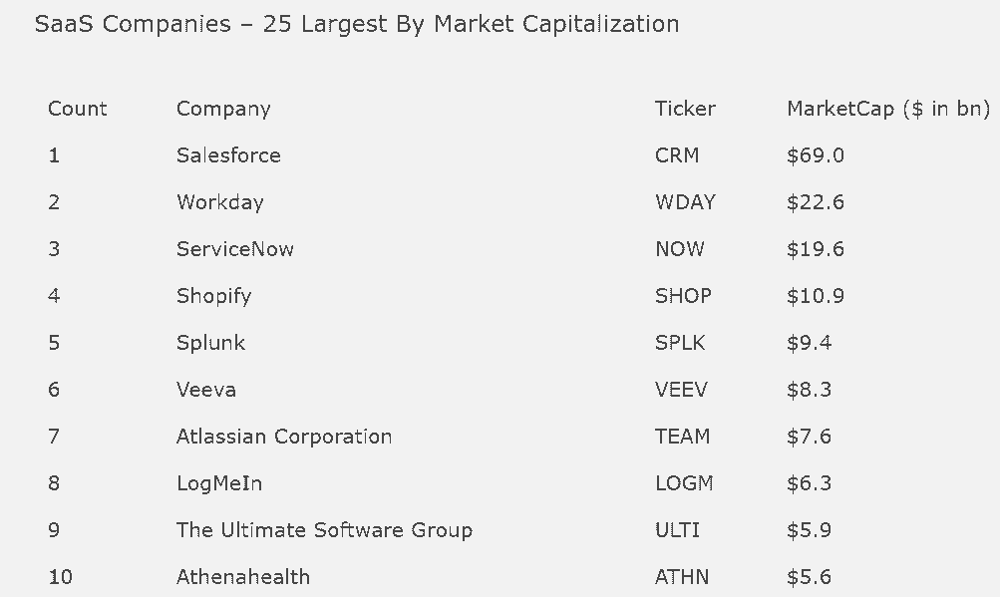

10 Largest SaaS Companies

这些公司有什么共同点？他们利用了通常被称为**的 SaaS 营销。**

但是什么是 SaaS 营销呢？你需要衡量什么才能成功，哪些渠道比其他渠道更好地销售你的 SaaS 产品？

让我们试着用这篇博文来回答这些(以及更多的问题)。准备好了吗？让我们开始吧！

## 什么是 SaaS 营销？

SaaS 营销是指为向新客户定位和销售基于订阅的产品而实施的一套独特的活动、战术和战略。

你可以认为 SaaS 营销是一种艺术，确保你的 SaaS 产品是相关的，能够解决你的目标客户的需求，使潜在客户想知道更多关于你的产品，尝试，并最终订阅，超过众多的竞争对手。

我们稍后会看到 SaaS 公司是如何获得客户的，但首先让我们明确一下 SaaS 营销的一个重要方面:术语。

像任何特定类别的营销，甚至与 SaaS 营销，有一些技术术语你应该更熟悉像 CAC，LTV，流失，和 NPS，以更好地理解这种类型的营销背后的概念。

## SaaS 营销术语解释

有几个术语是讨论 SaaS 营销时最常用的。我们在这里编辑了一个列表，并解释了每一个。

### 客户获取成本(CAC)

简而言之，客户获取成本是指在任何给定的营销渠道上，你获得一个新的付费客户所花费的金额。例如，如果你在谷歌广告上花了 1000 美元，得到了 10 个付费用户，你的 CAC 就是 100 美元。

**公式:**营销渠道的所有费用/导致的付费客户数。

对于有机渠道，如内容营销、有机搜索或有机社交，准确衡量 CAC 可能会很复杂。

### 客户终身价值(CLV、CLTV 或 LTV)

客户终身价值基本上是一个付费客户对你的企业的平均价值。如果你只以每月 30 美元的价格出售一个订阅，并且你的客户平均持续 6 个月，你的 CLV 是 180 美元。

如果您有多个订阅价格，计算会变得稍微复杂一点。

**公式**:平均认购价格*平均客户寿命(认购时长)/客户数量。

### CLV:CAC 比率

CLV:CAC 比率就是客户终身价值大于你的客户获取成本的比率。如果你创造一个客户的成本是 60 美元，每个客户的平均价值是 180 美元，那么你的 CLV:CAC 比率是 3。

**公式:** CAC / CLTV

### 客户流失率

客户流失率是在任何时间段内取消订阅的付费客户的百分比。例如，周流失率将与季度流失率大相径庭。

要计算你的流失率，你只需决定一段时间，并计算总用户离开的百分比。如果一个月内 10000 个客户中有 100 个离开，你的月流失率是 1%。

如果您想将客户流失率与增长率分开计算，则在计算时需要将新获得的客户从总数中排除。

**公式**:X 周期内离开的用户/现有用户总数 X 100

### 净发起人分数

网络推广者调查是一项被广泛采用的调查，许多初创公司和 SaaS 企业用它来衡量用户推广其产品的可能性。

这是一个简单的一个问题的调查，要求客户评价他们推荐你的产品的可能性。

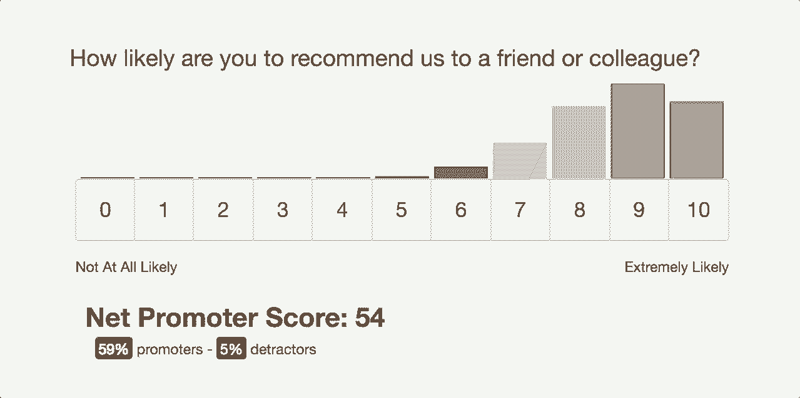

Net Promoter Score (Image source: Getfeedback.com)

#### 发起人

任何留下 9 或 10 分的顾客都被认为是推销者。像这样的用户很可能会分享关于你的产品或服务的正面信息。

#### 诽谤者

任何留下 1-6 分的顾客都被认为是贬低者。诽谤者可能会分享你公司的负面信息。

#### 中立的

任何选择 7 或 8 的人都被认为是中性的。这些客户对你的产品没意见，但不太可能分享关于你的服务的信息，无论是正面的还是负面的。

### 计算您的净推介值(NPS)

让我们看一个例子。您提示 100 名客户进行调查，所有 100 名客户都回答了调查。15 个客户，从 1-6 回答，30 个人从 7-8 回答，55 个人从 9-10 回答。

这些结果意味着你增加了 55 名推广者，减去了 15 名批评者，还有 30 名中立者，其中的**不计入**。

55-15 = 40，这意味着 NPS，在这种情况下，是 40。

**公式**:%促进者–%反对者

### 客户入职

客户加入指的是让注册免费试用的用户开始使用你的服务并最终成为付费客户的过程。使用你的服务的人越多，试用结束时他们就越有可能成为付费客户。

付费用户越依赖你的产品，他们在可预见的未来就越有可能成为付费用户。

### 每月经常性收入(MRR)

[每月经常性收入](https://kinsta.com/blog/bootstrapping-startup/#6-know-your-numbers-and-focus-on-profitability)就是您每月付费客户总数支付的费用总额。确保您不包括该月年度/季度订阅的固定金额。你还应该确保排除任何一次性付款。

## 如何在 SaaS 营销中定义指标

当你在营销 SaaS 的产品时，而不是一次性销售，你是在投资每一个客户关系的未来。这就是 SaaS 营销和消费品营销的区别。

潜在收入通常意味着在计算营销投资回报率时，您使用客户终身价值，而不是首次互动的价值。这些指标有助于您制定渠道预算。

对于一个典型的电子商务商店来说，拥有跟踪每笔销售额的 T2 电子商务交易就足够了。

然后你需要做的就是在 Google Analytics 中查看活动分类，看看你的活动进展如何。

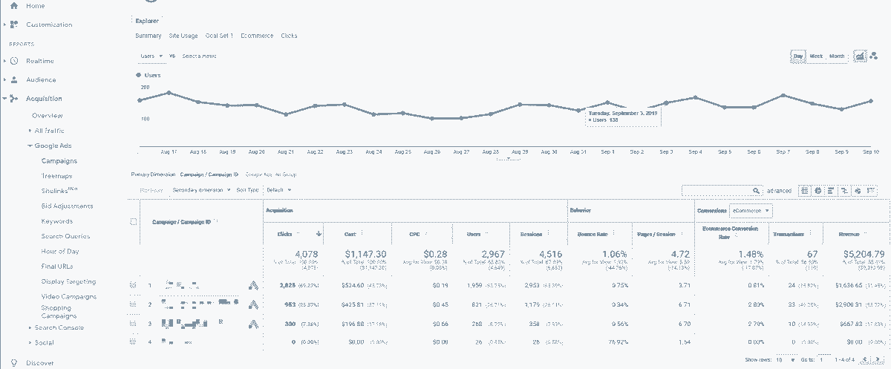

Google Analytics Dashboard

但是在 SaaS 做生意，有更多的困难要克服。如果你使用免费增值策略，你需要知道试用用户到付费客户的转化率。你需要知道平均客户终身价值。

然后你需要为免费试用和实际付费客户注册设置不同的转换点。

### 如何衡量/预测 SaaS 公司营销支出的有效性

如果你的平均客户价值是 180 美元，20%转化为付费客户，平均来说，一个新的试用用户价值 36 美元。

**公式**:平均客户终身价值 X * 0。转化为客户的试用用户百分比=试用用户注册的平均值。

基于这里的例子，你可以为每个试用用户投资高达 35.99 美元，以说服他们成为付费用户，并仍然盈利。因此，在这一点上，你可以为试用用户设置一个价值 36 美元的谷歌转换目标。

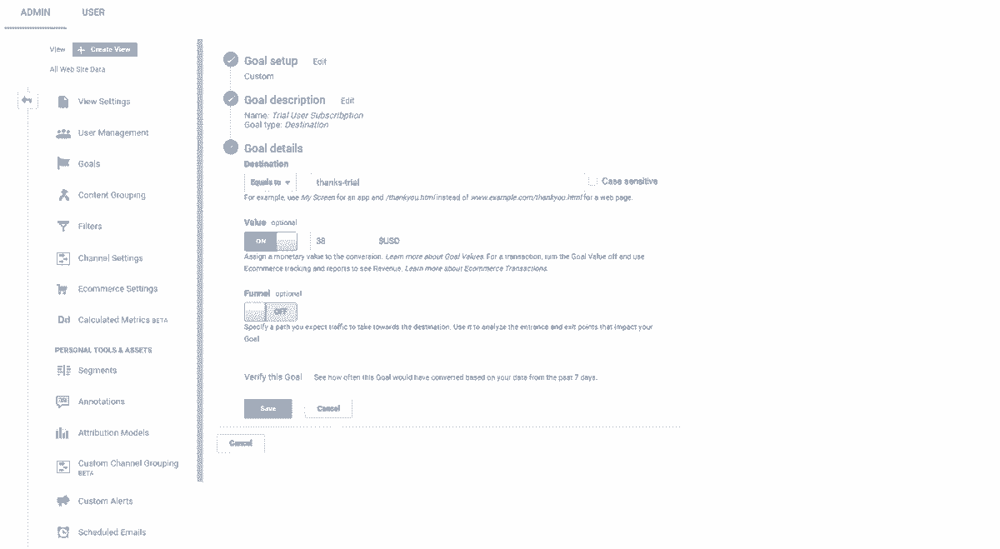

Google Analytics Goals setup

这一指标将让您对一项活动是否有可能长期盈利有所了解。

但是这个理论并不总是适用，因为 CLV 和试用用户转换率会因渠道不同而不同。

### 衡量特定于渠道的指标

虽然掌握所有渠道的平均 CLV 和试用用户转换率很重要，但您也需要单独衡量每个渠道。

如果你[使用像 Salesforce 这样的 CRM](https://kinsta.com/blog/wordpress-crm/) ,你可以自动标记你的客户访问的媒体或渠道。例如，您可以通过 UTM 参数来实现这一点。

您还可以[创建单独的登录页面](https://kinsta.com/blog/wordpress-landing-page-plugins/)，在注册表单中隐藏字段，指示发送它们的渠道。

为什么这很重要？因为你可能最终会在那些不会将试用用户转化为付费用户的渠道上浪费数万美元。

迪安·麦克弗森是 Paperform.co 公司的联合创始人，他发现这一点很不容易。他们在运行[谷歌搜索广告](https://kinsta.com/blog/how-to-use-google-adwords/)，将点击转化为试用用户，每条仅售 4 美元。当他们根据试用用户与付费用户的平均比率计算投资回报率时，继续下去是非常明智的。

但随后他做了一个特定渠道的回顾，看看有多少谷歌广告产生的试用用户已经转换。

答案令人震惊。SaaS 通过付费谷歌广告获得的大量试用用户最终转变了。

在这一发现之后，他们立即关闭了谷歌广告活动。

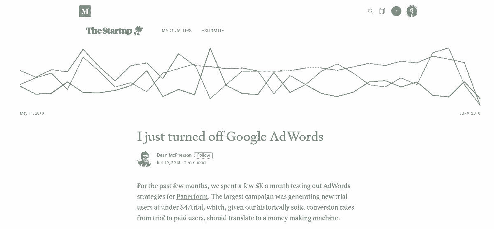

Paperform turned off AdWords

这个 SaaS 的恐怖故事是一个完美的例子，说明了为什么你需要衡量每个渠道的 CLTV 和试用用户转换率。

否则，你不知道每个渠道对你的底线的真正影响。

## 免费试用在 SaaS 营销中的作用

你不能谈论 SaaS 营销而不触及免费增值或免费试用模式的作用。

几乎每个主要的 SaaS 公司都提供他们产品的免费试用。

Salesforce offers free trials

事实是，在免费服务上转换冷流量要容易得多。任何一家提供免费试用的 SaaS 公司都认为，无用注册的额外开销是值得的。或者，[他们已经进行了对比测试](https://kinsta.com/blog/wordpress-ab-testing-tools/),并且确信他们通过免费试用赚了更多的钱。

成长中的 SaaS 最好的销售工具/论据应该是产品本身。这就是免费试用如此有用的原因。

听到销售代表说:“我们的产品比选项 A 好得多，如果你做出改变，你将不再有像 XYZ 那样的问题。”使用软件和自己感受差异完全是另一回事。

但这并不意味着免费试用必须成为你走向市场策略的基础。其他成功的 SaaS 企业以折扣价进行每周/每月付费试用。Ahrefs 是网上最成功的 SEO SaaS 公司之一，提供为期一周的试用，收费 7 美元。

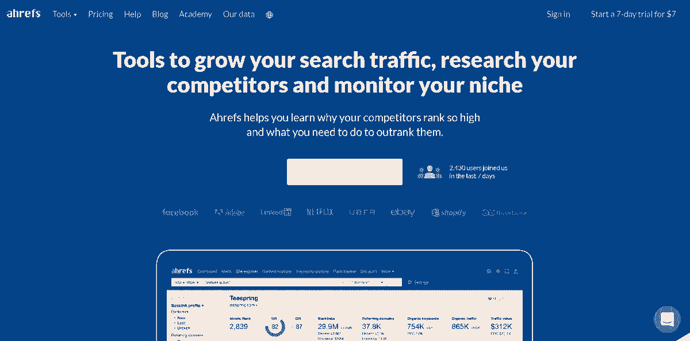

Ahrefs.com

因此，免费试用并不一定是你可以用 SaaS 营销策略解决并赢得的唯一商业模式。

只有通过实验和测试，才能找出最适合你的业务的方法。

## SaaS 营销的顶级渠道

成功的 SaaS 营销活动的关键不是复制竞争对手的渠道/平台和社交媒体帖子。你必须培养一种衡量、思考和实验的文化。哪些渠道适合你的企业取决于你的目标市场和创始团队的技能。

下面我们列出了一系列适合新兴创业公司的渠道。我们没有关注付费收购/SEM，因为这些渠道对于早期 SaaS 公司来说通常是不可扩展的。

举个例子，在撰写本文的时候，一般的关键词“CRM”一次点击的费用高达 12.72 美元。这意味着你需要从每次访问你的登陆页面中产生超过 13 美元的价值。

Google Ads Bids on CRM keywords

对于大多数新企业来说，这是不可行的。你需要一个不可能的转换率，一个离谱的试用客户比率，以及非常高的 LTV，甚至试图扭亏为盈。大型科技公司正利用它们的巨额预算收购较小的竞争对手。

这就是为什么你需要跳出框框，瞄准那些奖励小公司创造力和原创性的平台。

### 有机搜索/搜索引擎优化

[SEO 代表搜索引擎优化](https://kinsta.com/blog/what-does-seo-stand-for/)。从本质上来说，SEO 的精神是根据人们的搜索词来创造内容。你还必须为 SEO 优化你的网页和网站，以从谷歌和其他搜索引擎获得有机流量。

68%的在线体验都是从搜索开始的。截至 2019 年 8 月，谷歌在所有搜索流量上，保持着全球[92.37%的市场份额。57%的 B2B 营销人员选择 SEO 作为他们最大的潜在客户创造渠道。](https://gs.statcounter.com/search-engine-market-share)

[如果你的 SaaS 主要是 B2B](https://kinsta.com/blog/b2b-vs-b2c/) ，这意味着搜索引擎优化应该优先测试。

这些是搜索引擎优化的基础:

*   使用 SEO 工具[确定你的潜在客户可能搜索的关键词](https://kinsta.com/blog/keyword-research/)。
*   在那些关键词中寻找低竞争机会。
*   创建针对相关关键词的页面和文章。
*   为你的目标受众和搜索引擎优化这些页面，比如谷歌和它的替代品。
*   从高权威网站建立相关链接。
*   分析并记录哪些对你的网站有效，哪些无效。

这样总结起来可能听起来很复杂，但是有了正确的工具，大多数 SaaS 公司会很快学会。

让我们来看一个例子，看看搜索引擎优化对 SaaS 产品来说有多强大。

#### 成功案例:扎皮尔

通过大规模实施简单的 SEO 策略，Zapier 已经成为排名第一的集成工具。

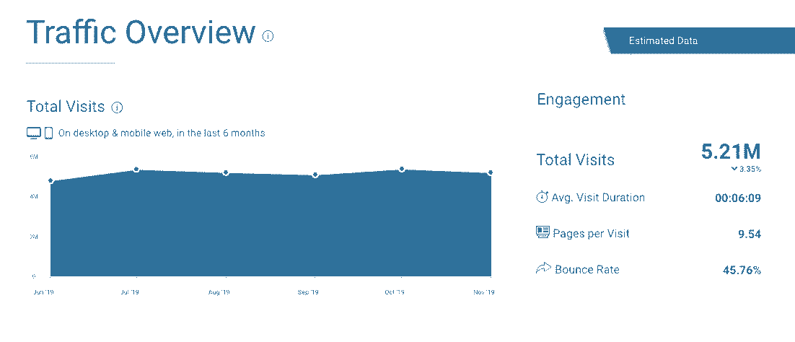

SimilarWeb report on Zapier.com

根据 SimilarWeb 的数据，zapier.com 每月的访问量超过 500 万次。这种流量的大部分来自有机搜索引擎优化。

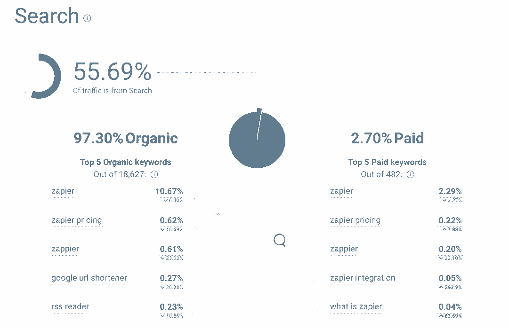

SimilarWeb Search report on Zapier.com

超过 56%来自搜索，超过 10%来自品牌查询。即使我们去除了品牌搜索和付费流量，Zapier 每个月都会从 organic search 获得大量访问量。

让我们用另一个我们喜欢的工具来看看 Zapier.com，在 Kinsta，Ahrefs:

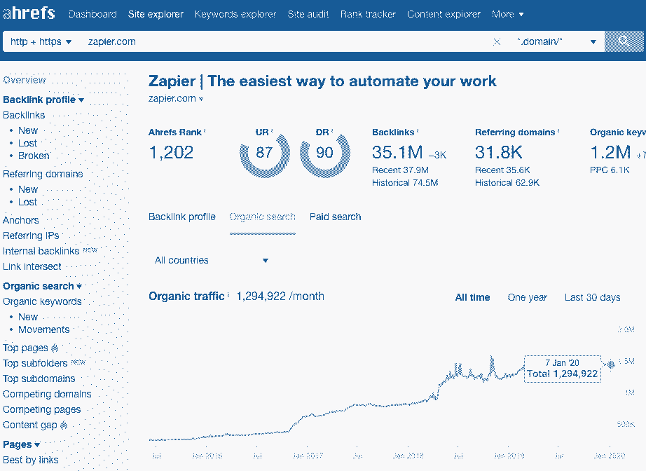

Ahrefs report on Zapier.com

尽管由于不同的工具使用不同的方法来跟踪和预测这些指标，访问量并不匹配，但你仍然可以看到有机流量在过去几年中是如何增长的，每月访问量高达 100 多万次。

为什么他们的策略如此强大？因为很直白！

Zapier 的营销团队的目标是与 Zapier 整合相关的关键词。比如“Slack Trello 集成”。

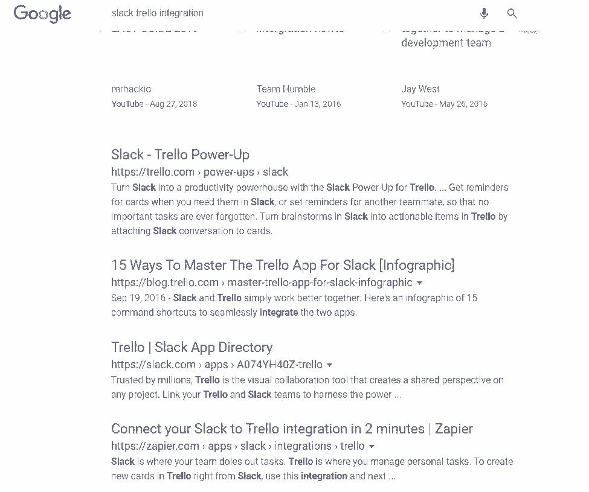

Google SERPs for “slack trello integration”

一个接一个，关键词是相对低的量，但当你针对成千上万个不同的，它加起来就很多了。

他们还创建了针对“SaaS 工具”+“整合”搜索词的独特登录页面。

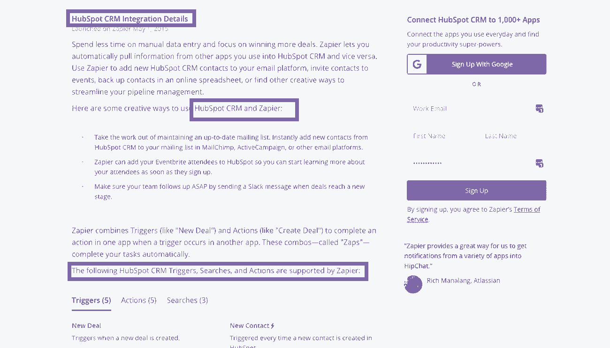

One of the many Zapier LPs

#### 搜索引擎优化基础:关键词研究

任何好的 SEO 策略的基础都是关键词研究。关键词研究是指你找出人们在搜索与你的业务相关的内容时使用了哪些特定的词。

虽然不理想，但作为开始，你可以用免费工具做基本的[关键词研究，比如](https://kinsta.com/blog/keyword-research/#tools)[谷歌广告关键词规划工具](https://ads.google.com/aw/keywordplanner/)。例如，如果您搜索“数据可视化”，它将显示相关关键字的列表。

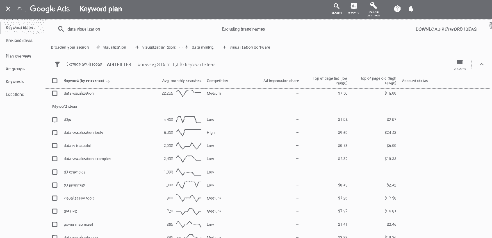

Google Keyword Planner

它还包括可以为您指明正确方向的指标。**搜索量**显示每个月有多少人搜索这个词。**竞争**表明还有多少人在谷歌上做广告。最后，**首页竞价排名**显示了一家公司愿意为这个关键词支付多少钱。

高度竞争和首页出价通常是高商业意图的指标。商业意图意味着搜索者有购买解决方案的意图。

因此，理想情况下，你希望目标关键字具有体面的数量和高感知商业价值。但是你没有办法知道这些关键字中的哪些在谷歌中是可行的。

关键字规划器中的竞争指标只显示有多少公司在为每个关键字竞价。为了获得更多与 SEO 相关的见解，您需要使用更高级的关键字研究工具。

要了解更多关于关键词研究和高级关键词研究工具如 SEMRush、Ahrefs 等，请阅读我们的[关键词研究指南](https://kinsta.com/blog/keyword-research/)。

#### 搜索引擎优化基础:页面搜索引擎优化

为用户提供最高质量的搜索结果符合谷歌的最大利益。这样，他们就能确保用户在搜索某样东西时会回到谷歌。

## 注册订阅时事通讯

### 想知道我们是怎么让流量增长超过 1000%的吗？

加入 20，000 多名获得我们每周时事通讯和内部消息的人的行列吧！

[Subscribe Now](#newsletter)

因此，谷歌试图从安全、组织有序、快速加载的网站提供高质量的新鲜内容。这就是[页面内 SEO](https://kinsta.com/blog/what-does-seo-stand-for/#7-optimise-your-pages-for-organic-traffic) 的精髓。

谷歌有一个工具可以帮你:[谷歌搜索控制台](https://search.google.com/search-console/index)。

检查**覆盖**和**网站地图**中的错误。

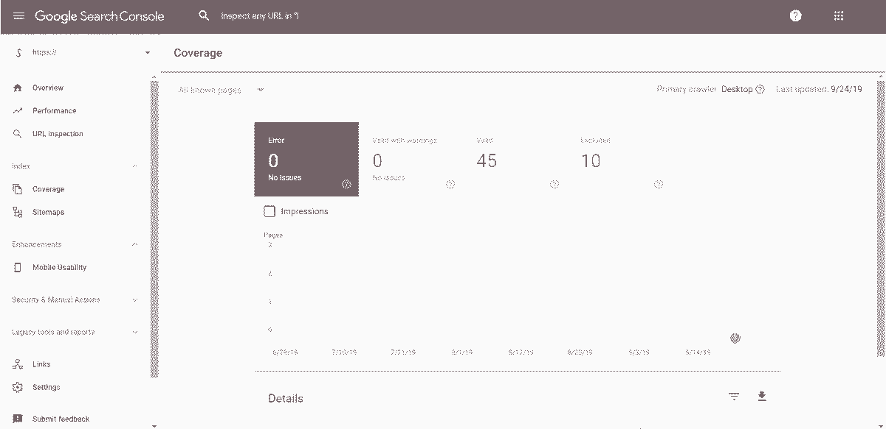

Google Search Console

这涵盖了确保你的页面上没有明显的 SEO 错误的绝对基础。

同样，第三方工具在这里非常有用。但是，如果我们试图涵盖页面搜索引擎优化的所有基础知识，它将成为一个独立的帖子。

幸运的是，我们已经介绍了 WordPress SEO 的 45 步清单，它帮助我们的有机流量增长了 517%。

### 内容营销

平均而言，[客户在转化前会接触 11.4 条内容](https://www.salesforce.com/ca/blog/2016/02/invest-time-on-content-marketing.html)。70%的顾客更喜欢通过文章而不是广告来了解一家公司。

内容营销是一种专注于通过各种渠道创造和分发高质量内容的方法。在金斯塔，我们是它的忠实粉丝，我们从早期就开始实施它。

当你制定一个包含多种形式的策略时，内容营销最有效:

*   博客帖子。
*   白皮书。
*   报告。
*   信息图表。
*   [视频](https://kinsta.com/blog/video-hosting/)。

通过为你的目标受众建立一个可靠的资源，你可以建立一个追随者。每一个内容都是与潜在客户建立关系的开始。

要在内容营销方面取得成功，你需要一个分发内容的策略，以及一个你的目标受众会认同的声音。请务必查看我们的[内容营销深度指南](https://kinsta.com/learn/content-marketing/)。

#### 我们的方法

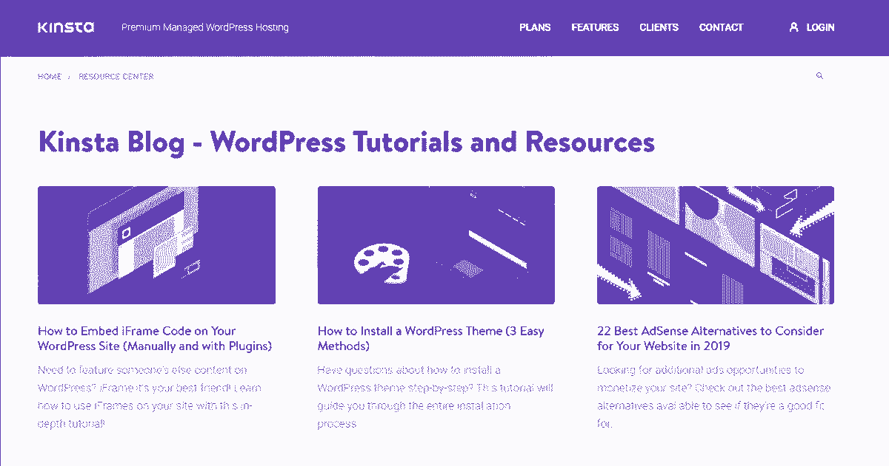

The Kinsta blog

这篇文章和我们自己的 [Kinsta 博客](https://kinsta.com/blog)是 SaaS 公司投资内容营销的一个例子。我们专注于提供对目标市场直接有用的高质量内容。

作为最重要的获取渠道，我们非常依赖 SEO，每篇新文章的写作过程总是从关键词研究开始。

在推广方面，我们专注于[建立我们的电子邮件列表](https://kinsta.com/blog/how-to-build-an-email-list/)，向其发送我们的[每周简讯](https://kinsta.com/wordpress-newsletter/)，以及社交媒体账户来分发我们的内容。

#### 内容营销策略

Difference between content strategy and content marketing

很多人把内容战略和内容营销混为一谈。正如 Moz [对](https://moz.com/beginners-guide-to-content-marketing/content-strategy)的解释:

> 内容战略关注的是愿景，即如何以及为什么创建、管理您的内容，并最终存档或更新
> 
> 内容营销侧重于策略和执行，即专门为营销目的而创建的内容的实际创建、管理和编辑。

总体战略将包括目标受众、分销、定位、基调等。

举个例子，我们假设你的目标受众是 45 岁左右的高级开发人员。你可以考虑像 Stack Overflow、专注于开发的利基脸书团体和 SEO 这样的分销渠道。你可以将自己定位为“同行专家”，解决他们感兴趣的复杂话题，并使用行话和开发人员迷因。

如果你的目标是 20 多岁的初级销售人员或全职妈妈，这一切都将改变。

#### 内容营销策略

接下来是你应该制作哪些内容的具体策略。大多数营销人员主要处理博客、[视觉内容](https://kinsta.com/blog/visual-content-strategy/)(信息图表等)。)，还有视频。

Commonly used types of content (Image source: Social Media Examiner)

你应该为你的企业选择哪种媒体取决于你的目标受众，以及你可用的人才/预算。

即使高质量的解说视频是你的理想客户的偏好，它也可能不在你的预算之内。

其他战术决策包括在哪里和如何推广你的内容，以及如何细分和多样化。

### 电子邮件营销

与已经对你的产品感兴趣的人交流和建立关系比转化陌生人更便宜。这就是为什么电子邮件营销可以记录每花费 1 美元的[投资回报率高达 42 美元。这在任何形式的有偿收购中都是闻所未闻的。](http://emailmonday.com/wp-content/uploads/2015/04/National-client-email-2015-DMA.pdf)

因此，59%的 B2B 营销人员选择电子邮件营销作为他们最有效的渠道。

电子邮件营销的本质是:

*   创建一个[登录页面](https://kinsta.com/blog/wordpress-landing-page-plugins/)或注册[表单，用“线索磁铁”或简讯收集线索](https://kinsta.com/blog/wordpress-lead-generation/)。
*   开发一个策略来吸引流量到这个登录页面或注册表单。
*   撰写和发送电子邮件有助于建立信任，让你在订户眼中成为专家。
*   高级:[根据用户与网站的互动，发送自动化的个性化电子邮件](https://kinsta.com/blog/how-to-use-mailchimp/#mailchimp-autoresponder-emails)。

电子邮件的伟大之处在于，它是最有效的销售线索生成渠道，但它并不太复杂，也不太难上手。

你可以使用一个简单的方法，如每周简讯或自动电子邮件宣传活动，将销售线索转化为客户。

一旦你建立了一个受众群，你就可以利用营销自动化工具来细分你的名单，并自动发送个性化的电子邮件。

#### 这并不复杂:时事通讯仍然有效

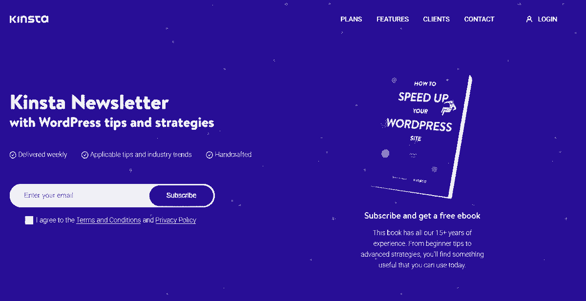

Landing page of the Kinsta Newsletter

电子邮件营销与其他营销渠道有很大的协同作用。它有助于你与那些从谷歌或社交媒体上访问你网站的人保持联系，这些人并不准备购买。但不要认为你必须就一个话题写一个 20 篇的电子邮件系列。

厌倦了你的 WordPress 站点缓慢的主机？我们提供超快的服务器和来自 WordPress 专家的 24/7 世界级支持。[查看我们的计划](https://kinsta.com/plans/?in-article-cta)

时事通讯仍然有效。

通过预先提供真正的价值，随着时间的推移，我们与博客读者建立了关系。每个订阅者都会得到我们关于如何加速他们的 WordPress 网站的详细电子书。

因为他们对 WordPress 技巧和加速他们的网站感兴趣，我们已经知道他们在我们的目标市场。通过订阅，他们自称是 WordPress 网站的所有者，关心网站的表现。

因此，我们尊重每一位潜在客户，并努力首先提供价值，而不是用自动销售电子邮件轰炸他们。

如果你想进一步证明时事通讯仍然有效，看看 Hustle 吧，这是一个专注于技术的电子邮件时事通讯，最近突破了 100 万订户。

#### 自动回复器

自动回复器或自动化工具是基于云的 SaaS 应用程序，可帮助您自动向客户和潜在客户发送电子邮件。想象一下，如果每次有人订阅你的时事通讯，你必须手动发送他们的欢迎电子书。

这将会消耗掉每年数百小时的工作时间。这可不是对你时间的有效利用。

这就是自动回复器的用武之地。

例如，每当[有人注册我们的时事通讯](https://kinsta.com/wordpress-newsletter/)时，表单会自动将数据发送到自动回复器。几秒钟后，他们会收到这样一封欢迎邮件。

Kinsta Autoresponder Message

您可以使用自动回复器发送自动电子邮件，以响应您网站上不同的用户行为。

也许最重要的是自动跟踪那些在结账过程中中途离开的人。

如果你想学习如何掌握自动回复功能，请阅读我们关于如何使用 Mailchimp 的指南。如果你不喜欢 mailchimp，点击这里查看它在 T2 的替代品。

#### 电子邮件列表分段

如果您使用电子邮件列表分段，您的自动电子邮件将是个性化和相关的。这样，你的潜在客户就能在那一刻看到对他们重要的信息。这种方法会让你的打开率比群发邮件高出 26%。

您可以轻松地为上周访问过您的博客的订阅者或注册免费试用的订阅者创建单独的列表。您可以进一步为不同类别的付费用户创建特定的列表，将他们排除在所有与其无关的促销邮件之外。

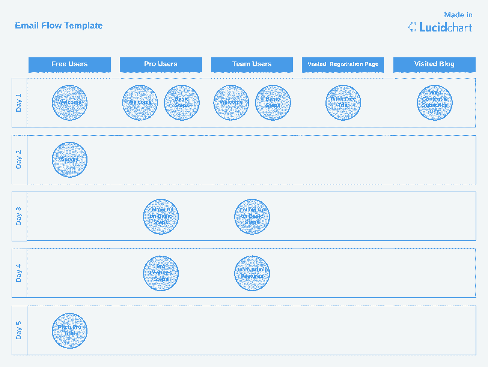

Email Segmentation Example

上面是一个[例子](https://www.lucidchart.com/blog/mastering-the-5-step-email-marketing-funnel)，展示了这样一个流程在纸上的样子。

### **社交媒体**

通过有机贴子和付费广告的各种方式，许多 SaaS 公司看到了社交媒体平台营销的成功。

借助社交媒体营销，您可以使用有机发布和付费广告的组合，在以下社交媒体平台之一上建立追随者:

*   [Instagram](https://kinsta.com/blog/wordpress-instagram-plugin/) 。
*   [脸书](https://kinsta.com/blog/facebook-marketing/)。
*   [LinkedIn](https://kinsta.com/blog/linkedin-marketing/) 。
*   [推特](https://kinsta.com/blog/twitter-marketing/)。
*   [YouTube](https://kinsta.com/blog/youtube-stats/) 。

世界上有超过 34.8 亿社交媒体用户。这使得社交媒体成为最具扩展性的渠道之一。

此外，入门没有固有的平台成本。你现在就可以零美元投资建立一个商业 Instagram 页面。

这使得社交媒体营销成为新 SaaS 公司首先尝试的事情之一。

但是成功需要时间、努力和投资。

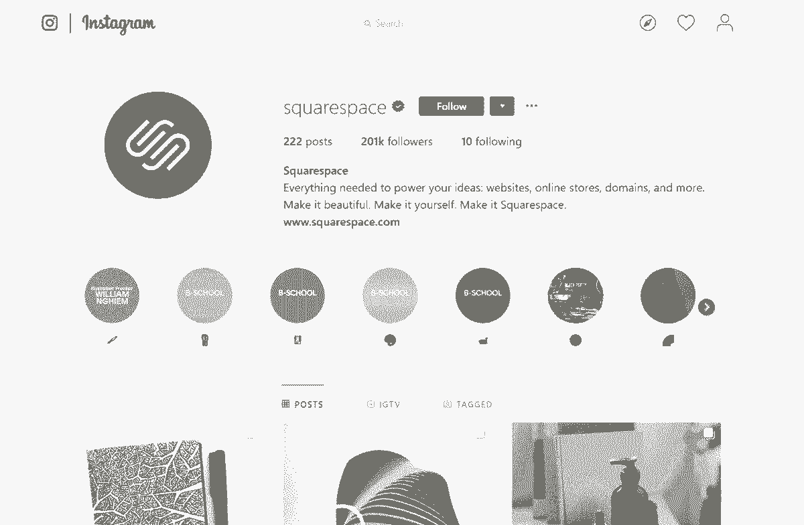

Squarespace Instagram account

SaaS 网站建设商 Squarespace 在 Instagram 上拥有超过 201，000 名粉丝(延伸阅读: [Squarespace vs WordPress](https://kinsta.com/blog/squarespace-vs-wordpress/) )。

他们通过广告、影响者营销和不间断的高质量产出的组合，成功实现了这一目标。

在他们最近的活动中，他们与摄影师合作，在展示摄影师的网站之前，展示了一些美丽的照片。当然是用 Squarespace 做的网站。

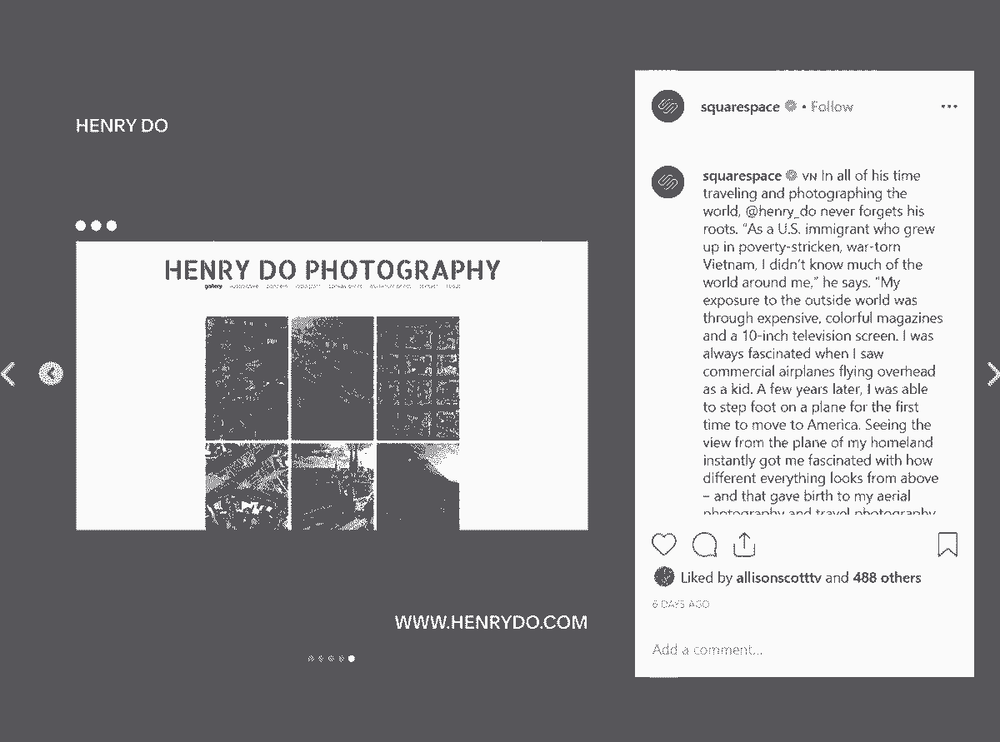

Squarespace Instagram Campaign

仅仅发布你的想法并希望吸引观众是不够的。

#### 向成功的竞争对手学习

谈到社交媒体营销，最大的“欺骗代码”是深入了解成功的竞争对手在做什么。

如果你已经意识到了这些直接的竞争对手，那么你很幸运。只要进入他们的社交媒体页面，分析内容。

尝试回答以下问题:

*   哪些职位类型的聘用最多？
*   哪种语调似乎最能引起共鸣？
*   他们如何定位自己？

由于社交媒体策略通常作为更广泛的内容营销策略的一部分，理应有自己的帖子，我们在这里不打算详细讨论。

但是如果你想深入了解 SMM 的具体情况，你可以参考 Hubspot 网站的指南。

### 影响者营销(关注微影响者)

要在社交媒体上被看到，仅仅创建一个页面和发布一些图片是不够的。仅 2016 年一年，公司页面的有机接触量就下降了 52%,此后一直稳步下降。

你需要接触到观众。这就是影响者营销发挥作用的地方。

影响者营销是一个概念，你接触影响者，并争取他们来推广你的产品。通常，公司会开展影响者活动，在这些活动中，他们会识别相关的影响者，并向他们支付费用，让他们展示特定的产品。

单次投放的成本取决于他们的追随者数量，以及他们的观众参与度。赛琳娜·戈麦斯在 Instagram 上发一条帖子就能让你损失数百万美元。

对于大多数崭露头角的 SaaS 公司来说，这不是一个可行的策略。大影响者的受众太广了，所以你最终会为一大堆不感兴趣的眼球买单。

在预算紧张的情况下，微影响者是最有效的方法。[微影响者活动的参与率比传统活动高出 60%](https://www.adweek.com/digital/micro-influencers-are-more-effective-with-marketing-campaigns-than-highly-popular-accounts/)。

所以，忘记岩石，克里斯蒂亚诺·罗纳多斯，和世界上的阿丽亚娜·格兰德。关注小的[博客作者](https://kinsta.com/learn/blogging-tips/)，运行本地开发小组或聚会的开发者等。

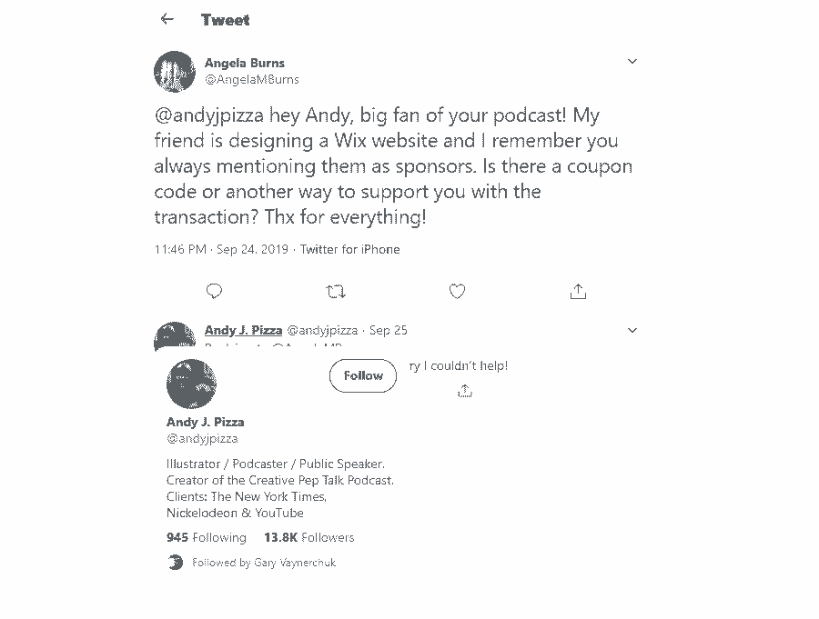

Micro influencer brand impact

这里有一个简单的例子:Wix 赞助了 Andy J. Pizza，这是一个在 Twitch 上拥有 13.8 万粉丝的播客(以下是 T2 如何使用 WordPress 开始播客的方法)。仅仅是因为听众对主机的认同如此强烈，他们中的一些人最终选择了 Wix

这些是较小的影响者可以与他们的观众建立的纽带。

为了找到你的影响者，你可以使用平台的搜索功能尽力搜索，或者使用第三方工具。一个你可以免费使用的影响者工具是 Buzzsumo 的 Twitter 影响者搜索。

BuzzSumo Twitter Search

假设你的主要目标是开展一场 Instagram 活动。只需选择“拥有 Instagram 个人资料”，在搜索中添加一个过滤器
该功能仅过滤活跃在 Instagram 上的 Twitter 用户:

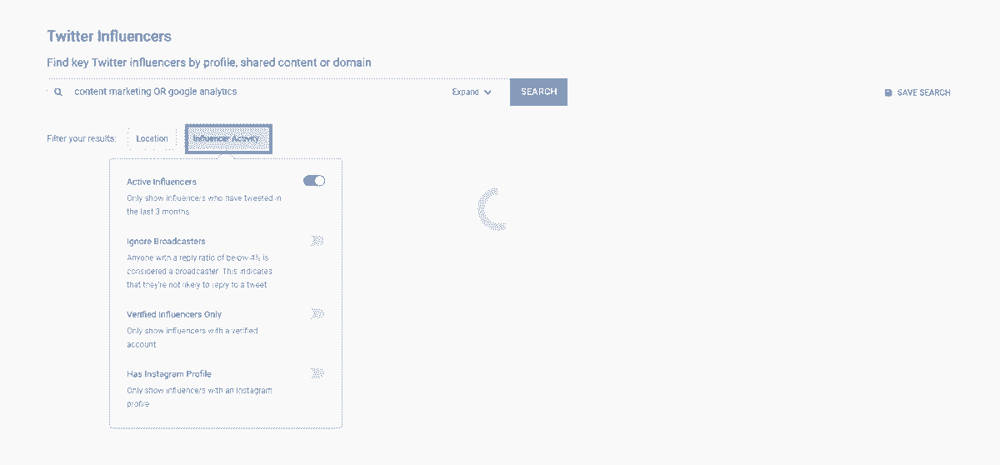

Buzzsumo Activity Filter

当你搜索时，使用与你的目标市场相关的短语。不需要是精确匹配的关键词，可以是相关概念，甚至可以是产品。

例如，如果你的 SaaS 是一个集成了[谷歌分析](https://kinsta.com/blog/google-analytics-wordpress/)的数据可视化插件，你可以搜索短语“谷歌分析”。

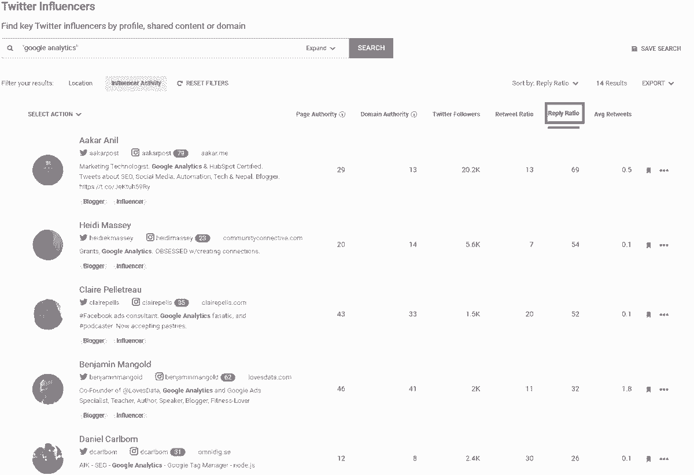

Buzzsumo Twitter Influencers sorted by Reply Ratio

一旦你有了结果，你会想按“回复率”对它们进行分类，看看谁更有可能回复你的[外展邮件](https://kinsta.com/blog/find-email-address/)或 DM。

#### 受欢迎的影响者营销工具

下面是一个流行的影响者营销工具列表，你可以用它来发现影响者并衡量他们的有效性。

*   [冰帽](https://buzzsumo.com/)
*   [萌芽社交](https://sproutsocial.com/)
*   [缓冲器](https://buffer.com/)
*   胡特苏特
*   [提及](https://mention.com/en/)

## 瞄准大众市场之前先细分市场

作为一家技术公司，你最感兴趣的可能是细分市场，让你的产品服务于特定的垂直市场。凭借专业化的服务，您可以将您的产品从 SaaS 的横向竞争对手中脱颖而出，并获得营销和销售优势。

而不是劣势，可以更容易在某个行业立足，通过代言和口碑成长。

一旦你在一个小市场站稳了脚跟，你就可以利用信誉和现金流来推动针对更大市场的营销努力。

你可以阅读杰弗里·摩尔的《跨越鸿沟》一书来进一步探索这种方法。

Kinsta 作为一家公司，通过专注于由[管理的 WordPress 主机](https://kinsta.com/blog/managed-wordpress-hosting/)的“狭窄利基”而得以茁壮成长。这一成功帮助我们走到了今天，能够提供[应用托管](https://kinsta.com/application-hosting/)和[数据库托管](https://kinsta.com/database-hosting/)。

Salesforce 现在是世界上最顶尖的 CRM，最初把所有的精力都放在销售人员身上。如果你成为小池塘里的大鱼，你的公司也可能面临更好的机会。

## 始终跟踪转化率并衡量投资回报率

如果你不知道什么可行，什么不可行，就不会有任何成功的企业。SaaS 公司也不例外。

这就是为什么你应该[从一开始就设置转换跟踪](https://kinsta.com/blog/conversion-tracking/)，看看哪些通道表现更好。如果你不知道，也许是因为你刚刚开始，用你可用的预算和资源判断哪些渠道是目标，然后从那里开始。

确保像 SEO 或内容营销这样的长期有机策略比微影响者营销或付费收购获得更长的时间框架。

只要你跟踪每个渠道所需的成本和产生的收入，你就可以计算出你的投资回报率。谷歌分析的默认收购报告可以帮助你掌握早期结果。

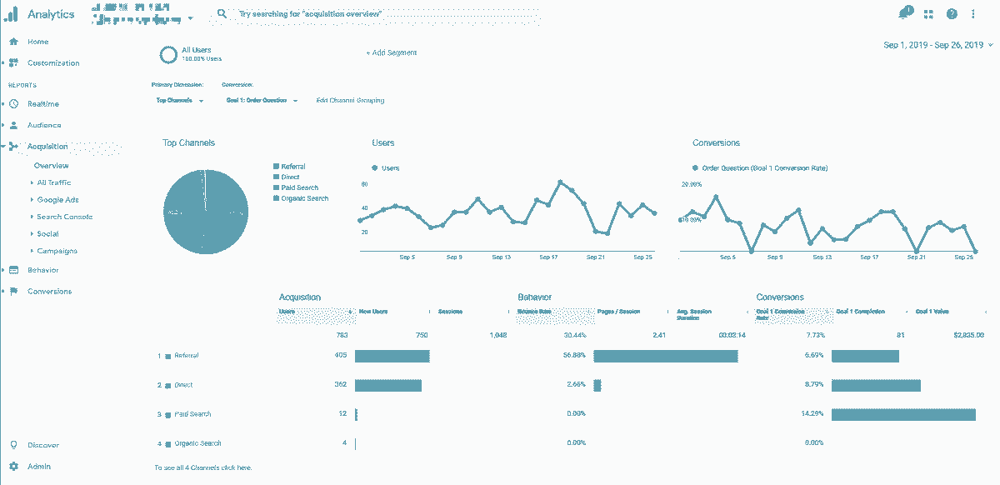

Google Analytics Channel Breakdown

如果你正在开展任何微影响者活动，你也可以通过创建定制登陆页面或使用 [UTM 参数](https://ga-dev-tools.appspot.com/campaign-url-builder/)来衡量结果。

虽然 CAC 是 SaaS 的主要指标，但有机收购渠道让事情变得更加复杂。对于内容营销，你需要考虑作家和设计师的工资，营销经理花在策略上的时间，以及其他间接成本。

如果你专注于 SEO，你也必须考虑到每篇文章的终身价值可能会远远超过前几个月产生的客户。

成长和转化提供了一个[现成的电子表格模型](https://growandconvert.com/content-marketing/customer-acquisition-cost/)来帮助您计算这一点。

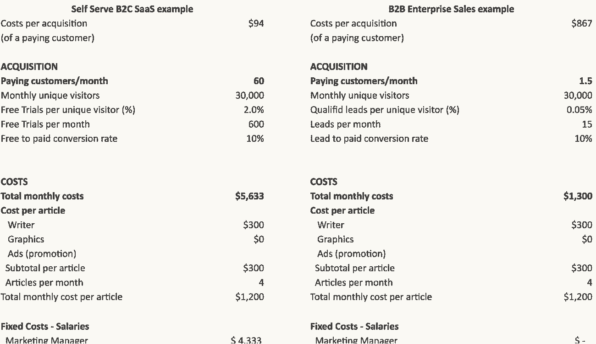

Model to calculate CAC from Content Marketing

如果您掌握了所有需要的数据，并且可以计算每个通道的 CAC，您将知道应该关注哪里。

[If CAC, LTV, ROI, Churn Rate, free trials, conversions are meaningless words to you, you're not alone. Check out this guide on SaaS marketing and learn why they're crucial for any SaaS product👨🏻‍💼🤑Click to Tweet](https://twitter.com/intent/tweet?url=https%3A%2F%2Fkinsta.com%2Fblog%2Fsaas-marketing%2F&via=kinsta&text=If+CAC%2C+LTV%2C+ROI%2C+Churn+Rate%2C+free+trials%2C+conversions+are+meaningless+words+to+you%2C+you%27re+not+alone.+Check+out+this+guide+on+SaaS+marketing+and+learn+why+they%27re+crucial+for+any+SaaS+product%F0%9F%91%A8%F0%9F%8F%BB%E2%80%8D%F0%9F%92%BC%F0%9F%A4%91&hashtags=marketing%2Csaasproducts)

## 摘要

本指南远非详尽无遗，因为 SaaS 的世界相当复杂。不过，它的作用是帮助你迈出理解基础的第一步，强调找到正确的收购渠道的重要性，以及要衡量哪些关键指标。

你不需要 Salesforce 的预算来启动你的 SaaS 的增长(而 [Kinsta 就是这个](https://kinsta.com/blog/bootstrapping-startup/)的活生生的例子)。你需要有正确的产品，找到正确的渠道，和正确的信息(你的市场定位)。

总的来说，SaaS 营销与传统营销没有什么不同。这意味着，如果你已经为你的 SaaS 产品找到了一个切实的需求/痛点，你已经有了一个好的开始。为什么？因为营销一个不能解决任何“真正”问题的产品是最难实现的。

* * *

让你所有的[应用程序](https://kinsta.com/application-hosting/)、[数据库](https://kinsta.com/database-hosting/)和 [WordPress 网站](https://kinsta.com/wordpress-hosting/)在线并在一个屋檐下。我们功能丰富的高性能云平台包括:

*   在 MyKinsta 仪表盘中轻松设置和管理
*   24/7 专家支持
*   最好的谷歌云平台硬件和网络，由 Kubernetes 提供最大的可扩展性
*   面向速度和安全性的企业级 Cloudflare 集成
*   全球受众覆盖全球多达 35 个数据中心和 275 多个 pop

在第一个月使用托管的[应用程序或托管](https://kinsta.com/application-hosting/)的[数据库，您可以享受 20 美元的优惠，亲自测试一下。探索我们的](https://kinsta.com/database-hosting/)[计划](https://kinsta.com/plans/)或[与销售人员交谈](https://kinsta.com/contact-us/)以找到最适合您的方式。