# 2021:深入探究新的默认主题

> 原文：<https://kinsta.com/blog/twenty-twenty-one-theme/>

221 是 WordPress 5.6 中新的默认主题。如果你正在等待一个功能齐全的主题，你可能会有点失望。

Twenty Twenty One 是一个极简主义的主题，看起来像一个高度可定制的空白画布。像它的前辈一样，新的默认主题将主要依靠[块编辑器](https://kinsta.com/blog/gutenberg-wordpress-editor/)来构建页面。

在这篇文章中，我们将介绍 Twenty Twenty-21 主题最有趣的特性，我们将向你展示如何用一个简单的 Twenty-21 子主题定制 WordPress 网站的外观和感觉。

准备好了吗？让我们开始吧！

 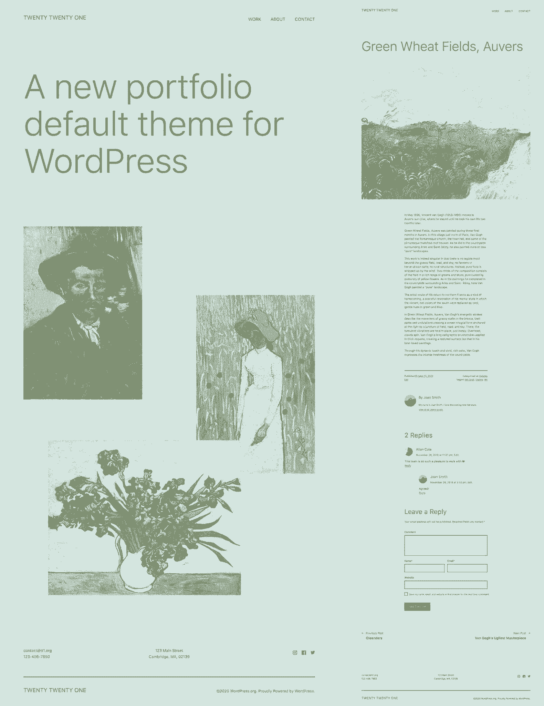

Twenty Twenty-One theme preview (Image source: [Make WordPress Core](https://make.wordpress.org/core/2020/09/23/introducing-twenty-twenty-one/))


## 221 WordPress 主题初探

像 [Twenty Twenty](https://kinsta.com/blog/twenty-twenty-theme/) 一样，WordPress 5.6 的新默认主题不是从零开始构建的，而是基于来自社区的主题。

Twenty Twenty 1 是在一个新的 Automattic 主题的基础上开发的，即 [Seedlet](https://wordpress.org/themes/seedlet/) 主题，它提供了一个整洁有序的嵌套 CSS 自定义属性结构。由于在主题的样式表中大量使用了 [CSS 属性](https://kinsta.com/blog/wordpress-css/#wordpress-and-css)，在 Twenty Twenty 1 上构建子主题既快速又简单。


> Kinsta 把我宠坏了，所以我现在要求每个供应商都提供这样的服务。我们还试图通过我们的 SaaS 工具支持达到这一水平。
> 
> <footer class="wp-block-kinsta-client-quote__footer">
> 
> 
> 
> <cite class="wp-block-kinsta-client-quote__cite">Suganthan Mohanadasan from @Suganthanmn</cite></footer>

[View plans](https://kinsta.com/plans/)

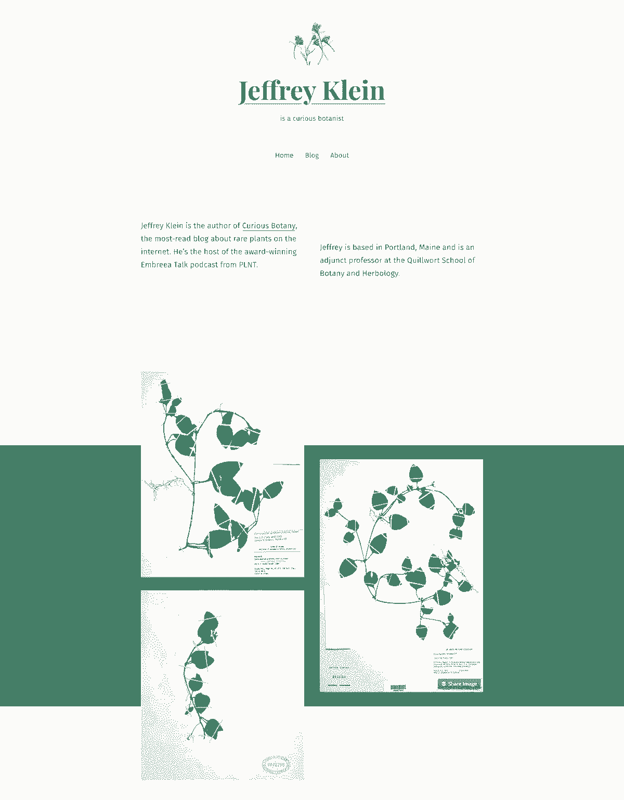

Seedlet WordPress theme


Twenty Twenty One 是一个高度可访问的极简 WordPress 主题，有一个单列布局、一个页脚侧边栏和两个[菜单位置](https://kinsta.com/blog/website-navigation/):主导航和页脚导航。

新主题使用了一个[系统字体堆栈](https://kinsta.com/blog/web-safe-fonts/)。这对用户和[开发者都有好处:](https://kinsta.com/blog/hire-wordpress-developer/)

*   首先，使用系统字体堆栈有利于 UX 和[性能](https://kinsta.com/learn/speed-up-wordpress/)，因为大多数操作系统已经支持原生字体，并且不需要额外的加载时间。
*   第二，它们看起来是中性的，所以可以平滑地融合到任何一种设计中。
*   第三，由于它们不需要加载额外的字体文件，用户和开发者可以更容易地使用 Twenty Twenty One 定制网站的布局。

Twenty Twenty One 主题使用基于淡绿背景色和两种灰色作为前景色的[最小调色板](https://kinsta.com/blog/website-color-schemes/)。该主题提供了几个额外的彩色调色板。

关于这一点，默认主题设计主管 Mel Choyse-Dwan 解释道:

> 我们将捆绑一些额外的调色板的主题，包括白色和黑色的配色方案。为什么是淡绿色？柔和的颜色现在很流行


Twenty Twenty-One colors (Image source: [Make WordPress Core](https://make.wordpress.org/core/2020/09/23/introducing-twenty-twenty-one/))


[二十二十一是 WordPress 5.6 中新的 WordPress 默认主题！👁‍🗨在这个深入的指南中学习它的所有关键功能！ 点击推文](https://twitter.com/intent/tweet?url=https%3A%2F%2Fkinsta.com%2Fblog%2Ftwenty-twenty-one-theme%2F&via=kinsta&text=Twenty+Twenty-One+is+the+new+WordPress+default+theme+coming+with+WordPress+5.6%21+%F0%9F%91%81%E2%80%8D%F0%9F%97%A8+Learn+all+its+key+features+in+this+in-depth+guide%21&hashtags=WordPress%2Cthemes)


## 如何安装 221

在写这篇文章的时候，Twenty Twenty 1 正在开发中，还不能在 WordPress 主题目录中下载。但是你可以在 Github 上下载这个主题的正在进行的版本。

一旦主题合并到[核心](https://kinsta.com/knowledgebase/wordpress-core/)中，Github 储存库将被弃用，你会在主题目录中找到它。由于 221 遵循 [WordPress 5.6 发布时间表](https://make.wordpress.org/core/5-6/)，你可能想要保存以下日期:

*   2020 年 10 月 20 日:Beta 1
*   2020 年 10 月 27 日:Beta 2
*   2020 年 11 月 2 日:Beta 3
*   2020 年 11 月 12 日:Beta 4
*   2020 年 11 月 17 日:RC 1
*   2020 年 12 月 1 日:RC 2
*   2020 年 12 月 7 日:WordPress 5.6 发布的试运行
*   2020 年 12 月 8 日:WordPress 5.6 发布的目标日期

要启动并运行 Twenty 221 主题，请遵循以下步骤:

1.  从 [GitHub](https://github.com/wordpress/twentytwentyone) 获取压缩包。
2.  从 [WordPress 仪表盘](https://kinsta.com/knowledgebase/wordpress-admin/)或通过 [SFTP](https://kinsta.com/knowledgebase/how-to-use-sftp/) 将你的包上传到你的开发安装中。
3.  浏览到**外观→主题**，点击主题预览图像上的**激活**按钮。
4.  进入**外观→定制**配置二十二十一。

你现在可以开始在一个[临时网站](https://kinsta.com/help/staging-environment/)或者你的[本地环境](https://kinsta.com/blog/install-wordpress-locally/)上运行你的测试。


### 重要的

请注意，Twenty Twenty One 仍在积极开发中，[许多问题](https://github.com/WordPress/twentytwentyone/issues)尚未修复，一些功能可能会在未来发生变化。


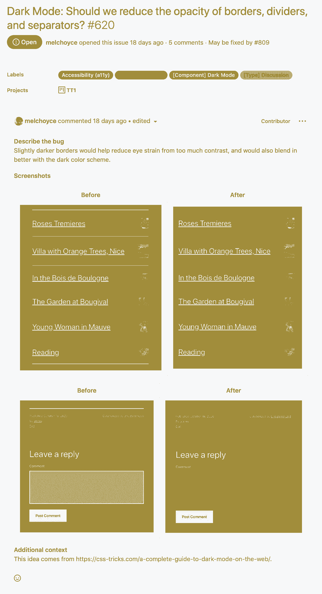

Twenty Twenty-One [Issue #620](https://github.com/WordPress/twentytwentyone/issues/620) on Github


还没准备好进行测试吗？

别担心，我们已经剖析了这个主题，我们将向你展示 2021 年你能期待什么。


## 221 的主题和街区特色

就像 Twenty Twenty 一样，新的默认 WordPress 主题不是一个全功能的主题，而是一个极简主义的主题，依赖于块编辑器进行页面构建。该主题还旨在[提供更好的可访问性](https://kinsta.com/blog/web-design-best-practices/#how-to-make-your-website-more-accessible)。用梅尔·乔斯·德万的话说:

> 最后，我们很乐意使主题符合 WCAG 2.1 AAA 级的相关准则。当+make . WordPress . org/accessibility/提出这个想法时，我们很高兴，并希望我们社区的所有专家能提供指导，帮助我们实现这个想法。

该主题支持大量的[主题](https://developer.wordpress.org/reference/functions/add_theme_support/)和[区块功能](https://developer.wordpress.org/block-editor/developers/themes/theme-support/)，包括以下内容:

**主题特色:**

*   自动馈送链接
*   Title tag
*   帖子格式
*   发布[缩略图](https://kinsta.com/blog/regenerate-thumbnails/)
*   [HTML5 元素](https://kinsta.com/blog/html-vs-html5/#what-is-html5)
*   自定义徽标
*   微件的选择性刷新
*   自定义背景
*   两个导航菜单
*   一个侧边栏

**块特征:**

*   默认块样式
*   编辑器样式
*   深色编辑器样式(深色背景)
*   宽对齐
*   阻止字体大小
*   块调色板
*   块渐变预设
*   起始内容
*   响应嵌入
*   自定义行高
*   实验链接颜色
*   实验自定义间距
*   自定义单位(在 WordPress 5.6 中删除)

下面的列表包括了基于 Twenty Twenty One 构建网站时可能更相关的特性。

### 导航菜单

221 支持两个菜单位置，位于页眉右上角的**主导航**和**页脚导航**。


Twenty Twenty-One menu locations


如果添加到页脚菜单中，[社交链接](https://kinsta.com/blog/wordpress-social-media-plugins/)会被自动检测并转换为支持社交媒体的 [SVG 图标](https://kinsta.com/blog/image-file-types/#vector-image-file-formats)。

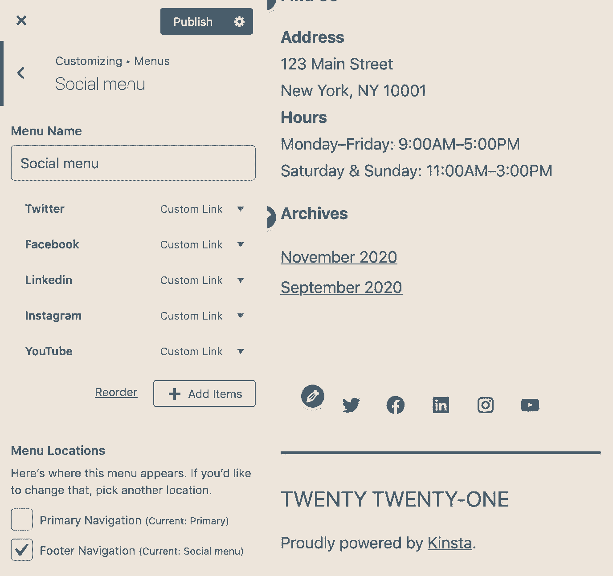

Twenty Twenty-One social menu


### 帖子格式

221 支持九种帖子格式:链接、旁白、图库、图片、引用、状态、视频、音频、聊天。您可以在编辑器设置的**状态&可见性**面板中选择您的帖子格式。

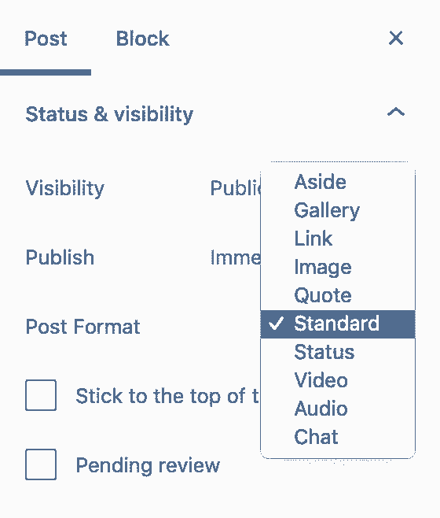

Twenty Twenty-One supports nine post formats


要查看 Twenty Twenty One 主题如何处理帖子格式，导航到*template-parts/extract*文件夹并选择模板。比如在你喜欢的[代码编辑器](https://kinsta.com/blog/free-html-editor/)中打开【excerpt-image.php】的*文件。在该文件中，您将看到以下代码:*

```
/**
 * Show the appropriate content for the Image post format.
 *
 * @link https://developer.wordpress.org/themes/basics/template-hierarchy/
 *
 * @package WordPress
 * @subpackage Twenty_Twenty_One
 * @since 1.0.0
 */

// If there is no featured-image, print the first image block found.
if (
	! twenty_twenty_one_can_show_post_thumbnail() &&
	has_block( 'core/image', get_the_content() )
) {

	twenty_twenty_one_print_first_instance_of_block( 'core/image', get_the_content() );
}

the_excerpt();
```

代码是不言自明的，但是让我们仔细看看:

*   `has_block` [确定](https://developer.wordpress.org/reference/functions/has_block/)一个帖子或一个字符串是否包含一个特定的块类型(本例中为核心图像块)。
*   `twenty_twenty_one_print_first_instance_of_block`是一个 Twenty Twenty-One 模板函数，它打印内容中块的第一个实例，然后分离。

因此，如果一个网站的浏览者需要一个“图片”格式的文章档案，WordPress 会在档案中的每个文章的顶部显示一个图片。按照同样的逻辑，您可以通过检查相应的模板部分来研究任何帖子格式。

### 网站标识和自定义徽标

Twenty 21 支持 300×100 像素的自定义徽标。您可以在**站点标识**面板中找到自定义徽标设置。


Site Identity in Twenty Twenty-One


该屏幕包括:

*   自定义徽标
*   网站标题
*   品牌理念;标签行
*   网站图标

### 编辑器字体大小

221 支持以下[字体大小](https://kinsta.com/blog/how-to-change-font-in-wordpress/):

*   超小号–16
*   小型–18
*   正常/中等–20
*   大–24
*   特大号–40
*   巨大–96
*   巨大–144

在主题的样式表中，大小以`rem`为单位设置。

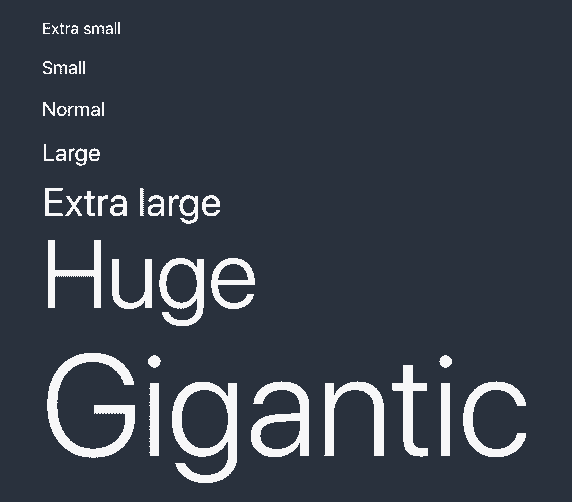

Twenty Twenty-One supports seven font sizes


### 颜色设置

主题定制器提供了一个**颜色&黑暗模式**面板，包括两个选项:

*   一个简单的颜色选择器，有 10 个预定义的调色板。
*   打开/关闭黑暗模式的复选框。

下图显示了带有深灰色文本的浅黄色背景色。

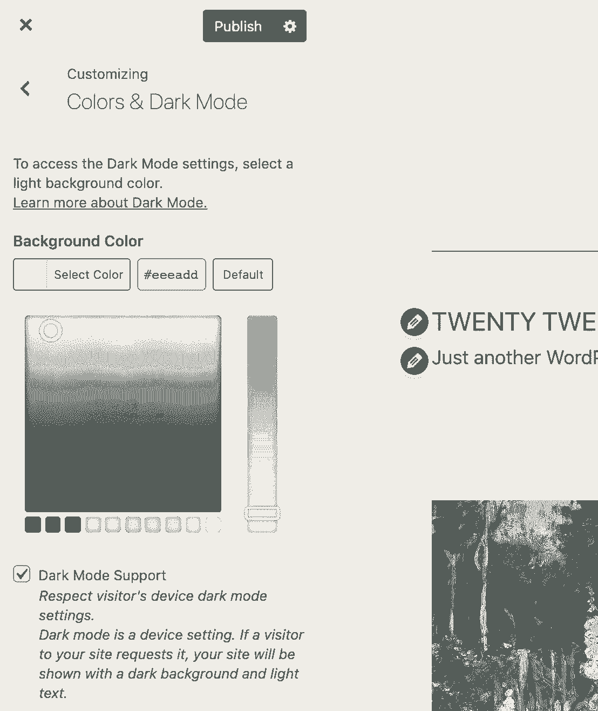

Colors & Dark Mode settings in Twenty Twenty-One


背景颜色默认为淡绿色(`'#d1e4dd'`)，但是[网站管理员](https://kinsta.com/blog/wordpress-user-roles/)可以很容易地在以下背景颜色之间切换:

*   black =`'#000000'`；
*   深灰=`'#28303D'`；
*   gray =`'#39414D'`；
*   green =`'#D1E4DD'`；
*   blue =`'#D1DFE4'`；
*   紫色=`'#D1D1E4'`；
*   red =`'#E4D1D1'`；
*   橙色=`'#E4DAD1'`；
*   黄色=`'#EEEADD'`；
*   white =`'#FFFFFF'`；

在编辑器的块设置中，与**块调色板**相同的颜色可用。

此外，Twenty Twenty One 支持几个**渐变预置**用于支持此功能的区块。下图显示了列块设置中的默认渐变。

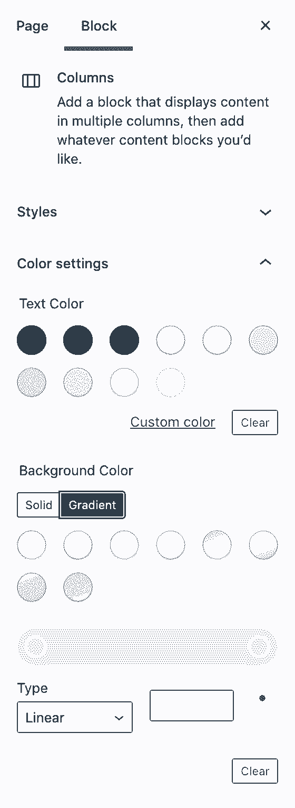

Eight gradient presets in a block’s Color settings


从可访问性的角度来看，对于默认主题来说，黑暗模式支持绝对是一个新奇的事物。

让我们再深入一点！


## 221 主题中的黑暗模式支持

在关于[#核心主题](https://wordpress.slack.com/archives/C02RP4VMP/p1603294484103600)松弛频道的讨论之后，[梅尔·乔伊斯-德万为 2021 引入了黑暗模式支持](https://make.wordpress.org/core/2020/10/22/twenty-twenty-one-dark-mode-discussion/)。


Enabling dark mode in macOS


起初，不清楚这个特性是作为一个主题特性还是作为一个独立的项目发布在一个插件中，如何在 Twenty Twenty-One 中实现。

有五个可能的选项可供选择:

*   允许站点所有者禁用黑暗模式支持，并允许站点访问者在查看站点时打开/关闭黑暗模式。
*   仅允许网站所有者禁用黑暗模式支持(网站访问者没有打开/关闭黑暗模式的选项)。
*   启用“始终开启”的黑暗模式支持，同时允许站点访问者在查看站点时切换它。
*   将黑暗模式支持启用为“始终开启”,并防止网站访问者打开/关闭黑暗模式。
*   完全不支持黑暗模式

[经过深思熟虑的讨论](https://make.wordpress.org/core/2020/11/10/twenty-twenty-one-dark-mode-update/)，主题中加入了黑暗模式。现在:

*   **黑暗模式支持是网站所有者的一项可选功能**。
*   [切换按钮](https://github.com/WordPress/twentytwentyone/pull/622)已从编辑器界面中移除，仅在定制器中可用。
*   黑暗模式切换按钮位于右下角(RTL 的左边),当站点查看器向下滚动页面时会消失。
*   启用黑暗模式后，网站浏览者可以根据个人喜好打开/关闭黑暗模式，而不考虑操作系统/浏览器设置。


Dark mode enabled in the Customizer and disabled on the front site


即使黑暗模式被认为是一种可访问性的改进，也不清楚你的站点页面在任何上下文中都更容易访问。

最大的担忧与深色标识和透明图像有关。从默认的浅色模板切换到深色背景可能会导致可读性问题，这可能会降低可用性并破坏网站的外观。

例如，如果您的读者启用了深色模式，浅色背景上的深色徽标可能会完全消失。类似的问题涉及[图像亮度和对比度](https://github.com/WordPress/twentytwentyone/issues/618)以及[边框、分割线和分隔符](https://github.com/WordPress/twentytwentyone/issues/620)的不透明度。

出于这个原因，如果你打算为你的网站提供黑暗模式支持，你也应该考虑你的网站在黑暗背景下会是什么样子。

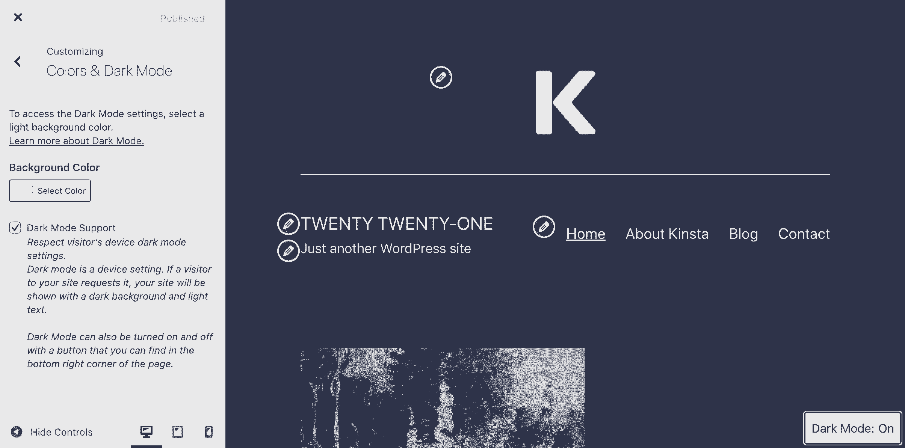

Dark mode enabled in the Customizer and enabled on the front site


主题贡献者知道这些问题，讨论在 Github 上继续。为了更深入地了解黑暗模式可用性问题并有机会参与讨论，请查看 Github 上的完整[问题列表。](https://github.com/WordPress/twentytwentyone/issues)

黑暗模式首选项存储在 LocalStorage 中，可以在浏览器的开发人员工具中查看。

在[谷歌 Chrome](https://developers.google.com/web/tools/chrome-devtools/storage/localstorage) 中，启动 Chrome WebTools，点击**应用**标签。找到**存储**部分，展开本地存储菜单。

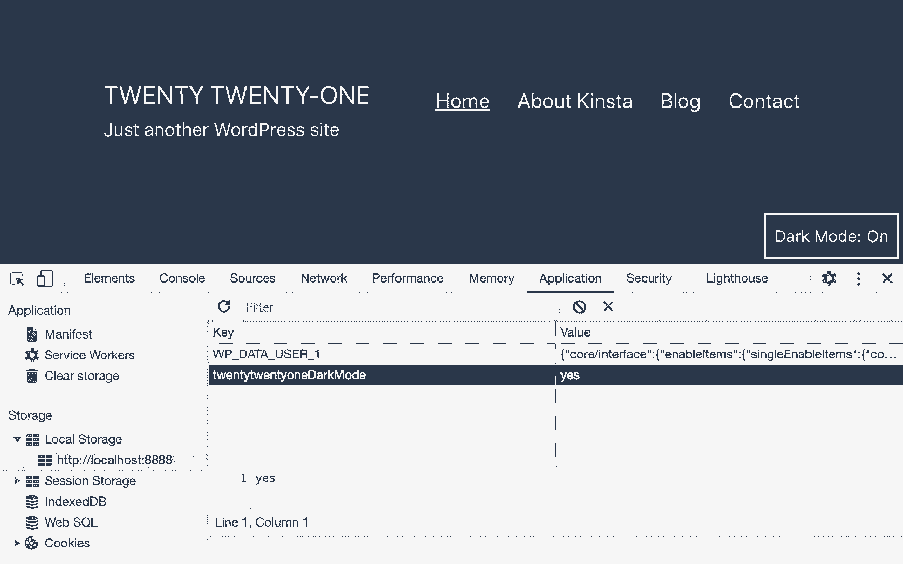

Dark Mode user preferences in Brave Browser local storage


说实话，黑暗模式在今天的网站背景下并不是一个常见的东西。然而，由于新的 WordPress 默认主题现在支持黑暗模式，我们可以预期在这个特定的可访问性领域会有所改变，因为 WordPress 是最常用的 CMS 软件。

想要更深入了解技术的开发者不应该错过这个关于网络黑暗模式的深度指南。

## 样式和 CSS 自定义属性

也就是说，现在是时候为主题开发者探索 Twenty Twenty 1 最有趣的特性了。

让我们从 CSS 自定义属性开始。

如上所述，Twenty Twenty One 基于 [Seedlet](https://wordpress.org/themes/seedlet/) ，一个两栏主题，带有页脚侧边栏和三个菜单位置。Seedlet 的风格完全基于 CSS 自定义属性，这使得主题开发者和高级用户更容易在 Automattic 的主题上[构建子主题](https://kinsta.com/blog/wordpress-child-theme/)。

同样是 221 的。新的默认主题带有一个单列布局、一个页脚侧边栏和两个菜单位置。样式表反映了 Seedlet 提供的嵌套定制属性系统，这使得 Twenty Twenty One 成为构建子主题和高度定制的网站的完美画布。

CSS 自定义属性(也称为 **CSS 变量**)是包含特定值的特殊实体，可以在样式表的任何地方重用。

因此，如果需要在文档中更改特定的颜色强调，不需要运行全局搜索来查找样式表中出现的任何颜色。你只需要在`:root` [块](https://developer.mozilla.org/en-US/docs/Web/CSS/:root)内设置一个不同的属性值。

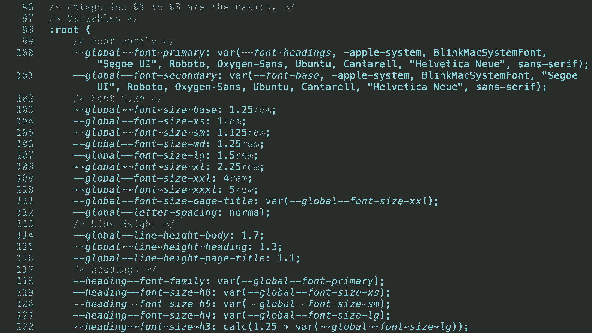

CSS custom properties in Twenty Twenty-One


作为简单定制的一个例子，假设您想要设置一个定制的背景颜色。您不需要为此构建子主题。你只需要在 [**附加 CSS** 面板](https://kinsta.com/knowledgebase/edit-wordpress-code/#css)的代码编辑器中包含两个 CSS 声明:

```
:root {
	--global--color-beige: #e6d7c1;
}

body {
	background-color: var(--global--color-beige);
}
```

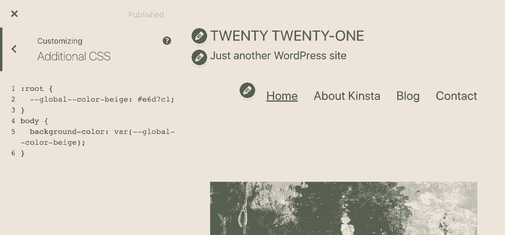

Custom CSS in Twenty Twenty-One Customizer


CSS 自定义属性可以安全使用，因为所有主流浏览器都支持它们，如下图所示，来自[我可以使用](https://caniuse.com/css-variables)吗:

## 注册订阅时事通讯


### 想知道我们是怎么让流量增长超过 1000%的吗？

加入 20，000 多名获得我们每周时事通讯和内部消息的人的行列吧！

[Subscribe Now](#newsletter)

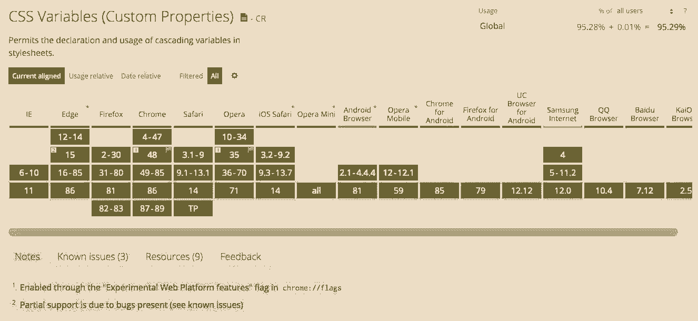

CSS custom properties are supported by the majority of modern web browsers


如果您想更深入地了解 CSS 自定义属性，请查看 [MDN 文档](https://developer.mozilla.org/en-US/docs/Web/CSS/Using_CSS_custom_properties)。

## 二十个二十一个积木图案

221 为块编辑器提供了几种模式。在[之前的博客文章](https://kinsta.com/blog/wordpress-5-5/#block-patterns)中，我们将块模式定义为**预定义的块布局，允许用户快速将复杂的嵌套块结构添加到他们的页面**。

WordPress 5.5 引入了一些区块模式，更多应该会出现在 WordPress 5.6 中。此外，221 有自己的一套积木图案。

在二十二十一中，块模式是在 *inc/block-patterns.php* 文件中定义的。[21 种模式](https://github.com/WordPress/twentytwentyone/issues/50)各不相同，从包含单个 H2 元素的简单模式*大文本*到更复杂的模式，如*重叠图像和文本*和*媒体和文本文章标题*。

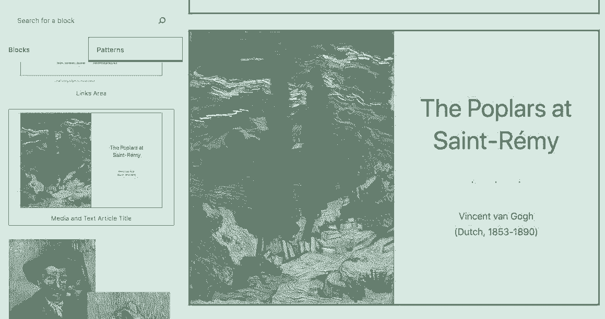

Media and Text Article Title block pattern in Twenty Twenty-One


目前，该主题提供了以下模式:

*   **大文本**
*   **链接区**:一个巨大的文本，后面是社交网络和电子邮件地址链接。
*   **媒体和文本文章标题**:一个媒体&文本块，左边是大图，右边是标题。标题后面是分隔符和描述段落。
*   **重叠图像**:重叠列块内的三幅图像。
*   **两个图像展示**:一个[媒体](https://kinsta.com/blog/wordpress-media-library/) &文本块，左边是一个大图像，右边是一个带边框的小图像。
*   **重叠图像和文本**:一个重叠的列块，有两个图像和一个文本描述。
*   **作品集列表**:带有缩略图的项目列表。
*   **联系信息**:一个有 3 列的区块，显示联系信息和社交媒体链接。

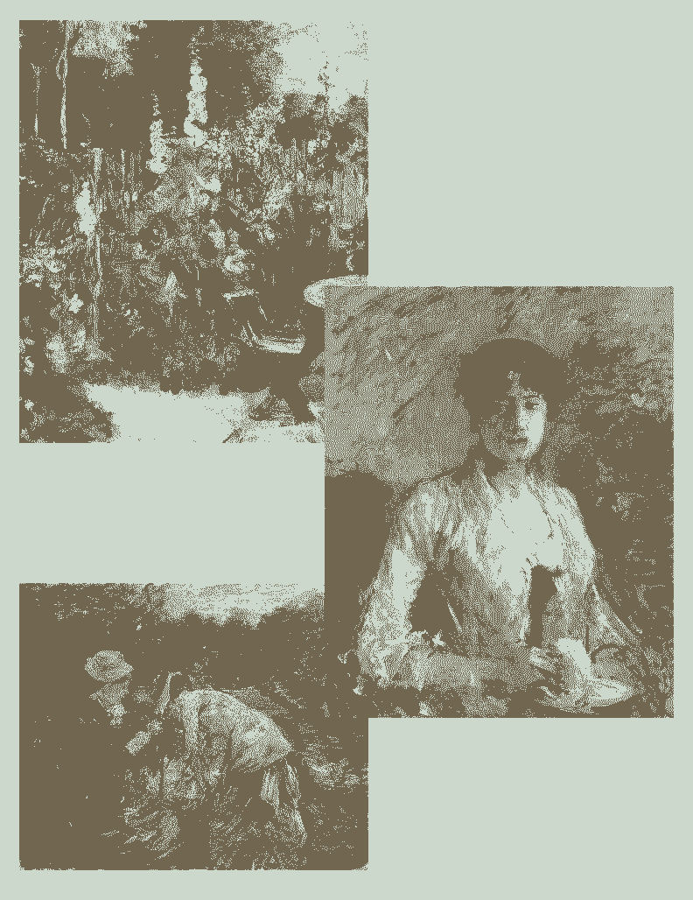

Overlapping Images block pattern in Twenty Twenty-One


这么多块模式的可用性对用户和开发人员来说都很好。用户将被允许快速方便地在他们的文章和页面中添加复杂的代码块，开发者可以使用这些模式作为有用的模板来编写他们自己的代码。

## 221 块实验

221 街区是 221 主题的一个独立的基于街区的实验版本。它的目的是分享并让每个人都了解整个网站编辑实验的最新进展，让每个人在成为 WordPress Core 的一部分之前都有机会深入了解 FSE 的新功能。

我们不太可能看到这个实验版本与 WordPress 5.6 合并成 core。[据卡罗来纳·尼马克](https://make.wordpress.org/themes/2020/10/23/developing-the-full-site-editing-version-of-twenty-twenty-one/)，

> 该主题将需要古腾堡和完整的网站编辑实验被启用。它不会是核心的一部分，但是一旦完成，它将出现在主题目录中。

在撰写本文时，**221 块需要古腾堡插件**。一旦安装并激活了主题和插件，一个站点编辑器菜单项就会出现在你的 WordPress 管理菜单中(你不再需要激活完整的站点编辑实验)。


The Site Editor menu item in Twenty Twenty-One Blocks experiment


现在，点击新的**站点编辑器**菜单项，打开全站点编辑界面，开始使用块编辑器编辑页面上的任何元素。

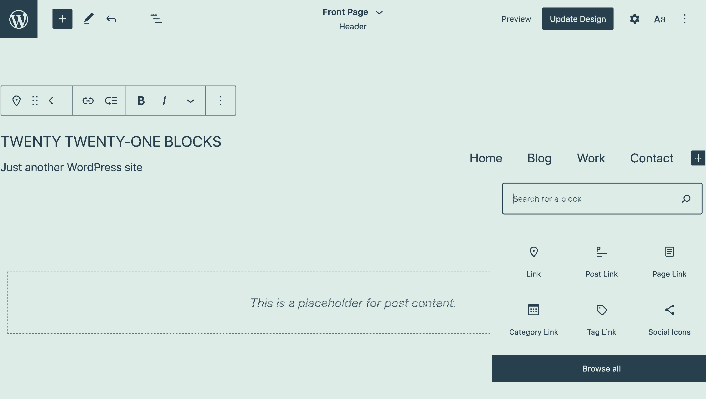

Full Site Editing in Twenty Twenty-One Blocks


在这里，我们不会陷入技术的东西。可以说，经典主题和基于块的主题在结构上是不同的。

下图显示了二十个二十一个街区文件夹的内容:

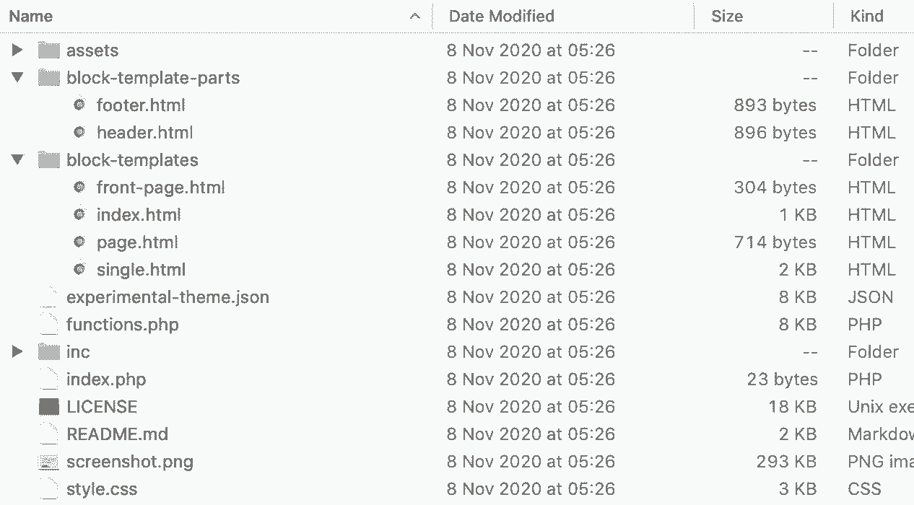

Twenty Twenty-One Blocks folder


你会注意到 *experimental-theme.json* 文件和*块模板*和*块模板部件*文件夹。

传统 WordPress 主题和基于块的主题的主要区别在于，基于块的主题包括完全由块组成的模板。

例如，在您的[代码编辑器](https://kinsta.com/blog/free-html-editor/)中打开*block-template-parts/header . html*。您应该会看到以下代码:

```
<!-- wp:spacer {"height":70} -->
<div style="height:70px" aria-hidden="true" class="wp-block-spacer"></div>
<!-- /wp:spacer -->

<!-- wp:columns {"align":"wide"} -->
<div class="wp-block-columns alignwide"><!-- wp:column -->
<div class="wp-block-column"><!-- wp:site-title /-->

<!-- wp:site-tagline /--></div>
<!-- /wp:column -->

<!-- wp:column -->
<div class="wp-block-column"><!-- wp:navigation {"orientation":"horizontal","itemsJustification":"right"} -->
<!-- wp:navigation-link {"label":"Home","url":"#"} /-->

<!-- wp:navigation-link {"label":"Blog","url":"#"} /-->

<!-- wp:navigation-link {"label":"Work","url":"#"} /-->

<!-- wp:navigation-link {"label":"Contact","url":"#"} /-->
<!-- /wp:navigation --></div>
<!-- /wp:column --></div>
<!-- /wp:columns -->

<!-- wp:spacer {"height":70} -->
<div style="height:70px" aria-hidden="true" class="wp-block-spacer"></div>
<!-- /wp:spacer -->
```

可以看到，经典的[*header.php 模板文件*](https://kinsta.com/knowledgebase/add-code-wordpress-header-footer/)*已经被一个*所取代。包含几个块的 html* 文件。*

 *你可以从 Github 上的[主题-实验](https://github.com/WordPress/theme-experiments)项目中获取正在进行的二十个二十一个街区主题的版本。

如果你是一个主题开发者，[官方文档](https://github.com/WordPress/gutenberg/blob/master/docs/designers-developers/developers/themes/block-based-themes.md)提供了你需要知道的关于基于块的主题的所有信息。

如果你愿意为整个网站编辑实验做贡献，请在这里提交你的反馈。


### 重要的

二十个二十一块是实验主题，不应该用于生产！在[舞台环境](https://kinsta.com/help/staging-environment/)中摆弄它。


## 如何在 2021 年建立一个儿童主题

默认的 WordPress 主题是学习[主题开发](https://kinsta.com/blog/wordpress-developer-salary/)的基础，并让你开始构建自定义[子主题](https://kinsta.com/blog/wordpress-child-theme/)的好起点。

默认主题遵循官方的 WordPress 编码标准的指导方针，并且符合 T2 的网络标准。

有没有更好的地方让[学习编码](https://kinsta.com/blog/scripting-languages/)？

需要为您的客户站点提供超快的、安全的、开发人员友好的托管服务吗？Kinsta 是为 WordPress 开发者设计的，提供了大量的工具和强大的仪表板。[查看我们的计划](https://kinsta.com/plans/?in-article-cta)

子主题是一个很棒的 WordPress 特性，它允许你自定义页面的布局、功能和结构。通过下面的例子，我们将深入主题定制的各个方面。

### 设置您的儿童主题

构建 WordPress 子主题有三个步骤:

#### 1.创建子主题文件夹

在 *wp-content/themes* 中创建一个新文件夹，根据需要命名。但是请记住，它应该是一个唯一的名称。[子主题手册](https://developer.wordpress.org/themes/advanced-topics/child-themes/#1-create-a-child-theme-folder)建议使用与父主题相同的名称，并在末尾添加**-子主题**。

因此，我们可以将新文件夹命名为 **twentytwentyone-child** 。

#### 2.创建 style.css 文件

现在移动到你的子主题目录，创建一个新的 *style.css* 文件，包括以下代码:

```
/*
Theme Name: My Twenty Twenty One Child Theme
Theme URI: https://example.com
Description: A child theme for Twenty Twenty One.
Author: Your Name
Author URI: https://example.com/
Template: twentytwentyone
Version: 1.0
License: GNU General Public License v2 or later
License URI: https://www.gnu.org/licenses/gpl-2.0.html
*/ 
```

信息标题允许 WordPress 正确处理你的子主题。

*   主题名称:主题的唯一名称。
*   主题 URI:用户可以在这里找到主题的代码或文档。
*   描述:帮助用户理解主题的描述性文字。
*   作者:你的名字
*   作者 URI:作者的网站。
*   模板:存储父主题的文件夹。使用文件夹名称，而不是主题名称。没有这一行，你的主题就不能作为子主题。
*   版本:版本号
*   License:许可证，其中[必须是 GNU](https://developer.wordpress.org/themes/getting-started/wordpress-licensing-the-gpl/) 。
*   URI 许可证:许可证信息的链接。

在该文本下面，您可以添加您的 CSS 声明块，稍后我将向您展示。

#### 3.创建一个 functions.php 文件

有了 221，你还需要一个*functions.php*文件。因此，在子主题的目录中创建您自己的目录，在代码编辑器中打开它，并添加以下代码:

```
<?php
/* enqueue scripts and style from parent theme */

function twentytwentyone_styles() {
	wp_enqueue_style( 'child-style', get_stylesheet_uri(),
	array( 'twenty-twenty-one-style' ), wp_get_theme()->get('Version') );
}
add_action( 'wp_enqueue_scripts', 'twentytwentyone_styles');
```

因为 Twenty Twenty-One 主题使用`get_template_directory()`来加载它的样式表，所以您需要使用`wp_enqueue_scripts`动作将子主题的样式表排队。

之后，保存你的文件，打开你的 WordPress 仪表盘，浏览到**外观- >主题**，激活你的 Twenty Twenty One 的子主题。

现在让我们添加我们的定制。

### 如何添加自定义样式

当谈到定制你的 WordPress 网站的布局时，你有几个选择来添加你的定制 CSS 代码。定制者的**额外的 CSS** 面板对于小改动来说已经足够了。

但是如果你必须进行高级定制，或者你需要将你的代码导出到不同的 WordPress 网站，子主题会是一个更好的选择。

让我们尝试一下简单的定制:改变默认的字体堆栈。

假设你想加载一个不同的字体堆栈，或者简单地将你最喜欢的字体添加到默认的 21 种字体中。

你是怎么做到的？

在这里我将向你展示如何改变 H1 标题的默认字体，但是你可以为你网站的任何文本元素改变字体系列。

首先，打开第二十一的 *style.css* 文件，找到下面的 css 块:

```
h1,
.h1,
h2,
.h2,
h3,
.h3,
h4,
.h4,
h5,
.h5,
h6,
.h6 {
	clear: both;
	font-family: var(--heading--font-family);
	font-weight: var(--heading--font-weight);
}
```

如您所见，标题的字体系列是在`--heading--font-family`变量中设置的。

现在转到`:root{}`块，找到下面的声明:

```
--heading--font-family: var(--global--font-primary);
```

`--heading--font-family`依赖于`--global--font-primary`变量，该变量定义在`:root{}`块的最顶端:

```
:root{
	/* Font Family */
	--global--font-primary: var(--font-headings, -apple-system, BlinkMacSystemFont, "Segoe UI", Roboto, Oxygen-Sans, Ubuntu, Cantarell, "Helvetica Neue", sans-serif);
	...
}
```

现在我们知道要改变什么了！

从父样式表中复制`--global--font-primary`声明，粘贴到子样式表的 *style.css* 中。然后，更改属性名称和值，如下所示:

```
:root{
	/* Font Family */
	--global--font-primary-child: var(--font-headings, Ubuntu, -apple-system, BlinkMacSystemFont, "Segoe UI", Roboto, Oxygen-Sans, Cantarell, "Helvetica Neue", sans-serif);

	--global--font-family-child: var(--global--font-primary-child);
}
```

一旦声明了自定义字体堆栈，就可以在样式表中的任何地方使用它。我们例子中的 H1 标题:

```
h1,
.h1 {
	font-family: var(--global--font-family-child);
}
```

保存孩子的 *style.css* ，重新加载页面。你应该看到 Ubuntu 作为你的页面标题的默认字体系列。

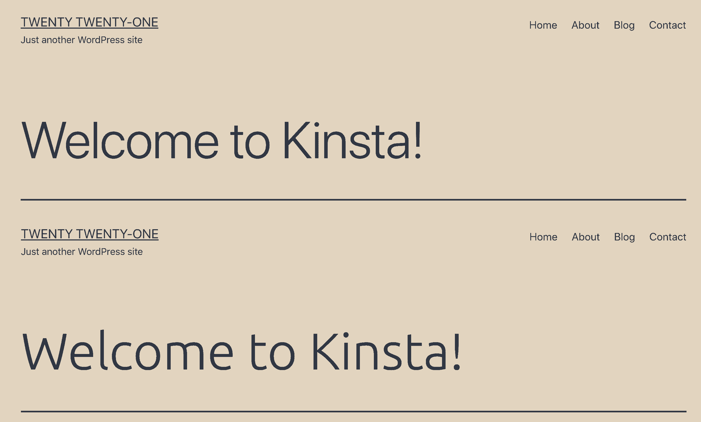

Default font family vs. custom font family in Twenty Twenty-One


既然您已经知道如何使用子主题自定义 Twenty Twenty-One 的样式，我们可以探索更多高级功能。

### 如何添加新的积木图案

在本例中，我们将构建一个定制的块模式，包括一个两列块，左边是一个圆形图像，右边是一个 H4 标题和一个段落。

您可以直接在块编辑器中构建您的模式，或者定制现有块模式的代码。

如果您选择在块编辑器中构建您的模式，您只需要将必要的块添加到帖子或页面草稿中，然后切换到代码编辑器并复制相应的代码。


A two-column block in the Code Editor


我们现在可以在子主题的*functions.php*文件中注册我们的模式:

```
add_action( 'init', function(){

	register_block_pattern_category( 
		'custom-patterns', 
		array( 'label' => esc_html__( 'Custom patterns', 'twentytwentyone-child' ) ) );

	register_block_pattern(
	'twentytwentyone-child/custom-bio-pattern',
	array(
		'title'			=> __( 'Author Bio', 'twentytwentyone-child' ),
		'description'	=> _x( 'A block with 2 columns that displays an avatar image, a heading and a paragraph.', 'Block pattern description', 'twentytwentyone-child' ),
		'content'		=> '<!-- wp:columns {"verticalAlignment":null} --> <div class="wp-block-columns"><!-- wp:column {"verticalAlignment":"center","width":"33.33%"} --> <div class="wp-block-column is-vertically-aligned-center" style="flex-basis:33.33%"><!-- wp:image {"id":29,"sizeSlug":"large","linkDestination":"none","className":"is-style-rounded"} -->  <!-- /wp:image --></div> <!-- /wp:column --> <!-- wp:column {"width":"66.66%"} --> <div class="wp-block-column" style="flex-basis:66.66%"><!-- wp:heading {"level":4} --> <h4>About Kinsta</h4> <!-- /wp:heading --> <!-- wp:paragraph --> <p>Kinsta was founded in 2013 with a desire to change the status quo. We set out to create the best hosting platform in the world, and that’s our promise. We don’t settle and are here to stay.</p> <!-- /wp:paragraph --></div> <!-- /wp:column --></div> <!-- /wp:columns -->',
		'categories'	=> array( 'custom-patterns' ),
	)
	);
});
```

上面的代码注册了**自定义模式**类别和**作者简介**模式。

注意我们用来构建`img`元素的代码:

```

```

`get_stylesheet_directory_uri()` [函数](https://developer.wordpress.org/reference/functions/get_stylesheet_directory_uri/)提供子主题目录的 URI(该图像之前已经添加到子主题的*资产*文件夹中)。

保存您的更改并创建新的帖子或页面。

现在，您应该在块插入器中找到新的模式。

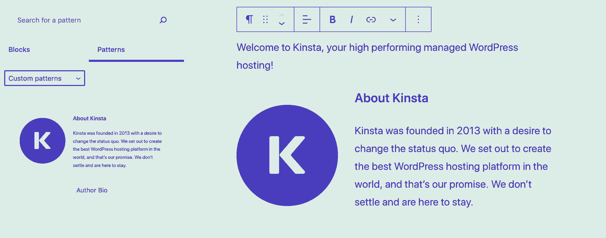

A custom block pattern added to Twenty Twenty-One


### 自定义模板文件

如果你想为一个特定的文档或单个文章/页面创建一个新的模板文件，你需要创建一个新的*。php* 模板按照 WordPress [模板的层次结构](https://kinsta.com/blog/wordpress-child-theme/#how-wordpress-chooses-template-files)。

但如果你只想编辑一个已有的模板(或模板部分)，你只需要从父主题中复制原始模板，并粘贴到你的子主题的相应位置(在我们的[子主题扩展指南](https://kinsta.com/blog/wordpress-child-theme/#the-files-in-a-wordpress-child-theme)中阅读更多关于这个主题的内容)。

假设你想定制“由 WordPress 提供动力的骄傲”文本。您有几个选项来[删除或定制该行](https://kinsta.com/knowledgebase/remove-powered-by-wordpress/)。对于我们的例子，让我们手动更改它。

为此，从父文件夹中复制*footer.php*模板文件并粘贴到你的子主题的根目录中。完成后，在代码编辑器中打开子主题的`footer.php`,找到以下代码:

```
<div class="powered-by">
	<?php
	printf(
		/* translators: %s: WordPress. */
		esc_html__( 'Proudly powered by %s.', 'twentytwentyone' ),
		'<a href="' . esc_attr__( 'https://wordpress.org/', 'twentytwentyone' ) . '">WordPress</a>'
	);
	?>
</div><!-- .powered-by -->
```

现在，您可以进行更改了。比方说，你想给你的网络主机积分，只需替换如下所示的`a`元素:

```
<div class="powered-by">
	<?php
	printf(
		esc_html__( 'Proudly powered by %s.', 'twentytwentyone' ),
		'<a href="https://kinsta.com/">Kinsta</a>'
	);
	?>
</div><!-- .powered-by -->
```

要删除该文本，只需注释掉或删除`div.powered-by`元素:

```
<!-- <div class="powered-by">
	<?php
	printf(
		/* translators: %s: WordPress. */
		esc_html__( 'Proudly powered by %s.', 'twentytwentyone' ),
		'<a href="' . esc_attr__( 'https://wordpress.org/', 'twentytwentyone' ) . '">WordPress</a>'
	);
	?>
</div> -->
```

仅此而已。现在，从上面的简单例子开始，你可以进行更令人兴奋的定制，将你的网站提升到一个新的水平。

[Check out what's new in WordPress theming, from Dark Mode to block-based themes, in this thorough overview of Twenty Twenty-One 🌅Click to Tweet](https://twitter.com/intent/tweet?url=https%3A%2F%2Fkinsta.com%2Fblog%2Ftwenty-twenty-one-theme%2F&via=kinsta&text=Check+out+what%27s+new+in+WordPress+theming%2C+from+Dark+Mode+to+block-based+themes%2C+in+this+thorough+overview+of+Twenty+Twenty-One+%F0%9F%8C%85&hashtags=WordPress%2CThemes)

## 摘要

221 主题是第三次尝试允许没有高级技术技能的人建立网站。这是一个极简主义的、性能良好的、可访问的 WordPress 主题，也适合广泛的用例。由 Twenty 221 主题驱动的 WordPress 站点有各种形状和大小。要想知道一个主题是否在使用 Twenty Twenty One，请查看我们方便的主题检测工具。

考虑到块编辑器的设计，新的默认主题便于用户和开发人员自定义。

现在轮到你了:你安装了 221 主题了吗？你对它有什么体验？在评论区分享你的想法吧！

* * *

让你所有的[应用程序](https://kinsta.com/application-hosting/)、[数据库](https://kinsta.com/database-hosting/)和 [WordPress 网站](https://kinsta.com/wordpress-hosting/)在线并在一个屋檐下。我们功能丰富的高性能云平台包括:

*   在 MyKinsta 仪表盘中轻松设置和管理
*   24/7 专家支持
*   最好的谷歌云平台硬件和网络，由 Kubernetes 提供最大的可扩展性
*   面向速度和安全性的企业级 Cloudflare 集成
*   全球受众覆盖全球多达 35 个数据中心和 275 多个 pop

在第一个月使用托管的[应用程序或托管](https://kinsta.com/application-hosting/)的[数据库，您可以享受 20 美元的优惠，亲自测试一下。探索我们的](https://kinsta.com/database-hosting/)[计划](https://kinsta.com/plans/)或[与销售人员交谈](https://kinsta.com/contact-us/)以找到最适合您的方式。*