# 2022 年 20 门最佳网络设计课程(免费和付费)

> 原文：<https://kinsta.com/blog/web-design-courses/>

在几十个学习平台、几百个博客和 YouTube 之间，有无穷无尽的网页设计课程和在线学习材料。

但是质量并不都一样。如果你从错误的地方开始，你最终会浪费你的时间和金钱。

我们已经在网上搜索了最好的、最新的网页设计课程，包括免费的和付费的，并整理了一份最佳选择的名单。如果你正在寻找 2022 年[最好的网络开发工具](https://kinsta.com/blog/web-development-tools/)，我们也将为你提供帮助。

所以，如果你不喜欢每天早上去办公室，忍受下午回家的高峰，那就继续读吧。

我们将涵盖你开始网页设计师新职业所需的所有课程。

## 做一名网页设计师需要具备哪些资质？

在[网页设计](https://kinsta.com/blog/web-design-best-practices/)中，像大学学位这样的传统硬资历并不像在其他行业中那样举足轻重。

这是一个快速变化的行业，所以 10 年前的学位并不意味着你现在是一个伟大的网页设计师。

> Kinsta 把我宠坏了，所以我现在要求每个供应商都提供这样的服务。我们还试图通过我们的 SaaS 工具支持达到这一水平。
> 
> <footer class="wp-block-kinsta-client-quote__footer">
> 
> 
> 
> <cite class="wp-block-kinsta-client-quote__cite">Suganthan Mohanadasan from @Suganthanmn</cite></footer>

[View plans](https://kinsta.com/plans/)

相反，网页设计师通常是通过他们的作品集网站展示的近期作品目录来评判的。

不仅仅是你文件夹中以前的项目有助于突出你的技能。

你可以说服潜在客户，你有必要的设计和网站本身的开发技能。

为了从使用前沿设计和开发的[真实投资组合网站](https://kinsta.com/blog/portfolio-website/)中获得灵感，你可以在 [Awwwards](https://www.awwwards.com/inspiration/search?text=portfolio&type=submission) 上查看以前获奖的项目。

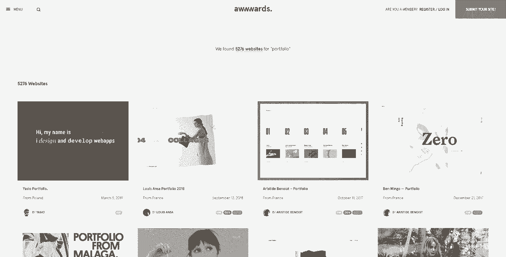

Awwwards portfolio sites

看看每个设计师如何使用[字体](https://kinsta.com/blog/modern-fonts/)、空白、动画、图标和其他设计元素来展示他们最好的一面。

你也可以在其他创意社区如 Dribble 或 Behance 中找到灵感。

### 掌握成功的必要工具和软技能

还有一些你需要掌握的工具和软技能将会成就或毁掉你的网页设计师生涯。

让我们先来看看您可能会用到的一些工具。

*   **基本插画和照片编辑工具:** Illustrator，Photoshop，Sketch，或者 GIMP。
*   **交互设计工具:** Adobe XD 或 Invision Studio。
*   **本地开发环境**(如果你开发原型或者[使用 CMS](https://kinsta.com/blog/cms-software/) ):桌面服务器、XAMPP 等。(了解[如何在本地安装 WordPress】来测试新设计。)](https://kinsta.com/blog/install-wordpress-locally/)

还有一些流行的框架和 CSS 可以帮助你脱颖而出。

*   **动画工具包** : Animate.css，Bounce.js 等等。
*   **jQuery 库和插件:**惰性加载，视差滚动等等。
*   熟悉 Bootstrap、React 和其他流行的前端开发框架至关重要。
*   了解 WordPress 和如何创建模板也可以成为潜在客户使用 [CMS](https://kinsta.com/knowledgebase/content-management-system/) 的一个关键卖点。

如果你想成功，你还需要一些软技能。

*   对网站上消费者心理和人类行为的理解。基本概念包括决策麻痹、社会证明的价值和颜色心理学。
*   作为一名自由职业者，你需要学习如何给项目定价和使用基本的谈判策略。
*   你还需要学习如何提出建议和获得客户。即使在[机构或公司背景下](https://kinsta.com/blog/wordpress-agency/)，这也是一项宝贵的技能。

[有兴趣成为网页设计师吗？✅学习如何开始与这个最好的课程选择综述。🎨 点击推文](https://twitter.com/intent/tweet?url=https%3A%2F%2Fkinsta.com%2Fblog%2Fweb-design-courses%2F&via=kinsta&text=Interested+in+becoming+a+web+designer%3F+%E2%9C%85++Learn+how+to+get+started+with+this+roundup+of+the+best+course+options+out+there.+%F0%9F%8E%A8&hashtags=WebDesign%2CTechjobs)

## 20 门最佳在线网页设计课程(免费与付费)

下面，我们将重点介绍一些最好的在线网页设计课程，包括免费和付费资源。

为了帮助您更快地找到您想要的内容，我们将它们分为以下几类。

### 免费在线网页设计视频课程

如果你喜欢通过视频格式学习，有人指导你学习每一段新的代码或技术，网上有许多免费的选择。

#### 1.WebFlow 大学:终极网页设计课程

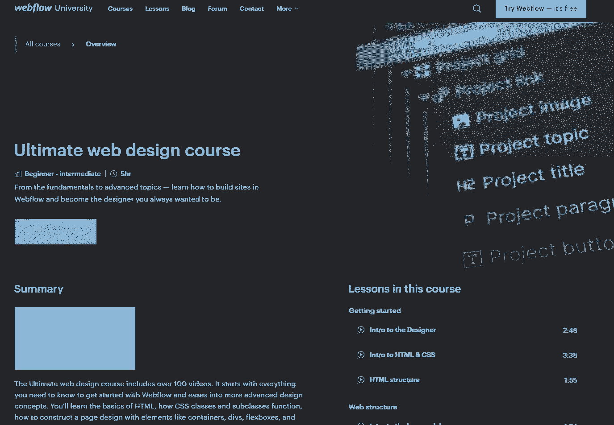

WebFlow University web design course

[终极网页设计课程](https://university.webflow.com/courses/ultimate-web-design-course)是由 [WebFlow](https://kinsta.com/blog/webflow-vs-wordpress/) 大学提供的免费课程，这是一个由 CMS 和设计工具 WebFlow 托管和开发的在线学习平台。

它包括超过 5 个小时的视频课程，是一个很好的介绍所有网页设计的东西。

**主题:**

*   HTML 和 CSS 基础知识
*   网络结构
*   小跟班
*   排印
*   媒体元素
*   成分
*   造型基础
*   布局基础
*   高级布局
*   响应式设计
*   CMS 和动态内容
*   [SEO](https://kinsta.com/blog/wordpress-seo/)

**时长:** 5 小时(视频)

**证书:**不可用

**优点:**

*   最新的网页设计前沿介绍。
*   易于遵循说明。
*   超过 5 个小时的视频内容(如果你继续下去，实际学习时间会更长)。

**缺点:**

*   虽然这是一个很好的速成课程，但它不会给你所有概念的最好的基础理解。

#### 2.BYOL:使用 HTML5、CSS3 和 Visual Studio 代码的网页设计初学者

Beginner web design course

Web designer 和 YouTuber Bring Your Own Laptop 利用 HTML5、CSS3 & Visual Studio 代码创建了一个名为[初级 Web 设计的 4 小时免费课程。](https://www.youtube.com/watch?v=C5QFHp1oAws)

这种格式是 YouTube 上一个 4 小时的视频，并附有一套可以免费下载的练习文件。

在整个课程中，你将学习如何创建三个不同的复杂程度和难度不断增加的网站，最后，如何使你的网站响应迅速。

**主题:**

*   HTML 和 CSS 基础知识
*   Head 和 HTML 标签
*   CSS 类
*   Web 结构和 div 嵌套
*   媒体元素
*   [外部 CSS](https://kinsta.com/knowledgebase/combine-external-css/)
*   测试您的网站
*   造型基础
*   布局基础
*   高级布局
*   [响应式设计](https://kinsta.com/blog/responsive-web-design/)
*   CMS 和动态内容
*   搜索引擎优化

**时长:** 4 小时(视频)

**证书:**不可用

**优点:**

*   有趣且易于理解的说明(大多数 YouTube 评论强调它是多么容易理解)。
*   YouTube 上有近 4 个小时的免费视频内容，分为几个部分以便更好地浏览。

**缺点:**

*   很简单，要完成整个课程(16 个小时)，你需要以每月 12 美元的价格注册一个自带笔记本会员。

#### 3.freeCodeCamp:响应式网页设计介绍——HTML & CSS 教程

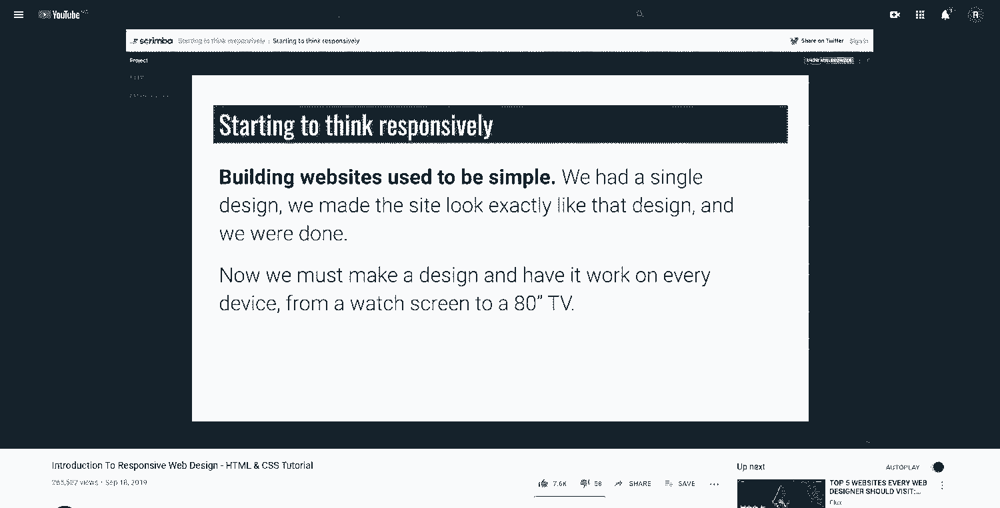

freeCodeCamp YouTube course

2019 年，freeCodeCamp 在他们的 YouTube 频道上发布了 4 小时的[响应式设计入门课程](https://www.youtube.com/watch?v=srvUrASNj0s)。

本课程将教你如何创建一个 3 页的响应式网站，以及响应式设计、CSS 和 HTML5 的基础知识。

**主题:**

*   响应式设计基础
*   移动优先设计
*   CSS 单位
*   在 vs px vs rems 中
*   flex box(flex box)的缩写形式
*   CSS 样式
*   响应容器
*   媒体查询
*   响应导航
*   页面结构
*   小工具

**时长:** 4 小时(视频)

**证书:**不可用

**优点:**

*   更深入的了解如何在 2022 年用 HTML 和 CSS 创建合适的响应式设计。
*   了解重要的 CSS 单元和高级 HTML 标签。
*   在 YouTube 上可以免费获得超过 4 小时的视频(无需注册)。

**缺点:**

*   除了响应式设计之外的有限的基础信息(如果你已经知道基本的 HTML 和 CSS 就好了)。

#### 4.开放式课堂课程:用 HTML 和 CSS 构建你的第一个网页

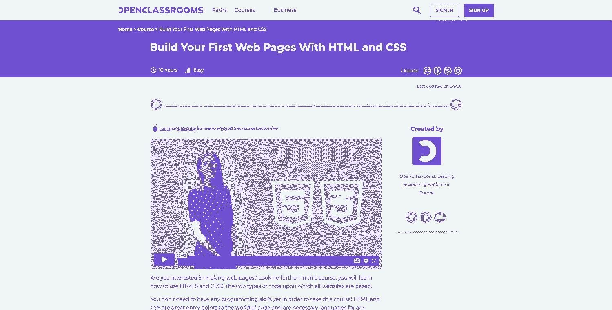

OpenClassrooms introductory course

OpenClassrooms 提供免费的入门课程，名为[用 HTML 和 CSS](https://openclassrooms.com/en/courses/5265446-build-your-first-web-pages-with-html-and-css/) 构建你的第一个网页。

它从最开始开始，会让你对 HTML5 和 CSS3 有一个很好的基本理解。如果你没有任何网站开发或设计的经验，这是一个很好的起点。

**主题:**

*   HTML5 和 CSS3 基础
*   HTML 结构
*   CSS 样式
*   页面结构和搜索引擎优化
*   图像优化
*   块和内联元素
*   颜色理论
*   [字体](https://kinsta.com/blog/web-safe-fonts/)(确保查看我们关于[如何在 WordPress](https://kinsta.com/blog/how-to-change-font-in-wordpress/) 中改变字体的指南)

**时长:** 10 小时

**证书:**可用(每月 20 美元的会员费)

**优点:**

*   伟大的网页设计入门，使用最新的 HTML 和 CSS。
*   Codepen 条目的集合，突出不同代码在现实世界中的工作方式。
*   10 小时免费学习，包括互动测验和视频课程。

**缺点:**

*   停留在非常基础的地方，让你对许多不同的概念有一个有限的、表面的理解。

### 付费在线网页设计视频课程

如果你有钱投资，网上也有一些高质量的付费网页设计课程值得一看。如果你打算把它作为职业，投资教育应该是显而易见的。

#### 5.Udemy 课程:面向初学者的网页设计:HTML 和 CSS 中的真实世界编码

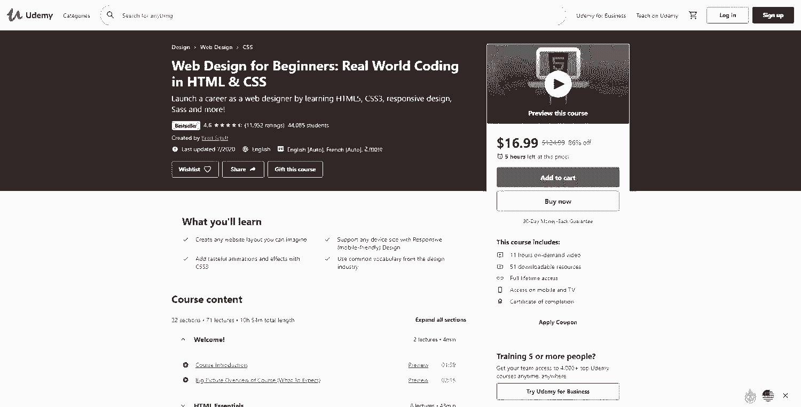

Udemy Web Design Course

Udemy 是最受欢迎的在线学习平台之一。有各种各样的课程，从网站设计到自由职业和生产力。

但是最好的起点是面向初学者的[网页设计:HTML 的真实世界编码& CSS](https://www.udemy.com/course/web-design-for-beginners-real-world-coding-in-html-css/) 在线课程。

**主题:**

*   HTML 布局和要点
*   媒体
*   字体和排版
*   页面结构
*   航行
*   [表格](https://kinsta.com/blog/wordpress-forms/)
*   CSS 要点
*   背景
*   flex box(flex box)的缩写形式
*   CSS3 动画
*   JavaScript 框架
*   引导程序

**时长:** 11 小时(视频)

**价格:**16.99 美元(100 美元以上的价格是一种销售策略)

**证书:**可用

**优点:**

*   结构良好的入门课程，涵盖了 2022 年响应式设计的所有基础知识。
*   最新信息(最后更新于 2020 年 7 月)。
*   与社区互动，并向课程讲师提问。
*   一次性费用(而不是每月付款)。

**缺点:**

*   对于付费课程来说，这不是最深入的课程。

#### 6.树屋:网页设计追踪

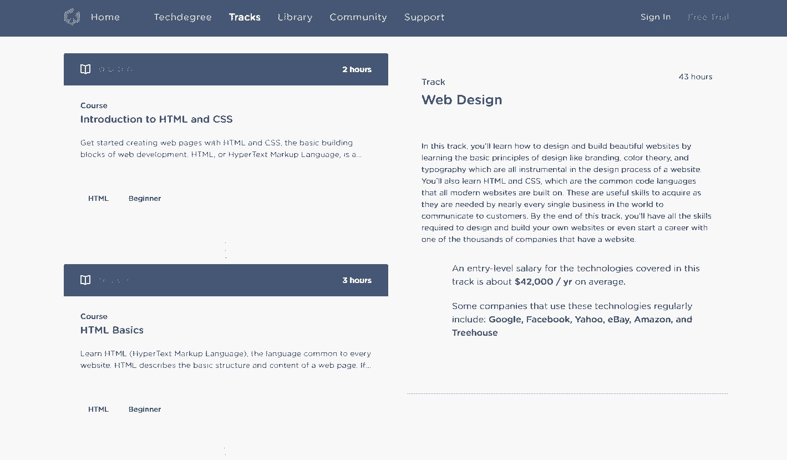

TreeHouse web design track

TreeHouse 是一个基于订阅的在线学习平台，适合设计师和程序员。[网页设计课程](https://teamtreehouse.com/tracks/web-design)提供 43 小时的视频和互动课程，内容涉及 HTML、CSS、布局和其他网页设计基础知识。

它还包括初露头角的平面设计师的基本技能，比如一个 [SVG](https://kinsta.com/blog/what-is-an-svg-file/) 教程。

**主题:**

*   HTML 和 CSS 基础知识
*   网页设计流程
*   高级 HTML 表单
*   桌子
*   排印
*   CSS layouts
*   响应式设计
*   flex box(flex box)的缩写形式
*   自举 4
*   线框化
*   CSS 动画
*   CSS 网格布局

**时长:** 43 小时(视频)

**价格:**课程 25 美元/月，附加课程 49 美元/月。

**证书:**不适用于课程(仅适用于 199 美元/月的 Techdegree 课程)。

**优点:**

*   对网页设计的深入介绍，超过四十小时的互动学习。
*   一个活跃的社区，你可以与之互动并从中学习。
*   仅仅在 HTML 和 CSS 基础上学习超过 15 个小时，就可以打下坚实的基础。

**缺点:**

*   如果你做全职工作，几乎没有空闲时间，如果你继续推迟学习，树屋可能会变得很昂贵。

#### 7.前端硕士:CSS 网格/Flexbox 课程

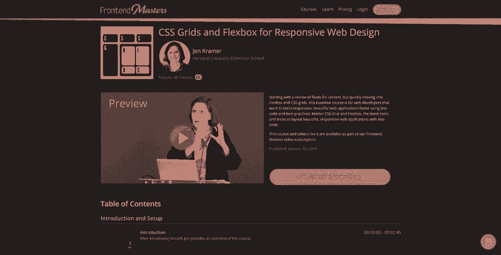

FM – CSS Grid & Flexbox course

Frontend Masters 是初学者和中级网页设计师的绝佳学习平台。这门课程将教你如何使用现代 CSS 技术为你的网站创建一个响应性的布局。

它将帮助你在一个基本的 HTML 线框设计师和能够创建功能原型和模板的人之间架起一座桥梁。

**主题:**

*   响应式设计基础
*   CSS 浮动
*   Flexbox 基础和实施
*   响应图像
*   CSS 网格基础和实现

**时长:** 5 小时以上(视频)

**价格:**$ 39/月

**证书:**可用

**优点:**

*   顶级专业设计教育家的一流视频课程。
*   将教你现代响应式设计是如何工作的，这是线框和布局设计师的必备技能。
*   FM 还有其他很棒的课程来学习基本的网页设计和开发基础。

**缺点:**

*   与其他在线课程一样，如果你需要更多的时间(几个月的时间很快就会累积起来)，它可能会变得有点贵。

#### 8.Skillcrush:前端开发课程

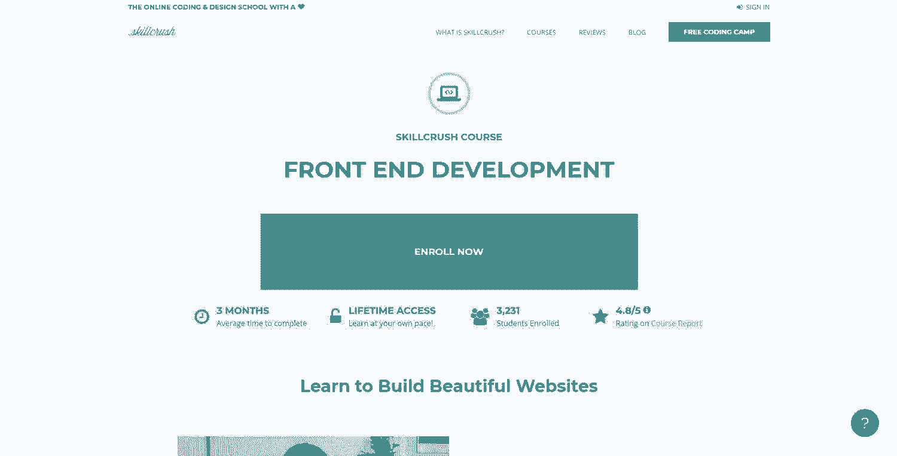

Skillcrush – Frontend development course

Skillcrush 提供了一个深入的前端开发入门课程，非常适合初学者。它的价格和时间表意味着它与一些更标准的 MOOCs 有更多的共同点，但结构是自由格式，你可以想学多快就学多快。

**主题:**

*   HTML、CSS 和 JS 基础知识
*   媒体询问和响应设计
*   [响应图像](https://kinsta.com/blog/optimize-images-for-web/)
*   Git & GitHub
*   Flexbox 基础和实施
*   [jQuery](https://kinsta.com/knowledgebase/what-is-jquery/)

**时长:** 3 个月(平均完成时间)

**价格:** $549 一次性付款或$ 199/月三个月

**证书:**可用

**优点:**

*   对前端开发和整体网页设计的深入介绍。
*   从例子中学习，因为你可以观察其他学生如何完成作业。

**缺点:**

*   有点贵，而且退款政策似乎有点弱。

#### 9.Envato Tuts+:面向初学者的响应式网页设计

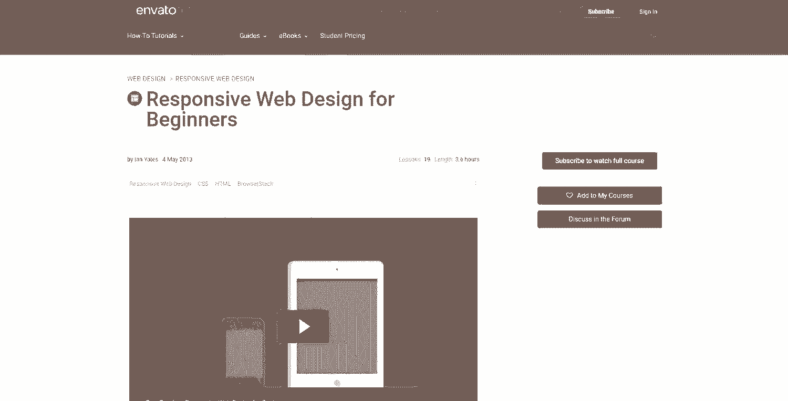

Tuts+ – Responsive web design course

面向初学者的 Tuts+ [响应式网页设计课程](https://webdesign.tutsplus.com/categories/responsive-web-design/courses)是对响应式设计、HTML、CSS、媒体查询等基础知识的快速介绍。

单独来看，它似乎不是最好的付费选择，因为它的播放时间只有 3 个多小时。但 Tuts+ premium 包括 20 多门网页设计课程，从使用 Sketch 或 Adobe XD 等特定软件，到深入的网页排版课程。

**主题:**

*   HTML、CSS 和 JS 基础知识
*   媒体询问和响应设计
*   响应图像
*   媒体查询
*   网格布局

**时长:** 3 小时(视频)

**价格:**$ 16.50/月

**证书:**不适用

**优点:**

*   从其他课程中学习如何使用 Adobe XD 和 Sketch 等设计软件。
*   从专门的课程中学习尖端的 CSS 和 HTML 技巧。
*   以相同的会员身份访问数百万张库存照片、web 模板等。

**缺点:**

*   他们的入门课程本身是基础的，有点过时。

#### 10.Paul Boag–鼓励点击大师班

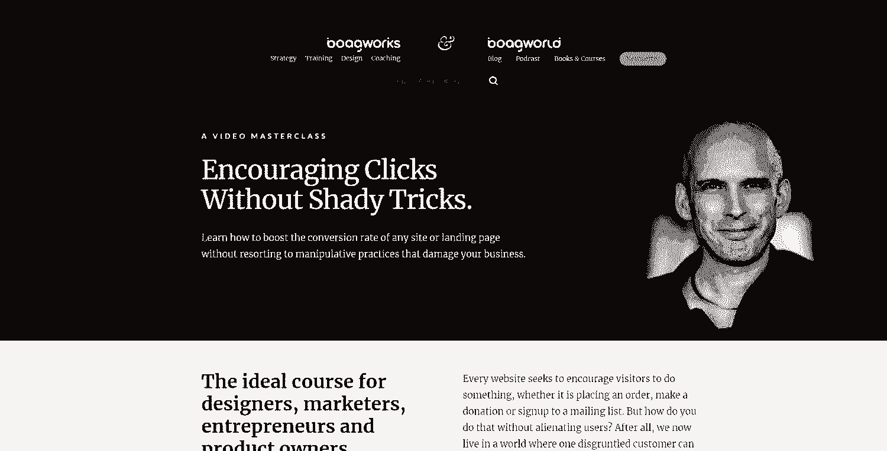

Encouraging Clicks Masterclass

Paul Boag 是一位领先的教育家和作者，他从事[转换优化](https://kinsta.com/blog/conversion-rate-optimization-tips/)和 UX 设计领域的工作。他为 Smashing 杂志写了多本关于网页和 UX 设计的书，并且是许多领先的网页设计出版物的经常性专栏作家。

他的“[鼓励点击大师班](https://boagworld.com/masterclass/)”是一个辅助视频课程，你可以在整个课程中直接询问保罗本人。你将学习设计网站的基本知识，推动行动和转换，而不诉诸于阴暗的伎俩或[黑暗的模式](https://kinsta.com/blog/dark-patterns/)。

**主题:**

## 注册订阅时事通讯

### 想知道我们是怎么让流量增长超过 1000%的吗？

加入 20，000 多名获得我们每周时事通讯和内部消息的人的行列吧！

[Subscribe Now](#newsletter)

*   [转换优化基础](https://kinsta.com/blog/conversion-tracking/)
*   衡量正确的指标
*   基本的消费者心理学以及如何在设计选择中利用它
*   创造更好的行动号召
*   [A/B 测试](https://kinsta.com/blog/wordpress-ab-testing-tools/) &正在进行优化

**时长:** 4 小时 30 分钟的视频

**价格:** $267 一次性费用

**证书:**不适用

**优点:**

*   了解如何为您的客户创建能够提高转化率的设计。

**缺点:**

*   每年只开放几次。

### 在线大学网页设计课程和学位(MOOC)

通过像 Coursera 这样的大规模在线开放课程(MOOC)平台，一些大学免费在线提供完整的网页设计课程。

然而，并不是所有的课程都是一样的，所以我们只强调精华部分。

#### 11.Coursera:面向所有人的网页设计:网页开发和编码专业化基础

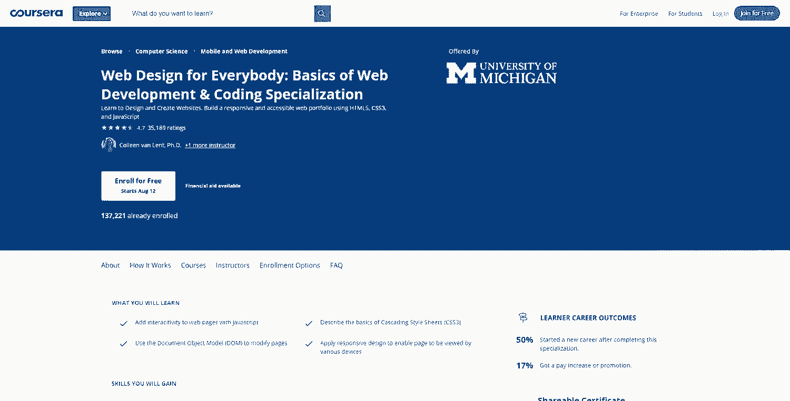

Coursera U-M web design course

密歇根大学为每个人设计的网页是 Coursera 上最受欢迎的开发课程之一。

它涵盖了 HTML、CSS 和 JS 的基础知识，以及响应式 web 设计和 web 可访问性。

如果你不需要或不想要认证或学分，你可以免费旁听课程。

**主题:**

*   Web 开发
*   级联样式表(CSS)基础知识
*   HTML5 基础
*   JavaScript 基础知识
*   响应式网页设计
*   网页可访问性
*   文档对象模型(DOM)
*   引导程序

**时长:** 70 学时学习(包括复习和实验)。

**价格:**免费旁听课程。

**证书:**获得证书需要 49 美元/月的会员资格。

**优点:**

*   非常适合作为一名网页设计师发展坚实的基础，超过 30 小时的 HTML，JS 和 CSS 基础知识的学习。
*   与其他渴望学习的人组成的蓬勃发展的在线社区互动。
*   完成复习、实验等，更好地内化你所学的一切。

**缺点:**

*   很少有人抱怨学习材料不合标准(错别字、测验中的错误等)。)

#### 12.EdX: W3CX 前端开发程序

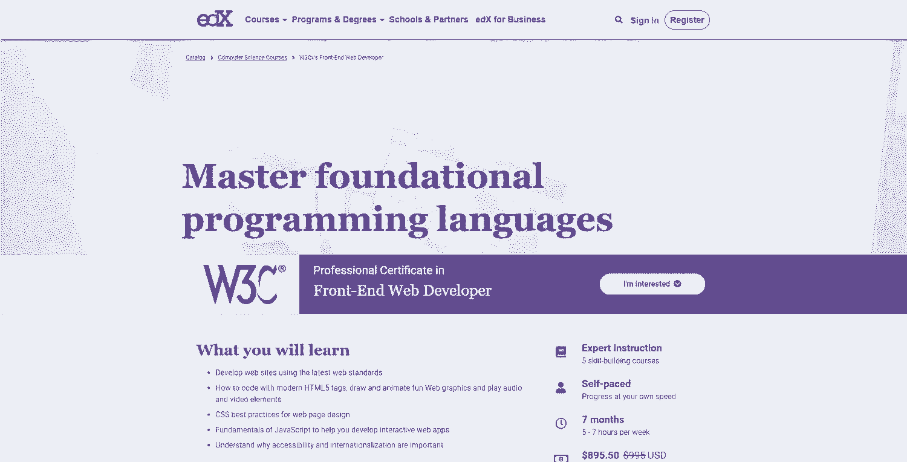

W3CX Frontend Web Developer program

edX 的 W3CX 前端开发程序非常适合那些想要在前端开发的所有核心语言中建立坚实基础的初学者。

**主题:**

*   HTML、CSS 和 JS 基础知识
*   高级响应设计、CSS 网格和 flexbox
*   航行
*   现代 HTML5 APIs，如定时文本跟踪和设备定位

**时长:** 140 学时的学习(包括复习和实验)。

**价格:**免费独立审核个别课程。

**证书:** $895.50 获得证书所需的一次性费用。

**优点:**

*   直接来自原始资料的非常深入的信息(W3C)。
*   讲师是在微软工作的高素质开发人员。
*   与活跃的[在线社区](https://kinsta.com/blog/wordpress-membership-theme/)互动，获得帮助并共同学习。

**缺点:**

*   课程的后半部分更侧重于 web 应用程序开发。

#### 13.Udacity:前端开发纳米学位

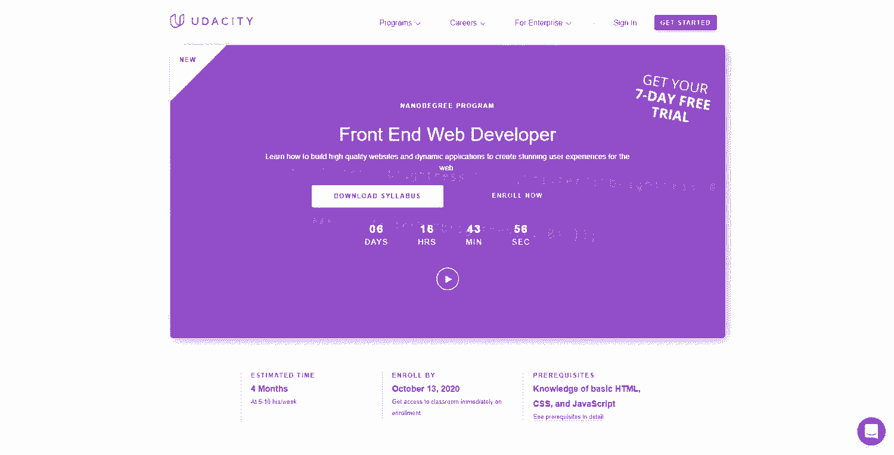

Frontend dev nanodegree

uda city frontend web development nano degree 将教你 HTML、CSS 和响应式 web 设计的基础知识，以及更多内容。

虽然从技术上讲，这不是一个大学课程，但 Udacity 纳米学位的结构、形式、教育深度和价格都符合标准的 MOOC 项目。

**主题:**

*   HTML、CSS 和 JS 基础知识
*   高级响应设计、CSS 网格和 flexbox
*   为营销内容创建动态登录页面
*   现代 web APIs
*   使用 Webpack 和其他工作流工具自动执行重复性任务

**时长:** 100+小时的学习(包括复习和实验)。

**价格:**4 个月的一次性费用为 1356 美元，或每月 399 美元

**证书:**可提供纳米学位价格。

**优点:**

*   包括专业的项目和任务评审和反馈。
*   与专门的技术导师互动。
*   在学位快结束时，从个人职业教练那里获得真正的一对一建议。

**缺点:**

*   免费学习仅限 7 天免费试用。

#### 14.未来学习:用户体验(UX)设计和研究

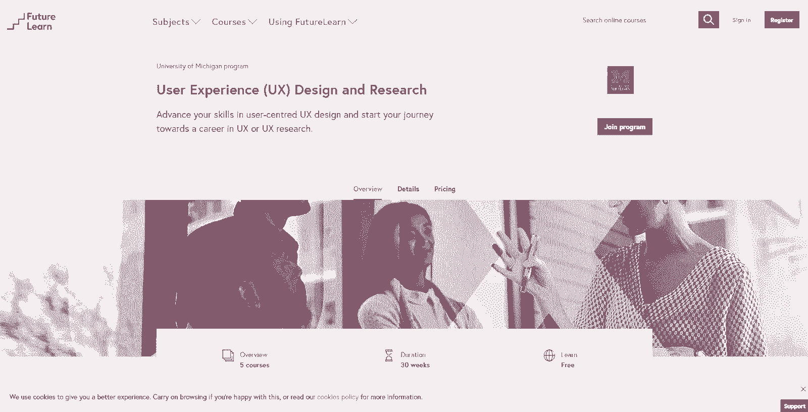

Future Learn – UX Design course

来自 Future Learn 和密歇根大学的[用户设计和研究](https://www.futurelearn.com/programs/ux-design-and-research)项目非常适合想要了解更多 UX 设计的有抱负的网页设计师。

需要为您的客户站点提供超快的、安全的、开发人员友好的托管服务吗？Kinsta 是为 WordPress 开发者设计的，提供了大量的工具和强大的仪表板。[查看我们的计划](https://kinsta.com/plans/?in-article-cta)

**主题:**

*   设计启发法
*   用户体验研究基础(UX 访谈、调查协议、数据提取)
*   亲和墙
*   设计流程和原型制作
*   实施数据驱动的 UX 设计

**时长:** 88 小时学习(包括复习和实验)。

**价格:**免费审核个别课程

**证书:** $345 一次性费用，可获得证书和每门课程的终身使用权。

**优点:**

*   这是一门很好的课程，有助于更好地理解用户如何与网站和应用程序交互。
*   可以使用技能提供更全面的服务，超越基本的网站设计。

**缺点:**

*   不是专门为网页设计量身定做的课程。

#### 15.OpenHPI:以人为中心的设计课程

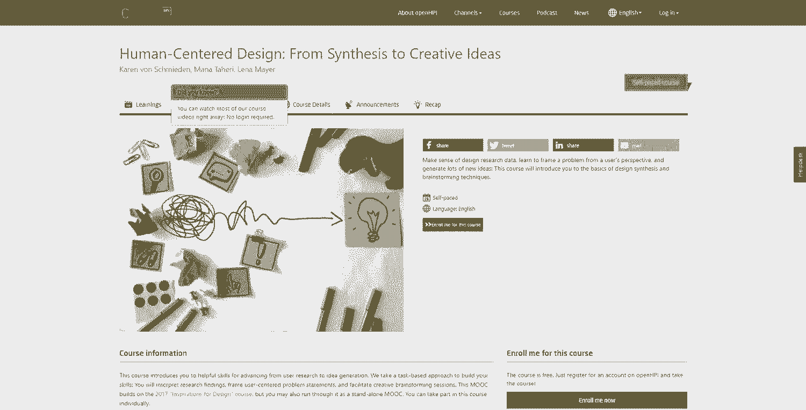

Human-centered design course

如果你想提高你的设计基础，这个以人为中心的设计课程是一个很好的起点。

它可以帮助你提高你的思维能力和研究技能，给你一个更强大的工具箱来作为一个网页设计师工作。

**主题:**

*   定义目标
*   思维能力
*   综合

**时长:** 10-11 小时的学习(包括复习和实验)。

**价格:**免费

**证书:**有基本的结业证书。

**优点:**

*   快速(在 10 小时内)建立你作为一名设计师的基本技能的伟大课程。
*   可以使用网页设计领域之外的概念。

**缺点:**

*   没有直接涉及网页设计。

### 互动网页设计课程

如果你想学习更多的前端开发和[动手编码](https://kinsta.com/blog/code-review-tools/)而不是图形设计元素，网上有很多交互式网页设计课程。

#### 16.免费:免费代码营

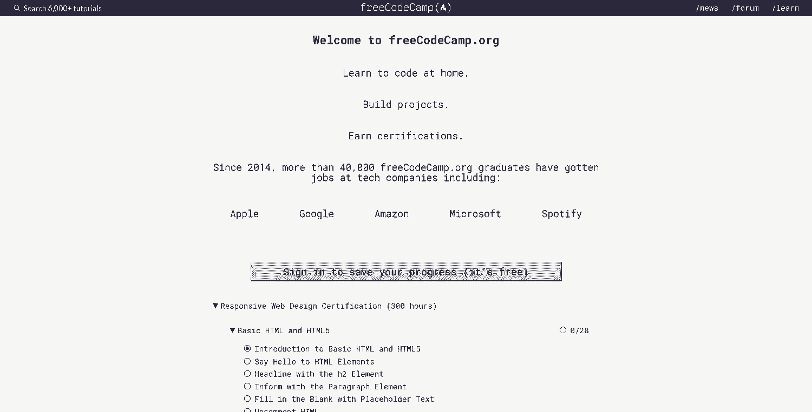

freeCodeCamp web design certification

免费代码营(freeCodeCamp)提供了一个庞大的响应式网站设计课程，免费学习时间超过 300 小时。

这个界面虽然有点单调，但是很直观，并且将学习代码的体验游戏化了。

要继续学习这门课程，你必须将每一条新信息付诸实践，这对记忆很有帮助。

**主题:**

*   HTML5 和 CSS3 基础
*   响应式设计
*   flex box(flex box)的缩写形式
*   网页可访问性
*   应用视觉设计

**时长:** 300+小时互动课。

**价格:**免费

**证书:**可用(免费)

**优点:**

*   伟大的基础信息。
*   按照自己的节奏学习。
*   通过立即使用你所学的每一段代码来更好地保留信息。

**缺点:**

*   学习界面并不是最吸引人的。

#### 17.免费:W3Schools

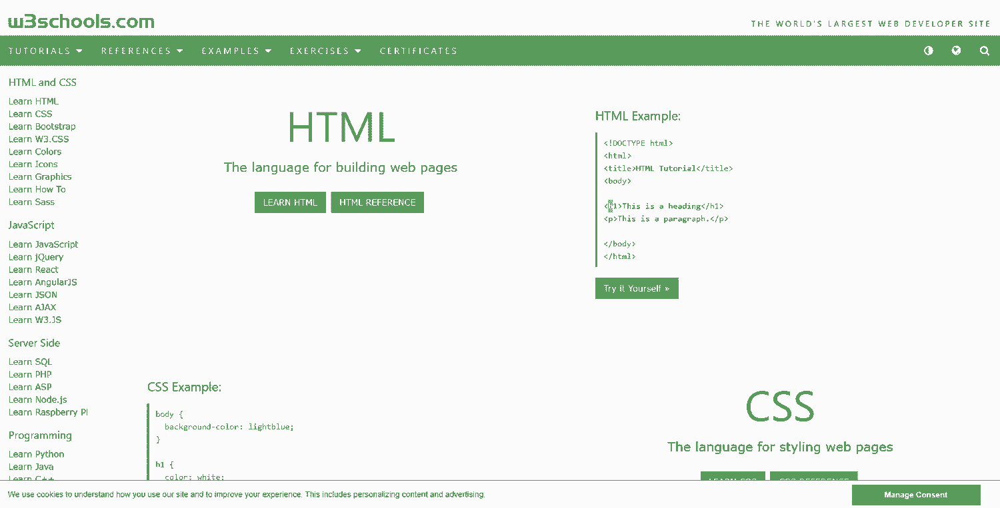

W3Schools homepage

W3Schools 是在线学习 web 开发的最大资源之一。

它有数百小时的教程和课程，内容涉及用于构建 web 的核心语言和框架。

界面可能有点笨拙，但大量高质量的免费课程弥补了这一点。你甚至不需要注册你的邮箱就可以开始了。

**主题:**

*   HTML5、JavaScript、CSS3 基础知识
*   画布和 SVG
*   引导程序
*   制图法
*   [颜色](https://kinsta.com/blog/website-color-schemes/)
*   核标准情报中心

**时长:**数百小时互动课。

**价格:**免费

**证书:**可用(每种语言 95 美元起)。

**优点:**

*   所有语言的重要基础信息。
*   在建立你的第一个网站时，通过浏览大量的目录边做边学。
*   不需要电子邮件注册。

**缺点:**

*   学习界面不如其他互动课程流畅。

#### 18.免费:Codecademy

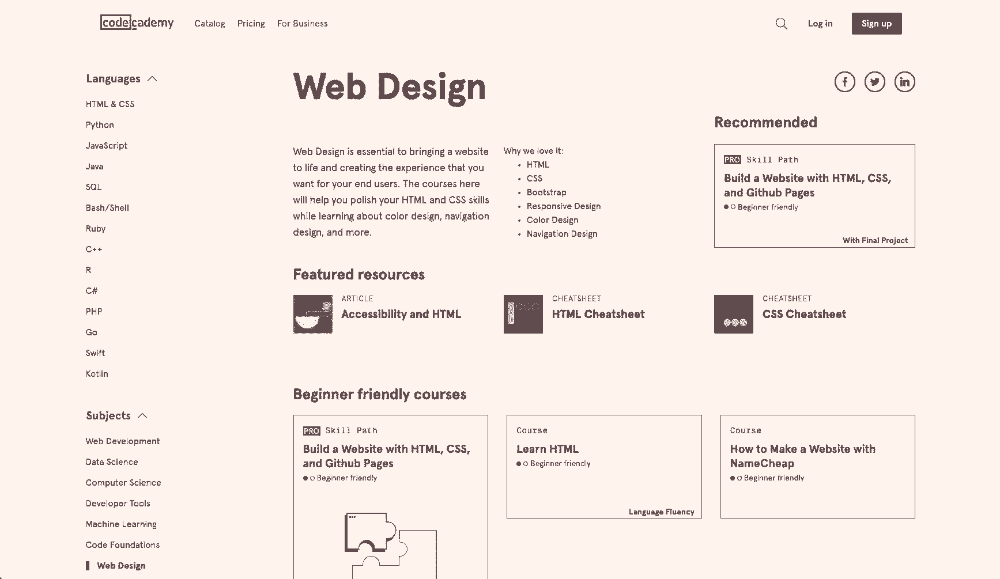

Codecademy

Codecademy 是一个面向程序员和网页设计师的交互式学习平台。它免费提供几门课程来帮助你入门。

它有一个令人敬畏的游戏化界面，使学习新代码变得轻而易举。

遗憾的是，免费计划中的内容相当有限，只专注于基本语言和创建一个简单的网站。

**主题:**

*   HTML5、JavaScript、CSS3 基础知识
*   如何创建你的第一个网站

**时长:** 10-20 小时互动课。

**价格:**基础课程免费(以下为付费版本)

**证书:**不可用

**优点:**

*   很棒的学习界面。
*   积极参与的学习社区。

**缺点:**

*   免费课程非常有限。

#### 19.付费版:Codecademy Pro

使用 Codecademy Pro，您可以获得免费计划中包含的平台和社区，以及对所有课程和 [web 开发路径](https://www.codecademy.com/learn/paths/web-development)的完全访问权。

你也可以走更短的技能路线，比如学习如何建立网站。

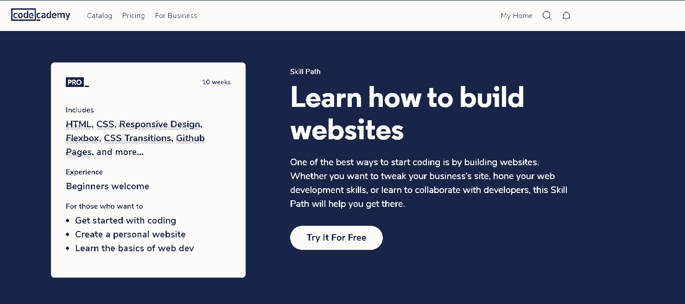

CA – Build websites path

使用专业版，您可以获得数百小时的互动课程，并在课程结束时获得证书。

**价格:**$ 39.99/月(19.99/月按年计费)。

#### 20.自由:大会破折号

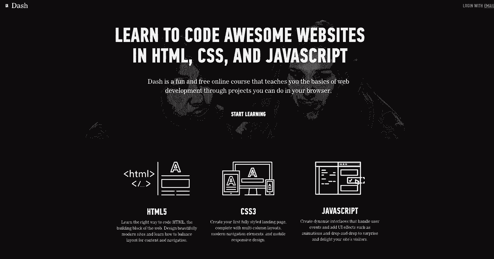

Dash by General Assembly

General Assembly 主要是一家面向设计师和程序员的校园或面对面训练营式教育公司。

但是他们的免费互动在线课程 Dash 是学习 HTML、CSS 和 JavaScript 基础知识的一个很好的方式，所有这些都是在你从零开始积极设计和创建自己的网站的时候。

**主题:**

*   HTML5、CSS3、JavaScript 基础知识
*   HTML 标签
*   媒体询问和响应设计
*   图像和媒体
*   jQuery
*   用 JS 创建一个基本的互动游戏

**时长:** 10 小时以上的互动课程

**价格:**免费

**证书:**不适用

**优点:**

*   关于前端开发语言的大量基础信息。
*   通过立即使用你学到的每一个概念和每一行代码，更好地保留信息。

**缺点:**

*   免费课程中包含的信息量有限(付费选项起价 3950 美元)。

## 网页设计商务课程与 WordPress 网页设计

WordPress 目前的市场份额是互联网上所有网站的+38%。因此，WordPress 网站和相关开发技能的市场几乎和一般的[前端开发者](https://kinsta.com/blog/frontend-developer/)一样大。

专攻 WordPress 可以帮助你迅速立足并建立你的作品集。但你不能只凭基本的网页设计技能就一头扎进去。

### 作为 WordPress 设计者/开发者的必要技能

首先，你需要编辑/创建 WordPress 主题的能力。这意味着你需要清楚地了解 WordPress 是如何工作的，以及 WordPress 开发基础:

*   **循环**(显示 WordPress 文章和页面内容的基本 PHP 函数)
*   古腾堡区块编辑器(以及区块如何在现场 WP 网站上显示)
*   **WordPress 模板层级**(你需要编辑哪些页面模板以及如何创建[子主题](https://kinsta.com/blog/wordpress-child-theme/)
*   **CSS 特异性**(如何正确地[调整和覆盖 CSS](https://kinsta.com/blog/wordpress-css/) )

您还需要:

*   精通 HTML 和 CSS 以及网页设计基础
*   对 [PHP](https://kinsta.com/blog/php-tutorials/) 的基本了解
*   能够与流行的[页面生成器](https://kinsta.com/blog/wordpress-page-builders/) (Elementor、Divi 等)一起工作。)
*   熟悉[流行主题](https://kinsta.com/best-wordpress-themes/)

为了帮助你发展这些技能，看看我们关于学习 WordPress online 的 [13 个地方的专门指南。](https://kinsta.com/blog/learn-wordpress/)

[Dozens of learning platforms. Hundreds of blogs. Thousands of YouTube videos. How do you find the best web design courses in a crowded field? 🤯 Click to see the best options and get ready for a new career ✨Click to Tweet](https://twitter.com/intent/tweet?url=https%3A%2F%2Fkinsta.com%2Fblog%2Fweb-design-courses%2F&via=kinsta&text=Dozens+of+learning+platforms.+Hundreds+of+blogs.+Thousands+of+YouTube+videos.+How+do+you+find+the+best+web+design+courses+in+a+crowded+field%3F+%F0%9F%A4%AF++Click+to+see+the+best+options+and+get+ready+for+a+new+career+%E2%9C%A8&hashtags=WebDesign%2CWebDesigner)

## 摘要

从 YouTube 到程序员的付费和免费学习平台，再到在线大学课程，每个人都有适合自己的东西。尽管不是普遍的，免费网页设计课程中的信息会比付费课程更过时。

这仅仅是因为来自会员或学生的钱为教育工作者提供了更新课程和视频的预算。

付费网页设计课程也经常给你机会与老师互动，而不仅仅是其他学生。

没有必要在你不熟悉的课程或老师身上浪费时间。选择适合你目前水平和目标的网页设计课程，并坚持下去。

作为一名网页设计师，训练和发展你的技能的完美工具就在那里。

现在轮到你了:你参加过提高网页设计技能的课程吗？你的体验如何？分享到评论里吧！

* * *

让你所有的[应用程序](https://kinsta.com/application-hosting/)、[数据库](https://kinsta.com/database-hosting/)和 [WordPress 网站](https://kinsta.com/wordpress-hosting/)在线并在一个屋檐下。我们功能丰富的高性能云平台包括:

*   在 MyKinsta 仪表盘中轻松设置和管理
*   24/7 专家支持
*   最好的谷歌云平台硬件和网络，由 Kubernetes 提供最大的可扩展性
*   面向速度和安全性的企业级 Cloudflare 集成
*   全球受众覆盖全球多达 35 个数据中心和 275 多个 pop

在第一个月使用托管的[应用程序或托管](https://kinsta.com/application-hosting/)的[数据库，您可以享受 20 美元的优惠，亲自测试一下。探索我们的](https://kinsta.com/database-hosting/)[计划](https://kinsta.com/plans/)或[与销售人员交谈](https://kinsta.com/contact-us/)以找到最适合您的方式。