# WordPress 5.4 简介(模块、特性、新 API)

> 原文：<https://kinsta.com/blog/wordpress-5-4/>

WordPress 5.4“Adderley”于 2020 年 3 月 31 日发布，并提供下载。

所以是时候让我们深入了解 WordPress 5.4 带来的最有趣的新特性和变化了。

首先也是最重要的，WordPress 5.4 为 block editor 带来了许多功能、改进和 bug 修复，相当多版本的[古腾堡插件](https://kinsta.com/blog/disable-gutenberg-wordpress-editor/)合并到了核心中。这些变化影响了功能和用户界面，总体上改善了编辑器的可访问性/可用性和编辑体验。

除了编辑器之外，WordPress 5.4 在[站点健康工具](https://kinsta.com/blog/wordpress-5-2/#site-health-check)和 [REST API](https://kinsta.com/blog/wordpress-rest-api/) 中引入了有趣的改进，而 WordPress 5.4 预期的几个功能已经被推迟，应该会捆绑到下一个发布的 [WordPress 5.5](https://kinsta.com/blog/wordpress-5-5/) 的核心中(参见[图片上的本地惰性加载](https://kinsta.com/blog/wordpress-5-5/#native-image-lazyloading-in-wordpress-core)和[导航块](https://kinsta.com/blog/wordpress-5-5/#whats-new-with-the-block-editor))。

你可能想要保存以下日期和来自 [WordPress 5.4 开发周期](https://make.wordpress.org/core/5-4/)的链接:

*   2020 年 2 月 11 日: [Beta 1](https://wordpress.org/news/2020/02/wordpress-5-4-beta-1/)
*   2020 年 2 月 18 日: [Beta 2](https://wordpress.org/news/2020/02/wordpress-5-4-beta-2/)
*   2020 年 2 月 25 日: [Beta 3](https://wordpress.org/news/2020/02/wordpress-5-4-beta-3/)
*   2020 年 3 月 3 日: [RC 1](https://wordpress.org/news/2020/03/wordpress-5-4-release-candidate/)
*   2020 年 3 月 10 日: [RC 2](https://wordpress.org/news/2020/03/wordpress-5-4-rc2/)
*   2020 年 3 月 17 日: [RC 3](https://wordpress.org/news/2020/03/wordpress-5-4-rc3/)
*   2020 年 3 月 24 日: [RC 4](https://wordpress.org/news/2020/03/wordpress-5-4-rc4/)
*   2020 年 3 月 27 日: [RC 5](https://wordpress.org/news/2020/03/wordpress-5-4-rc5/)
*   2020 年 3 月 30 日:WordPress 5.4 发布的试运行
*   2020 年 3 月 31 日:发布 WordPress 5.4[“Adderley”](https://wordpress.org/news/2020/03/adderley/)

那么，WordPress 5.4 在 WordPress 中有什么新的功能呢？

## 块编辑器的新特性

相当数量的[古腾堡](https://kinsta.com/?s=gutenberg)插件版本已经被合并到核心中，从 6.6 到 7.5。因此，如果你没有使用 Gutenberg 插件，当升级到 WordPress 5.4 时，你会在 block editor 中发现大量的新特性、增强功能和错误修复。


但是编辑器中不仅仅有块和特性，还有报告的整体性能改进:

> 自 WordPress 5.3 以来，block editor 团队已经实现了 14%的加载时间减少和 51%的打字时间减少，特别是对于相当大的帖子(大约 36，000 个单词，大约 1，000 个块)。

这是一个很棒的东西，所以让我们开始吧。

*   [新的块编辑器特性和增强功能](#block-editor-features-enhancements)
*   [主题和区块开发者的区块编辑器变化](#block-editor-changes-for-developers)
*   [附加功能](#additional-features)

[What's new in WordPress 5.4? Get an in-depth view of all the new interesting features and changes coming with this latest release! 💪🚀Click to Tweet](https://twitter.com/intent/tweet?url=https%3A%2F%2Fkinsta.com%2Fblog%2Fwordpress-5-4%2F&via=kinsta&text=What%27s+new+in+WordPress+5.4%3F+Get+an+in-depth+view+of+all+the+new+interesting+features+and+changes+coming+with+this+latest+release%21+%F0%9F%92%AA%F0%9F%9A%80&hashtags=wordpress%2Ccms)

### 新的块编辑器功能和增强功能

我们可能同意 block 编辑器仍在开发中的事实，但是 WordPress 5.4 带来了大量的改变，提高了编辑器在桌面和移动上的可用性。

其中一些变化与界面密切相关，包括默认启用的全屏模式、改进的块选择、编辑模式和选择模式之间的轻松切换、固定的移动工具栏和块导航的面包屑。两个新块和附加选项设置为编辑器增加了更多功能。

以下是我们最喜欢的 WordPress 5.4 的功能和改进的快速列表:

*   [新社交图标屏蔽](#new-social-icons-block)
*   [新按钮块](#new-buttons-block)
*   [一个欢迎引导模式](#welcome-guide-modal)
*   [默认启用全屏模式](#fullscreen-mode)
*   [rich Text 块中的内联文本颜色支持](#text-color)
*   [多个区块的附加颜色选项](#color-options)
*   [最新帖子区的特色图片](#featured-images)
*   [用于块导航的新面包屑栏](#improved-navigation)

#### 新社交图标阻止

最初被称为社交链接的**社交图标模块**允许作者快速添加链接到[社交档案](https://kinsta.com/blog/social-media-image-sizes/)的图标，并提供大量社交图标子模块供选择。这个模块已经试验了一段时间，自从[古腾堡 7.5](https://make.wordpress.org/core/2020/02/12/whats-new-in-gutenberg-12-february/) 以来一直是稳定的。

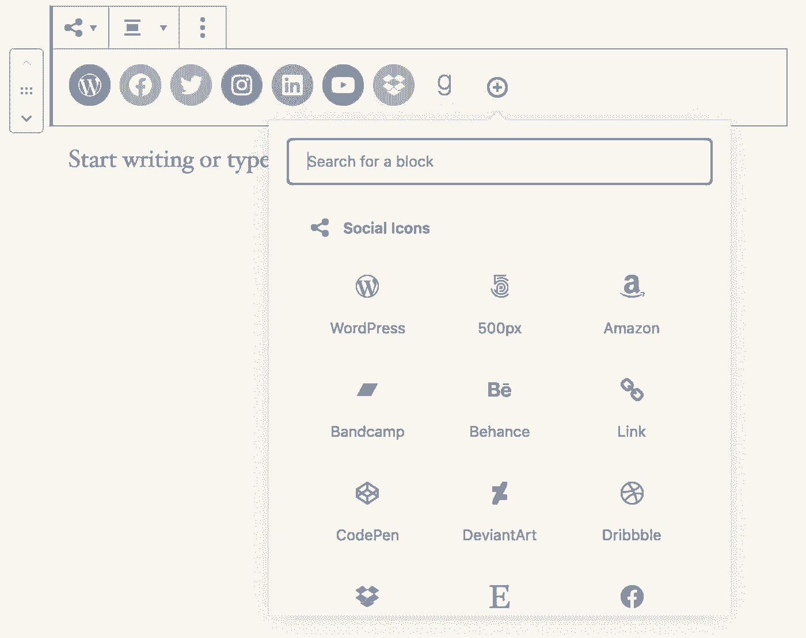

The Social Icons block


社交图标块提供了三种预定义的样式供您进行视觉定制:**默认**、【仅 T2】徽标、和**药丸形状**。

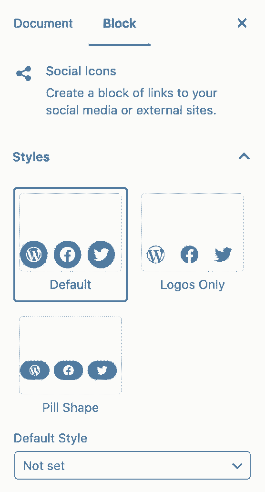

Social Icons styles


自从 Gutenberg 6.5 中首次引入社交图标作为实验性功能(并合并到 [WordPress 5.3](https://kinsta.com/blog/wordpress-5-3/) )以来，社交图标已经被添加到 Gutenberg 7.5 中，如果您运行的是过时版本的 Gutenberg 插件，它们可能不会像预期的那样工作。

[根据若热·科斯塔](https://make.wordpress.org/core/2020/02/27/new-or-updated-blocks-in-wordpress-5-4/)的说法，有两种方法可以防止社交偶像的问题:

*   **手动迁移任何带有社交图标的内容**:更新到 WordPress 5.4，在区块编辑器中加载帖子并保存。社交图标将自动迁移到新版本。
*   更新到 WordPress 5.4 时保持 Gutenberg 插件的安装状态:该插件提供了向后兼容性，你不会遇到任何问题。

#### 新按钮块

添加到 Gutenberg 7.2 的块编辑器中，**按钮块** [取代了单个按钮块](https://github.com/wordpress/gutenberg/pull/17352#issuecomment-534062973)，允许 WordPress 用户在同一个块容器中添加更多的按钮到他们的内容中。


The new Buttons block


单个按钮有两种预设样式可供选择，还有几个附加选项可以微调按钮的外观。

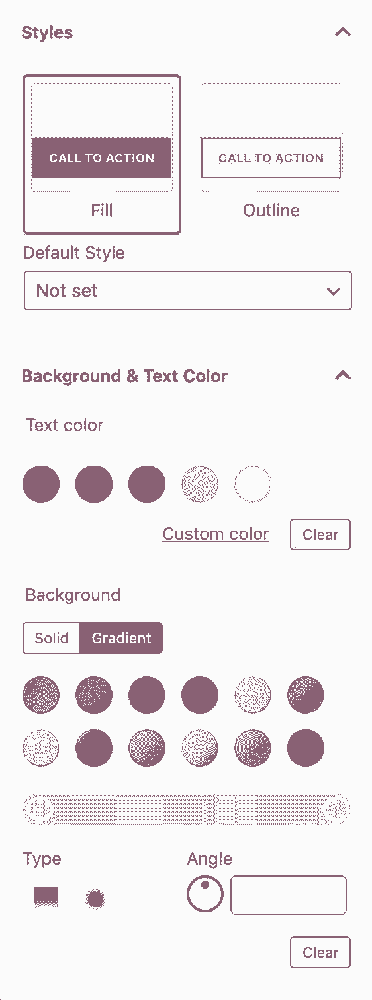

Button settings in WordPress 5.4


在 WordPress 5.4 中，由于添加了[渐变背景](https://github.com/WordPress/gutenberg/pull/17169)，网站所有者可以更好地控制他们的行动号召的外观和感觉，这也为网站管理员提供了一些渐变预设，作为进一步定制的起点。

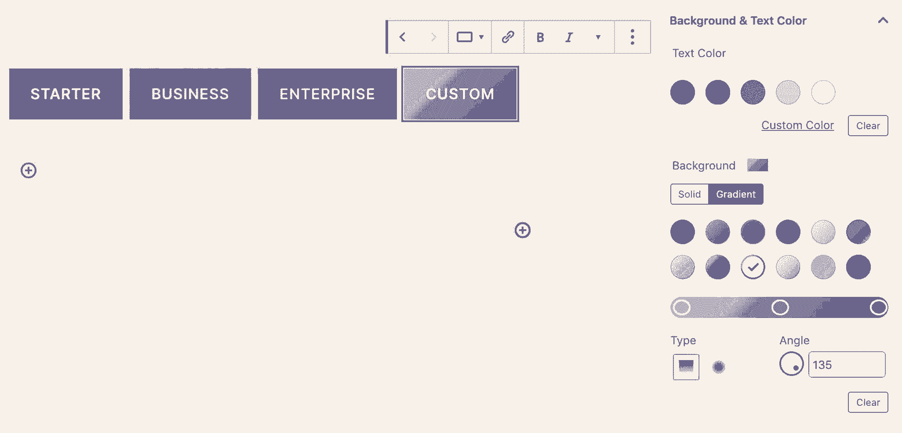

Revamped color features for buttons


#### 一个受欢迎的向导模型

WordPress 5.4 增加了一个全新的欢迎幻灯片，提供关于块编辑器的基本信息和一个链接到[在线文档](https://wordpress.org/support/article/wordpress-editor/)(增加了[古腾堡 7.1](https://make.wordpress.org/core/2019/12/11/whats-new-in-gutenberg-11-december/) )。

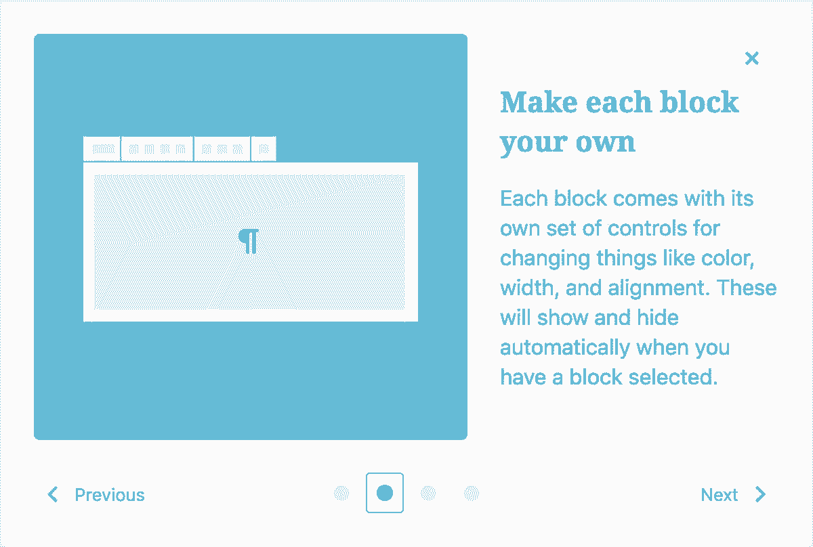

Welcome Guide Modal


模态只有在更新到 5.4 之后才可见。如果你想再次触发它，只需从右上角按钮打开**更多工具&选项**菜单，找到**欢迎指南**链接。

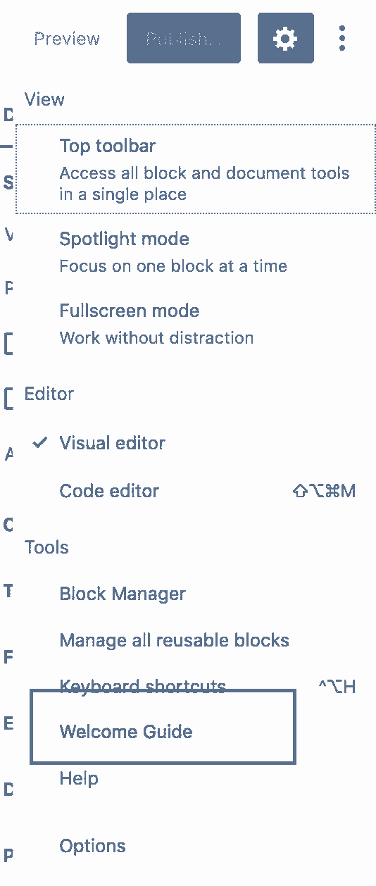

Welcome guide


#### 默认情况下启用全屏模式

从 WordPress 5.4 开始，在新的安装和设备中，编辑器默认以[全屏模式打开](https://make.wordpress.org/core/2020/03/03/fullscreen-mode-enabled-by-default-in-the-editor/)。点击**更多工具&选项**菜单，可以切换**全屏模式**的开/关，如下图所示。

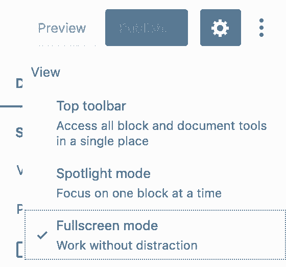

Fullscreen mode is enabled by default in WordPress 5.4


目前，此首选项存储在本地，这意味着它将在首选项更改时被覆盖，因为它发生在您以匿名模式访问您的网站时。将来，这个首选项应该存储在数据库中，使用户的选择在任何上下文中都是持久的。

注意[默认情况下让编辑器处于全屏模式的决定](https://make.wordpress.org/core/2020/03/03/fullscreen-mode-enabled-by-default-in-the-editor/#comment-38054)并没有被一致认可，因为它被认为可能会让初学者和非高级用户感到困惑。如果你想更多地了解人们对全屏模式的关注，请查看[这篇文章](https://make.wordpress.org/accessibility/2020/03/24/wordpress-accessibility-team-position-on-default-full-screen-mode-in-the-editor/)。

块编辑器开发人员可以用几行 JavaScript 以编程方式控制全屏模式:

```
const isFullscreenMode = wp.data.select( 'core/edit-post' ).isFeatureActive( 'fullscreenMode' );

if ( isFullscreenMode ) {
	wp.data.dispatch( 'core/edit-post' ).toggleFeature( 'fullscreenMode' );
}
```

#### RichText 块中的内联文本颜色支持

如果你平时写[长篇文章](https://kinsta.com/blog/long-form-articles/)，应该会很欣赏内联文本颜色支持。在这次更新之前，我们被迫以 HTML 模式硬编码富文本块，以改变单个单词和字符串的颜色。

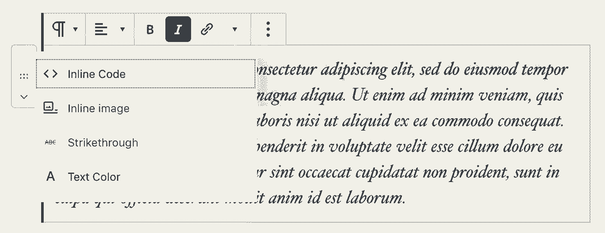

RichText Color option


从 WordPress 5.4 开始，我们可以在 RichText 块中选择单词和子字符串，并使用内置的颜色选择器快速改变它们的颜色。

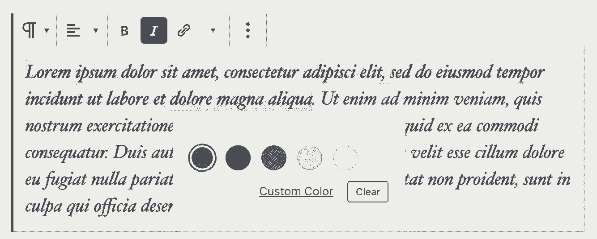

RichText color picker


#### 多种颜色可供选择

WordPress 5.4 在块编辑器中增加了一长串与颜色相关的特性和增强功能。如上所述，我们不再局限于纯色。一些区块现在支持渐变背景和预定义的渐变集。

以下是一些与颜色相关的增强功能的快速列表:

*   按钮块的渐变背景支持([古腾堡 6.7](https://make.wordpress.org/core/2019/10/16/whats-new-in-gutenberg-16-october/) )。
*   覆盖块的渐变背景支持([古腾堡 6.8](https://make.wordpress.org/core/2019/10/30/whats-new-in-gutenberg-30-october/) )。
*   组块的文本颜色支持(古腾堡 [7.4](https://make.wordpress.org/core/2020/02/05/whats-new-in-gutenberg-5-february/) 和 [7.5](https://make.wordpress.org/core/2020/02/12/whats-new-in-gutenberg-12-february/) ):嵌套块现在可以从其父组块继承文本颜色。
*   对列块的文本和背景颜色支持(古腾堡 [7.4](https://make.wordpress.org/core/2020/02/05/whats-new-in-gutenberg-5-february/) 和 [7.5](https://make.wordpress.org/core/2020/02/12/whats-new-in-gutenberg-12-february/) )。

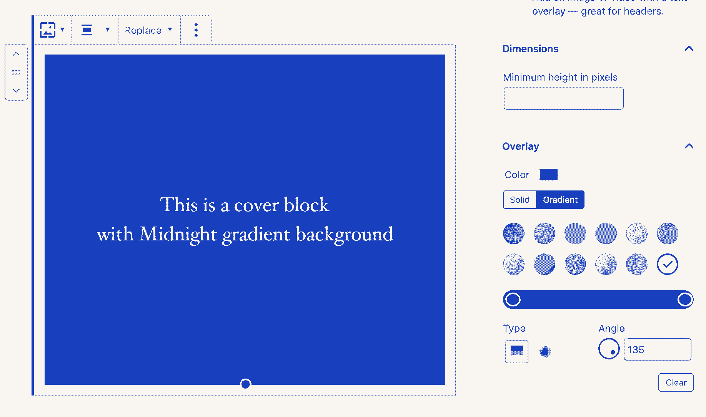

Cover block with preset gradient background


#### 最新帖子板块中的特色图片

块编辑器的另一个引人注目的增加是对最新帖子块中特色图片的支持([古腾堡 7.5](https://make.wordpress.org/core/2020/02/12/whats-new-in-gutenberg-12-february/) )。

这只是随着时间的推移添加到最新帖子块的几个改进中的最新一个，[标志着向“更复杂的动态或全局块”又迈进了一步](https://kinsta.com/blog/wordpress-5-3/#9-improvements-in-latest-posts-block)。

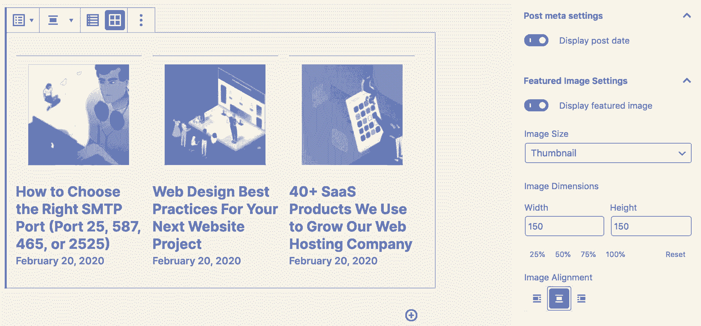

Latest Posts block


在 WordPress 5.4 中，最新的帖子块允许你从特定的类别中提取帖子，但不允许你通过类别/标签/帖子类型和/或包含/排除单个帖子来构建更高级的查询。

我们希望在未来看到这个模块的进一步改进。

#### 用于块导航的新面包屑栏

从 6.7 版本开始，Gutenberg 用户可以使用这个新的面包屑栏，现在已经合并到核心中，目的是简化嵌套块导航。

下图显示了几个嵌套块和底部新的[面包屑](https://kinsta.com/blog/wordpress-breadcrumbs/)菜单。

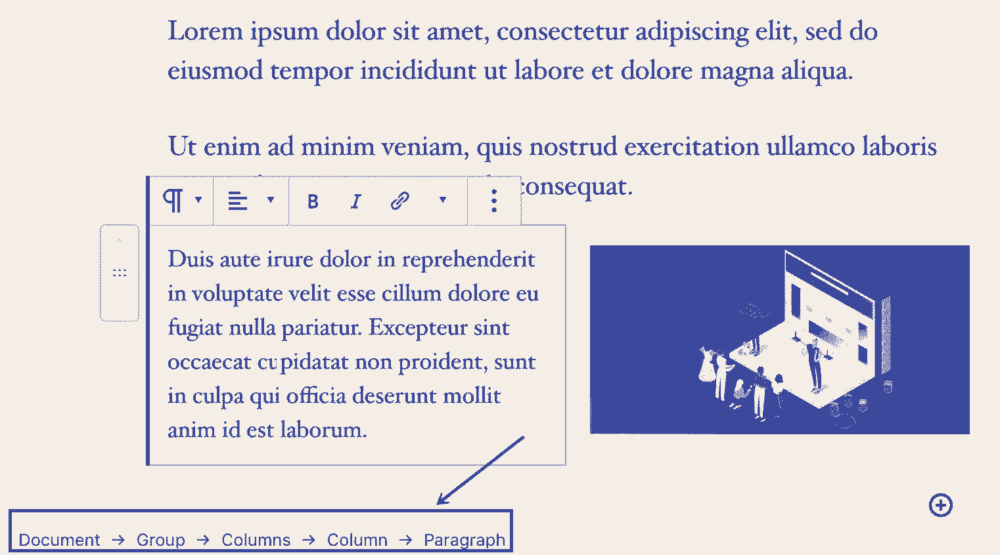

The new breadcrumb menu


### 主题和块开发人员的块编辑器更改

主题和块开发者应该注意到 WordPress 5.4 给块编辑器带来的许多变化。这些变化包括:

*   [块编辑器键盘快捷键](#keyboard-shortcuts)
*   [渐变主题 API](#gradient-api)
*   [块编辑器上的标记和样式变化](#markup-and-style)
*   [块状脚手架](#block-scaffolding)
*   [阻止集合](#block-collections)
*   [块变化](#block-variations)

#### 块编辑器键盘快捷键

块开发人员和高级用户现在可以向块编辑器添加自定义快捷方式。

一个名为`@wordpress/keyboard-shortcuts` [的新包已经被引入](https://make.wordpress.org/core/2020/02/19/block-editor-keyboard-shortcuts-in-wordpress-5-4/)来集中注册、移除和记录编辑器快捷方式。

[开发者](https://kinsta.com/blog/hire-wordpress-developer/)可以通过这样调用`registerShortcut`动作来添加他们的自定义快捷键:

```
wp.data.dispatch( 'core/keyboard-shortcuts' ).registerShortcut( {

	// Shortcut identifier
	name: 'plugin/shortcut-test',

	// Shortcut category (possible values global, block, selection)
	category: 'global',

	// Shortcut description
	description: 'My first shortcut',

	// The key combination that triggers the shortcut
	keyCombination: {

		// Available modifiers:
		// primary, primaryShift, primaryAlt,
		// secondary, access, ctrl, alt,
		// ctrlShift, shift, shiftAlt
		modifier: 'alt',
		character: 'w',
	},

	// An alias for the key combination
	aliases: [
		{
			modifier: 'primary',
			character: 'q',
		},
	],
} );
```

这将自动将自定义快捷方式添加到编辑器右上角的**更多工具&选项**按钮下的快捷方式模式中。

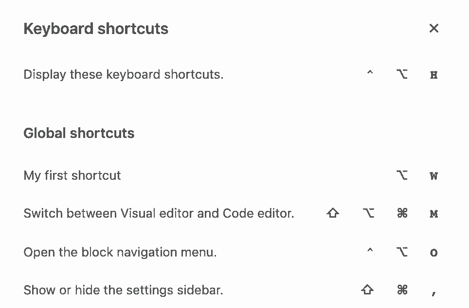

A custom global block editor shortcut has been added


然后，我们可以使用`useShortcut`函数附加一个[键盘快捷键](https://kinsta.com/blog/wordpress-keyboard-shortcuts/)处理程序:

```
import { useShortcut } from '@wordpress/keyboard-shortcuts';
import { useCallback } from '@wordpress/element';

const MyComponent = () => {
	useShortcut(

		'plugin/shortcut-test',

		useCallback(
			( event ) => {
				// Do something
			},
			[]
		)
	);
}
```

你可以在 [Make WordPress 核心博客](https://make.wordpress.org/core/2020/02/19/block-editor-keyboard-shortcuts-in-wordpress-5-4/)上阅读更多关于键盘快捷键的内容。

#### 渐变主题 API

WordPress 5.4 引入了渐变背景，为按钮和封面块提供了一些预置。这要归功于新的[渐变主题 API](https://make.wordpress.org/core/2020/03/02/new-gradient-theme-apis/)。

新的 API 提供了`editor-gradient-presets`主题支持选项，允许主题开发者[覆盖默认预设并定义他们自己的](https://developer.wordpress.org/block-editor/developers/themes/theme-support/#block-gradient-presets):

```
add_theme_support(
	'editor-gradient-presets',
	array(
		array(
			'name'		=> __( 'CadetBlue to Chartreuse', 'themeLangDomain' ),
			'gradient'	=> 'linear-gradient(135deg,rgba(95,158,160,1) 0%,rgb(127,255,0) 100%)',
			'slug'		=> 'cedetblue-chartreuse'
		),
		array(
			'name'		=> __( 'Chocolate to Coral', 'themeLangDomain' ),
			'gradient'	=> 'linear-gradient(135deg,rgba(210,105,30,1) 0%,rgba(255,127,80,1) 100%)',
			'slug'		=>  'chocolate-to-coral',
		),
		array(
			'name'		=> __( 'DarkMagenta to DarkOrchid', 'themeLangDomain' ),
			'gradient'	=> 'linear-gradient(135deg,rgb(139,0,139) 0%,rgb(153,50,204) 100%)',
			'slug'		=> 'darkmagenta-to-darkorchid',
		),
		array(
			'name'		=> __( 'DeepSkyBlue to DodgerBlue', 'themeLangDomain' ),
			'gradient'	=> 'linear-gradient(135deg,rgba(0,191,255,1) 0%,rgba(30,144,255,1) 100%)',
			'slug'		=> 'deepskyblue-to-dodgerblue',
		),
	)
);
```

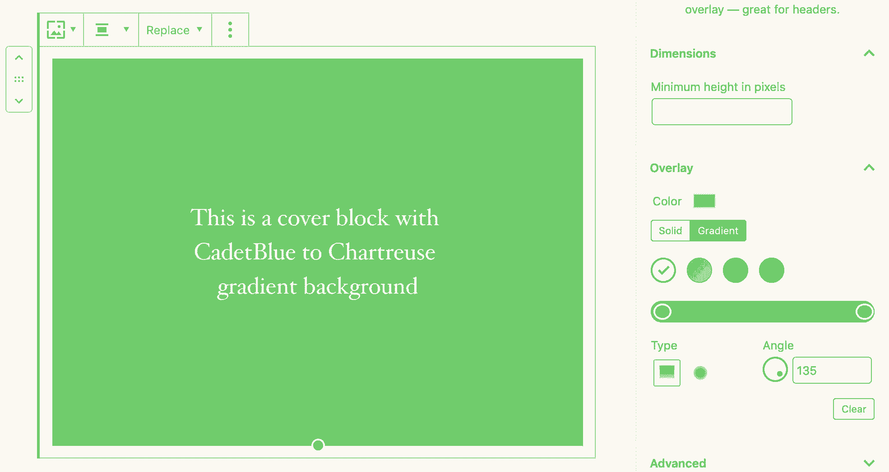

Custom gradient presets in WordPress 5.4


*   `name`:提供渐变信息的工具提示的有意义标签。这对于屏幕阅读器和区分某些颜色有困难的用户特别有用。
*   `gradient`:渐变的 CSS 值。
*   `slug`:生成在块编辑器中使用的 [CSS 类](https://kinsta.com/blog/wordpress-css/)的标识符。

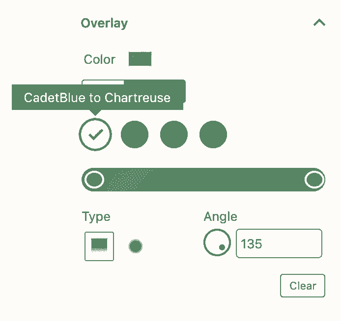

Custom gradient presets


您可以使用`disable-custom-gradients`主题支持选项禁用自定义渐变:

```
add_theme_support( 'disable-custom-gradients' );
```

使用`disable-custom-gradients`和`editor-gradient-presets`可以完全移除渐变功能:

```
add_theme_support( 'disable-custom-gradients' );
add_theme_support( 'editor-gradient-presets', array() );
```

#### 块编辑器中的标记和样式更改

WordPress 5.4 引入了几个主题开发者应该知道的 DOM 结构变化。

*   传统的`editor-`类前缀已经从块编辑器脚本中移除，现在开发者应该只使用`block-editor-`前缀。
*   `edit-post-layout__content`类已从块编辑器的 DOM 中移除。
*   从 RichText 和其他块中删除了几个多余的包装器。这一改变带来了显著的性能提升并简化了 DOM 树，这应该得到 block 和[主题开发者](https://kinsta.com/blog/wordpress-free-vs-paid-themes/)的赞赏。
*   块填充和负边距已经消失。块样式应该相应地更改。

关于 DOM 和 CSS 变化的详细视图，请参见 WordPress 5.4 中的[标记和样式相关的变化](https://make.wordpress.org/core/2020/03/02/markup-and-style-related-changes/)

## 注册订阅时事通讯


### 想知道我们是怎么让流量增长超过 1000%的吗？

加入 20，000 多名获得我们每周时事通讯和内部消息的人的行列吧！

[Subscribe Now](#newsletter)

#### 块状脚手架

有了新的@wordpress/create-block 块脚手架包，开发人员有了一种新的方法来为块编辑器插件生成目录结构。这种结构通常包括 index.js、index.js 和 style.css

块开发人员现在可以简单地运行以下命令:

```
$ npm init @wordpress/block block-name
```

#### 阻止收藏

[块集合](https://make.wordpress.org/core/2020/02/27/block-collections/)提供了一种在块编辑器插入器中对块集合进行可视化分组的方法。集合不同于类别，它提供了对块进行分组的另一种方式。

新的 API 提供了一个新功能:

```
registerBlockCollection( namespace, { title, icon } );
```

*   `namespace`:匹配块前缀。
*   `title`:这是插页器中显示的标签。
*   `icon`:这是块插入器中与标题一起显示的图标。

随着古腾堡 7.3 和 T2 的引入，新的 API 允许主题和块开发者更好地组织块，使用户更容易发现和添加块到内容中。

#### 阻止变化

[块变化 API](https://make.wordpress.org/core/2020/02/27/introduce-block-variations-api/) 提供了一组功能，允许块开发者添加/管理/删除块的变化，用户在向内容添加块时可以从中选择。注册新的变体非常简单(JS 代码):

```
wp.blocks.registerBlockVariation( 'core/heading', { 
	name: 'green-text', 
	title: 'Green Text', 
	description: 'This block has green text. It overrides the default description.',  
	attributes: { 
		content: 'Green Text', 
		textColor: 'vivid-green-cyan' 
	}, 
	icon: 'palmtree', 
	scope: [ 'inserter' ] 
} );
```

*   `blockName`:块的名称(即`core/heading`)。
*   `variation`:描述块类型变化的对象。

*   `name` : ( *字符串*)变更的唯一标识符。
*   `title` : ( *字符串*)人类可读的变奏标题。
*   `description` : ( *字符串*)详细描述。
*   `: ( *WPIcon* )显示在块插入器中的图标。`
`*   `[isDefault]` : ( *布尔*)当前变化是否为默认变化。默认为`false`。*   `[attributes]` : ( *对象*)覆盖块属性的值。*   `[innerBlocks]` : ( *数组[]* )嵌套块的初始配置。*   `[example]` : ( *对象*)用于块预览的结构化数据。设置为`undefined`禁用预览。*   `[scope]`:(*WPBlockVariationScope[]*)变更适用的范围列表。如果未提供，则假定所有可用的范围。可用选项:`block`、`inserter`。`

 `

Heading block variations


有关块变化 API 的详细视图，请参见 [PR #20068](https://github.com/WordPress/gutenberg/pull/20068) 。

### WordPress 5.4 附带的附加块编辑器特性

WordPress 5.4 的核心功能还包括:

*   在编辑和导航模式之间直观切换的菜单( [7.1](https://make.wordpress.org/core/2019/12/11/whats-new-in-gutenberg-11-december/) )


Switch between Edit Select mode


*   向表格块添加标题( [7.1](https://make.wordpress.org/core/2019/12/11/whats-new-in-gutenberg-11-december/) )


A table with a caption in WordPress 5.4


*   将图像拖放到特色图像框中( [7.1](https://make.wordpress.org/core/2019/12/11/whats-new-in-gutenberg-11-december/) )


Drag and Drop featured image


*   移动固定块工具栏( [7.1](https://make.wordpress.org/core/2019/12/11/whats-new-in-gutenberg-11-december/) )


Fixed block toolbar on mobile


*   将图像尺寸选择器添加到图库块( [7.2](https://make.wordpress.org/core/2020/01/09/whats-new-in-gutenberg-8-january/) )


Gallery block settings


*   添加了媒体和文本块中图像的链接( [7.2](https://make.wordpress.org/core/2020/01/09/whats-new-in-gutenberg-8-january/) )


Add links to images in Media & Text block


## 面向 WordPress 开发者的特性和改进

开发者应该会从 WordPress 5.4 的一些新功能中受益。

厌倦了 WordPress 的问题和缓慢的主机？我们提供世界一流的支持，由 WordPress 专家提供 24/7 服务和超快的服务器。[查看我们的计划](https://kinsta.com/plans/?in-article-cta)

我们最喜欢的变化包括:

*   [语义正确的日历部件和新的 CSS 类](#calendar-widget)
*   PHP 脚本中的短代码
*   [WordPress 5.4 中对 Favicon 处理的增强](#favicon)
*   [向菜单项添加自定义字段的新挂钩](#custom-fields-to-menu-items)
*   [针对开发人员的其他变更](#additional-changes-for-developers)

### 语义正确的日历小部件和新的 CSS 类

HTML 5.1 规范已经[改变了](https://make.wordpress.org/core/2020/02/12/changes-related-to-calendar-widget-markup-in-wordpress-5-4/) `tfoot`元素在表格中的使用方式。HTML 5.1 之前`tfoot`元素可以在`tbody`元素之前。新的规格改变了事情，现在`tfoot` **必须**跟随`tbody`。


Old calendar widget


WordPress 日历窗口小部件会相应地改变。从 WordPress 5.4 开始，导航链接移动到日历表外的`nav`元素。

考虑到`nav`是[任何竞赛中导航链接](https://html.spec.whatwg.org/multipage/sections.html#the-nav-element)最合适的 HTML 元素，并且还可以帮助提高屏幕阅读器的可访问性，这是[期待已久的变化](https://core.trac.wordpress.org/ticket/39763)。根据 [Mozilla 文档](https://developer.mozilla.org/en-US/docs/Web/HTML/Element/nav#Usage_notes):

> 一个文档可能有几个`<nav>`元素，例如，一个用于[站点导航](https://kinsta.com/blog/website-navigation/)，一个用于页面内导航。在这种情况下，可以使用 aria-labelledby 来提高可访问性…
> 
> 用户代理(如针对残疾用户的屏幕阅读器)可以使用此元素来确定是否忽略仅导航内容的初始呈现。

此外，为了更容易定位，在`get_calendar()`中引入了以下 [CSS 类](https://core.trac.wordpress.org/ticket/39763#comment:38):

*   `wp-calendar-table`为`table`元素。
*   `wp-calendar-nav`为`nav`元素。
*   `wp-calendar-nav-prev`为上个月的链接，替换`#prev` ID。
*   `wp-calendar-nav-next`为下个月的链接，替换`#next` ID。

下面的代码片段显示了新日历的 HTML 结构:

```
<div class="widget widget_calendar">
	<div class="widget-content">
		<div id="calendar_wrap" class="calendar_wrap">
			<table id="wp-calendar" class="wp-calendar-table">
				<caption>February 2020</caption>
				<thead>
					<tr><!-- Day names --></tr>
				</thead>
				<tbody>
					<!-- Calendar cells -->
				</tbody>
			</table>
			<nav aria-label="Previous and next months" class="wp-calendar-nav">
				<span class="wp-calendar-nav-prev"><a href="http://example.com/?m=201912">« Dec</a></span>
				<span class="pad"> </span>
				<span class="wp-calendar-nav-next"> </span>
			</nav>
		</div>
	</div>
</div>
```

主题开发者可能想相应地改变他们的样式表。


New calendar widget


### PHP 脚本中的短代码

[WordPress 5.4 引入了](https://make.wordpress.org/core/2020/02/13/wordpress-5-4-introduces-apply-shortcodes-as-an-alias-for-do-shortcode/)`apply_shortcodes()`函数作为`do_shortcode()`的别名，这允许我们[在 PHP 文件](https://developer.wordpress.org/reference/functions/do_shortcode/)中使用一个短代码。

从语义的角度来看，我们可能期望通过简单地调用函数本身来看到`do_*`函数的结果。但`do_shortcode`却不是这样。要打印指定短码的输出，`do_shortcode`必须被回显:

```
// Displays the result of the shortcode
echo do_shortcode( '[shortcode]' . $text . '[/shortcode]' );
```

WordPress 5.4 引入了`apply_shortcodes()`，稍微改变了一些事情，它的工作方式与`do_shortcode()`相同，但是允许开发者构建可读性更强、语义更正确的代码:

```
// Displays the result of the shortcode
echo apply_shortcodes( '[shortcode]' . $text . '[/shortcode]' );
```

从 WordPress 5.4 RC 5 开始，`do_shortcode()`不打算被弃用，因为它在第三方插件中被广泛使用。

### WordPress 5.4 中对 Favicon 处理的增强

有了 WordPress 5.4，主题开发者可以更加灵活地处理 [favicon](https://kinsta.com/knowledgebase/wordpress-favicon/) 请求，几个新的功能允许像管理 robots.txt 相关功能一样管理 favicon。[谢尔盖·比留科夫解释道:](https://core.trac.wordpress.org/ticket/47398#comment:10)

对`favicon.ico`的请求应该像我们用`do_robots()`处理`robots.txt`一样处理:

*   如果物理文件存在，什么都不做，让服务器处理请求。
*   否则，提供一个后退图标(见下文)。

因此，如果没有提供物理的`favicon.ico`文件，WordPress 是这样处理的:

*   如果定制器中设置了图标，它会将`/favicon.ico`重定向到那个特定的图标。
*   如果没有图标集，那么它使用 WordPress 标志(`wp-admimg/w-logo-blue.png`)作为后备选项。

一些新的函数和钩子补充了相应的`robots.txt`相关函数/钩子:

*   新的`is_favicon()`功能是对`is_robots()`的补充。
*   `do_favicon`动作是对 [`do_robots`](https://developer.wordpress.org/reference/hooks/do_robots/) 的补充，当模板加载器确定一个 favicon 请求时被触发。
*   `do_favicon()`功能钩在`do_favicon`动作上，[与`do_robots()`](https://developer.wordpress.org/reference/functions/do_robots/) 互补。
*   `do_faviconico` action 是对`do_robotstxt`的补充，允许开发者覆盖默认行为。

阅读更多关于[图标处理](https://make.wordpress.org/core/2020/02/19/enhancements-to-favicon-handling-in-wordpress-5-4/)的信息。

### 向菜单项添加自定义字段的新挂钩

有了 WordPress 5.4，开发者可以使用[两个新的动作钩子](https://kinsta.com/blog/wordpress-hooks/)来给菜单项添加自定义字段。

在将导航菜单项添加到管理菜单编辑器之前，`wp_nav_menu_item_custom_fields`被触发。请参见下面的示例:

```
function kinsta_add_menu_item_custom_field() {
	echo '<p class="menu-item-custom-field">Hey! This is an example for Kinsta blog readers!</p>';
}
add_action( 'wp_nav_menu_item_custom_fields', 'kinsta_add_menu_item_custom_field' );
```


Custom fields in nav menu items


新的操作挂钩支持五个参数，您可以使用它们来微调自定义字段行为:

*   `$item_id`:菜单项 ID(整数)。
*   `$item`:菜单项数据对象(object)。
*   `$depth`:菜单项的深度(整数)。
*   `$args`:菜单项参数的对象(object)。
*   `$id`:导航菜单 ID(整数)。

`wp_nav_menu_item_custom_fields_customize_template`的工作方式与`wp_nav_menu_item_custom_fields`相同，但是它是在定制器中导航菜单项的表单字段模板的末尾被触发的。下图显示了 WordPress 5.4 中的定制菜单部分。


Custom fields in nav menu items


### 针对开发人员的其他更改

WordPress 5.4 对开发者和高级用户的进一步改变包括:

*   更多关于导致登录失败的错误的[信息，这要感谢`wp_login_failed`动作现在支持的一个新的`$error`参数。](https://make.wordpress.org/core/2020/02/26/miscellaneous-developer-focused-changes-in-wordpress-5-4/)
*   [可定制的管理通知](https://make.wordpress.org/core/2020/02/26/miscellaneous-developer-focused-changes-in-wordpress-5-4/)在 [WordPress 多站点](https://kinsta.com/wordpress-multisite-hosting/)中，取决于站点 ID。
*   新的`_source_url` post meta 值现在允许[存储媒体文件](https://make.wordpress.org/core/2020/02/26/miscellaneous-developer-focused-changes-in-wordpress-5-4/)的原始 URL。
*   [管理栏现在在`wp_body_open`而不是`wp_footer`加载](https://make.wordpress.org/core/2020/02/26/miscellaneous-developer-focused-changes-in-wordpress-5-4/)。
*   REST API 中的几个[变化。](https://make.wordpress.org/core/2020/02/29/rest-api-changes-in-5-4/)

## 如何安装 WordPress 开发版本

如果你想确保你的主题和插件与 WordPress 5.4 完全兼容，或者你只是对最新 WordPress 版本的新功能感到好奇，你可以点击几下就安装当前的开发版本。

你有两种方法安装 WordPress Beta/RC 版本:

*   安装 [WordPress Beta Tester](https://wordpress.org/plugins/wordpress-beta-tester/) 插件，并在现有 WordPress 环境的仪表板中运行安装。
*   手动下载并安装当前的 Beta/RC。您可以获得“[夜间构建](https://wordpress.org/nightly-builds/wordpress-latest.zip)”，它是从 Subversion 存储库中创建的。如果你正在寻找一个特定的 [WordPress 版本](https://kinsta.com/knowledgebase/check-wordpress-version/)，无论是稳定版还是开发版，你都可以查看[发布类别档案](https://wordpress.org/news/category/releases/)。

如果你决定安装 Beta tester 插件，你需要首先设置一个常规的 WordPress 安装，要么在你的本地机器上，要么在你的[登台环境](https://kinsta.com/help/staging-environment/)中。

一旦你的 WordPress 网站建立并运行，浏览到**插件→添加新的**并搜索 [WordPress Beta Tester](https://wordpress.org/plugins/wordpress-beta-tester/) 插件。

该插件提供了一个快速简单的方法来测试 WordPress，允许点击一个按钮来安装和/或更新当前的测试版或候选版本。


Install the WordPress Beta Tester plugin


因此，[照常安装并激活插件](https://kinsta.com/knowledgebase/how-to-install-wordpress-plugins/)。

浏览到**工具→ Beta 测试**并检查**出血边缘夜线**选项并保存更改。

之后，导航至**仪表板→更新**屏幕，点击**立即更新**按钮。


WordPress Updates screen


WordPress 现在将下载并安装以下软件包:

```
https://wordpress.org/nightly-builds/wordpress-latest.zip
```

一旦安装完成，你将被重定向到临时的 WordPress 关于页面。


WordPress update progress


仅此而已。现在你可以在 WordPress Beta 和 RC 版本上运行你的测试了。

查看官方文档了解更多关于 [WordPress Beta 测试](https://make.wordpress.org/core/handbook/testing/beta/)的信息。


**开发版本并不意味着在生产中使用**。请随意将它们安装在您的临时环境中的[或本地机器](https://kinsta.com/help/staging-environment/)上的[，但是不要在您的现场使用它们。](https://kinsta.com/blog/install-wordpress-locally/)


## 摘要

随着十个版本的 Gutenberg 插件合并到核心中，WordPress 5.4 主要集中在块编辑器上。我们有两个新的模块，自定义快捷方式，改进的可用性和可访问性，我们可以期待[在不久的将来](https://make.wordpress.org/core/2019/12/06/update-9-projects-for-2019/)的进一步发展。

但是还有更多:

*   仪表板中添加了一个站点健康状态小部件，使用户更容易检查他们站点的健康状况、[安全性](https://kinsta.com/blog/wordpress-security/)和[性能](https://kinsta.com/blog/third-party-performance/)。
*   更好的焦点管理、更简单的键盘导航和更易读的隐私政策指南，提高了移动和桌面的可访问性。
*   隐私工具的几项[变更](https://make.wordpress.org/core/2020/03/02/privacy-updates-in-5-4/)简化了导出个人数据时的 UX。


The new Site Health Status widget


现在轮到你了。你对 WordPress 5.4 有什么看法？你最喜欢哪些变化和功能？请在评论中告诉我们！

* * *

让你所有的[应用程序](https://kinsta.com/application-hosting/)、[数据库](https://kinsta.com/database-hosting/)和 [WordPress 网站](https://kinsta.com/wordpress-hosting/)在线并在一个屋檐下。我们功能丰富的高性能云平台包括:

*   在 MyKinsta 仪表盘中轻松设置和管理
*   24/7 专家支持
*   最好的谷歌云平台硬件和网络，由 Kubernetes 提供最大的可扩展性
*   面向速度和安全性的企业级 Cloudflare 集成
*   全球受众覆盖全球多达 35 个数据中心和 275 多个 pop

在第一个月使用托管的[应用程序或托管](https://kinsta.com/application-hosting/)的[数据库，您可以享受 20 美元的优惠，亲自测试一下。探索我们的](https://kinsta.com/database-hosting/)[计划](https://kinsta.com/plans/)或[与销售人员交谈](https://kinsta.com/contact-us/)以找到最适合您的方式。`