# 如何在 WordPress 中编辑 CSS(编辑、添加和定制你的站点外观)

> 原文：<https://kinsta.com/blog/wordpress-css/>

想尝试编辑 WordPress CSS，但是不知道从哪里开始？使用 CSS 样式，您可以在全局范围内或特定页面上编辑站点的外观。添加颜色，分隔某些元素，设计布局，基本上改变你的 WordPress 主题的外观。

如果你想更熟悉 WordPress 的开发环境，或者只是更好地控制你网站的外观，你需要知道如何在 WordPress 中添加 CSS(以及如何改变已经存在的东西)。

通过编辑你的主题并加入你自己的 CSS，你将能够优化你网站上的每一个视觉元素。今天，我们将仔细看看它。

准备好开始了吗？我们开始吧！

### 更喜欢看[视频版](https://www.youtube.com/watch?v=1DUH_85wxVI)？

## 什么是 CSS 编辑？

CSS 代表层叠样式表，是除了 HTML 之外最流行的网络语言。这两者齐头并进，因为 [CSS 被用来设计 HTML 元素的样式](https://kinsta.com/knowledgebase/edit-wordpress-code/#css)。HTML 奠定了网站外观的基础，CSS 用于进一步设计风格。

> 需要在这里大声喊出来。Kinsta 太神奇了，我用它做我的个人网站。支持是迅速和杰出的，他们的服务器是 WordPress 最快的。
> 
> <footer class="wp-block-kinsta-client-quote__footer">
> 
> 
> 
> <cite class="wp-block-kinsta-client-quote__cite">Phillip Stemann</cite></footer>

[View plans](https://kinsta.com/plans/)

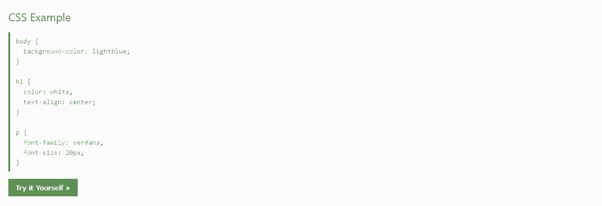

Example of CSS code (Source: w3schools.com)

CSS 让你能够[让网站响应](https://kinsta.com/blog/responsive-web-design/)，添加颜色、[、改变字体](https://kinsta.com/blog/how-to-change-font-in-wordpress/)，修改布局，以及总体上微调网站的视觉呈现。与 HTML 和 JavaScript 一样，CSS 是一种前端客户端语言，这意味着它在用户端执行，而不是在后端服务器上执行。

当开始 WordPress 开发时，HTML、CSS、JavaScript 和 [PHP](https://kinsta.com/blog/php-tutorials/) 是你需要了解的语言。这就是内置的核心 [CMS](https://kinsta.com/knowledgebase/content-management-system/) ，以及它的[很多主题](https://kinsta.com/best-wordpress-themes/)和[插件](https://kinsta.com/best-wordpress-plugins/)。

但是，即使你不是网页设计师或 T2 开发者，学习一点 CSS 也是很好的，因为你可以用它来移动或设计网站上的元素，或者对你的主题做一些小的美学改变来更好地适应你。

[Ready to give your #WordPress site a custom look & feel? 👀 Learn how to use CSS styling to edit colors 🎨, change the layout ✨ & moreClick to Tweet](https://twitter.com/intent/tweet?url=https%3A%2F%2Fkinsta.com%2Fblog%2Fwordpress-css%2F&via=kinsta&text=Ready+to+give+your+%23WordPress+site+a+custom+look+%26amp%3B+feel%3F+%F0%9F%91%80+Learn+how+to+use+CSS+styling+to+edit+colors+%F0%9F%8E%A8%2C+change+the+layout+%E2%9C%A8+%26amp%3B+more&hashtags=CSS%2CWordPressThemes)

## WordPress 和 CSS

在 WordPress 中，CSS 有一点不同。它由主题控制，主题由模板文件、模板标签和 CSS 样式表组成。虽然是由你的主题生成的，但所有这些都是你可以编辑的。

[模板文件](https://developer.wordpress.org/themes/basics/template-files/)将你网站的各个部分分割成几个部分(比如 header.php 或者 archive.php)，而[模板标签](https://developer.wordpress.org/themes/basics/template-tags/)用于调用它们以及你数据库中的其他内容。这些文件实际上主要由 PHP 和 HTML 组成，不过如果需要的话，您可以添加 CSS。

你真正要找的是[样式表](https://developer.wordpress.org/themes/basics/main-stylesheet-style-css/)，或者 style.css。要改变你网站的外观，你需要学习[如何在这个文件中添加和编辑代码](https://kinsta.com/knowledgebase/edit-wordpress-code/)。

## 如何用 CSS 定制你的 WordPress 主题

如果你想用 CSS 定制你的主题并改变你的网站的外观，你需要添加你自己的代码或者编辑已经存在的代码。有很多方法可以添加 CSS 而不需要接触任何主题文件，但是要改变现有的主题代码，你必须访问你站点的样式表。

当你做这些改变时，有一件事你应该知道:当[你的主题更新](https://kinsta.com/blog/how-to-update-wordpress-theme/)时，你对 *style.css* 、【functions.php】或其他主题模板文件所做的任何编辑都将被删除。一般来说，如果没有使用[子主题](https://kinsta.com/blog/wordpress-child-theme/)，你不应该在编辑器中直接修改你的网站。

样式表就像是你的网站的“说明列表”,精确地设置它的样式和 CSS 代码的处理方式。这是你做大部分编辑的地方，但是我们也会告诉你如何访问其他主题模板文件，比如[header.php 和 footer.php](https://kinsta.com/knowledgebase/add-code-wordpress-header-footer/)。

有两种方法可以访问你的 WordPress 网站的样式表:通过 [WordPress 仪表盘](https://kinsta.com/knowledgebase/wordpress-admin/)或者通过 [FTP 客户端](https://kinsta.com/blog/best-ftp-clients/)。我们会报道他们两个。

自己做这个不舒服？考虑[雇佣一个 WordPress 开发者](https://kinsta.com/blog/hire-wordpress-developer/)来为你处理这一步。

### 在仪表板中编辑 WordPress CSS

访问 CSS 样式表最简单、最方便的方式就是在 WordPress 仪表盘中。不需要安装 FTP 程序或者[代码编辑器](https://kinsta.com/blog/free-html-editor/)。你可以直接编辑任何内置语法高亮和函数文档的文件。

在你对核心文件做任何重大编辑之前，你应该总是[备份你的 WordPress 站点](https://kinsta.com/help/wordpress-backups/)。如果你是 CSS 的新手，很容易不小心犯一个错误，破坏你的网站的外观，并且很难弄清楚如何恢复你的更改。

一旦你做了备份和子主题，登录到你的后台。进入菜单点击*外观>主题编辑器*即可找到编辑器。

您应该会看到一个弹出窗口，警告您不要对这些文件进行直接编辑。别急，点“我懂”就好。这只是一个警告，使用儿童主题和备份您的网站之前，你作出任何重大改变。遵循这些步骤，编辑就安全了。

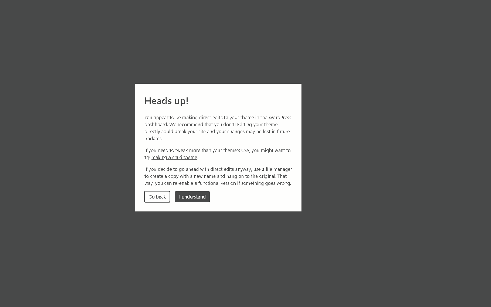

Making direct edits to WordPress files

现在你进来了！默认情况下，您应该在样式表上，但是如果没有，请查看右边的菜单来查看您的主题文件。

除了 style.css，你还可以访问模板文件，比如 functions.php、header.php 和 single.php。所有这些都会影响网站上某些页面的行为。

但是在深入研究这些特定的文件之前，您应该熟悉 PHP。

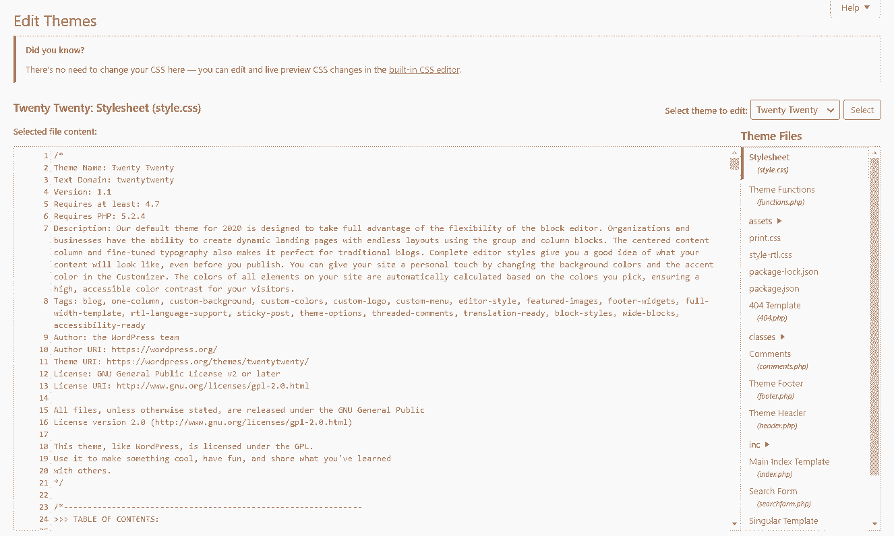

Editing the style.css stylesheet in a WordPress theme

请记住:您在这里进行的大多数 CSS 更改都是全局的。例如，如果你把你的 H1 标题改成某种字体，它会对你网站上的每一页都生效。您需要使用特殊的语法来定制特定页面的样式。

### 直接编辑主题文件

如果你不能访问主题编辑器或者更喜欢通过 FTP 工作怎么办？使用后端编辑器更容易，但一些主题或插件可能会禁用它。如果是这样的话，你需要通过 FTP 连接到你的网站。

FTP(文件传输协议)允许你远程访问和修改网站的文件。你需要做的第一件事是[下载 FileZilla](https://kinsta.com/blog/best-ftp-clients/#Filezilla) 或任何其他 FTP 客户端。

接下来，您应该联系您的主机并询问您的 FTP 凭据(主机、端口和用户名/密码，如果适用的话)。如果您的主机有仪表板，您可能可以通过登录找到它们。

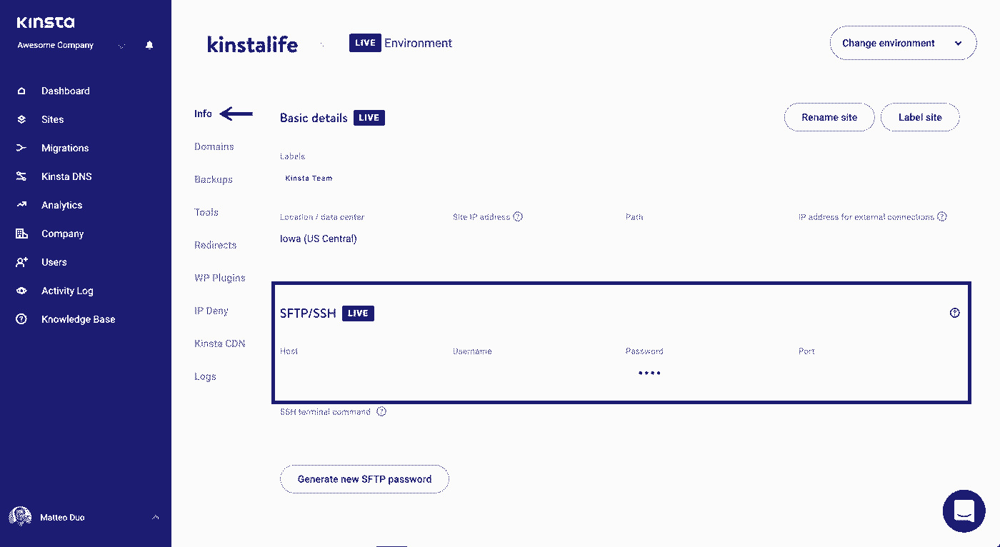

FTP credentials in MyKinsta

Kinsta 用户的凭证位于*站点> SFTP/SSH* 下的 [MyKinsta 仪表板](https://kinsta.com/mykinsta)中。

一旦你有了它们，启动你的 FTP 客户端并输入信息。如果不行，可以尝试在*主机*部分的 URL 前加上“sftp://”。

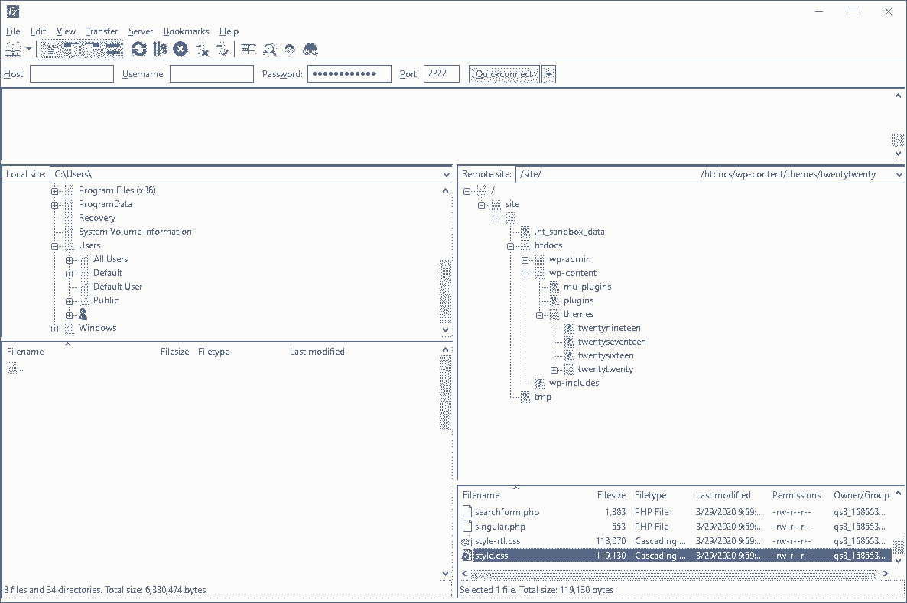

Using FileZilla

一旦你进入，你可以找到你的 style.css 文件，点击 *wp-content* 文件夹打开它，然后你的主题的文件夹(像[T*Twenty Twenty*主题](https://kinsta.com/blog/twenty-twenty-theme/)，然后滚动直到你看到 style.css

双击打开它(或右击并选择*查看/编辑*)并进行修改。记得保存并上传回服务器。

如果需要编辑其他[模板文件](https://developer.wordpress.org/themes/basics/template-files/)如 home.php、single.php、archive.php，可以在 style.css 同一个文件夹中找到

无论是通过 FTP 还是仪表板，编辑你的主题文件并不总是必要的。事实上，如果您只是添加一些额外的代码，最好避免这样做。

对于小的添加，这里是添加 CSS 到你的 WordPress 站点的最好方法。

## 如何在 WordPress 中添加自定义 CSS

如果你不想编辑现有的 CSS 代码，只想添加你自己的样式，强烈建议使用以下方法之一:WordPress customizer 或使用专用插件。

## 注册订阅时事通讯

### 想知道我们是怎么让流量增长超过 1000%的吗？

加入 20，000 多名获得我们每周时事通讯和内部消息的人的行列吧！

[Subscribe Now](#newsletter)

首先，通过这些方法之一添加的 CSS 代码更容易访问和使用。如果以后要进行修改，您不必担心将新的 CSS 放在错误的位置，或者忘记添加到了哪里。

此外，当你的主题更新时，通过这些方法之一添加的 CSS 不会丢失(尽管如果你[改变主题](https://kinsta.com/blog/change-wordpress-theme/)，它可能仍然会消失)。

这意味着你不需要使用子主题，如果有什么东西坏了，你所要做的就是删除你刚刚添加的 CSS。

请注意，你仍然应该[为你的网站](https://kinsta.com/blog/restore-wordpress-from-backup/)保留一份备份，因为有些人报告说在主要更新期间偶尔会丢失他们的 CSS。尽管如此，这种方法比直接编辑主题文件要可靠得多。

虽然你可以在 style.css 中添加代码，然后就到此为止，但是如果你不想[创建一个子主题](https://kinsta.com/blog/wordpress-child-theme/)，对你的主题中现有的 css 进行大的编辑，并且可能最终删除你所有的工作，那么最好是使用 WordPress customizer 中的附加 CSS 选项或者安装一个插件。

### 1.通过 WordPress 定制器编辑 CSS

不要使用主题编辑器，试试这个。[登录你的 WordPress 后端](https://kinsta.com/blog/wordpress-login-url/)，点击*外观>定制*打开主题定制界面。你会看到你的网站的实时预览，左边的选项可以定制元素，如颜色、菜单或其他[小工具](https://kinsta.com/blog/wordpress-widgets/)。

在这个菜单的最底部，你应该可以找到 [*附加 CSS*](https://kinsta.com/knowledgebase/edit-wordpress-code/#css) 框。

单击打开它。你将被带到一个新的屏幕，屏幕上有一个代码输入框和一些说明。额外的 CSS 屏幕包括语法突出显示，就像主题编辑器一样，以及让您知道代码是否错误的验证。

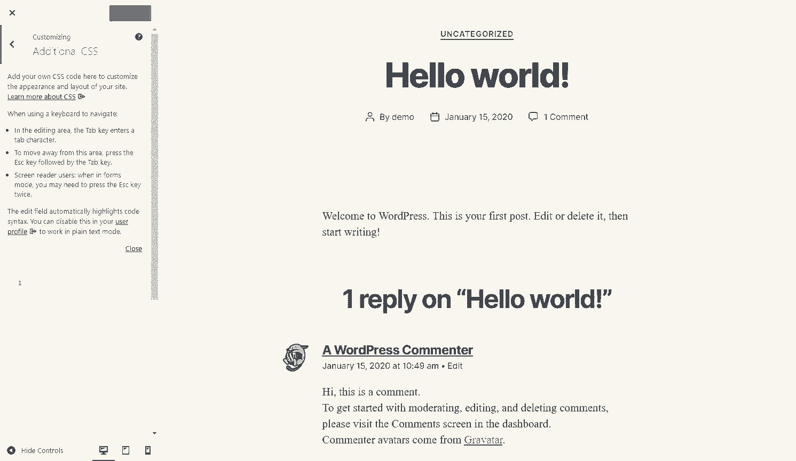

Additional CSS in WordPress

您编写的任何代码都会自动出现在右侧的预览区域，除非它有错误(尽管您仍然可以选择发布它)。

当您完成工作时，您可以发布代码，安排代码生效的时间，或者将其保存为草稿供以后使用。你甚至可以获得一个预览链接，与他人分享。

正如您所看到的，额外的 CSS 页面在许多方面比主题编辑器更强大，并且更适合添加代码而不是处理核心文件。

你在这里写的 CSS 代码覆盖了你的主题的默认样式，当你的主题更新时它不会消失。如果你在预览中看不到它，请仔细检查你是否在 CSS 代码中使用了正确的选择器。

就像主题编辑器一样，CSS 在默认情况下是全局的，但是您可以编写代码让[针对特定的页面](https://medium.com/gobeyond-ai/how-to-use-custom-css-on-specific-pages-in-wordpress-d7bf04e7cce5)。

一个缺点是，[如果你切换主题](https://kinsta.com/blog/change-wordpress-theme/)，你写的任何东西都会被删除。确保在移动到新主题之前备份你的 CSS，否则你可能会丢失很多工作。

如果你很难使用这个选项，或者想要一个跨主题的解决方案，可以更容易地针对某些页面，你应该尝试一个插件。

### 2.使用插件向 WordPress 添加自定义 CSS

有几个原因可能会让你想用一个插件来添加 CSS 到 WordPress。虽然功能类似于额外的 CSS 菜单，但即使你切换/更新主题，样式通常也会保持不变。

需要为您的客户站点提供一个非常快速、安全且对开发人员友好的托管服务吗？Kinsta 是为 WordPress 开发者设计的，提供了大量的工具和强大的仪表板。[查看我们的计划](https://kinsta.com/plans/?in-article-cta)

你也可能更喜欢他们的用户界面，或者喜欢像自动完成这样的额外功能。有些插件甚至让你通过[下拉菜单](https://kinsta.com/knowledgebase/wordpress-dropdown-menu/)来构建 CSS，而不是自己去写。

#### 简单自定义 CSS

简单定制 CSS 是最流行的 CSS 编辑器插件，因为它易于使用，最小化的界面和轻量级的后端。简而言之，它是一个非常小的 WordPress 插件，但却有很大的冲击力。

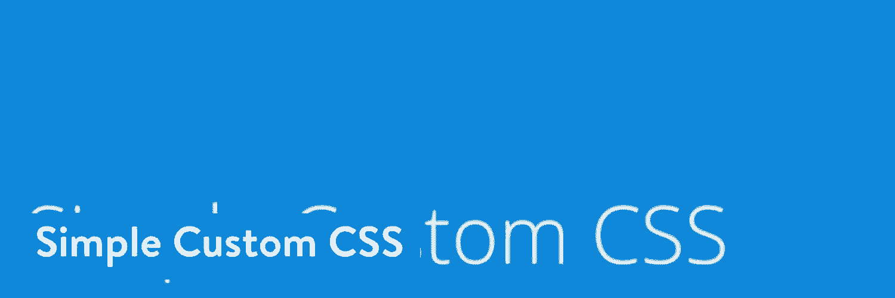

Simple Custom CSS WordPress plugin

设置很容易，您将不会看到对性能的负面影响。它适用于任何主题，包括语法高亮和错误检查。

#### 简单的自定义 CSS 和 JS

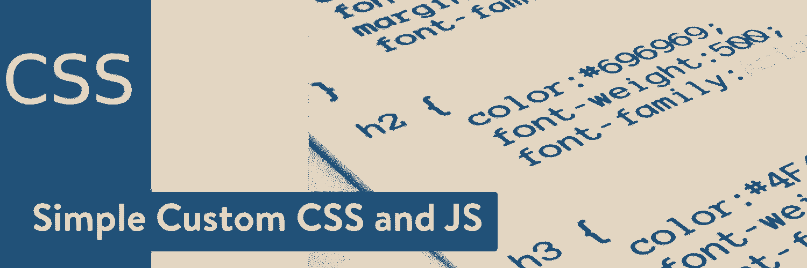

Simple Custom CSS and JS WordPress plugin

简单的定制 CSS 和 JS 是一个很好的选择。它还可以让你定位页眉、页脚、前端，甚至是管理后端。

#### SiteOrigin CSS

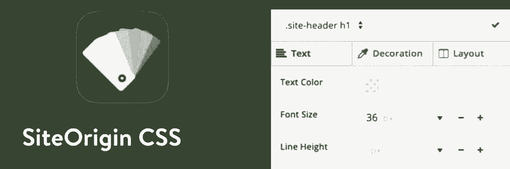

SiteOrigin CSS WordPress plugin

SiteOrigin CSS 是另一个选项，也包括一个传统的 CSS 编辑器。你可以随时在它和[视觉编辑器](https://kinsta.com/blog/wordpress-page-builders/#siteorigin)之间切换。

#### WP 添加自定义 CSS

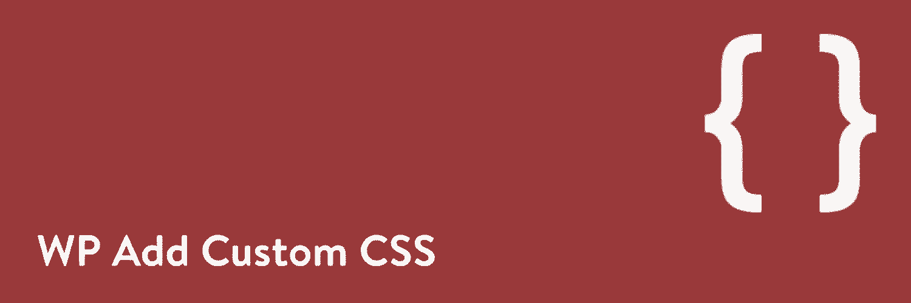

WP Add Custom CSS WordPress plugin

如果你正在努力为特定的页面添加 CSS， [WP Add Custom CSS](https://wordpress.org/plugins/wp-add-custom-css/) 在编辑屏幕上添加了一个自定义 CSS 框，并且还带有全局样式。

#### CSS 英雄

你也可以考虑尝试一个可视化的 CSS 编辑器。这些将所有复杂的编码转化为一系列易于使用的输入字段和下拉菜单，为你处理所有的编程。

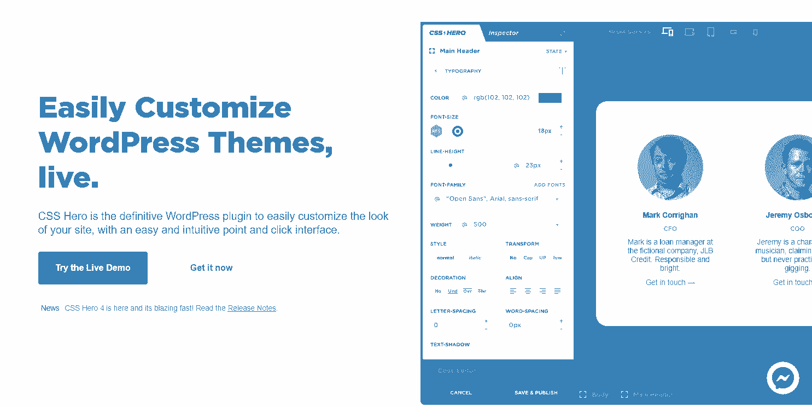

CSS Hero

CSS Hero 是一个高级的可视化编辑插件，具有一些非常强大的功能(动画、特定于设备的编辑和非破坏性编辑等等)。
T3】

## 从哪里学习 CSS

准备好自己钻研 CSS 了吗？这些初学者教程将建立基础，并教你编写自己的函数式 CSS 代码所需的语法。

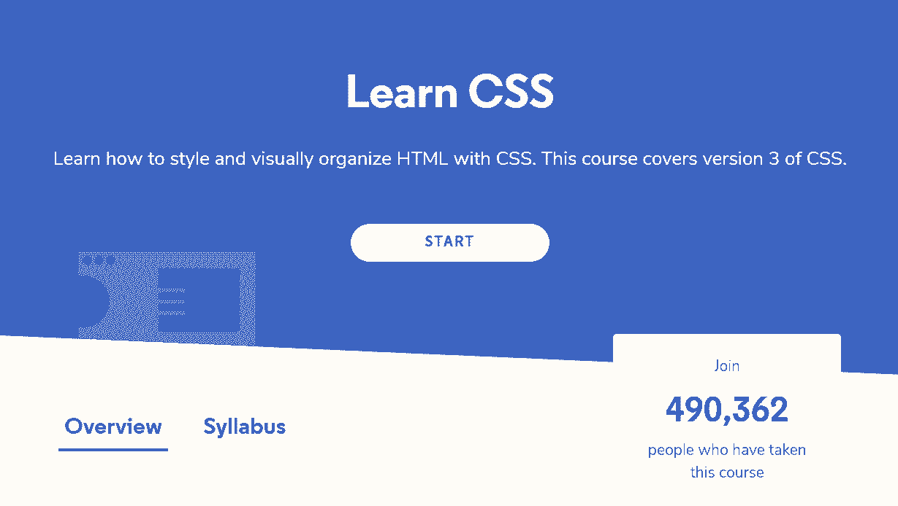

Learn CSS

这可能令人望而生畏，但是除非你想做一些真正高级的事情，CSS 并不太难！像改变背景颜色或设置字体样式这样简单的事情相当容易，网上有很多例子。

(建议阅读:[在你的 WordPress 网站上使用的 50 多种现代字体](https://kinsta.com/blog/modern-fonts/)

你在互联网上找到的大多数编程教程也是完全免费的。T2 有大量免费/几乎免费的信息。

这里有几个例子，涵盖了初学者最好的 CSS 教程。

*   W3Schools CSS 教程:这里有大量的信息:深入的教程、例子和参考资料供你使用。W3Schools 的教程尽可能简单易懂，所以即使你是一个完全的初学者，这也是一个很好的起点。
*   [Codeacademy 学习 CSS](https://www.codecademy.com/learn/learn-css) :通过六堂免费的实践课，你将学习 CSS 的基础知识。这不是简单的视频教程，而是让您使用实际代码的交互式课程。有了专业版，你还可以进行测验和自由形式的项目。
*   [一小时学会 CSS](https://www.freecodecamp.org/news/want-to-learn-css-heres-our-free-20-part-course-9fb3dcb0a971/):很多人想学习一门新的[编程语言](https://kinsta.com/blog/scripting-languages/)，但是他们就是没有时间去投入。但是如果你能抽出一个小时的时间，你可以通过这个免费的 20 节课来学习 CSS。即使你最终不是大师，你也应该很好地掌握基础知识。
*   [基本 HTML 介绍&面向 WordPress 用户的 CSS](https://www.udemy.com/course/introduction-to-basic-html-css-for-wordpress-users/):在寻找 WordPress 特有的东西？如果你总是纠结于 HTML 和 CSS 的编写，这个课程非常适合你。它是付费的，但附带 52 节课和 5 小时的视频供学习。

[Learn how to use CSS to customize & optimize your website, from the colors used to the spaces between elements ✨Click to Tweet](https://twitter.com/intent/tweet?url=https%3A%2F%2Fkinsta.com%2Fblog%2Fwordpress-css%2F&via=kinsta&text=Learn+how+to+use+CSS+to+customize+%26amp%3B+optimize+your+website%2C+from+the+colors+used+to+the+spaces+between+elements+%E2%9C%A8&hashtags=CSS%2Cwebdev)

## 摘要

作为一个 WordPress 用户，一开始可能会感到困惑。但是一旦你知道了如何编辑你的主题文件以及在哪里添加样式，你应该就不会再有麻烦了。

主题文件可以从你的后端或者通过 FTP 来编辑，以改变你的站点的外观，但是这通常应该避免，除非你需要编辑现有的代码。

如果你只是想添加自己的 CSS，使用*外观>定制*下的额外 CSS 页面，或者如果你需要更强大的东西，尝试一个插件。

对样式表的编辑将在主题更新时丢失，除非你使用[子主题。](https://kinsta.com/blog/wordpress-child-theme/)对于额外的 CSS 就不一样了。你的代码不会被更新，但是不要忘记:当你[改变主题](https://kinsta.com/blog/change-wordpress-theme/)时，只有插件会保留 CSS。

无论你选择哪种方法，你都应该定期备份你的网站，包括你添加的样式表和自定义代码。现在是时候使用我们提供的资源来复习 CSS 基础知识了。

快乐造型！

推荐阅读:[最佳网页设计在线课程](https://kinsta.com/blog/web-design-courses/)

* * *

让你所有的[应用程序](https://kinsta.com/application-hosting/)、[数据库](https://kinsta.com/database-hosting/)和 [WordPress 网站](https://kinsta.com/wordpress-hosting/)在线并在一个屋檐下。我们功能丰富的高性能云平台包括:

*   在 MyKinsta 仪表盘中轻松设置和管理
*   24/7 专家支持
*   最好的谷歌云平台硬件和网络，由 Kubernetes 提供最大的可扩展性
*   面向速度和安全性的企业级 Cloudflare 集成
*   全球受众覆盖全球多达 35 个数据中心和 275 多个 pop

在第一个月使用托管的[应用程序或托管](https://kinsta.com/application-hosting/)的[数据库，您可以享受 20 美元的优惠，亲自测试一下。探索我们的](https://kinsta.com/database-hosting/)[计划](https://kinsta.com/plans/)或[与销售人员交谈](https://kinsta.com/contact-us/)以找到最适合您的方式。