# 修复和排除最常见的 WordPress 错误(70 多个问题)的终极指南

> 原文： [https://kinsta.com/blog/wordpress-errors/](https://kinsta.com/blog/wordpress-errors/)

你网站上的 WordPress 错误不是闹着玩的。虽然有些可能只造成小的不便，但其他的可能会导致大问题。[停机时间](https://kinsta.com/blog/website-downtime/)，失败的更新和安装，以及资源的丢失都会阻止访问者访问或使用你的网站。这**伤害了你的信誉**，并且潜在地**影响了你的收入**。

从里到外了解每一个潜在的 WordPress 错误几乎是不可能的。然而，了解用户遇到的一些最常见的 WordPress 问题可以帮助你准备和解决出现的问题。

这篇文章涵盖了最常见的 WordPress 错误。我已经提供了资源来帮助你清理每一个问题，这样你就可以很快地重新建立并运行你的网站。

让我们直接跳进来吧！

[From 404s to broken media files, this guide will help you banish WordPress errors for good ❌Click to Tweet](https://twitter.com/intent/tweet?url=https%3A%2F%2Fkinsta.com%2Fblog%2Fwordpress-errors%2F&via=kinsta&text=From+404s+to+broken+media+files%2C+this+guide+will+help+you+banish+WordPress+errors+for+good+%E2%9D%8C&hashtags=wphelp%2Cwordpress)

## 70 多个最常见的 WordPress 错误以及如何修复它们

为了在一篇文章中涵盖这么多不同的问题，我大致按照类型对它们进行了组织。下面你会发现你的 WordPress 站点的各个组件的一般描述和他们可能遇到的问题，接着是具体的错误和他们的解决方案。

### 400 个错误

用 400 到 499 之间的数字标记的错误是 HTTP 客户端错误。这通常意味着在网站访问者使用的浏览器和网站服务器之间的通信过程中出现了问题。


> 需要在这里大声喊出来。Kinsta 太神奇了，我用它做我的个人网站。支持是迅速和杰出的，他们的服务器是 WordPress 最快的。
> 
> <footer class="wp-block-kinsta-client-quote__footer">
> 
> 
> 
> <cite class="wp-block-kinsta-client-quote__cite">Phillip Stemann</cite></footer>

[View plans](https://kinsta.com/plans/)

#### **查看我们的视频指南，解决 400 个错误:**


#### 1.400 错误请求

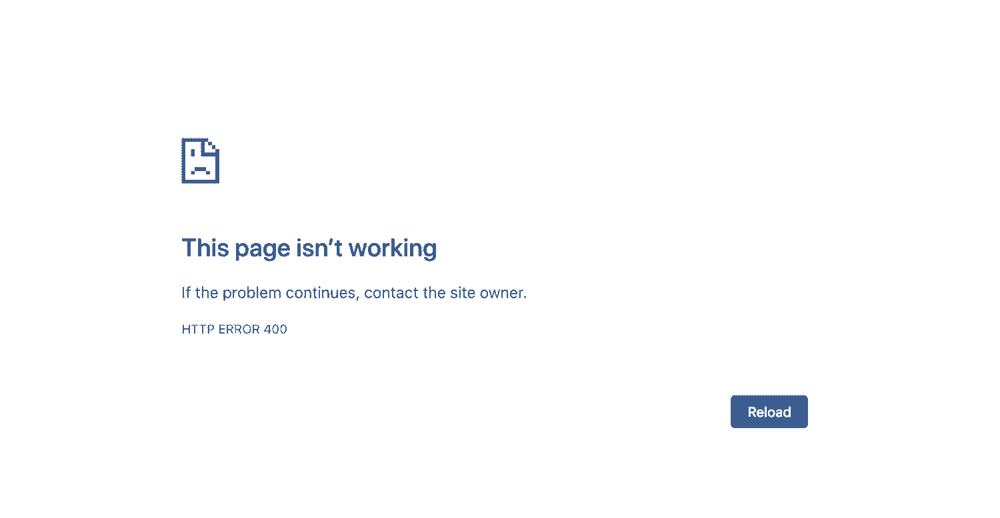

400 error response in Google Chrome


[400 错误请求](https://kinsta.com/knowledgebase/400-bad-request/)响应是当你的服务器遇到客户端错误时的一个总括，但它不属于一个特定的类别*。*这意味着该错误有几种可能的原因，包括:

*   键入的 URL 不正确或包含不允许的字符。
*   浏览器缓存或 cookies 损坏。
*   [域名系统(DNS)](https://kinsta.com/knowledgebase/what-is-dns/) 数据和您的本地 DNS 缓存之间的差异。
*   试图上传太大的文件。
*   某种常见的服务器错误。

潜在的解决方案包括检查 URL 的拼写错误、清除浏览器缓存和 cookies、清除 DNS 缓存以及停用浏览器扩展。

#### 2.403 禁止

有很多措施可以保证你的 WordPress 网站的安全，包括不同级别的“许可”。虽然此功能可以防止不应该访问您的站点的人进入，但如果权限设置不正确，有时会导致问题。

一个 [403 禁止错误](https://kinsta.com/blog/403-forbidden-error/)就是这样一个问题:


403 Forbidden response in Google Chrome


要修复它，您需要重置您的文件权限或生成一个新的**。htaccess** 文件。这个问题也可能是插件、您的[内容交付网络(CDN)](https://kinsta.com/help/kinsta-cdn/) 或[热链接保护](https://kinsta.com/blog/hotlinking/)的问题造成的。

#### **查看我们修复 403 禁止错误的视频指南:**


#### 3.404 未找到

当用户试图访问一个不存在的网页时，会出现一个 [404 错误](https://kinsta.com/blog/error-404-not-found/)。他们将看到一个与此类似的页面，而不是找到他们正在寻找的资源:

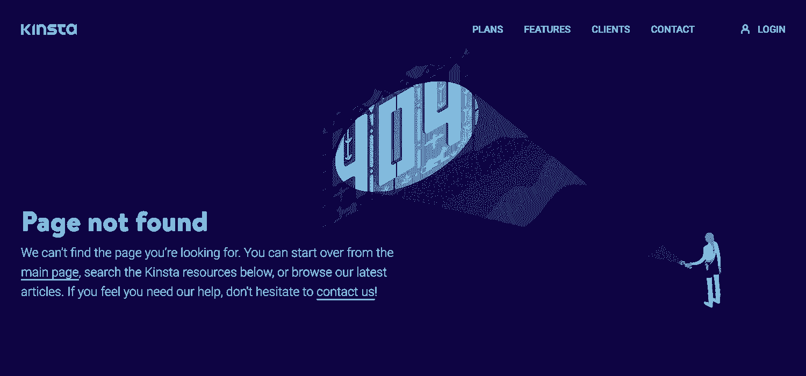

Kinsta’s 404 Error page


这个问题相对来说是无害的，但是仍然让用户感到沮丧。为了避免这种情况，确保[定期修复你网站上断开的链接](https://kinsta.com/blog/broken-links/)，如果你删除了一个页面或者[将它转移到一个新的网址](https://kinsta.com/knowledgebase/wordpress-change-url/)，那么[会执行重定向](https://kinsta.com/blog/wordpress-redirect/)。

#### **查看我们修复 404 错误的视频指南:**

#### 4.不允许 405 方法

[405 方法不允许错误](https://kinsta.com/blog/405-method-not-allowed-error/)是你的服务器说它已经收到浏览器的请求，但由于某种原因拒绝了它。

有几种可能的方法来解决这个问题，包括[回滚最近的主题和插件更新](https://kinsta.com/blog/downgrade-wordpress/)，检查你的服务器的配置和错误日志，调试你的应用程序代码。

#### 5.413 请求实体太大

如果此错误出现在您的浏览器中，这意味着您试图访问的站点的服务器无法处理您发出的 HTTP 请求，因为它太大了。

如果你试图上传一个非常“重要”的文件，这种情况经常发生。您可以通过增加最大 HTTP 请求大小来解决这个问题。

#### 6.429 请求太多

如果用户试图在短时间内多次访问某个资源，他们可能会收到 [429 太多请求错误](https://kinsta.com/knowledgebase/429-too-many-requests/)。这是服务器阻止可疑行为的方式。

为了帮助防止对您的登录页面的网络攻击，这种攻击可能会导致 429 错误，您可以更改它的默认 URL。其他解决方案包括测试主题和插件冲突。
T3】

### 500 个错误

您的站点上任何标有 500 到 599 之间的[数字的错误都表明您的服务器由于某种原因无法执行给定的请求。这里有几个最常见的例子。](https://kinsta.com/blog/http-status-codes/#500-status-codes)

#### 查看我们修正 500 个错误的终极指南


#### 7.500 内部服务器错误

除了阻止用户访问你的网站，一个 [500 内部服务器错误](https://kinsta.com/blog/500-internal-server-error/)如果不迅速解决，会对[你的 SEO](https://kinsta.com/blog/what-does-seo-stand-for/) 产生负面影响:

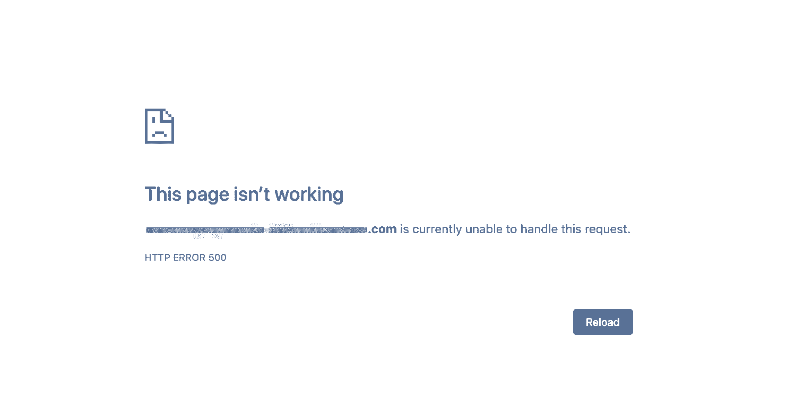

An Internal Service Error in Google Chrome


不幸的是，500 错误有许多可能的原因和解决方案，这使得[解决这个问题](https://kinsta.com/blog/wordpress-debug/)变得棘手。你可以从[清空你的浏览器缓存](https://kinsta.com/knowledgebase/how-to-clear-browser-cache/)并重新加载页面开始。如果还不行，你可以钻研[更多的技术调试方法](https://kinsta.com/blog/500-internal-server-error/)。

#### 8.501 未执行

此错误意味着您的服务器没有完成用户浏览器请求所需的功能。很可能是服务器无法识别请求方法。

就像 500 内部服务错误一样，如果你不在几个小时内解决这个问题，501 错误会降低你在搜索引擎中的排名。您可以尝试重新加载页面，清除浏览器缓存，并禁用任何活动的代理设置来解决此问题。

然而，你可能需要联系你的主人寻求帮助。

#### 9.502 错误网关

在一台服务器充当另一台服务器的代理或“网关”的情况下，用户可能会遇到 [502 坏网关错误](https://kinsta.com/blog/502-bad-gateway/)。当代理从入站服务器收到无效响应时，会出现这种情况。

一个 502 错误会影响你的搜索引擎优化，所以最好尽快解决。重新加载页面和清除浏览器缓存是很好的开始。如果这些解决方案不起作用，请检查您的 DNS 问题，尝试禁用您的 CDN 或[防火墙](https://kinsta.com/blog/what-is-a-firewall/)，或者联系您的主机寻求帮助。

#### 10.503 服务不可用

当出现 [503 服务不可用错误](https://kinsta.com/blog/http-error-503/)时，意味着由于某种原因无法到达您的服务器。虽然您的网站已启动，但用户将无法访问它。

这可能是由于[例行维护](https://kinsta.com/blog/wordpress-maintenance/)，高流量水平，或者你的服务器有更严重的问题。好消息是 503 错误不会影响你的搜索引擎排名。然而，它仍然会让游客非常讨厌。要解决这个问题，您可以尝试:

*   停用你的插件。
*   [切换到默认主题](https://kinsta.com/blog/change-wordpress-theme/)。
*   禁用您的 CDN。
*   限制 WordPress 心跳 API。
*   增加服务器的资源。
*   [启用 WP_DEBUG](https://kinsta.com/knowledgebase/the-site-is-experiencing-technical-difficulties/#step-4-enable-wordpress-debug-mode) 。

如果这些解决方案都不起作用，你最好的办法就是联系你的主机支持团队。

#### 11.504 网关超时

与 502 错误一样， [504 网关超时](https://kinsta.com/blog/504-gateway-timeout/)响应是入站服务器和代理之间的通信出现问题的结果。本质上，这意味着后一个服务器在等待前一个服务器响应请求时超时。

这种错误会对你的搜索引擎优化产生负面影响。可能的解决方案包括重新加载页面，禁用任何活动的代理设置，检查您的 DNS 问题，并暂时禁用您的 CDN。


### 与服务器相关的错误

你的服务器负责存储你的 WordPress 站点的所有文件，并与浏览器通信，使你的内容对用户可用。

虽然已经列出的 400 和 500 错误以某种方式涉及到你的服务器，但是还有一些更多的 WordPress 特有的问题可能是由你的服务器的[问题引起的。](https://kinsta.com/knowledgebase/dns-server-not-responding/#what-does-dns-server-not-responding-mean)

#### **查看我们修复安全相关错误的终极指南:**


#### 12.WordPress 内存限制错误

您的主机提供商为您的网站分配一定数量的服务器内存。如果您达到了服务器的内存限制，您可能会遇到安装新插件或主题，或上传媒体文件到您的网站的问题。

您将看到一条消息，内容是“致命错误:允许的内存大小已用尽”，而不是成功添加新资源。如果发生这种情况，你可以通过编辑你的【wp-config.php】文件**来增加你的 PHP 内存限制。**

或者，你可以检查[你使用了多少磁盘空间](https://kinsta.com/blog/disk-usage-wordpress/)，看看你能否[提高你的 PHP 内存限制](https://kinsta.com/knowledgebase/php-memory-limit/)，并考虑[升级到一个新的托管计划](https://kinsta.com/plans/)，为你日益增长的 WordPress 网站提供更多空间。

#### 13.上传的文件超过了 php.ini 中的 upload_max_filesize 指令

同样，您的主机也对您可以上传到服务器的单个文件的最大大小设置了限制。你可以通过在你的 [WordPress 仪表盘](https://kinsta.com/knowledgebase/wordpress-admin/)中导航到**媒体>添加新的**，并寻找**最大上传文件大小**(kin sta 的默认上传大小为 128 MB)来查看这个限制:


The maximum upload file size listed in the WordPress Media Uploader


如果您需要上传大于指定最大大小的文件，您可以通过[编辑您的](https://kinsta.com/knowledgebase/the-uploaded-file-exceeds-the-upload_max_filesize-directive-in-php-ini/) [php.ini](https://kinsta.com/knowledgebase/the-uploaded-file-exceeds-the-upload_max_filesize-directive-in-php-ini/) [文件](https://kinsta.com/knowledgebase/the-uploaded-file-exceeds-the-upload_max_filesize-directive-in-php-ini/)来更改限制。或者，您可以联系您的主机提供商，与他们讨论这个问题。

这比你自己尝试改变它要简单得多，风险也小得多，而且对你的主机支持团队来说，这不应该是个问题。

#### 14.致命错误:超过了最大执行时间

服务器对脚本可以运行的时间有限制(通常是 30 秒，在 Kinsta 默认的最大执行时间是 300 秒)。如果你的 WordPress 站点上的 PHP 脚本花费的时间超过了规定的时间限制，你可能会看到消息:[“致命错误:超过最大执行时间”](https://kinsta.com/blog/err_connection_timed_out/#9-look-at-the-maximum-execution-time)。

您可以通过增加站点的执行时间限制来解决此问题。为此，你需要[找到运行时间过长的脚本](https://www.fixrunner.com/how-to-fix-fatal-error-maximum-execution-time-exceeded-in-wordpress/)，并删除它，这可能是插件或主题的一部分。

#### 15.上传:无法将文件写入磁盘

在你的帖子和页面上添加图片可以让它们更有用，更有趣，[可以带来额外的有机流量](https://kinsta.com/blog/how-to-drive-traffic-to-your-website/)。然而，每当你试图向你的站点添加媒体文件时，如果你看到类似“[上传:未能将文件写入磁盘](https://kinsta.com/knowledgebase/wordpress-failed-to-write-file-to-disk/)”的消息，你将很难做到这一点。

这个错误通常是由于[不正确的文件权限](https://kinsta.com/knowledgebase/sorry-you-are-not-allowed-to-access-this-page-error-in-wordpress/#9-evaluate-your-file-permissions)造成的。您可以通过[文件传输协议(FTP)](https://kinsta.com/blog/best-ftp-clients/) 更改您的文件权限来解决此问题。

但是，这也可能是服务器的问题。当你上传文件到 WordPress 时，它们首先被保存到你服务器上的一个临时文件夹中。然后，它们被移动到适当的 WordPress 目录。如果更改您的文件权限无法修复此错误，请联系您的主机，让他们清空您的临时文件目录，因为该目录可能已满，会阻止上载。

#### 16.安全连接错误

当你更新你的 WordPress 安装的核心文件时，你的网站必须连接到*WordPress.org*。有时，由于服务器的配置，这是不可能的。结果是在你的 WordPress 仪表盘上出现一个警告。

由于这是一个与您的服务器直接相关的问题，您可能需要联系您的主机来解决它。您的服务器可能受到了 [DDoS 攻击](https://kinsta.com/blog/what-is-a-ddos-attack/)，在这种情况下，错误应该会很快自行解决。或者，你可以通过[安全外壳协议(SSH)](https://kinsta.com/help/connect-to-ssh/) 将你的服务器指向 WordPress.org*来尝试自己解决这个问题。*

 *### 与安全相关的错误

在你的网站上实施 [WordPress 安全最佳实践](https://kinsta.com/knowledgebase/hsts-strict-transport-security/)是明智的。网络攻击可能会造成严重的损失，需要大量资金来修复。不幸的是，有时你采取的保护网站的措施会导致错误。


### 信息

如果你在 Kinsta 托管你的站点，我们会提供[恶意软件安全保证](https://kinsta.com/knowledgebase/malware-security/)，并免费清除你站点上的恶意软件。


#### **查看我们的安全相关错误终极指南:**


#### 17\. Cloudflare Error 521

虽然这是一个 500 错误，就像我们在上一节中描述的那样，但它是特定于 [Cloudflare](https://kinsta.com/help/kinsta-cdn/) 的。这个流行的平台被用作 CDN，并用于防御 DDoS 和其他攻击。

在您的站点上看到一个 [521 错误](https://kinsta.com/knowledgebase/error-521/)意味着 Cloudflare 无法连接到您的服务器。要么是它关闭了，要么是由于某种原因阻止了服务。一般来说，检查以确保您的服务器已启动，并且其防火墙已将所有 Cloudflare 的 IP 范围列入白名单，这将让您知道是什么导致了问题。然后，您可以采取措施与您的主机合作并解决它。

建议阅读:[如何为 WordPress](https://kinsta.com/blog/cloudflare-apo-wordpress/) 设置 Cloudflare APO。

#### 18.抱歉，出于安全原因，不允许使用这种文件类型

作为一种安全措施，WordPress 有一个允许文件类型的标准列表。这可以防止恶意方向您的站点添加可能危及用户敏感信息的可执行文件。

如果用户试图上传不在该列表中的文件类型，他们会看到一条消息:[“抱歉，出于安全原因，不允许使用此文件类型”](https://kinsta.com/knowledgebase/sorry-this-file-type-is-not-permitted-for-security-reasons/):


The “Sorry, this file type is not permitted for security reasons” message


通过编辑你的**wp-config.php**文件，你可以上传 WordPress 默认设置中不允许的文件类型。

WP 额外文件类型插件也可以作为替代方案。

#### 19.抱歉，不允许您访问此页面

在这篇文章的前面，我们简单地提到了文件权限，但是概括一下，它们决定了谁可以在你的 WordPress 站点上编辑哪些文件。这使您的网站免受黑客攻击，黑客可能会插入恶意代码。

但是，如果您的权限设置不正确，他们可能会无意中阻止您或善意的用户访问您的网站。

这可能会导致一个错误，显示为:[“对不起，您不允许访问此页面”](https://kinsta.com/knowledgebase/sorry-you-are-not-allowed-to-access-this-page-error-in-wordpress/)。


The “Sorry, you are not allowed to access this page” error message


这个问题有许多可能的解决方案。你可能想试试:

*   通过[安全文件传输协议(SFTP)](https://kinsta.com/knowledgebase/how-to-use-sftp/) 重置您的文件权限。
*   通过 [phpMyAdmin](https://kinsta.com/help/wordpress-phpmyadmin/) 检查以确保您的帐户被分配了正确的用户角色。
*   确保数据库前缀是正确的。
*   插件和主题冲突的故障排除。

在最坏的情况下，你也可以[恢复你站点的备份](https://kinsta.com/blog/restore-wordpress-from-backup/)或者[重置 WordPress](https://kinsta.com/blog/reset-wordpress/) 。

#### 20."安装失败:无法创建目录"

每当你在你的 WordPress 网站上安装插件或 T2 主题时，它们的文件就会被添加到你的服务器上。如果在安装或更新过程中，你收到一条消息说[“安装失败:无法创建目录”](https://kinsta.com/knowledgebase/installation-failed-could-not-create-directory/)，这意味着出于某种原因，WordPress 无法向你的服务器添加必要的文件。

同样适用于插件和[主题更新](https://kinsta.com/blog/how-to-update-wordpress-theme/)。这是另一个与文件权限相关的错误。

要修复它，确保你被允许通过 FTP 在你的 **wp-admin** 、 **wp-content** 和 **wp-includes** 目录中**写**。

#### 21.不正确的文件权限

除了拒绝您访问网站的某些区域(如“对不起，您无权访问此页面”错误)，不正确的文件权限还会阻止您:

*   更新或安装[插件](https://kinsta.com/best-wordpress-plugins/)和[主题](https://kinsta.com/best-wordpress-themes/)。
*   发布或更新帖子和页面。
*   [上传图片](https://kinsta.com/knowledgebase/bulk-upload-files-wordpress-media-library-ftp/)。

另一方面，如果你的文件权限不是太强，你的网站就容易受到攻击，并且有被黑客访问的风险。在那里，他们可以删除内容，窃取数据，或添加自己的恶意代码。

如果您遇到上述问题之一，或者怀疑您被黑客攻击，您可能需要通过 SFTP 验证您的文件权限:

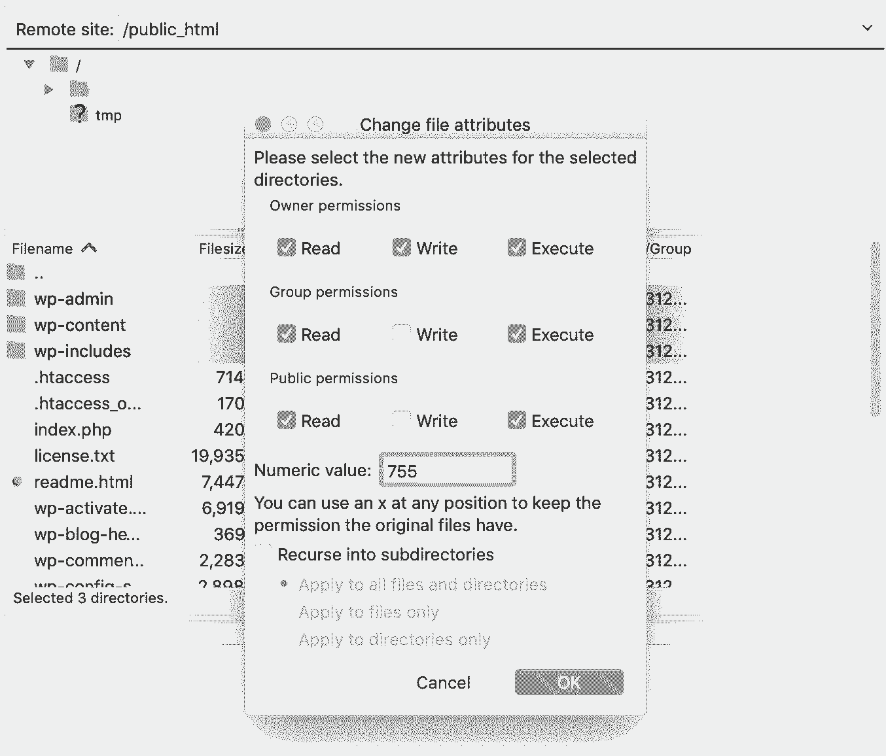

The file permissions window in FileZilla


文件夹的默认数值是 755，文件的默认数值是 644。

#### 22.错误 _ SSL _ 协议 _ 错误

[安全套接字层(SSL)证书](https://kinsta.com/knowledgebase/how-ssl-works/)是一种用于加密数据的安全措施。这可以防止黑客窃取敏感数据，如在服务器之间传输的信用卡信息。

如果你最近更换了主机提供商或者[在你的网站上安装了一个新的 SSL 证书](https://kinsta.com/help/how-to-install-ssl-certificate/)，你可能会在你的浏览器上看到一个 [ERR_SSL_PROTOCOL_ERROR](https://kinsta.com/knowledgebase/err_ssl_protocol_error/) 。这意味着，由于某种原因，您的服务器无法建立安全连接。

你可以采取几个[步骤](https://kinsta.com/knowledgebase/err_ssl_protocol_error/)来解决这个问题，包括更新你的浏览器和操作系统、[验证你的 SSL 证书](https://kinsta.com/knowledgebase/ssl-check/)、[禁用浏览器扩展](https://kinsta.com/knowledgebase/how-to-remove-chrome-extensions/#how-to-temporarily-disable-chrome-extensions)，以及清除你的浏览器缓存和 cookies。

#### 23.错误 _ SSL _ 版本 _ 或 _ 密码 _ 不匹配

ERR _ SSL _ VERSION _ OR _ CIPHER _ MISMATCH 错误可能表示您的浏览器或操作系统已经过时。这也可能是由于你的 SSL 证书的问题，或者在你[将你的 WordPress 站点迁移到一个新的主机](https://kinsta.com/blog/wordpress-migration-plugins/)后弹出。

如果更新浏览器和操作系统没有帮助，请检查 SSL 证书中的名称是否不匹配。或者，[清除您计算机的 SSL 状态](https://kinsta.com/knowledgebase/err_ssl_version_or_cipher_mismatch/#clear-ssl-state)可能会解决问题，或者您的 [SSL 证书可能已经过期](https://kinsta.com/knowledgebase/err_ssl_obsolete_version/)。

#### 24.混合内容警告

当你添加一个 SSL 证书到你的 WordPress 站点时，它将开始运行 HTTPS 而不是 HTTP。如果你的网站试图同时加载 HTTPS 和 HTTP 内容或脚本，你会看到一个[混合内容警告](https://kinsta.com/blog/mixed-content-warnings/)。

这可能会读作“这个站点不是完全安全的”的某种变体。为了解决这个错误，您需要[遵循几个步骤](https://kinsta.com/blog/mixed-content-warnings/)来确定哪些 HTTP 资源正在加载，并删除它们或者用 HTTPS 资源替换它们。

#### 25.SSL 握手失败

当浏览器无法与服务器建立安全连接时，会出现与 SSL 连接相关的错误。不幸的是，这可能由于各种原因而发生。你可以在这里了解更多:“[如何修复“SSL 握手失败”错误(5 种方法)](https://kinsta.com/knowledgebase/ssl-handshake-failed/)”。

### WordPress 媒体错误

在 WordPress 的世界里，“媒体”通常指的是图像文件。但是，它也包括视频和音频。虽然这些元素可以为您的用户提供引人入胜和有趣的内容，但由于过程中可能出现的各种错误，它们有时很难合并。

#### **查看我们修复 WordPress 媒体错误的指南:**


#### 26.WordPress HTTP 错误(上传图像到媒体库)

当试图上传一个文件到 WordPress [媒体库](https://kinsta.com/blog/wordpress-media-library/)时，你可能会遇到一个[模糊的 HTTP 错误’](https://kinsta.com/blog/wordpress-http-error/)。这通常显示为图像上传器右侧的一个小弹出框。

这个问题有几个可能的原因，包括过期的登录会话、文件名中不允许的字符、错误的权限和服务器端问题。

首先，从刷新页面开始。如果不起作用，请尝试调整媒体文件的大小或重命名。如果运气不好，你应该检查你的权限或者暂时关闭你的插件和主题。如果您仍然无法完成上传，您可能需要联系您的主机。

#### 27.“添加媒体”按钮不起作用

在 WordPress Classic 编辑器中，**添加媒体**按钮是一个重要的特性:


The Add Media button in the WordPress Classic Editor


此按钮使您能够快速[上传新媒体文件](https://kinsta.com/knowledgebase/bulk-upload-files-wordpress-media-library-ftp/)或从您的媒体库中选择一个添加到您的帖子中。然而，有时点击按钮没有任何作用，或者它可能会从编辑器中完全消失。

如果是这种情况，问题可能是由于插件或主题冲突。您可以通过在您的**wp-config.php**文件中添加定义`(‘CONCATENATE_SCRIPTS’, false)`函数或者通过排除潜在的兼容性错误来解决这个问题。

#### 28.损坏的媒体文件

如果您打开媒体库，发现所有的图像都不见了，或者被占位符替换，那么您的文件可能已经“损坏”:

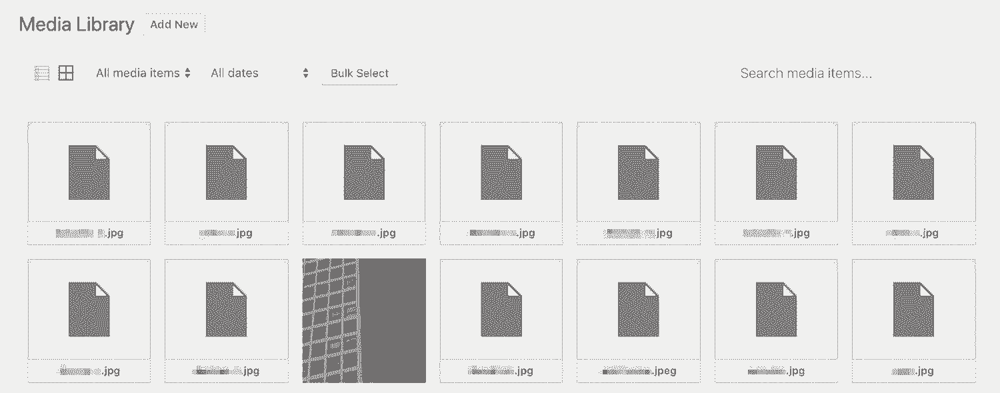

Broken image files in the Media Library


发生这种情况的原因多种多样，包括:

*   您的服务器出现问题，例如[性能问题](https://kinsta.com/blog/debugging-wordpress-performance/)。
*   你的插件和/或主题之间的兼容性错误。
*   不正确的文件权限。
*   一个[黑客攻击](https://kinsta.com/blog/wordpress-hacked/)或者[其他攻击](https://kinsta.com/blog/what-is-a-ddos-attack/)。

为了[修复问题](https://wordpress.org/support/topic/media-library-images-appear-to-be-broken/)，你可以尝试将你的**上传**目录的文件权限重置为 755。如果这不起作用，看看是否有任何插件冲突。之后，如果你的图像还是坏了，联系你的主机提供商看看是不是服务器的问题。

#### 29.“裁剪您的图像时出现错误”

在 WordPress 媒体库中，你可以对你上传的图片进行一些小的编辑，比如旋转和裁剪。尝试以这种方式编辑时，您可能会收到消息:“裁剪您的图像时出现错误”。

该错误有两种可能的原因。首先，你运行的是一个过时的 PHP 版本，在这种情况下，你可以简单地通过[升级来修复它](https://kinsta.com/knowledgebase/how-to-update-php-in-wordpress/)。另一方面，你的服务器可能缺少必要的**图形绘制(GD)** 包。

如果是这种情况，您需要[根据您的设置按照适当的步骤安装它](https://bobcares.com/blog/wordpress-error-cropping-image/)。如果你遇到麻烦，你应该联系你的主机提供商寻求帮助。

#### 30.不正确的脸书缩略图

社交分享是建立网站受众的有效方法。然而，有时当[你的帖子被分享到脸书](https://kinsta.com/blog/wordpress-facebook-plugins/)时，可能会显示错误的缩略图。

当帖子中的多个图像包含开放图表(OG)标签时，通常会出现这种情况。脸书使用这个标签来猜测哪个图像应该被用作缩略图，但是当多个图像包含它时，平台就会变得混乱。

解决这个问题的一个方法是使用 Yoast SEO 的社交分享功能。通过这个插件设置你的脸书缩略图，你可以确保正确的图片有 OG 标签。

### 数据库错误

你的 WordPress 安装由两个关键部分组成:文件和数据库。虽然你更有可能定期与前者互动，但你的[数据库](https://kinsta.com/knowledgebase/wordpress-repair-database/)对你的网站正常运行也是至关重要的。

#### 31.建立数据库连接时出错

如果您的网站[无法与您的 MySQL 数据库](https://kinsta.com/blog/error-establishing-a-database-connection/)建立连接，它将无法检索显示您的内容所需的数据。相反，您会看到类似这样的错误:

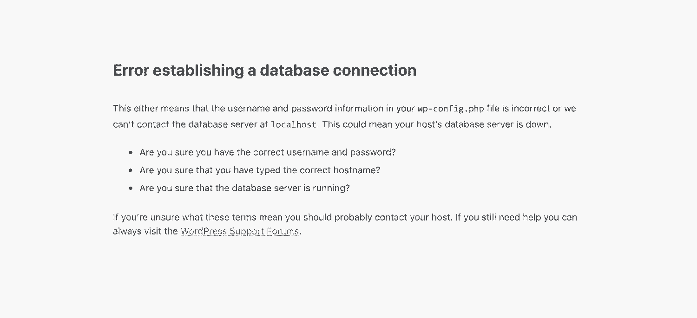

The Error Establishing a Database Connection


这将阻止用户查看你网站的前端，同时也将你锁定在你的 WordPress 仪表盘之外。该错误最常见的原因是您的数据库凭据不正确。你可以在你的**wp-config.php**文件中修改它们。

#### 32.WordPress 数据库已损坏

“损坏”是一个通用术语，适用于 WordPress 数据库和文件，当它们被破坏或不可用时。这通常会导致建立数据库连接时出错。

理想情况下，您会希望[恢复数据库](https://kinsta.com/knowledgebase/mysql-backup-database/)的备份来替换损坏的版本。如果这不可能，你也可以通过添加 define('WP_ALLOW_REPAIR '，true)函数到你的 wp-config.php 文件**来修复这个错误。**

建议阅读:看看这个关于如何解决和修复 WordPress 数据库问题的指南。你也可以通过使用免费的 [WordPress 数据库插件](https://kinsta.com/blog/wordpress-database-plugin/)来解决这些问题。

### PHP 错误

PHP 是一种编码语言，是 WordPress 的一部分。与其功能相关的问题可能会阻止您编辑您的站点，或者导致干扰性的消息和通知。

#### 33.WordPress 中的 PHP 错误

当你的 WordPress 站点的 PHP 出现问题时，你会在你的 [WordPress 仪表盘](https://kinsta.com/knowledgebase/wordpress-admin/)顶部看到一条消息或警告，说明问题是什么以及哪些文件受到了影响。

这些消息是给[开发者](https://kinsta.com/blog/wordpress-developer-salary/)的，这样他们就可以挖掘他们网站的代码并修改问题。如果你没有 PHP 的经验，试图解决这些错误可能会给你的网站带来更多的问题。

如果这就是你的情况，不要担心。PHP 错误不应该阻止你的网站运行或阻止用户访问它。

理想情况下，你应该联系任何可能导致问题的相关插件或主题的开发者。否则，你可以[雇佣一个开发者](https://kinsta.com/blog/hire-wordpress-developer/)来帮你修复。

#### 34."缺少一个临时文件夹"

任何时候你上传一个文件到你的 WordPress 站点，在移动到它的永久目录之前，它首先存储在一个临时文件夹中。然而，服务器上不正确的 PHP 设置可能会阻止对这个临时文件夹的访问，导致你的 WordPress 站点出错。

## 注册订阅时事通讯


### 想知道我们是怎么让流量增长超过 1000%的吗？

加入 20，000 多名获得我们每周时事通讯和内部消息的人的行列吧！

[Subscribe Now](#newsletter)

解决这个问题需要您[通过 FTP](https://kinsta.com/blog/best-ftp-clients/) 访问您的服务器，并将以下函数添加到您的【wp-config.php】文件**中:**

```
define(‘WP_TEMP_DIR’, dirname(__file__). ‘/wp-content/temp/’);
```

然后，你可以添加一个名为 **temp** 的新文件夹到你的 **wp-content** 目录中。

### WordPress 文件错误

从你的帖子和页面到你的[插件](https://kinsta.com/best-wordpress-plugins)和[主题](https://kinsta.com/best-wordpress-themes/)，你的 WordPress 安装包含了成百上千的文件。与这些关键组件相关的错误会导致内容丢失或不可用。

#### **查看我们修复 WordPress 文件错误的视频指南:**


#### 35."目标文件夹已经存在"

当你在你的 WordPress 站点上安装一个新的主题或插件时，你的服务器上会创建一个文件夹来存储它的文件。如果您尝试安装插件或主题，并且您的服务器上已经存储了一个同名的文件夹，您会看到一条错误消息“目标文件夹已经存在…插件安装失败”:

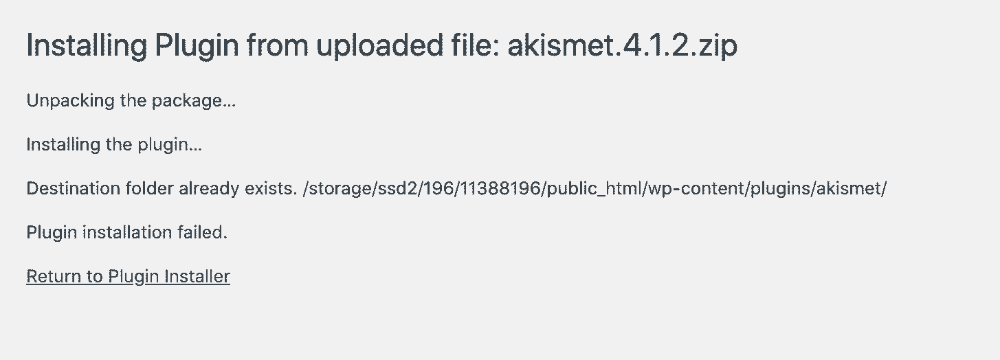

The “Destination folder already exists” error


当遇到这个问题时，你的第一步应该是检查插件或主题是否已经安装。

如果没有，通过 FTP 访问你的服务器并导航到你的 **wp-content** 文件夹。然后，浏览你的插件或主题，看看是否存在与你要安装的组件同名的文件夹。删除该文件夹后，您可以再次尝试安装。

#### 36.缺少 WordPress 主题样式表

CSS 是一种编码语言,它决定了你网站的“风格”。这可能包括颜色、[字体](https://kinsta.com/blog/how-to-change-font-in-wordpress/)，以及其他各种让你的网站看起来有趣的元素。

当谈到 [WordPress themes](https://kinsta.com/best-wordpress-themes/) 时，所有必要的 CSS 都包含在一个叫做‘样式表’的文件中。如果您的主题的样式表不可用，您的站点将无法正确加载，您将看到一个错误:


The “Stylesheet is missing” error in the WordPress themes list


这也可能发生在主题安装期间:

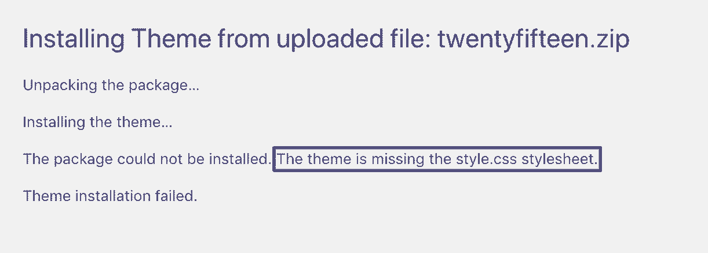

A failed theme installation due to a missing stylesheet


这可能是因为你的主题的样式表还没有上传到你的服务器上，或者是因为它的名字不正确，所以找不到。为了解决问题，通过 FTP 访问你的服务器并导航到你的主题子目录。

然后，寻找主题的样式表。如果它不在那里，从你的主题文件中获取并上传到你的服务器。确保文件被命名为 **style.css** ，并保存在正确的主题文件夹中。

#### 37.Pluggable.php 文件错误

你的 WordPress 站点的**pluggable.php**文件允许用户、插件和主题覆盖核心功能。如果插件或主题编码不正确，可能会导致与该文件冲突。

这个问题将作为 php 错误消息出现在你的 WordPress 仪表盘上，它引用了你的**pluggable.php**文件。然而，问题的原因通常不在 pluggable.php 本身的**内部，例如，它可能是你的 wp-config.php**或 functions.php 的**。**

相反，您需要在错误消息中找到冲突的真正位置。然后，导航到相关文件，并通过删除空格、空行或类似的东西来修复它。

#### 38.WordPress 文件已损坏

正如你的 WordPress 数据库会被破坏一样，它的文件也会被破坏。这将使它们不可访问，这是一个大问题，尤其是当涉及到核心文件时。

损坏的文件可能是服务器故障、不正确的文件权限或 PHP 版本错误的结果。最简单的解决方法是[恢复一个站点备份](https://kinsta.com/blog/restore-wordpress-from-backup/)。这只是在 [MyKinsta](https://kinsta.com/mykinsta/) 点击几下的问题。

首先，登录 [MyKinsta 仪表盘](https://my.kinsta.com/)。转到左边的“站点”,然后点击你需要恢复备份的 WordPress 站点。

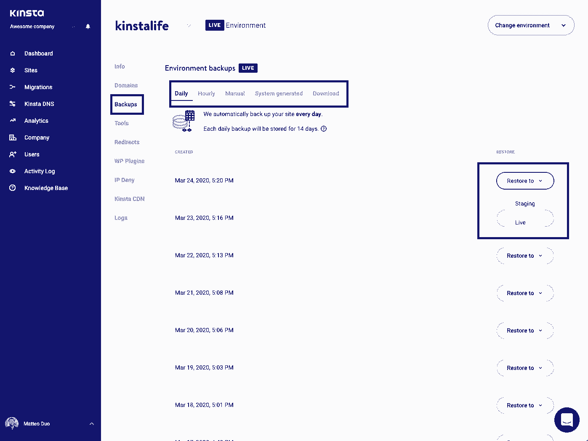

Restore WordPress from Backup in MyKinsta


从提供的选项中选择你喜欢的备份选项，点击“恢复到”按钮，决定你是否想要你的 [WordPress 站点备份](https://kinsta.com/blog/backup-wordpress-site/)恢复到你的实时或临时站点。

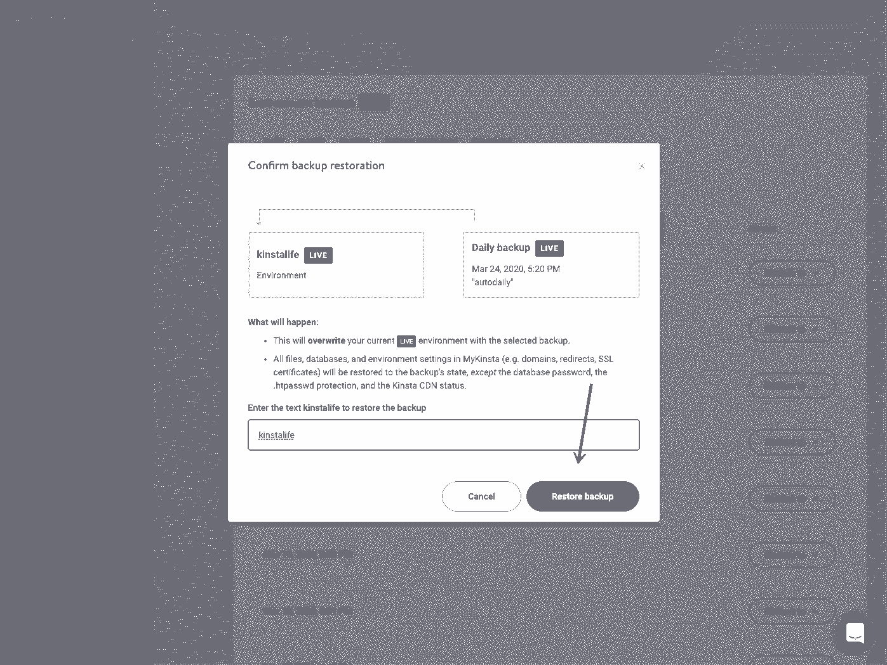

Restoring a WordPress backup to live site in MyKinsta


然后，您必须通过输入您的站点名称来确认备份恢复。然后点击“恢复”这将**覆盖你的生活环境**。

或者，你可以通过下载 WordPress 来替换核心文件，通过 FTP 删除损坏的文件，然后从 WordPress **上传新的副本。zip** 文件。

### 浏览器错误

访问者使用他们选择的浏览器访问您的网站。这意味着各种浏览器错误会阻止用户访问您的网站。防止它们将帮助你避免错过交通。

#### **查看我们的浏览器错误终极指南:**


#### 39.Chrome 中的“不安全”警告

使用谷歌浏览器浏览互联网时，你可能已经注意到一些网页的网址旁边有一个“不安全”的警告:


The “Not Secure” warning in Google Chrome


当网站没有使用 [SSL 证书](https://kinsta.com/knowledgebase/how-ssl-works/)时，浏览器会显示此警告。如果你的页面在用户的浏览器中触发了这些信息，它会伤害你网站的可信度，影响你的流量水平、 [SEO](https://kinsta.com/blog/what-does-seo-stand-for/) 和转化率。为了防止这种情况发生，你可以[安装一个 SSL 证书](https://kinsta.com/help/how-to-install-ssl-certificate/)。

最近，Chrome 开始为没有使用 TLS 1.2 或 1.3 的网站显示 [ERR_SSL_OBSOLETE_VERSION 警告消息](https://kinsta.com/knowledgebase/err_ssl_obsolete_version/)。

#### 40.“您的连接不是私人的”浏览器错误

比 Chrome 中的“不安全”警告更糟糕的是[“你的连接不是私人的”页面](https://kinsta.com/blog/your-connection-is-not-private/)。由于 SSL 证书有问题(或没有证书)，此错误会阻止用户轻松访问您的站点。

如果他们遇到这个页面，用户可能会因为害怕他们的个人信息被窃取而被吓跑。您可以通过[确保正确安装您的 SSL 证书来防止这种情况发生](https://kinsta.com/knowledgebase/err_ssl_obsolete_version/#how-to-find-out-what-version-of-tls-your-site-is-running)，但这也可能是一个客户端问题，您的用户必须自己解决。

#### 41.ERR _ TOO _ MANY _ 重定向

重定向循环，通常显示为 ["ERR_TOO_MANY_REDIRECTS"](https://kinsta.com/blog/err_too_many_redirects/) ，当您的服务器上出现重定向的[错误配置时就会发生。](https://kinsta.com/blog/wordpress-redirect/)

例如，这可能意味着 URL 1 指向 URL 2，但 URL 2 又指向 URL 1，从而导致无限循环。用户可以尝试通过删除你网站的 cookies 和[清除他们的浏览器缓存](https://kinsta.com/knowledgebase/how-to-clear-browser-cache/)来修复这个错误。您还可以尝试确定重定向循环的性质，以便找出问题的根源，然后解决它。

#### 42.错误连接被拒绝

像许多浏览器问题一样，[ERR _ CONNECTION _ rejected 问题](https://kinsta.com/blog/err_connection_refused/)通常不是由 WordPress 特有的问题引起的。然而，如果用户因为 Chrome 中的这条消息而无法访问您的网站，那么告诉他们如何解决这个问题仍然会有所帮助。

出现 ERR _ CONNECTION _ rejected 错误是因为用户的浏览器无法连接到您站点的服务器。这可能是服务器端的问题，在这种情况下，你应该检查你的网站是否关闭，并联系你的主机提供商。或者，你可以尝试指导你的用户重启他们的路由器并[清空他们的浏览器缓存](https://kinsta.com/knowledgebase/how-to-clear-browser-cache/)。

#### 43.错误 _ 空 _ 响应

当用户的浏览器向您的站点发送请求，而您的服务器没有发回任何信息时，就会出现问题。针对这个问题最流行的[修复是清除你的浏览器缓存并重置你的网络设置。](https://blog.pcrisk.com/windows/12807-err-empty-response)

你可能还想建议遇到这个问题的用户禁用他们正在使用的任何 [Chrome 扩展](https://kinsta.com/blog/best-chrome-extensions/)，并尝试暂时禁用他们的防病毒软件。

#### 44.DNS_PROBE_FINISHED_NXDOMAIN 浏览器错误

[你的 DNS](https://kinsta.com/knowledgebase/what-is-dns/) 是获取你网站的 IP 地址并将其转换成可读域名的系统，比如 kinsta.com 的*。如果你的 DNS 无法将你的域名正确转换成你网站的 IP 地址，用户将会在 Chrome 中看到 [DNS_PROBE_FINSHED_NXDOMAIN 浏览器错误](https://kinsta.com/knowledgebase/dns_probe_finished_nxdomain/)。*

 *解决这个问题的第一步是释放和更新您的 IP 地址。如果这不起作用，你可以建议用户尝试暂时禁用他们的防病毒软件或虚拟专用网络(VPN)。

建议阅读:[如何修复 DNS_PROBE_FINISHED_BAD_CONFIG 错误代码](https://kinsta.com/knowledgebase/dns_probe_finished_bad_config/)。

#### **查看我们的视频指南，修复 DNS_PROBE_FINISHED_NXDOMAIN 浏览器错误:**


厌倦了体验你的 WordPress 网站的问题？通过 Kinsta 获得最好、最快的主机支持！[查看我们的计划](https://kinsta.com/plans/?in-article-cta)

### 疑难解答各种 WordPress 错误

虽然许多 WordPress 错误可以追溯到一个特定的原因，但有些更难诊断。它们可能有多种可能的来源，或者可以追溯到一个看起来并不重要的微小细节。

以下是各种各样的 WordPress 问题，这些问题并不完全符合我们到目前为止所讨论的类别。

#### **查看我们修复 WordPress 错误的视频指南:**


#### 45.死亡的白色屏幕

WordPress 最著名的错误之一是[死亡白屏(WSoD)](https://kinsta.com/blog/wordpress-white-screen-of-death/) 。它会使你的网站向用户显示为一个空白的页面。这个问题也可能[把你锁在你的 WordPress 仪表盘之外](https://kinsta.com/blog/locked-out-of-wordpress-admin/)。通常，这是由插件兼容性问题引起的。

解决这个问题的最好方法是找到引起冲突的插件并删除它。其他可能的原因包括语法错误，达到您的[站点的内存限制](https://kinsta.com/knowledgebase/wordpress-memory-limit/)，以及文件权限问题。

#### **看看我们修复死亡白屏的视频指南:**

#### 46.被锁定在 WordPress 管理仪表板之外

你的 WordPress 仪表盘对于很多任务都非常重要，包括修复很多常见的 WordPress 错误。然而，有时你在网站上遇到的问题会把你锁在你的 WordPress 仪表盘之外。

这个问题有许多可能的原因。如果可以，试着确定你是否因为一个单独的问题而被锁定，然后采取措施解决问题的根源。你也可以尝试恢复你网站的备份，或者通过 FTP 禁用一个[安全插件](https://kinsta.com/blog/wordpress-security-plugins/),如果你认为它阻止了你网站的后端。

#### 47.无法通过 SSH 或 SFTP 连接

有时，WordPress 管理或故障排除会要求你直接访问你的服务器。 [SFTP](https://kinsta.com/knowledgebase/how-to-use-sftp/) 使你能够访问你的文件(了解 SFTP 和 FTP 之间的[差异)，SSH 允许各种各样的其他远程任务(这里有一个关于如何](https://kinsta.com/knowledgebase/ftp-vs-sftp/)[开始使用 SSH](https://kinsta.com/blog/how-to-use-ssh/) 的指南)。

如果你试图使用 SFTP 或 SSH 访问你的服务器，但无法连接，你可能需要从你的**已知主机**文件中[删除过时的 IP 地址](https://kinsta.com/help/cant-connect-delete-ssh-known-hosts/)。

#### 48.SSH 连接被拒绝

如果您试图通过 SSH 连接到您的服务器，并且在您的命令行界面中看到一条消息，内容为[“连接被拒绝”](https://kinsta.com/knowledgebase/ssh-connection-refused/)，那么问题略有不同:


The Connection refused error message in Terminal


代替编辑 **known_hosts** ，您需要检查一些与您的 SSH 配置相关的东西。

首先，确保您的服务器安装了 SSH 守护进程。您还应该[检查您的凭证](https://kinsta.com/blog/how-to-use-ssh/#how-to-connect-to-your-server-via-the-command-line)并确定您正在使用的端口是否打开。该问题也可能是由于您的防火墙设置。

#### **查看我们的视频指南，修复 SSH 连接被拒绝的错误:**


#### 49.暂时无法进行定期维护

每当你在你的 WordPress 站点上运行更新时，它会暂时进入[维护模式](https://kinsta.com/blog/wordpress-maintenance-mode/)。在此期间，任何试图访问您网站的人都会看到一条类似于[“暂时无法进行定期维护”的消息。一分钟后检查"](https://kinsta.com/knowledgebase/briefly-unavailable-for-scheduled-maintenance/):


The “Briefly unavailable for scheduled maintenance” message in WordPress


这不是一个真正的错误，因为它应该发生，但用户可能会有不同的解释。如果他们联系你，但你没有遇到麻烦，你会建议他们重新加载页面。

另一方面，如果你在 WordPress 中运行更新时看到这条消息，你的网站可能已经陷入了维护模式。

#### 50.WordPress 卡在维护模式

在更新过程中关闭你的浏览器或者运行批量插件更新会导致你的站点[陷入维护模式](https://kinsta.com/knowledgebase/wordpress-stuck-in-maintenance-mode/)。在这种情况下，当您运行更新时，您将看到用户在前端看到的相同消息。

幸运的是，解决这个问题非常简单。你所要做的就是通过 FTP 访问你网站的文件，并删除名为**的文件。维护**:


The .maintenance file in FileZilla


之后，你可以检查你的网站，一切都会好起来。

#### 51.更改在您的实时网站上不可见

如果你已经做了大量的工作来更新你的网站，但是只检查了一下前端，发现没有一个是可见的，你可能会感到沮丧。好消息是，这个问题通常很容易解决。

大多数情况下，这是缓存问题的结果。首先，您可以尝试清除浏览器缓存。如果您的更改仍然不可见，并且您正在使用一个[缓存插件](https://kinsta.com/blog/wordpress-caching-plugins/)，请查看其文档以了解如何清除插件的缓存。

#### 52.错过的时间表

一致的上传时间表是强大的内容战略的一部分。WordPress 可以帮助你安排文章在特定的日期和时间发表。


The Scheduled Post Trigger plugin


不幸的是，它并不总是像预期的那样工作，导致[错过进度错误](https://kinsta.com/knowledgebase/wordpress-missed-schedule/)。一般来说，这个问题最快的解决方案要么是通过插件，如[预定帖子触发器](https://wordpress.org/plugins/scheduled-post-trigger/)或 [WP 预定帖子 Pro](https://wpdeveloper.net/plugins/wp-scheduled-posts/) ，要么是通过编辑 cron 作业。

在 Kinsta 这里，我们[配置你的 WordPress cron 作业](https://kinsta.com/help/how-to-write-a-cron-job/)以 15 分钟的间隔在系统级运行。

#### 53.自动更新失败

为了帮助你的网站[保持最新版本的 WordPress](https://kinsta.com/knowledgebase/check-wordpress-version/) ，你可以启用[自动更新](https://kinsta.com/blog/wordpress-automatic-updates/)。这有助于简化网站维护的这一方面并保证网站的安全，但有时也会导致问题。

自动更新有时会失败，在这种情况下，您的网站可能会关闭，用户无法使用。建议的修复方法是改为执行手动更新。

#### 54.WordPress 导入问题

出于各种原因，你可能会发现你需要[导入内容到你的 WordPress 站点](https://kinsta.com/knowledgebase/wordpress-import-issues/)。这在开发人员中是相当常见的做法，各种插件经常被用于这项任务。

不幸的是，导入很容易导致 PHP 或 HTTP 超时。为了避免这些问题，您可以:

*   切换到更快的互联网连接。
*   使用 [WP-CLI](https://kinsta.com/blog/wp-cli/) 导入您的文件。
*   增加你的 PHP 超时限制。

您可能还需要联系您的主机提供商来帮助解决这个问题。

#### 55.WordPress 性能问题

你的网站的性能或多或少等同于它的速度。快速加载页面有助于更好的 UX 和搜索引擎优化，所以定期监控和优化你网站的速度是很重要的。 [Pingdom](https://kinsta.com/blog/pingdom-speed-test/) 是一个从多个位置测试加载时间的便捷工具:


The Pingdom Website Speed Test


测试完您的站点后，Pingdom 会给出一个关于如何提高其性能的建议列表。常见的解决方案包括[图像压缩](https://kinsta.com/blog/optimize-images-for-web/)、[缓存](https://kinsta.com/blog/wordpress-cache/)和[启用 CDN](https://kinsta.com/help/kinsta-cdn/) 。

#### 56.WordPress 没有发送电子邮件

对于许多 WordPress 网站来说，电子邮件营销是一个关键策略，它可以增加你的流量和转化率。有几个插件可以让你从你的 WordPress 仪表板发送电子邮件，方便地将你的电子邮件营销平台与你的网站后端捆绑在一起。

通常，如果你的[邮件没有发送](https://kinsta.com/blog/wordpress-not-sending-email/)给你的订阅者，那是因为你的服务器的配置。您的主机可能对您的站点可以使用的资源有[限制](https://kinsta.com/blog/free-smtp-server/)，这阻止了电子邮件的发送。

如果您怀疑存在与服务器相关的问题，请联系您的主机。你可能需要升级你的计划。或者，你正在使用的插件可能是问题的根源。请查看其支持论坛和文档以了解常见问题，或者联系开发人员寻求支持。

最后，从 WordPress 发送的邮件可能会被标记为垃圾邮件。如果某个用户因为丢失了一封邮件而联系你，告诉他们检查一下他们的垃圾文件夹以防万一。

#### 57.WordPress 语法错误

语法错误是指代码的语法或结构有问题。这可能包括使用不当的标点符号或其他打字错误。在某些情况下，语法错误会将您锁定在仪表板之外，并破坏您的站点。

尽管根本原因看似无关紧要，**但这种错误相当严重**。这经常发生在你[粘贴你在网上找到的代码片段的时候](https://kinsta.com/knowledgebase/edit-wordpress-code/)。如果你最近做过类似的事情，那很可能是你问题的根源。

要解决这个问题，使用 FTP 导航到您在[中粘贴的代码片段的位置，并纠正或删除它。](https://kinsta.com/blog/best-ftp-clients/)

#### 58.WordPress 工具条出现在内容的下面

侧边栏对于向你的用户显示关键内容很有用，比如你的[导航菜单](https://kinsta.com/blog/website-navigation/)、 [WordPress 搜索功能](https://kinsta.com/blog/wordpress-search/)、[社交图标](https://kinsta.com/blog/wordpress-social-media-plugins/)，甚至[免责声明](https://kinsta.com/affiliate-academy/affiliate-disclosures/)。然而，如果你的侧边栏看起来很奇怪，因为它出现在你的内容下面而不是旁边，那你就有问题了。

这通常是一个或多个主题文件中误用了

标签的结果。您需要追踪问题的根源，以便纠正您的代码并修复它。这也可能是由于你的站点宽度的问题，浮动属性错误，或者你的 [WordPress 主题](https://kinsta.com/blog/wordpress-delete-theme/)的其他问题。

#### 59.可视化编辑器中的白色文本和缺少的按钮

你的 WordPress 编辑器非常重要。没有它，给你的网站添加新内容将会更加困难。如果你曾经打开[经典编辑器](https://kinsta.com/blog/disable-gutenberg-wordpress-editor/)发现工具栏中所有的按钮都不见了，你的文本颜色被设置为白色，你可能已经感受到了无法使用该功能带来的痛苦。

通常，这个错误是由于插件冲突或缓存问题。如果清除你的浏览器缓存或者停用你的插件不能解决问题，你可能需要替换一些你的 WordPress 核心文件。

#### 60.WordPress RSS 订阅源问题

RSS 提要是一种通过监管来支持你的网站的简单方法。它们对新闻网站和其他内容中心特别有用。但是，RSS 提要中的错误会显得不专业，并阻止用户查看内容。

这些错误可能是由于在你的**functions.php**文件或插件中关闭 PHP 标签后的额外空格或换行符引起的。您可以找到并删除它们，以消除此问题。或者，你可能还需要测试[插件和主题的不兼容性](https://kinsta.com/knowledgebase/banned-plugins/)或者简单的[禁用 WordPress 的默认 RSS 订阅功能](https://kinsta.com/knowledgebase/wordpress-disable-rss-feed/)。

#### 61.WordPress 未能打开流

如果你看到一个错误信息“未能打开流”，这意味着 WordPress 无法打开你的代码中引用的文件。

该错误可能是由各种问题引起的，但该消息通常会告诉您问题的来源。可能的反应包括:

*   没有这样的文件或目录。
*   拒绝许可。
*   操作失败。

纠正问题所需的行动将取决于您看到的是哪种反应。可能有一个文件丢失，你的权限设置不正确，或者 WordPress 在连接第三方 API 时遇到问题。

#### 62.密码重置键错误

如果[用户能够在你的网站](https://kinsta.com/blog/wordpress-user-registration-plugins/)上注册账户，他们有时可能需要重设密码。在某些情况下，默认的密码重置电子邮件会提供一个链接，将用户引导回登录页面，在那里他们会看到一条消息，内容是:“此密钥无效或已被使用。请再次尝试重置密码。

通常，这是一个缓存问题。如果你的网站上安装了一个[缓存插件](https://kinsta.com/blog/wordpress-caching-plugins/)，确保你已经在插件的设置中禁用了*我的账户*页面的缓存。与[验证码插件](https://kinsta.com/blog/wordpress-captcha/)冲突的例子[也被报道](https://wordpress.org/support/topic/error-empty-captcha-2/)。

#### 63.登录页面不断刷新

如果点击你的 [WordPress 登录页面](https://kinsta.com/blog/wordpress-login-url/)上的**登录**按钮仅仅是刷新页面，而不是把你带到你的仪表板，可能有问题发生了:

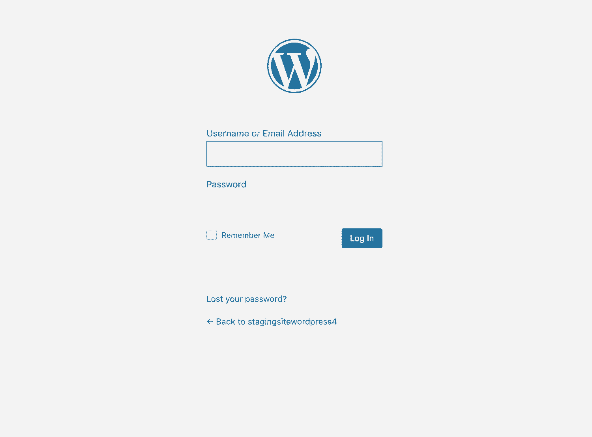

The WordPress login screen


这个问题可能是由于插件冲突，[错误的 WordPress 地址](https://kinsta.com/knowledgebase/wordpress-keeps-logging-me-out/#manually-update-wordpress-addresses)，或者损坏的[。htaccess 文件](https://kinsta.com/knowledgebase/wordpress-htaccess-file/)。

#### 64.WordPress 一直让你注销

与登录页面刷新错误不同，这个问题让你可以短暂地访问你的 WordPress 仪表盘，但是[突然让你退出](https://kinsta.com/knowledgebase/wordpress-keeps-logging-me-out/)。这通常是因为你的 WordPress 站点设置有问题。

如果你遇到这个错误，你的通用设置中的 WordPress **地址**和**网站地址**可能不匹配:

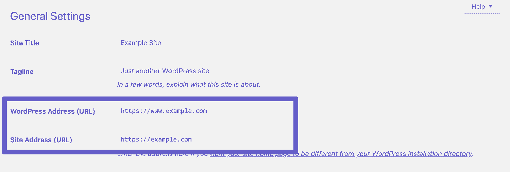

The WordPress Address and Site Address in the General Settings


这可能包括看似很小的差异，比如两个 URL 是否都在开头包含了 **www** 。更改 URL 使它们匹配应该可以解决这个问题。

如果你因为 WordPress 一直让你退出而无法通过你的仪表盘来完成这项工作，你可以通过[编辑你的 wp-config.php 文件](https://kinsta.com/blog/free-html-editor/)来完成这项工作。

#### 65.“你确定要这么做吗？”

最令人沮丧的 WordPress 错误是那些没有指出是什么原因导致的错误。“您确定要这样做吗？”就是这样一个问题。

大多数情况下，这是由[插件或主题冲突](https://kinsta.com/knowledgebase/the-site-is-experiencing-technical-difficulties/#step-2-troubleshoot-for-a-plugin-or-theme-conflict)造成的，可以通过标准的故障诊断来解决。如果这不起作用，你可能需要更换你的 wp-config.php[文件](https://kinsta.com/knowledgebase/how-to-clear-browser-cache/)。

#### 66."另一个更新正在进行中"

通常，当 WordPress 仍在执行[核心更新](https://kinsta.com/help/managed-wordpress-scope-of-support/#do-you-update-wordpress-core-themes-or-plugins)时，如果你试图运行插件或[主题更新](https://kinsta.com/blog/how-to-update-wordpress-theme/)，就会出现“另一个更新正在进行中”的错误。

这通常发生在自动核心安全更新期间。第一次更新完成后，该消息应该会自动消失。如果没有，那你就犯了一个错误。您可以在 [phpMyAdmin](https://kinsta.com/help/wordpress-phpmyadmin/) 中通过从 **wp_options** 表中删除 **core_updater.lock** 行来解决它。

#### 67.移至垃圾桶时出错

WordPress 可以让你通过点击一个按钮轻松地从你的网站上删除文章和页面。但是，在尝试将内容移到废纸篓时，各种问题可能会导致错误。

这可能是因为[缓存问题](https://kinsta.com/knowledgebase/how-to-clear-browser-cache/)或插件冲突。这也可能是由于[数据库损坏](https://kinsta.com/knowledgebase/wordpress-repair-database/)或不正确的文件权限。

#### 68.WordPress 安装错误

虽然 WordPress 以其简单的五分钟安装过程而闻名，但你可能还是会遇到麻烦。[潜在问题](https://themes.artbees.net/blog/common-errors-wordpress-installation/)包括[错误建立数据库连接](https://kinsta.com/blog/error-establishing-a-database-connection/)和 [500 内部服务器错误](https://kinsta.com/blog/500-internal-server-error/)，我们在这篇文章的其他地方已经讨论过了。

您还可能会遇到“邮件头已发送”的错误消息。这可能是因为代码中有不必要的空格或 PHP 标签。该消息应该告诉您问题在哪里，您可以通过编辑相关文件来解决它。

#### 69.“网站遇到技术困难”

自从 WordPress 5.2 发布以来，这个错误变得越来越频繁。它通常出现在核心、插件或主题更新期间:

 *一条错误消息，内容为:“站点遇到技术问题。”*

导致[“网站遇到技术困难”错误](https://kinsta.com/knowledgebase/the-site-is-experiencing-technical-difficulties/)的原因通常是 [PHP 内存限制错误](https://kinsta.com/knowledgebase/wordpress-memory-limit/)或插件冲突。你可以[用不同的方式增加你网站的内存](https://kinsta.com/blog/wordpress-http-error/#increase-php-memory-limit)。

要解决插件冲突，请尝试停用插件，然后逐个重新激活，看看哪个插件导致错误再次出现。


### 信息

Kinsta 客户的默认内存限制设置为 256 MB。如果你在 Kinsta 托管你的 WordPress 站点，你应该不会有内存不足的问题。


#### 70.“自动 WordPress 更新失败——请现在再次尝试更新”

你可能在你的 WordPress 管理面板顶部遇到过这个错误:“**自动 WordPress 更新失败——请现在再次尝试更新。**


WordPress Error: “An automated WordPress update has failed to complete – please attempt the update again now.”


这个错误通常是由 WordPress 在主题、插件或 WordPress 本身更新后进入“维护模式”引起的。

此错误通常可以通过手动更新任何失败的自动更新来解决。

如果这个消息持续出现，可能是因为你的 WordPress 站点停留在“维护模式”。这可以通过删除“.”来解决。维护”文件，或者通过 cPanel 的[或者使用 SFTP](https://kinsta.com/knowledgebase/what-is-cpanel/) 的[。查看我们的指南](https://kinsta.com/knowledgebase/how-to-use-sftp/)[修复陷入维护模式的 WordPress】，获得逐步的指导。](https://kinsta.com/knowledgebase/wordpress-stuck-in-maintenance-mode/)

#### 71.你的 WordPress 站点关闭了

一个不可用的网站会导致流量和收入的损失。如果你确定你的 [WordPress 站点关闭了](https://kinsta.com/blog/website-downtime/)，第一步是确定原因是 WordPress 错误还是你的服务器遇到了麻烦。其他 WordPress 错误的症状可能会提示你潜在的问题。

如果没有，你可以尝试[检查你的服务器的错误日志](https://kinsta.com/feature-updates/error-logs-now-visible-kinsta/)。以下是在 MyKinsta 中的做法:

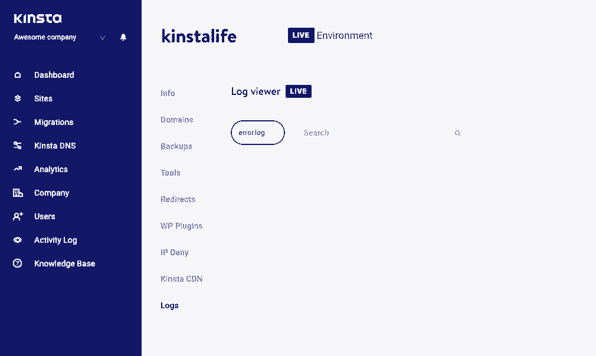

Accessing error logs in MyKinsta 


如果您的服务器无法正常工作或不知道发生了什么，您应该联系您的主机提供商寻求帮助。

[Steps to fixing any #WordPress error: Read this guide. ✅ That's it. That's all the steps. 😃Click to Tweet](https://twitter.com/intent/tweet?url=https%3A%2F%2Fkinsta.com%2Fblog%2Fwordpress-errors%2F&via=kinsta&text=Steps+to+fixing+any+%23WordPress+error%3A+Read+this+guide.+%E2%9C%85++That%27s+it.+That%27s+all+the+steps.+%F0%9F%98%83&hashtags=wptips%2Cwordpress)

## 摘要

任何网站所有者都不希望他们的 WordPress 网站对用户不可用或者出现问题。这不仅会导致你错过任何销售、[广告浏览量](https://kinsta.com/blog/how-to-add-google-adsense-to-wordpress/)、 [SEO](https://kinsta.com/blog/wordpress-seo/) 、[转化率](https://kinsta.com/blog/conversion-rate-optimization-tips/)，甚至[你可能已经赚到的代销商佣金](https://kinsta.com/blog/affiliate-system/)。

这也会让你的网站看起来不那么可靠，损害你的品牌声誉，这可能很难修复。

这就是为什么我们将这些常见的 WordPress 错误都集中在一个页面上，以帮助你尽可能容易地找到修复方法，并让你的业务快速回到正轨。那不是很方便吗？

你对 WordPress 网站上的错误诊断有任何问题吗？请在下面的评论区提问！

* * *

让你所有的[应用程序](https://kinsta.com/application-hosting/)、[数据库](https://kinsta.com/database-hosting/)和 [WordPress 网站](https://kinsta.com/wordpress-hosting/)在线并在一个屋檐下。我们功能丰富的高性能云平台包括:

*   在 MyKinsta 仪表盘中轻松设置和管理
*   24/7 专家支持
*   最好的谷歌云平台硬件和网络，由 Kubernetes 提供最大的可扩展性
*   面向速度和安全性的企业级 Cloudflare 集成
*   全球受众覆盖全球多达 35 个数据中心和 275 多个 pop

在第一个月使用托管的[应用程序或托管](https://kinsta.com/application-hosting/)的[数据库，您可以享受 20 美元的优惠，亲自测试一下。探索我们的](https://kinsta.com/database-hosting/)[计划](https://kinsta.com/plans/)或[与销售人员交谈](https://kinsta.com/contact-us/)以找到最适合您的方式。**