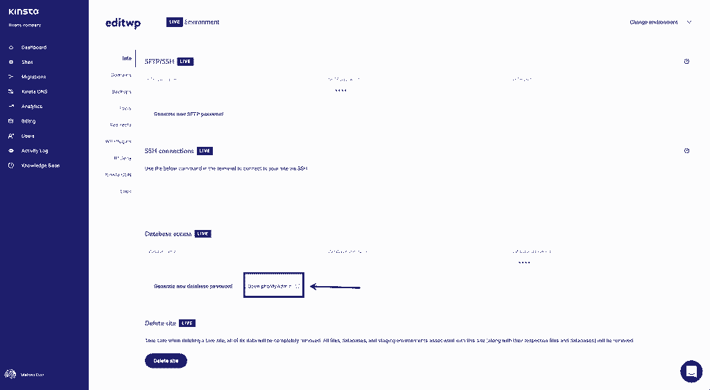

# 在 WordPress 中获得文章和页面 id 的 5 种方法

> 原文：<https://kinsta.com/blog/wordpress-get-post-id/>

在很多情况下，你可能需要知道 WordPress 中特定页面或文章的 ID。例如，一个[插件](https://kinsta.com/best-wordpress-plugins)可能需要它来从一个特性中排除那个页面。或者，如果你是一个[开发者](https://kinsta.com/blog/hire-wordpress-developer/)，你可能需要查询那个 ID。

页面和文章 ID 号是 WordPress 识别你网站上每一部分内容的方式。传统上，该平台不会公开显示这些信息，但如果你知道在哪里可以找到这些信息，就很容易找到。事实上，在 WordPress 中有很多方法可以获得文章 id。

在这篇文章中，我们将向你展示在 WordPress 中获取文章 id 的五种不同方法，从传统的到非传统的。

我们开始吧！

### 更喜欢看[视频版](https://www.youtube.com/watch?v=1cnKJl2rzMs)？


## 为什么知道如何识别 WordPress 文章和页面 id 是有用的

在内部，WordPress 通过 ID 号识别特定的页面和文章。如果你正在使用一个插件，询问你想要包含或排除哪些帖子，这些信息有时是必要的。


WordPress 帖子 id 在某些情况下对于[构建自定义短代码](https://kinsta.com/blog/wordpress-shortcodes/)也是必要的。如果你使用的短代码要求你指定一篇文章，它会要求你输入文章的 ID 作为参数的一部分。

另一个更高级的例子是，如果你正在向你的网站添加自定义代码，但是你只想针对特定的页面。在这种情况下，你可以告诉 WordPress，如果一个帖子或页面匹配你设置的 ID，它应该运行你想要的代码:

```
if(is_single(POST_ID))
```

不管你面对的是哪种情况，你都有很多方法可以在 WordPress 中找到任何帖子或页面的 ID。

我们来谈谈它们是什么。

[想知道某个特定页面或帖子的 ID？无需侦探🕵️‍♂️，这里有 5 个简单的方法可以找到你想要的东西💥 点击推文](https://twitter.com/intent/tweet?url=https%3A%2F%2Fkinsta.com%2Fblog%2Fwordpress-get-post-id%2F&via=kinsta&text=Want+to+know+a+specific+page+or+post%27s+ID%3F+No+need+for+sleuthing+%F0%9F%95%B5%EF%B8%8F%E2%80%8D%E2%99%82%EF%B8%8F+Here+are+5+foolproof+methods+to+find+what+you%27re+looking+for+%F0%9F%92%A5&hashtags=WordPress%2CWPTips)


## 如何在 WordPress 中获得文章 IDs 种方法)

如果你知道去哪里找，在 WordPress 中找到文章 id 是非常简单的。让我们从最简单的方法开始，然后一步步往下。

### 1.在每个帖子的 URL 中找到 ID

在 WordPress 中找到文章 ID 最简单的方法是进入你的仪表板，点击**文章**菜单选项。您应该会看到网站上所有帖子的列表，找到它们的 id 就像将鼠标放在每个标题上一样简单:


Mousing over a post’s title to see its ID.


在上面的例子中，文章 ID 是 1，这个数字紧跟在参数 *posts=* 之后。

如果出于某种原因，你不能清楚地看到 ID，你可以使用 WordPress 编辑器打开文章。这样，它的 [URL](https://kinsta.com/knowledgebase/what-is-a-url/) 就会出现在你的导航栏中，这应该会使 ID 更容易被发现:


Finding a WordPress post’s ID by checking out its URL.


请记住，您在仪表板中看到的帖子 URL 可能与您的访问者遇到的不同。这是因为许多 WordPress 网站[使用定制的永久链接结构](https://kinsta.com/blog/wordpress-permalinks/)，根本不显示文章 id。

仅有的两个包含 WordPress 文章 id 的永久链接结构是*普通*和*数字*选项。

这里有两个关于这些 URL 结构的简单例子:

1.  *yourwebsite.com/?p=1*
2.  *yourwebsite.com/archives/1*

在这两种情况下，文章 ID 都是 1。虽然这两种 URL 结构都不一定不好，但在大多数情况下，你会希望使用永久链接，让访问者了解他们可以从每个页面上看到什么内容。

### 2.使用自定义代码在帖子选项卡中显示帖子 id

如果你看一下你的**帖子**标签，你会注意到它包含了关于每条内容的大量信息，包括作者、标签、类别等等:


The WordPress Posts tab.


可以编辑你的主题的*functions.php*文件来添加一个新的列到表格中。这个专栏将显示每篇文章的 ID，所以你不必挖掘它的 [URL](https://kinsta.com/knowledgebase/what-is-a-url/) 来找到那个信息。

## 注册订阅时事通讯


### 想知道我们是怎么让流量增长超过 1000%的吗？

加入 20，000 多名获得我们每周时事通讯和内部消息的人的行列吧！

[Subscribe Now](#newsletter)

您将希望[使用文件传输协议(FTP)客户端](https://kinsta.com/knowledgebase/how-to-use-sftp/)修改该文件。通过 FTP 访问你的网站，打开 WordPress **根目录**文件夹，导航到*WP-内容/主题*。在里面找到你的主题文件夹(我们希望你使用的是子主题！)，并打开***文件位于其中。***

 ***您的 FTP 客户端将下载该文件，并使用默认的[编辑器](https://kinsta.com/blog/free-html-editor/)打开它。下面是您想要将添加到该文件中的[代码:](https://developer.wordpress.org/reference/hooks/manage_posts_columns/)

```
function add_column( $columns ){
	$columns['post_id_clmn'] = 'ID'; // $columns['Column ID'] = 'Column Title';
	return $columns;
}
add_filter('manage_posts_columns', 'add_column', 5);

function column_content( $column, $id ){
	if( $column === 'post_id_clmn')
		echo $id;
}
add_action('manage_posts_custom_column', 'column_content', 5, 2);
```

该代码在您的 **Posts** 表中包含了一个额外的列。请记住，如果您使用的[插件](https://kinsta.com/blog/wordpress-table-plugins/)将额外的数据添加到同一个表中，您可能需要修改上面代码片段中指示的位置。我们的示例在第五个位置添加了新列(因此您在上面看到了“5”)，但是如果需要，您可以相应地调整代码。

一旦代码片段就绪，保存对*functions.php*、**T3】和**帖子**标签的更改，现在应该是这样的:**


A column that displays post IDs.


从这一点开始，您将能够直接从该表中查看帖子 id。

### 3.使用插件在 WordPress 中显示文章 id

如果你不想修改你的主题的*functions.php***文件，你可以使用一个插件为你做脏活。我们的推荐是[通过 99 个机器人展示 id](https://wordpress.org/plugins/wpsite-show-ids/):**

 **

The Show IDs by 99 Robots plugin.


这个特定的插件做了我们在上一节中所做的事情，并且做得更进一步。除了显示帖子的 id 之外，它还包括页面、类别、标签、媒体文件等信息。

一旦你激活插件，当你检查我们上面提到的任何元素的完整列表时，你会看到一个新的 *ID* 列出现。例如，下面是我们的**页面**标签在插件设置后的样子:


The Pages tab with the Show IDs by 99 Robots plugin activated.


任何时候你需要一个文章 ID，你需要做的就是去**文章**页面复制它。
T3】

厌倦了体验你的 WordPress 网站的问题？通过 Kinsta 获得最好、最快的主机支持！[查看我们的计划](https://kinsta.com/plans/?in-article-cta)

### 4.在 WordPress 数据库中查找文章 id

如你所知， [WordPress 数据库](https://kinsta.com/knowledgebase/wordpress-database/)存储了你网站上的所有信息，包括每个帖子、页面和内容的 id。包括我们在内的一些网络主机允许您使用自定义界面访问您网站的数据库。

如果您是 Kinsta 用户，您可以通过我们的定制仪表板 [MyKinsta](https://kinsta.com/mykinsta/) 访问您的数据库:



Accessing phpMyAdmin via the Kinsta Dashboard.


我们使您能够使用 [phpMyAdmin](https://kinsta.com/help/wordpress-phpmyadmin/) 访问您的数据库。一旦进入，打开你的网站的数据库，移动到 *wp_posts* 表。你应该可以在 **post_author** 左边的 **ID** 栏中看到每个帖子的 ID:


Finding post IDs within your WordPress database.


像往常一样，你现在要做的就是复制并粘贴你需要的文章或页面 ID，然后你就可以开始比赛了。


### 5.使用函数获取 WordPress 文章 id

如果你是一个开发者，你可能根本不需要查找 WordPress 文章 id。凭借你的超能力，你可以使用函数获取你需要的 id，并使用正确的参数。

例如，您可以使用*[get _ the _ id()](https://developer.wordpress.org/reference/functions/get_the_id/)*[函数](https://developer.wordpress.org/reference/functions/get_the_id/)返回执行的帖子的 ID:

```
get_the_id();
```

如果你想多一点乐趣，你也可以通过标题或 slugs 来获取文章 id，尽管这两个功能不太实用:

```
$mypost = get_page_by_title( 'Your post title goes here', '', 'post' );
$mypost->ID;
```

```
$mypost = get_page_by_path('post-slug', '', 'post');
$mypost->ID;
```

您可以使用的另一种方法是使用下面的函数从 URL 中获取文章 ID:

```
$mypost_id = url_to_postid( 'https://yourwebsite.com/your-post' );
```

如果你想在 WordPress 循环中找到文章 id，你可以使用下面的代码:

```
$id_query = new WP_Query( 'posts_per_page=6 );

while( $id_query-have_posts() ) : $id_query->the_post();
	$id_query->post->ID;
endwhile;
```

如果你正在添加自定义功能或者构建你自己的插件，使用函数获取 WordPress 文章 id 会很方便。然而，如果您只需要找到几个特定帖子的 id，那么您最好使用我们上面讨论的其他方法之一。

[On the hunt for a specific page or post's ID? 🔍 Look no further. This guide has 5 easy ways to find them!Click to Tweet](https://twitter.com/intent/tweet?url=https%3A%2F%2Fkinsta.com%2Fblog%2Fwordpress-get-post-id%2F&via=kinsta&text=On+the+hunt+for+a+specific+page+or+post%27s+ID%3F+%F0%9F%94%8D+Look+no+further.+This+guide+has+5+easy+ways+to+find+them%21&hashtags=WPTips%2CWebDev)

## 摘要

虽然 WordPress 没有清晰地显示文章或页面 id，但是有很多方法可以找到它们。了解每篇文章的 ID 对于在插件中启用特性、使用短代码，甚至是你自己的开发项目都是很有用的。

如果你正在寻找一个特定的 WordPress 文章 ID，有五种方法可以找到它:

1.  在每个帖子的 URL 中找到 ID。
2.  使用自定义代码在**帖子**选项卡中显示帖子 id。
3.  使用插件在 WordPress 中显示文章 id。
4.  在 WordPress 数据库中查找文章 id。
5.  使用函数获取 WordPress 文章 id。

* * *

让你所有的[应用程序](https://kinsta.com/application-hosting/)、[数据库](https://kinsta.com/database-hosting/)和 [WordPress 网站](https://kinsta.com/wordpress-hosting/)在线并在一个屋檐下。我们功能丰富的高性能云平台包括:

*   在 MyKinsta 仪表盘中轻松设置和管理
*   24/7 专家支持
*   最好的谷歌云平台硬件和网络，由 Kubernetes 提供最大的可扩展性
*   面向速度和安全性的企业级 Cloudflare 集成
*   全球受众覆盖全球多达 35 个数据中心和 275 多个 pop

在第一个月使用托管的[应用程序或托管](https://kinsta.com/application-hosting/)的[数据库，您可以享受 20 美元的优惠，亲自测试一下。探索我们的](https://kinsta.com/database-hosting/)[计划](https://kinsta.com/plans/)或[与销售人员交谈](https://kinsta.com/contact-us/)以找到最适合您的方式。*****