# 如何将 WordPress 多站点恢复为单一站点

> 原文：<https://kinsta.com/blog/wordpress-multisite-to-single-site/>

WordPress Multisite 有很多好处。它让你只需要安装一个 WordPress 就可以创建任意多的网站。它允许这些站点之间的连接，数据和用户的共享，并且它给你一个从你的 WordPress 安装中赚钱的方法，通过在你的网络上向用户出售站点。

但是有时候，单站点 WordPress 安装可能是你站点的最佳选择。也许你不想与其他网站共享用户数据库。也许你的站点已经变得比网络中的其他站点大得多，你想把它分离出来。或者，您可能希望该站点有一个不同的托管环境，或者您正在从其他人的多站点网络迁移到您自己的单个安装。

另一种可能是，您一直在运行一个小型多站点网络，但现在想要删除除一个站点之外的所有站点，并将其恢复为单站点安装。

好消息是你可以从 WordPress Multisite 迁移一个子站点到一个单独的站点，或者转换一个网络到一个单独的站点。不太好的消息是，这比简单地将一个网站迁移到另一个 WordPress 安装或另一个域更复杂。

在这篇文章中，我将向你展示如何[将你的 WordPress 站点](https://kinsta.com/blog/migrate-wordpress-site/)从 [WordPress 多站点](https://kinsta.com/blog/wordpress-multisite/)迁移到一个单独的站点，而不会丢失任何数据。

## 为什么从 WordPress Multisite 迁移到单个站点比迁移单个站点更复杂

让我们看看为什么从多站点网络中迁移一个站点比在单站点安装之间迁移更复杂。

原因是 WordPress Multisite 存储数据和文件的方式，以及一些数据与网络中其他站点的数据一起存储的事实。


> Kinsta 把我宠坏了，所以我现在要求每个供应商都提供这样的服务。我们还试图通过我们的 SaaS 工具支持达到这一水平。
> 
> <footer class="wp-block-kinsta-client-quote__footer">
> 
> 
> 
> <cite class="wp-block-kinsta-client-quote__cite">Suganthan Mohanadasan from @Suganthanmn</cite></footer>

[View plans](https://kinsta.com/plans/)

多站点网络存储每个站点的数据，如下所示:

上传文件为每个站点单独存储，在 WordPress-content/uploads/sites/xx 中，其中 xx 是单个站点的 ID。

大多数数据，包括帖子、帖子元数据、[分类法](https://kinsta.com/knowledgebase/what-is-taxonomy/)等等，都是为每个站点单独存储在专用数据库表中的，这些表是在每次有新站点添加到网络中时创建的。这些都有一个前缀，包括站点的 ID，所以 wp_12_posts 将是站点 12 的 posts 表。

整个网络的用户数据存储在两个表中。用户不是成为一个网站上的用户，而是在网络上拥有一个帐户，该帐户存储关于他们可以访问哪些网站的元数据。这意味着您不能[导出用户数据库表](https://kinsta.com/knowledgebase/wordpress-export-users/)并将它们迁移到您的新站点:您必须单独迁移用户。

主题和插件文件只在网络上存储一次，不管它们在多少网站上被激活。这是 Multisite 的主要好处之一，因为这意味着你只需要[保持主题](https://kinsta.com/blog/how-to-update-wordpress-theme/)和[插件更新](https://kinsta.com/knowledgebase/manually-update-wordpress-plugin/)一次。但是当你将一个站点从网络中迁移出来时，事情就变得更加复杂了。

在这篇文章中，当我们经历从 WordPress Multisite 迁移到一个站点的过程时，我将向你展示如何分别处理站点的每个部分，这样你就可以成功地迁移它。

**术语注释**:在本文中，我将多站点网络中的站点称为“子站点”。我将使用“基本站点”来指代网络中的核心站点，即在启用多站点之前的站点。我将在他们自己的专用 WordPress 安装中把独立的站点称为“单一站点”。

[从 WordPress 多站点切换到单站点安装，让一切回归基础。✨This 一步一步的指导会帮你一路⬇️ 点击推文](https://twitter.com/intent/tweet?url=https%3A%2F%2Fkinsta.com%2Fblog%2Fwordpress-multisite-to-single-site%2F&via=kinsta&text=Take+things+back+to+the+basics+by+switching+from+WordPress+Multisite+to+a+single-site+installation.+%E2%9C%A8This+step-by-step+guide+will+help+you+along+the+way+%E2%AC%87%EF%B8%8F&hashtags=WordPress%2CWPMultisite)


## 如何将子网站从 WordPress Multisite 迁移到单个网站

所以，假设到目前为止你还没有被你所学到的关于这个过程的知识吓跑，让我们来看看你做这件事的不同方法。

这些选项包括:

1.  [使用免费的导出/导入插件迁移数据，手动迁移文件。](#=import-export-plugins)
2.  使用迁移插件导出所有数据和文件。
3.  [执行手动迁移。](#manual-migration)

让我们依次看看这些方法。

### 1.使用免费插件将子站点从 WordPress 多站点网络迁移到一个单独的站点

第一个选项使用免费的[导入/导出插件来迁移您的内容](https://kinsta.com/knowledgebase/export-wordpress-site/)，并使用另一个免费插件来迁移小部件设置。

这种方法的好处是它是免费的，并且不涉及对数据库的任何修改，所以相当简单。然而，它也有一些缺点:

*   唯一迁移的用户将是创建内容的用户，您必须手动迁移所有其他用户。
*   除了小组件设置之外，不会迁移任何设置。如果你有复杂的设置和插件，如电子商务插件，这种方法不推荐，因为你会花很多时间手动复制你所有的设置。

但是如果你的网站很简单，只有少量的插件，没有太多的定制，没有太多的用户，这可能是最简单的方法。

所以让我们来看看你是怎么做的。有六个步骤:

1.  创建新的单站点安装。
2.  安装与旧网站相同的插件和主题，并激活它们。
3.  使用导入/导出插件迁移内容。
4.  使用小部件导入/导出插件迁移小部件设置。
5.  使用用户导入和导出插件添加任何非内容作者的其他用户。
6.  手动将设置从旧站点复制到新站点。

这是相当多的步骤，但其中一些是快速或自动化的。

#### 创建新的单一站点安装

从[在你的新网站](https://kinsta.com/blog/reinstall-wordpress/)上安装 WordPress 开始。当你创建网站时，你会得到一个临时域名，因为你现在还不想使用旧网站的域名——留着当你的网站运行时使用。

使用安装程序或者使用[手动安装](https://kinsta.com/knowledgebase/manually-install-wordpress/)来安装 WordPress。

#### 安装插件和主题文件

现在你需要将你在多站点网络旧站点使用的[插件](https://kinsta.com/best-wordpress-plugins)和[主题](https://kinsta.com/best-wordpress-themes/)安装到新站点。在迁移任何内容之前这样做是很重要的，因为插件和主题可能会创建您需要迁移的内容类型(如帖子类型)。

从多站点网络中的旧站点打开 [WordPress 仪表盘](https://kinsta.com/knowledgebase/wordpress-admin/)中的每个插件和主题屏幕，检查哪些是活动的。如果插件和主题来自 WordPress 插件和主题目录，你可以用正常的方式在你的新网站上安装并激活它们。

如果它们是[高级主题](https://kinsta.com/blog/wordpress-free-vs-paid-themes/)并且你没有许可证，你需要购买一个。从提供商处下载主题/插件，并按照他们的说明进行安装。

在你继续之前，确保所有相同的插件在新网站上被激活，以及相同的主题。现在不要担心配置它们，也不要运行任何向导，我们将在导入内容后进行配置。

#### 使用导入/导出插件迁移内容

现在是时候从旧站点导出内容并导入到新站点了。

在旧站点中，[安装导入/导出插件](https://kinsta.com/knowledgebase/export-wordpress-site/#built-in-tool)。您需要通过网络管理屏幕来完成此操作，或者要求网络管理员为您完成此操作。

一旦为你的站点安装并激活了插件，进入**工具>导出**。

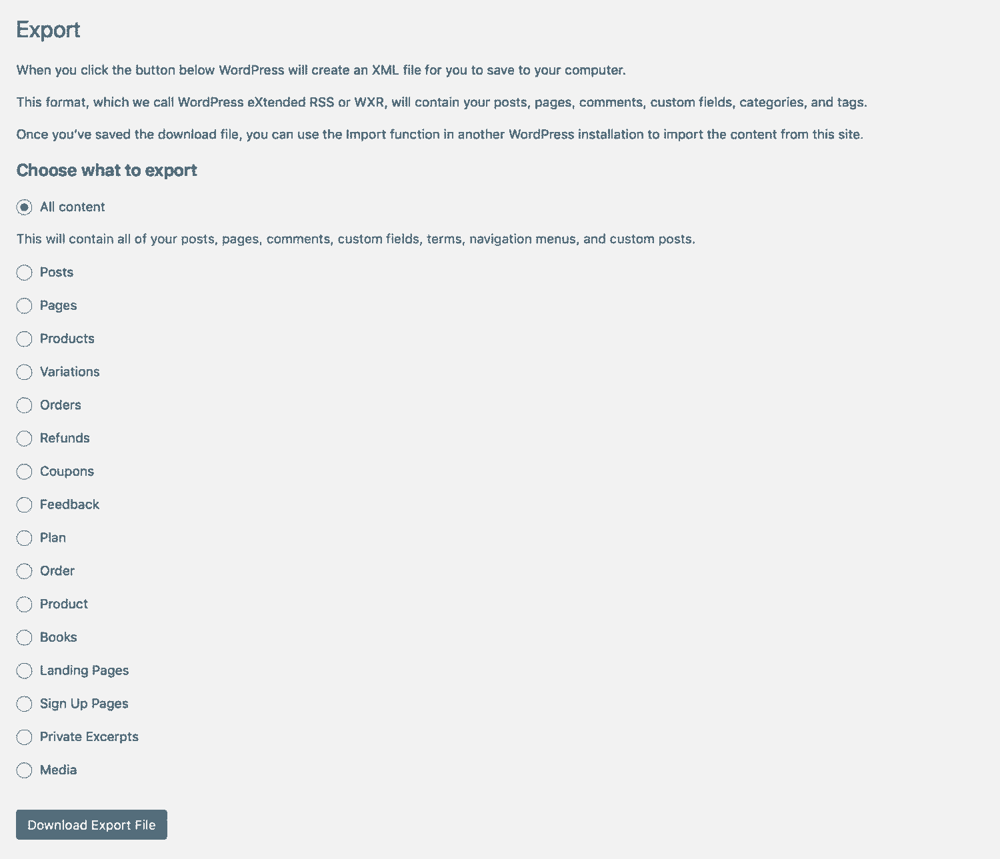

WordPress export screen


在**下选择要导出的内容**，选择**所有内容**，然后点击**下载导出文件**按钮。

这会将一个 XML 文件下载到您的计算机上，该文件的名称将包含您的网站名称。请将此文件保存在安全的地方，您将需要它来导入新网站。

现在打开你的新网站，进入**工具>导入**。

如果导入插件还没有安装，你需要点击 **WordPress** 下的**立即安装**链接。

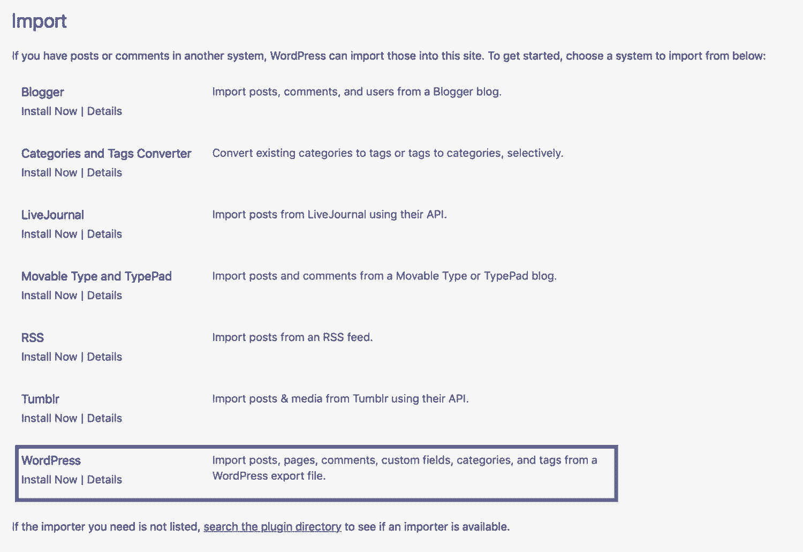

Import screen – installing the WordPress installer


导入器插件将被安装并激活，一个链接将出现在屏幕顶部，供您运行导入器。

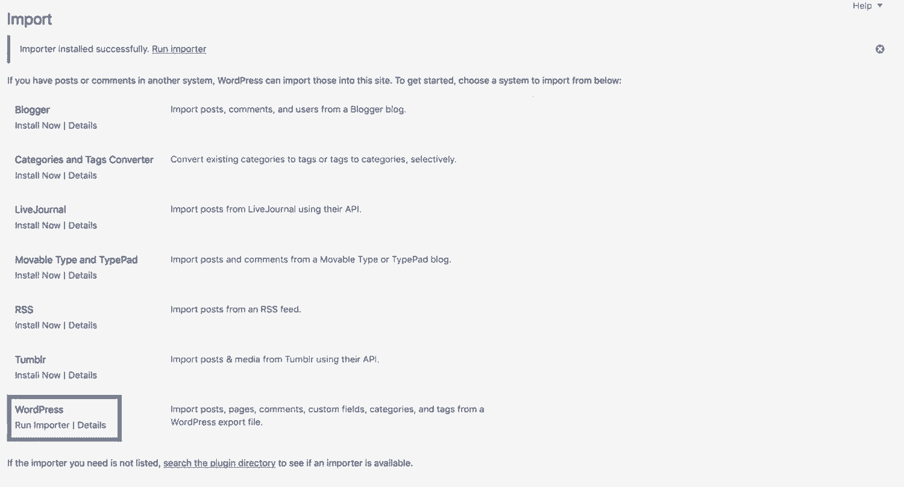

Run the importer


单击该链接，您将被带到上传 XML 文件的屏幕。


Upload import file


点击**选择文件**按钮，在电脑上找到 XML 文件，然后点击**上传文件并导入**按钮。

WordPress 会要求你指定作者，并决定你是否要下载附件。


Import options


选择与旧网站中的作者相对应的新网站中的作者(如果您已经将他们添加到网站中)。如果没有，请输入登录名，导入程序将为您添加新的用户帐户。然后勾选**下载和导入文件附件**框。

单击**提交**按钮，导入程序将为您从 XML 文件中导入内容。前往你的**帖子**屏幕，你会看到它们都被列出来了。

#### 使用小部件导入/导出插件迁移小部件设置。

所以你现在已经得到了你所有的文章、页面等等。进口的。

您不能导入大多数设置，但是您可以使用[widget Importer&Exporter](https://en-gb.wordpress.org/plugins/widget-importer-exporter/)插件导入 Widget 设置。

在两个站点上安装并激活插件——同样，只有在网络中有插件安装权限时才能这样做。

现在在原始站点(Multisite 中的站点)，转到**工具>小部件导入器&导出器**。


Widget Importer & Exporter


点击**导出小部件**按钮。这将下载一个. wie 文件到你的电脑上-把它保存在安全的地方。

现在，在新站点中，转到**工具>小部件导入器&导出器**。点击**选择文件**按钮，上传刚刚下载的文件，然后点击**导入小工具**按钮。您将进入一个屏幕，显示哪些小部件已经导入。

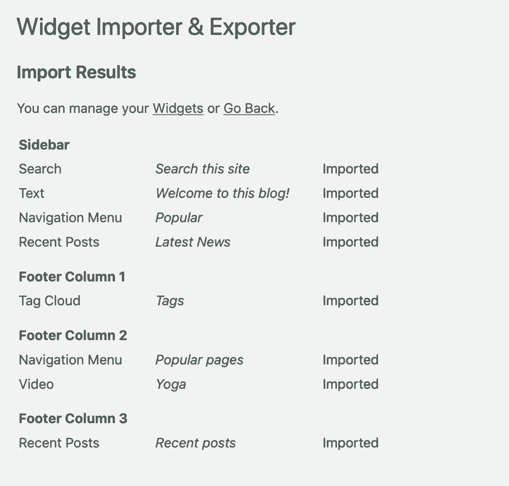

Widgets imported


下一步是导入在导入内容时未创建的任何用户。如果迁移你的站点，这是你需要为所有方法采取的一个步骤，它在这篇文章的结尾被覆盖——向下滚动到“导入用户”部分。

最后，您需要更新新站点中的设置。

#### 手动将设置从旧的子站点复制到新的单个站点。

最后一步是更新新站点中的设置，以便它们反映旧站点中的设置。这是您必须手动完成的事情，因此这可能是一个费力的过程。

在一个浏览器窗口中打开旧网站的管理界面，在另一个窗口中打开新网站的管理界面——或者更好的是，使用不同的浏览器，这样你就不太可能混淆这两个界面。详细浏览设置屏幕，调整新站点中的设置，使其反映旧站点中的设置。

一旦你做到了这一点，你的新网站将开始运行。最后一个阶段是[更新域名](https://kinsta.com/help/add-domain/)——这对于所有方法都是一样的，在下面关于迁移域名的章节中会有介绍。

### 2.使用迁移插件将子站点从 WordPress Multisite 迁移到单个站点

如果您可以访问多站点网络上的[迁移插件](https://kinsta.com/blog/wordpress-migration-plugins/)，使用该插件进行迁移将比使用导入/导出插件更加容易和可靠。这也意味着您不必直接访问数据库，因此比手动迁移更安全(如果您不习惯这样做的话)。

从执行旧站点的迁移开始。你需要使用一个与 WordPress Multisite 兼容的迁移插件，只迁移一个网站，而不是整个网络。

在 Kinsta，我们向大型网站推荐免费的 [Migrate Guru](https://kinsta.com/help/migrate-guru/) 插件。然而，这个插件不允许你从一个多站点网络中迁移一个站点。没有免费的插件可以做到这一点，所以你需要使用一个高级插件。

大多数迁移插件，甚至是高级插件，都不支持将子站点迁移出网络。

两个有价值的选择是[复制器 Pro](https://snapcreek.com/duplicator) 和[都在一个 WP 迁移](https://servmask.com/)插件，通过他们的服务器传输你的文件和数据库。

要运行自动迁移，您需要在网络和新网站上购买并安装 Duplicator Pro 插件。浏览[插件文档](https://snapcreek.com/duplicator/docs/guide/#guide-mu-005-q)以执行迁移:您需要创建一个从旧站点迁移的包，然后将其导入到新站点。

因为用户数据是为整个网络存储的，所以您需要单独迁移它，我将在本文后面介绍，因为它影响所有的迁移方法。


### 重要的

市场上有两个插件选项可以通过上面列出的服务器传输你的文件和数据库( Duplicator Pro 和都在一个 WP 迁移中)目前与 Kinsta 主机不兼容，你可能需要选择这里列出的其他解决方案之一。


### 3.手动将子网站从 WordPress Multisite 迁移到单个网站

将一个站点从 WordPress 多站点网络迁移到单个站点的最后一种方法是手动迁移。这不会让您付出任何代价，但是只有在您觉得可以轻松访问 phpMyAdmin 和编辑数据库导出文件时，才应该这样做。

您从多站点移出的站点将有三个组件需要从多站点网络中复制:

*   主题和插件文件——你可以在新网站上复制或重新安装它们
*   上传—您可以在 WP-content/uploads/sites 下的子站点子目录中找到这些内容
*   数据库表——您不需要所有的数据库表，只需要与该站点相关的数据库表

注意:如果你的多站点网络是在 WordPress 3.5 之前创建的，你将没有站点文件夹。相反，您将在 wp-content 中拥有一个 blogs.dir 文件夹，其中包含子站点的所有上传文件。这将为您要迁移的站点提供一个带编号的文件夹，您可以复制该文件夹。

#### 首先备份

在进行迁移之前，最好备份您的多站点安装。使用你喜欢的[备份插件](https://kinsta.com/blog/wordpress-backup-plugins/)，或者使用你的主机接口创建一个备份，如果你的提供商允许的话——Kinsta 执行常规备份，[你也可以创建一个手动备份](https://kinsta.com/help/wordpress-backups/)。

您将使用该备份将相关文件复制到您的新站点，万一您遇到任何问题，它也能让您安心。

#### 在多站点网络中查找您的子站点的 ID

网络中的每个站点都有自己唯一的 ID。这用于标识它在 wp-content/uploads/sites 目录中的文件夹，并标识该站点的数据库表。

转到**网络管理>站点**，为您要迁移的站点选择**编辑**选项。

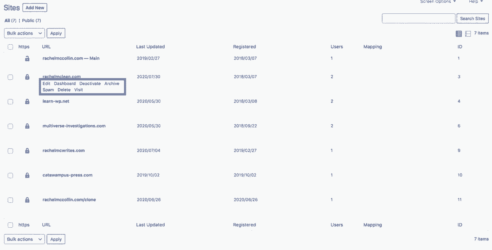

Sites screen in Network Admin


WordPress 带你去的网址会给你网站的 ID。该 URL 的格式应该是 http://mynetwork.com/wp-admin/network/site-info.php?id=XX.

XX 是您站点的 ID，将是包含其文件的文件夹的名称，也是其数据库表名称的前缀。

#### 将主题和插件文件从 WordPress Multisite 迁移到一个站点

现在确定子站点使用的插件，或者[通过插件屏幕将它们安装](https://kinsta.com/knowledgebase/how-to-install-wordpress-plugins/)到你的新 WordPress 站点，或者从你旧站点的备份中上传它们。将它们复制到你的新站点的 WP-内容/插件中。

你可以通过进入你的子站点的插件页面来找到正在使用的插件。包括网络激活的任何插件。

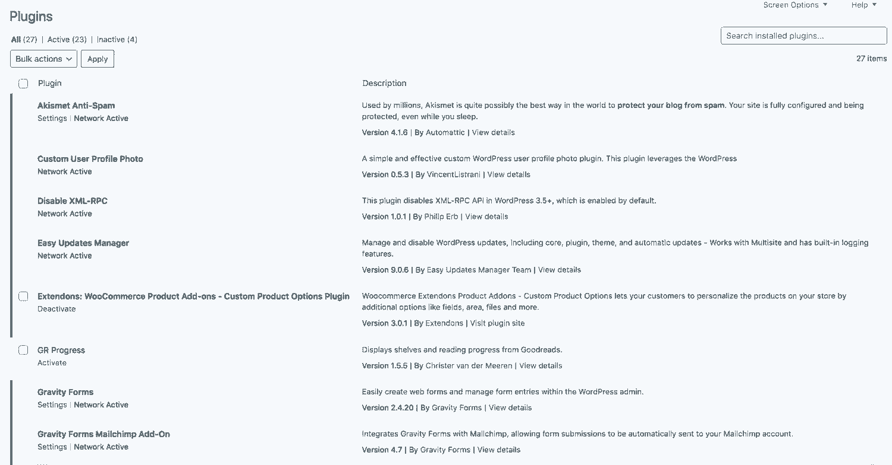

Plugins screen in Multisite Network sub-site


对你的主题做同样的事情——把它从你的备份拷贝到你的新的单站点 WordPress 安装的 wp-content/themes 目录，或者只是[重新安装它](https://kinsta.com/blog/how-to-install-a-wordpress-theme/)。

#### 将上传从 WordPress 多站点子站点迁移到单一站点

如果网络是在 WordPress 3.5 之后创建的，它将在 wp-content/uploads 中有一个 sites 文件夹。找到带有你的子站点 ID 的子文件夹，并把它的内容上传到你的新站点的 wp-content/uploads 文件夹中。

如果网络比较旧，并且有一个 blogs.dir 文件夹，那么它也将包含一个带有您站点 ID 的文件夹。在里面，你会找到一个名为“文件”的子文件夹。将 files 文件夹的内容复制到新站点的 [wp-content/uploads 文件夹](https://kinsta.com/knowledgebase/bulk-upload-files-wordpress-media-library-ftp/)中。

## 注册订阅时事通讯


### 想知道我们是怎么让流量增长超过 1000%的吗？

加入 20，000 多名获得我们每周时事通讯和内部消息的人的行列吧！

[Subscribe Now](#newsletter)

注意:为了避免冲突，你可能需要删除 WordPress 在你的新上传文件夹中创建的所有文件夹。

您现在已经安装了所有文件。你不需要激活它，因为迁移数据库会复制任何设置，包括插件和主题激活和设置。

#### 从多站点网络导出子站点的表

因为您只是移动一个子站点，而不是整个安装，所以您不需要整个数据库的内容。

为多站点网络打开 [phpMyAdmin](https://kinsta.com/help/wordpress-phpmyadmin/) 。点击**导出**选项卡。

多站点网络比单个站点有更多的表，每个站点有一套额外的表。找到与您要导出的站点相关的表格。它们将以 wp_XX_ 开头，其中 XX 是您站点的 ID。

选择与您的子站点相关的所有表格，然后向下滚动到**和选择的:**框。

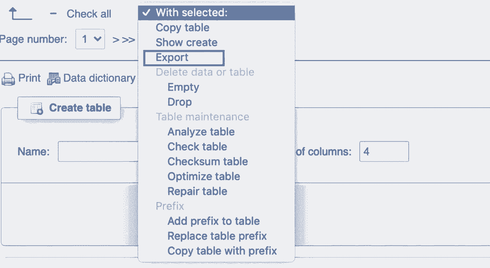

Selecting and exporting database tables


点击并选择**导出**。

在下一个屏幕上，将导出方法保留为 **Quick** 并点击 **Go** 按钮。

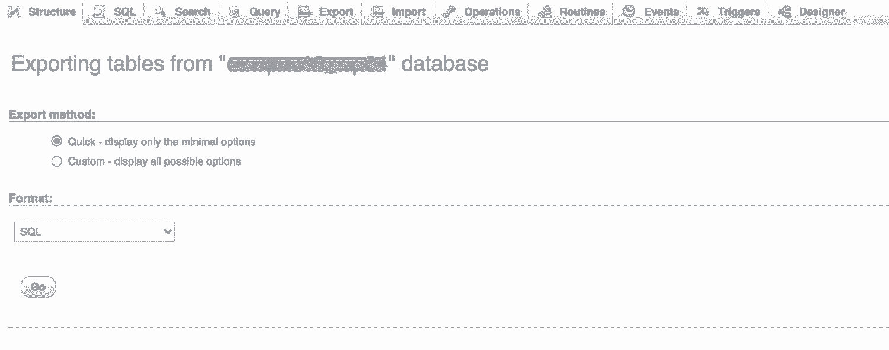

Quick export method


#### 编辑数据库表

[复制一份已经下载到你电脑上的 SQL 文件](https://kinsta.com/knowledgebase/mysql-backup-database/)，并给它起一个能告诉你它是什么的名字(例如在名字前加上“copy”)。在[代码编辑器](https://kinsta.com/blog/free-html-editor/)中打开它。

您需要编辑两件事:**链接**和**表格引用**。

从链接开始。您需要将多站点网络中站点域的所有实例更改为新的单一站点域(或者更改为临时域，如果您在新站点运行时使用了临时域)。例如，如果您的站点位于 http://network.com/mysite,，请将其更改为 http://mysite.com。

如果您的网络使用子域，您需要更改 http://mysite.network.com 的所有实例。如果你这样做，我建议也运行一个子目录版本检查以防万一。保存您的文件。

其次，新的单站点安装中的数据库表没有站点 ID 前缀，所以您需要删除这些前缀。在您的 SQL 文件中，[用 wp_ 替换 wp_XX_ 的所有实例，其中 XX 是您的站点 ID](https://kinsta.com/knowledgebase/wordpress-search-and-replace/#5-run-a-find-and-replace-mysql-query-with-phpmyadmin) 。

现在保存 SQL 文件。

#### 将数据库表从多站点的子站点迁移到单个站点

现在您已经编辑了 SQL 文件，您需要导入数据库表。从删除新的 [WordPress 安装](https://kinsta.com/knowledgebase/what-is-a-wordpress-install/)中的所有现有表格开始。

为你的新站点打开 [phpMyAdmin](https://kinsta.com/help/wordpress-phpmyadmin/) 。从新站点的数据库中选择除 wp_users 和 wp_usermeta 表之外的所有表。

在下拉框中点击**，选择**下拉框**。当在下一个屏幕上出现提示时，点击**进入**。**

接下来，您需要上传您编辑过的数据库:

1.  点击**导入**选项卡。
2.  点击**选择文件**按钮。
3.  选择您编辑过的 SQL 文件，点击**选择**或**确定**。
4.  点击 **Go** 按钮。

过一会儿(取决于数据库的大小)，您会看到一条消息，告诉您上传已成功完成。如果您的数据库很大，这可能需要一段时间。

#### 最后的步骤

你还没有完成。接下来，[清空浏览器的缓存](https://kinsta.com/knowledgebase/how-to-clear-browser-cache/)。如果浏览器缓存了旧网站的内容，这可以避免任何问题。

现在[登录新网站的 WordPress admin](https://kinsta.com/blog/wordpress-login-url/) 。如果你移动了用户表，你的登录细节将会和你的旧站点一样，但是如果你没有移动，这些将会是你在新位置安装 WordPress 时指定的。

检查你的所有链接是否正常工作，以及[小部件](https://kinsta.com/blog/wordpress-widgets/)和[插件](https://kinsta.com/best-wordpress-plugins)是否正常运行。如果没有，您可以在需要的地方使用您的备份，或者在您的新站点中进行调整。

一旦你对一切正常感到满意，就从多站点安装中删除该站点。我建议把它放一周左右，以防你发现有什么东西没有移动。与此同时，您需要移动域(这将在下面介绍)。

要从网络中删除子站点，请转到**网络管理>站点**。找到该网站，点击其名称下方的**删除**链接。


Deleting a site in a Multisite Network


唷！这是一个漫长而有点复杂的过程，但你做到了。

## 将用户从 WordPress 多站点子站点迁移到单个站点

迁移用户比网络中站点的其他数据更复杂，因为用户存储在整个网络的一个数据库表中。

需要一个给你带来竞争优势的托管解决方案吗？Kinsta 为您提供了令人难以置信的速度、一流的安全性和自动伸缩功能。[查看我们的计划](https://kinsta.com/plans/?in-article-cta)

这意味着，除非您的网络只有几个用户，并且都是该子站点上的用户，否则您将无法从网络中导出 wp_users 表。

相反，您需要使用一个插件将用户从网络导出到新网站。[Import/Export WordPress Users](https://kinsta.com/knowledgebase/wordpress-export-users/#1-import-export-wordpress-users)插件就是为此而设计的，并且是免费的。

在两个站点上安装插件，并为多站点网络中的子站点和新站点激活它。现在在子站点中，转到**用户>用户导入导出**。


User Import Export screen


向下滚动并点击**导出用户**按钮，下载包含您所有用户数据的 CSV 文件。

现在在新的站点中，再去**用户>用户导入导出**。点击**用户/客户导入**选项卡。


User Import tab


点击**选择文件**按钮选择您刚刚下载的 [CSV 文件](https://kinsta.com/knowledgebase/wordpress-export-users/#2-export-users-to-csv)，然后点击**上传文件导入**按钮。

该插件将上传文件，并从您的旧网站导入所有用户。然后，它将带您到一个屏幕，显示您导入的那些用户的详细信息。

现在你已经从多站点网络中导入了旧站点的所有方面到你的新 WordPress 安装中。你只有一步可走:转移你的域名。

## 将您的域从多站点网络迁移到新的单一站点

您是否需要迁移您的域名将取决于您如何在多站点网络中进行设置。

如果你在[使用子域](https://kinsta.com/blog/wordpress-subdomain/)或子目录作为你的子站点，而[没有将域映射到它们](https://kinsta.com/knowledgebase/wordpress-multisite-domain-mapping/)，那么你需要[为你的新站点注册一个新的域](https://kinsta.com/blog/how-much-does-a-domain-name-cost/)并使用它。

但是如果你想使用你在旧网站上使用的相同域名，你需要确保它没有指向你在网络上的旧网站。

如果您已经从多站点删除了子站点(您应该这样做)，那么该域名将不再被该站点使用。但是你仍然需要确保它指向你的新站点。

为此，你需要使用 [DNS](https://kinsta.com/knowledgebase/what-is-dns/) 让你的域名指向你的新站点。如果你和金斯塔在一起，请按照我们的指示让[将你的域名指向我们的主机](https://kinsta.com/help/dns/)。

然后在**设置>常规**选项卡中更新新站点的设置。

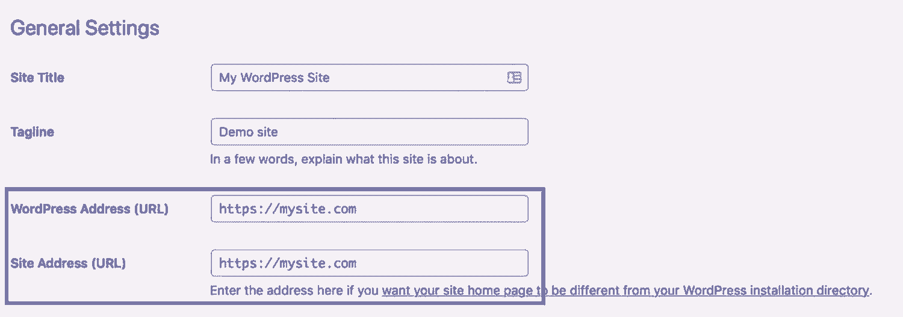

General settings screen


将正确的域名添加到**站点 URL** 和**站点地址**字段，并保存您的更改。

你完了！你的站点现在将作为一个单独的 WordPress 站点工作。

## 如何将整个多站点网络恢复到单个站点

有时你不想将一个站点移出 WordPress 多站点网络，而是想将整个网络恢复到一个站点，而根本不运行多站点。

这是一个极端的步骤，但是如果您的网络只包含非常少的站点，或者如果您必须删除除基本站点之外的所有站点，这可能是合适的。

您只能对基本站点执行此操作，即在您激活多站点之前已经存在的站点。您不能通过这种方式将其中一个子站点恢复为网络上的唯一站点。

为此，您需要遵循五个步骤:

 让我们完成这个过程。

### 1.删除或迁移网络中的所有站点

首先，您需要删除网络中的所有子站点。只需将它们从**站点**屏幕中删除，或者将它们分别迁移到各自的站点或另一个网络(尽管如果您想创建另一个网络，很难理解为什么要这样做)。

按照上述步骤迁移每个子站点。一旦你完成了这些，他们都在新的地点工作，进入**网络管理>站点**。

选择所有子站点，然后打开**批量操作**下拉菜单，选择**删除**。然后点击**应用**按钮。

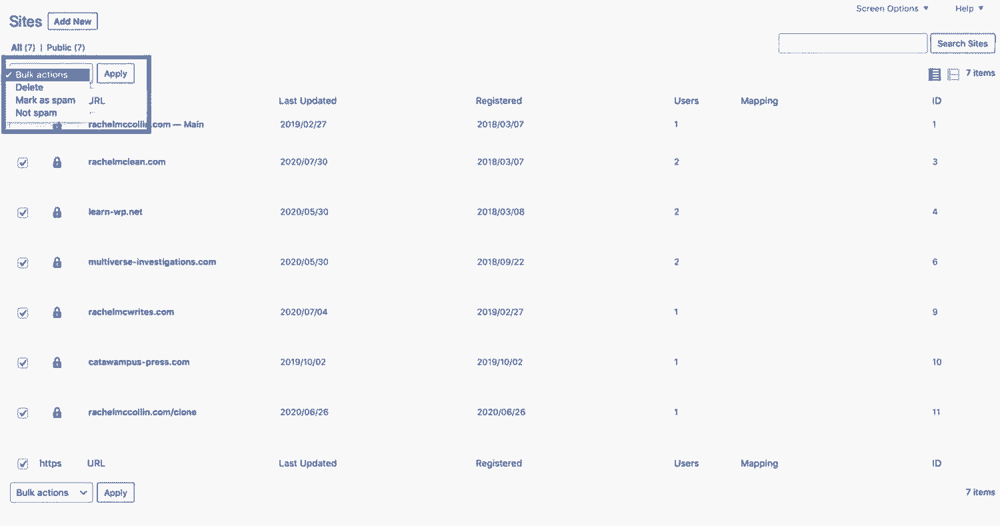

Deleting all sub-sites


在这样做之前要非常小心，确保您需要的任何东西都已备份或迁移。这件事已经没有回头路了。

像这样删除子站点会删除每个子站点的上传文件以及与这些站点相关的数据库表，但不会删除所有的多站点数据库表，您稍后会执行此操作。

你现在有一个只有一个站点的网络。

### 2.卸载并删除基本网站未使用的主题和插件

现在进入**网络管理>插件**。[删除任何不被主站点使用的插件](https://kinsta.com/blog/uninstall-wordpress-plugin/)。你可能想先去主网站的插件页面检查一下。

对[主题重复此操作，删除那些你不需要的](https://kinsta.com/blog/wordpress-delete-theme/)。

### 3.删除无权访问基本网站的用户

现在转到**网络管理>用户**并删除任何无法访问基本站点的用户帐户。

安装 [Multisite Enhancements](https://kinsta.com/blog/wordpress-multisite-plugins/#multisite-enhancements) 插件会有所帮助，因为它会告诉你哪些用户在哪个网站上有账户。在下面的例子中，只有[超级管理员](https://kinsta.com/blog/wordpress-user-roles/#super-admin)可以访问基本站点。

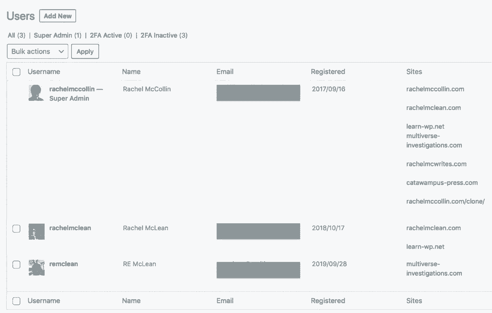

Network users


要删除用户，选择您要删除的用户，点击**批量操作**下拉菜单，选择**删除**，然后点击**应用**按钮。

现在，您的网络上只有[个用户](https://kinsta.com/blog/wordpress-user-roles/)可以访问基本站点。

### 在您的 WordPress 安装上停用 WordPress Multisite

最后一步是在你的网络上关闭 WordPress Multisite。在你这样做之前，备份你的网站——以防万一。

现在打开[wp-config.php 文件](https://kinsta.com/blog/wp-config-php/)，找到这几行:

```
define( 'MULTISITE', true );
define( 'SUBDOMAIN_INSTALL', false );
$base = '/wordpress/';
define( 'DOMAIN_CURRENT_SITE', 'localhost' );
define( 'PATH_CURRENT_SITE', '/wordpress/' );
define( 'SITE_ID_CURRENT_SITE', 1 );
define( 'BLOG_ID_CURRENT_SITE', 1 );
```

删除所有这些行。

找到这样一行:

```
define('WP_ALLOW_MULTISITE', true);
```

编辑它，使其显示为:

```
define('WP_ALLOW_MULTISITE', false);
```

现在保存你的 wp-config.php 文件。

你可能还需要编辑你的[。htaccess 文件](https://kinsta.com/knowledgebase/wordpress-htaccess-file/)将其还原为单个站点的代码。

如果你是 Kinsta 的客户，并且你的多站点网络运行在子域名上，你应该会发现你不需要做这个编辑，你的站点将作为一个单独的站点工作，只需要 wp-config.php 的编辑。如果你的网络运行在子目录下，你需要[支持](https://kinsta.com/kinsta-support/)要求做出改变。

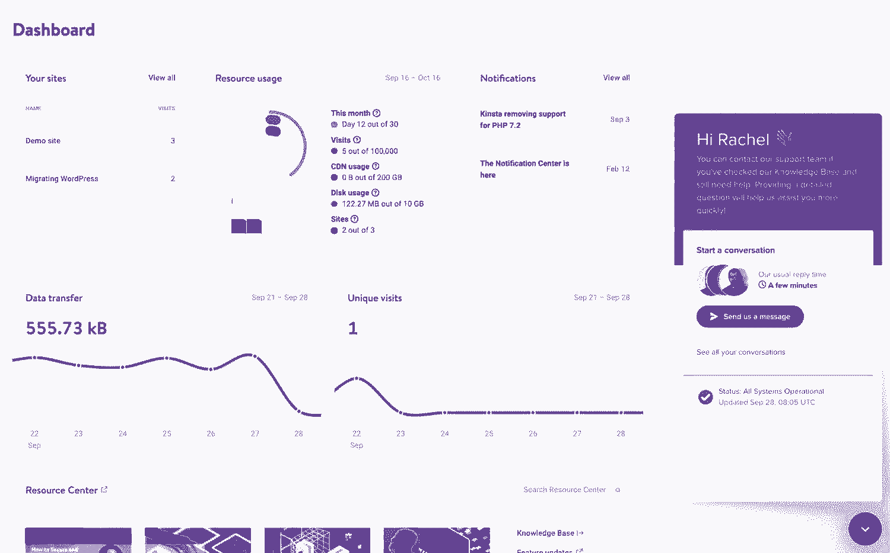

Raising a support ticket via MyKinsta


如果你有权限。htaccess 文件，在代码编辑器中打开它，并找到与 Multisite 相关的行。用这些行替换它们:

```
RewriteEngine On
RewriteBase /wordpress/
RewriteRule ^index.php$ - [L]

# uploaded files
RewriteRule ^([_0-9a-zA-Z-]+/)?files/(.+) wp-includes/ms-files.php?file=$2 [L]

# add a trailing slash to /wp-admin
RewriteRule ^([_0-9a-zA-Z-]+/)?wp-admin$ $1wp-admin/ [R=301,L]
RewriteCond %{REQUEST_FILENAME} -f [OR]
RewriteCond %{REQUEST_FILENAME} -d
RewriteRule ^ - [L]
RewriteRule ^([_0-9a-zA-Z-]+/)?(wp-(content|admin|includes).*) $2 [L]
RewriteRule ^([_0-9a-zA-Z-]+/)?(.*.php)$ $2 [L]
RewriteRule . index.php [L]
```

保存。htaccess 文件。

### 删除由多站点添加的数据库表

当你第一次激活 Multisite 的时候，WordPress 已经在你的网站上添加了额外的数据库表。

在 phpMyAdmin 中，找到这些表:

*   wp _ 博客
*   wp _ 博客 _ 版本
*   wp _ 注册 _ 日志
*   wp _ 注册
*   wp_site
*   WP _ siteid

将它们全部选中，点击**与选中:**下拉，选择**下拉**。确认您要这样做，这些表将从数据库中删除。

你现在有了一个单一站点的 WordPress 安装。您需要再次登录，但是基本站点现在应该作为单个站点工作。

[Sometimes less is more. 😌 Turn your WordPress Multisite back to a single site with this guide 👆Click to Tweet](https://twitter.com/intent/tweet?url=https%3A%2F%2Fkinsta.com%2Fblog%2Fwordpress-multisite-to-single-site%2F&via=kinsta&text=Sometimes+less+is+more.+%F0%9F%98%8C+Turn+your+WordPress+Multisite+back+to+a+single+site+with+this+guide+%F0%9F%91%86&hashtags=WordPressTips%2CMultisite)

## 摘要

将一个站点移出 WordPress 多站点网络比在单个站点之间迁移更复杂，但是这并不是不可能的。还可以将多站点网络恢复为单个站点，这样只有基本站点仍然存在。

按照上述步骤，您将拥有一个新的单一站点，而不是一个多站点网络中的站点。你对 WordPress 多站点和单一站点有任何问题吗？请在评论中告诉我们！

* * *

让你所有的[应用程序](https://kinsta.com/application-hosting/)、[数据库](https://kinsta.com/database-hosting/)和 [WordPress 网站](https://kinsta.com/wordpress-hosting/)在线并在一个屋檐下。我们功能丰富的高性能云平台包括:

*   在 MyKinsta 仪表盘中轻松设置和管理
*   24/7 专家支持
*   最好的谷歌云平台硬件和网络，由 Kubernetes 提供最大的可扩展性
*   面向速度和安全性的企业级 Cloudflare 集成
*   全球受众覆盖全球多达 35 个数据中心和 275 多个 pop

在第一个月使用托管的[应用程序或托管](https://kinsta.com/application-hosting/)的[数据库，您可以享受 20 美元的优惠，亲自测试一下。探索我们的](https://kinsta.com/database-hosting/)[计划](https://kinsta.com/plans/)或[与销售人员交谈](https://kinsta.com/contact-us/)以找到最适合您的方式。